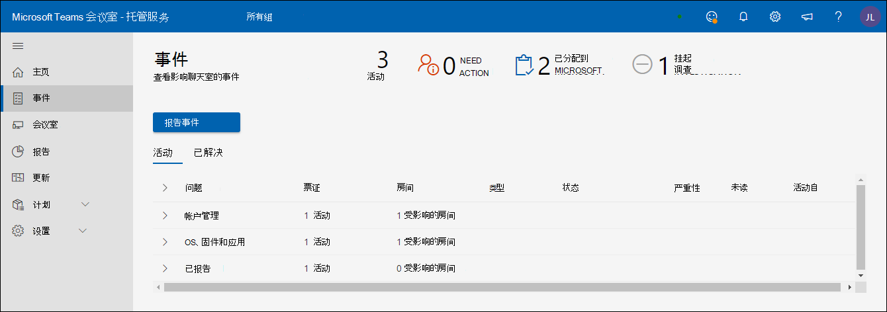
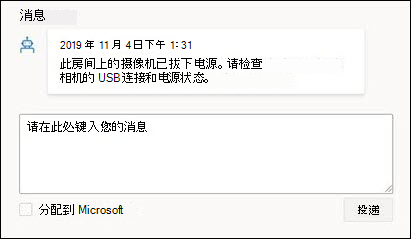

# Microsoft 托管的会议室门户

## 概述

托管会议室门户 ("会议室门户") 提供会议室运行状况的视图。 此门户的客户视图用于查看可见性和反馈，以及促进现有监视工具/做法。

监视范围为

- 事件视图
  - 影响聊天室的热门问题
  - 将聊天室还原到正常状态所需的操作
  - Microsoft 正在调查的问题
- 会议室Microsoft Teams视图
  - 设备级别的MICROSOFT TEAMS 会议室 (的) 快照
  - 每个设备的基本历史记录和详细信息

**会议室Microsoft Teams视图**

- 设备级别的MICROSOFT TEAMS 会议室 (的) 快照
- 每个设备的基本历史记录和详细信息

> [!Important]
> 查看 [**将用户分配到托管服务管理员**](enrolling-mtrp-managed-service.md#assign-users-to-the-managed-service-administrator-role) 角色，并确保根据业务需求限制对门户的访问。

## 术语

下面是门户中的常用术语。

|术语 |含义 |
| :- | :- |
|**监视软件** |在每个会议室设备中部署的Microsoft Teams代理。 |
|**应用** |Microsoft Teams Room 系统应用 (，无论它使用 Skype for Business 还是 Microsoft Teams 作为协作服务。 |
|**会议室/设备** |经过认证的Microsoft Teams会议室系统设备。 |
|**未监视** | 部署为托管服务的一部分的 Microsoft 监视软件无法连接到云服务。 我们未收到有关设备的遥测数据。 |
|
**正常 /** 

**不正常** 
|设备/外围设备中的异常。 |
|**已取消** |如果已知设备在维护中，应忽略其警报，可以特意禁止该设备。 |
|**载入** |正在添加会议室设备的状态，但尚未准备好作为定期支持的房间。 |
|**事件** |影响需要采取措施的最终用户的会议体验的问题。 |
|**配置错误** |检测到的配置不正确/常用。 |
|**支持票证** |内部 Microsoft 跟踪标识符，用于跟踪与事件有关的所有通信/操作。 |

## 事件视图

此视图是托管会议室门户中"事件"选项卡的概述。 此页面是门户的默认主页。

### 顶级摘要 
顶级摘要一目了然地显示影响聊天室的问题、需要执行哪些工作，以及 Microsoft 正在如何解决这些问题：

|# |解释 |
| :- | :- |
|1 |影响聊天室的事件类型 |
|2 |**需要操作**：需要干预才能解决的项目。 |
|3 |**分配给 MICROSOFT：Microsoft** 人员当前调查的项目。 |
|4 |**待调查**：Microsoft 人员要调查的队列中的项目。 |

事件预期为以下三种状态之一：

- **需要操作**：分配给你用于操作
- **分配到 Microsoft：** 分配给 Microsoft 以执行下一步操作
- **待调查**：正在调查，以执行下一步

### 查看事件

下图列出了你的聊天室中当前处于活动状态的所有事件。 分配给你的项目位于顶部 *–* 这些是需要查看以执行下一步的步骤。 此外，分配到 Microsoft 或等待调查的人具有可用于介入的详细信息。

单击状态为"需要操作"的任何 **项** 会显示有关事件的其他详细信息。

## 事件类型

事件分为两种广泛的严重性类型：

- **重要** 提示：可能导致会议中出现问题的事件，应优先处理。
- **警告** - 计划维护操作的通知的事件。 如果未处理这些问题，则随着时间的推移，会议室更有可能出现问题。 警告旨在让你有时间来计划和协调支持。

如果一段时间未参与 **，** 警告可能会转换为"重要"。

## 设备和事件的运行状况

严重性分类为" **重要"** 的事件会影响设备的运行状况。 如果至少有一个严重性 **为** "重要"的事件与设备关联，则将其分类为 **_不正常_** 设备。

分类为 **"警告"** 严重性的事件不会影响设备上报告的运行状况状态。 但是，如果设备具有与之关联的警告级别事件，则会显示该设备的运行状况状态，如下所示。

下面是你可能会看到的一些事件类型，以及每种类型的说明。 对于每个类型，与事件关联的操作将更具体，具体取决于问题。

**表 1：严重性为"重要"的事件**

|类型 |解释 |
| :- | :- |
|**显示器** |连接到设备的显示器似乎并不正常。|
|**会议麦克风，会议发言人** |麦克风/扬声器 (音频) 似乎配置错误。 |
|**相机** |连接到设备的相机似乎未正常。 |
|**HDMI Ingest** |HDMI Ingest 不正常。 |
|**登录 (Exchange)** |Microsoft Teams会议室应用从 Exchange且登录成功发生的任何问题都会通过登录事件报告。 |
|**登录 (Teams)** |Microsoft Teams会议室应用登录到设备，如果客户使用设备，则此事件 (登录失败Teams) 。 |
|**登录 (Skype for Business)** |Microsoft Teams会议室应用登录到设备，如果客户使用设备，则此事件 (登录失败Skype for Business)  |
|**邻近感应传感器** |Microsoft Teams会议室应用邀请与会者加入会议（如果他们位于邻近的位置）。 此功能中的故障将在此事件下报告。 |

**表 2：严重性为"警告"的事件**

|类型 |解释 |
| :- | :- |
|**应用版本** |设备上运行的 Microsoft Teams Room App 的版本不是最新的。 过时的版本是用户遇到问题的已知原因。 |
|**操作系统版本** |不再Windows会议室中运行的操作系统版本。 |
|**网络** |由于评估后需要执行额外的工作，因此，此警报将在近期内作为一种警告类型删除。 |

## 响应事件

事件分为三类：需要操作、待调查或已分配给 Microsoft。

### "需要操作"事件

状态设置为"需要操作 **"的事件会** 分配给你采取纠正措施。

每个此类事件都有一个操作字段，Microsoft 会提供建议的操作，如下所示：

- 如果已采取该操作，可以在"响应"框中使用备注对事件做出响应，然后在发布前选择"分配给 Microsoft"。
- 根据你的评论，通知也可能不正确。 在这种情况下，请提供该反馈并将其重新分配给 Microsoft。
- 最后，如果要添加评论，为你自己的团队或 Microsoft 团队提供其他上下文，请发布消息，而无需打开"分配到 Microsoft"。

>[!NOTE]
>你的纠正措施可以解决问题，并且托管聊天室监视会从列表中清除该事件。 在以上情况下，可能无法解决问题并将其重新分配给 Microsoft。 此问题将在将来的版本中解决。

### "待调查"事件

对于正在调查的事件，说明字段包含有关事件、典型原因和解决方法的信息，这些信息可能有助于解决某些问题，以便可以立即采取行动。

### "分配到 Microsoft"事件

对于分配给 Microsoft 的事件，"操作"字段将包含有关计划内或已进行纠正措施的简要详细信息。 这些步骤可能需要与团队协作，扩展协作将根据需要通过电子邮件/呼叫完成。 这些问题一旦解决，就会从门户中消失，将来会提供历史记录来跟踪此类事件及其解决方法。

## 会议室视图

每个设备都是会议室及其连接的外围设备的代理。 正常的设备表示一个状况良好的房间，不正常的设备表示在会议期间可能会导致问题的会议室。 除了"事件"视图外，托管会议室门户还提供聊天室运行状况概述，可帮助你排查设备详细信息，以及了解事件历史记录中重复发生的故障。

**正常、不正常、断开连接** "会议室"视图的顶部面板提供一个快速快照，其中显示有多少设备处于良好状态 ("正常") 、多少设备受问题 ("Unhealthy") 的影响、有多少设备未提供遥测数据 ("已断开连接") ，以及有多少设备禁止将 (作为替代) 发出警报。 使用不断发展的条件和启发式方法监视房间的运行状况。 目标是尽可能准确地反映聊天室中用户体验的真实情况，使其可操作。

**正常/不正常的聊天室**：

未发生严重性为"重要"的任何事件的设备/外围设备符合当前运行状况条件，会标记为正常。 但是，这并不意味着门户中每个不正常的设备都发生房间中断。 事件的说明和操作部分包含有关问题及其对用户体验的潜在影响的更具体的详细信息。

**断开连接的设备：**

作为托管会议室试点的一部分部署的 Microsoft 监视代理与托管会议室云服务断开连接。 我们未收到有关房间的遥测数据，并且没有最新的运行状况状态。 这可能是由于网络问题、防火墙策略更改，或者对设备映像进行了更改。

## 会议室详细信息：状态和更改

**会议室详细信息：状态** " *设备状态* "选项卡提供设备状态、设备处于活动状态的所有问题、解决这些问题所需的操作或正在进行的操作的综合视图。 "状态"选项卡还包含"事件"选项卡 下设备运行状况 *的不同组件的细分*。如果设备断开连接，状态详细信息将不可用。

**显示所有信号：** 若要查看信号类别中包含的所有信号，请启用"显示所有信号"切换按钮。 展开箭头将显示在类别标题旁边，可单击这些标题以展开可折叠视图。

**取消/取消压缩票证** 注册聊天室后，表示想要接收有关会议室遥测数据更改的通知。 有时，当特定设备或外围设备位于已知状态时，你不希望生成票证或通知。 使用"抑制票证"功能，将静音有关该特定信号的任何通知。 准备好让服务监视并通知你该信号时，只需取消压缩单个信号。

**活动票证类别扩展** 在每个票证类别下，会显示任何活动或最新已解决的票证以及严重性以及上次更新票证的时间。 单击展开箭头，将显示所有票证，以及票证信息的活动链接。

活动票证类别扩展：在每个票证类别下，将显示任何活动或最新已解决的票证以及严重性以及上次更新票证的时间。 单击展开箭头，将显示所有票证，以及票证信息的活动链接。

## 活动票证：概述

创建的每个事件都标识检测到的问题，以及需要采取的纠正措施，以将会议室还原到正常状态。 生成的票证将传达事件概述，包含托管服务 AI 以及调查此问题的 Microsoft 服务工程团队生成的任何消息。 将列出为事件故障排除收集的所有附件。 "历史记录"选项卡提供已识别问题的日期。

活动票证：消息 UI 是主要通信工具，用于与致力于修复所识别问题的 Microsoft 服务工程师进行交互。 必须确认来自 Microsoft 的通信，以确保我们尽可能提供最佳服务。 如果已采取建议的操作，请通过"回复"框中的备注响应此事件，在发布前单击"分配给 Microsoft"，将其分配回 Microsoft。
根据你的评论，通知也可能不正确。 在这种情况下，请提供该反馈并将其重新分配给 Microsoft。
最后，如果要添加评论，为你自己的团队或 Microsoft 团队提供其他上下文，只需发布消息而不打开"分配到 Microsoft"

活动票证：有时 Microsoft 服务工程师需要更多信息来增强对问题的调查。 通过附件选项卡，可以上传请求的图片、视频或日志。

活动票证：历史记录 每个会议室信号只有一个已分配有用途的票证编号。 会议室设备或外围设备仍保留于房间中，并且随着时间的推移可能有问题。 通过保留特定唯一票证 ID 下的此信息，将保留所有历史信息，并可以针对行为模式进行分析。 历史记录 UI 提供针对此信号创建和解析的所有票证操作视图。

常见问题解答 动态票证如何影响我以及聊天室的操作？  
客户将看到创建比二进制信号票证更智能的票证和修正。 例如，在一个"显示 1"和"会议室 (2"屏幕中，可以有三&一个"，) 。 但是，只有 1 (一) 显示信号为"正常"或"不正常"。 使用新的动态票证，我们现在可以生成每个显示信号所特有的票证。
