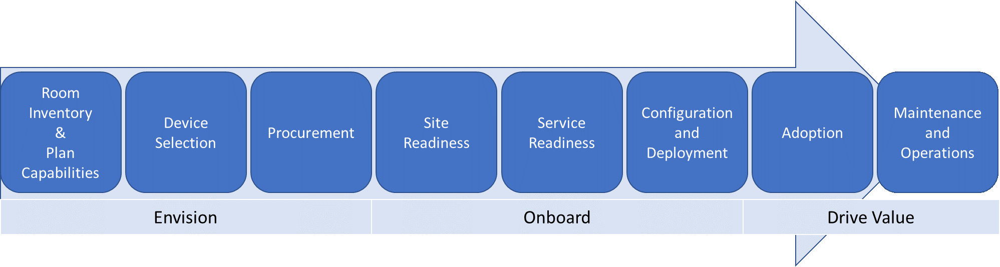

# 计划Microsoft Teams 会议室

本文介绍一种端到端的方法来规划、交付和操作Microsoft Teams 会议室作为整体会议与会议室策略的一部分。

在下面可以找到规划信息，包括建议的方法和需要做出的关键决策，以及指向支持技术信息的链接。 建议查看"计划、部署和管理"部分，即使已完全部署。

## 概述Microsoft Teams 会议室

Microsoft Teams 会议室提供完整的会议体验，将 HD 视频、音频和内容共享引入各种规模的会议，从小型会议区域到大型会议室。

[Microsoft Teams 会议室帮助](https://support.office.com/article/Skype-Room-Systems-version-2-help-e667f40e-5aab-40c1-bd68-611fe0002ba2)是一个很好的资源，可以详细了解Microsoft Teams 会议室以及如何在部署中添加值。 此外，我们建议观看此 [概述视频](https://youtu.be/tNey5KZVCl0)。 

## Microsoft Teams 会议室组件

Microsoft Teams 会议室包括以下关键组件，以提供出色的用户体验：

- 触摸屏控制面板
- 计算
- Microsoft Teams 会议室应用程序
- Dock/扩展程序
- 外围设备 (、麦克风、扬声器) 
- 外部屏幕 (最多两) 
- HDMI 输入

你可以从许多供应商购买这些组件作为预安装捆绑包，也可以按照本文中介绍的要求单独购买 [支持的组件](requirements.md)。

除了内置Surface Pro/扩展坞组合外，还可Microsoft Teams 会议室触摸屏控制面板、计算、扩展坞和集成的关键外围设备进行购买。 

通常，捆绑包和集成单元包括预安装的软件，而如果你单独为 Surface Pro 系统购买支持的组件，则需要安装该软件。 有关说明， [请参阅此文章，了解在设备上安装软件](rooms-scale.md)。 

可以使用 Microsoft Teams 会议室 部署Microsoft Teams、Skype for Business Online Skype for Business混合部署或本地部署。  有关[Teams 会议室许可证的信息](rooms-licensing.md)，请参阅许可更新。

| &nbsp;   |  &nbsp;   |
|-----------|------------|
|  决策点|<ul><li>是否将Microsoft Teams 会议室部署？ </li><li>如何采购你的Microsoft Teams 会议室-捆绑、作为独立组件或作为集成单元？</li></ul> |
|  后续步骤 | <ul><li>确定谁将在整个部署中执行关键活动。</li><li>查看已 (并计划设置) ，以了解要在何处部署 Microsoft Teams 会议室 以及适合会议室大小的外围设备。</li></ul> |
| | |

## 确定谁将在整个部署中执行关键活动

使用下面演示的方法指导完成部署，并根据需要自定义在这些文章中提供的示例输出。

首先了解你拥有哪些会议室并构想将来最适合你的会议室，然后开始选择和采购所需的设备、准备网站、配置和部署服务、管理更改和用户采用，以及制定操作和维护过程。

可能需要跨多个团队协调这些活动。 我们提供了应涵盖的主要活动的高级别视图，以及通常参与部署和管理会议室系统的团队的建议，以帮助你决定需要与谁合作。

| 任务                       | Who可能执行该任务           | 分配到 | 指向此内容的链接 |
|----------------------------|----------------------------------------|-------------|-----------------------|
| 库存会议室            | 设施/AV 团队/IT Project团队 |             | [房间库存与功能规划](#room-inventory-and-capability-planning)        |
| 计划功能          | IT Project 团队                        |             | [房间库存与功能规划](#room-inventory-and-capability-planning)                       |
| 设备选择           | IT Project 团队/AV 团队              |             | [设备选择](#device-selection)                      |
| 采购                | IT Project 团队/AV 团队              |             | [采购](#procurement)                      |
| 网站就绪             | 设施/AV 团队/IT Project团队 |             | [网站就绪](rooms-deploy.md#site-readiness)                      |
| 服务就绪          | IT Project 团队                        |             | [服务就绪](rooms-deploy.md#service-readiness)                      |
| 配置              | IT Project 团队                        |             | [配置和部署](rooms-deploy.md#configuration-and-deployment)                      |
| 部署                 | 设施/AV 团队/IT Project团队 |             | [部署清单](console.md#microsoft-teams-rooms-deployment-checklist)                      |
| 采用                   | 设施/AV 团队/IT Project团队 |             | [采用](#plan-for-adoption-and-change-management)                      |
| 维护和操作 | AV 团队/IT Project团队              |             | [管理概述](rooms-manage.md)                      |

## 房间库存与功能规划

第一步是清点组织的现有会议室，以了解其环境、会议室大小、布局和用途，并确定希望范围内每个会议室在将来拥有的功能，例如会议室中将启用哪些更丰富的协作功能。 

在每个现有房间创建设备和功能的清单后，你针对该会议室的要求会进入你的设备选择计划，以创建丰富的会议解决方案。 每个 (所需的) 、音频、视频等形式（除了房间大小和用途）在决定最适合每个房间的解决方案方面都扮演了重要角色。 

作为发现的一部分，考虑房间音响效果和布局是关键。 例如，检查房间中的椅子是否不会阻止相机视图。 验证房间没有过多的回声或嘈杂的空调，并且该房间是否有足够的电源供屏幕和Microsoft Teams 会议室。 有许多因素需要考虑，你的音频视觉 (AV) 团队或合作伙伴能够提供建议。 

| &nbsp;   | &nbsp;    |
|-----------|------------|
|  后续步骤|<ul><li>查看作用域中的聊天室，并Microsoft Teams 会议室其配置。</li></ul>|

_示例会议/会议室清单_

| 站点  | 会议室名称 | 会议室类型 | 人员数  | 在范围内？ | 当前房间功能       | 未来会议室容量     |
|-----------|---------------|---------------|-----------------------|--------------|-------------------------------------|----------------------------------------------------------|
| 伦敦总部 | Curie         | 中型        | 6 &ndash; 12                  | 是          | 免提电话                        | 1 个屏幕、音频和视频以及演示文稿 PSTN 访问 |
| 悉尼总部 | Hill          | 大型         | 12 &ndash; 16                 | 是          | 旧版 AV 单元，1 个屏幕和摄像头 | 2 个屏幕、音频和视频以及演示文稿 PSTN 访问 |

## 设备选择 

根据Microsoft Teams 会议室功能评估哪种解决方案最适合每个房间。 根据房间大小和布局，确定最适合的 AV 外围设备。 

有关按房间类型和大小的系统和外围设备类型的指导，请参阅Microsoft Teams 会议室[要求一](requirements.md)文。 

根据你喜欢的供应商，使用要求一文提供的信息来定义每个房间类型的 Microsoft Teams 会议室 和支持的外围设备配置，并使用它作为部署的模板。 

**Pro提示**- 某些聊天室类型可能不适用于部署。

| &nbsp;   |  &nbsp;   |
|-----------|------------|
|   决策点|<ul><li>从清单中，哪些类型的会议室在部署范围内？</li><li>将针对每种聊天室类型部署哪些系统？</li></ul>|
|  后续步骤|<ul><li>开始收集所选系统的关键操作材料，并吸引采购团队参与。</li></ul>|

_适用于Microsoft Teams 会议室的示例部署模板_

| **房间类型/大小** | **人员数**  | **Microsoft Teams 会议室系统** | **外围设备**  | **显示 ()** |
|----------------------|-----------------------|----------------------------------|-------------------------|-----------------|
| 焦点 10' by 9'      | 2 &ndash; 4                   |                                  |                         |                 |
| 小 16' by 16'     | 4 &ndash; 6                   |                                  |                         |                 |
| 中 18' by 20'    | 6 &ndash; 12                  |                                  |                         |                 |
| 大 15' by 32'     | 12 &ndash; 16                 |                                  |                         |                 |

**Pro提示 –** 现在，可以开始收集有关所选解决方案Microsoft Teams 会议室的信息。

## 采购 

可以通过设备合作伙伴购买所选系统作为捆绑包或集成解决方案。 还可以获取合作伙伴设备扩展坞，并准备自己的 Microsoft Teams 会议室 解决方案，Surface Pro设备和现有的受支持的 _AV_ 外围设备。 

可以从要求Microsoft Teams 会议室中列出的许多合作伙伴获取[产品/服务](requirements.md)。 请访问合作伙伴的网站，了解有关这些解决方案和采购选项的详细信息。 

根据部署规模和方式，可能决定将Microsoft Teams 会议室和支持的外围设备运送到中心位置进行初始配置和分配。 这可能是跨多个站点进行分步推广的一个好方法。 或者，您可以选择将捆绑包直接运送到网站。 

|   &nbsp; |  &nbsp;   |
|-----------|------------|
|   决策点|<ul><li>是否直接将组件运送到站点或过渡设施？</li><li>Who决定使用一个 (，请管理过渡) ？</li></ul>|
|  后续步骤|<ul><li>规划操作。</li><li>规划采用和更改管理。</li></ul>|

## 操作计划 

组织必须持续执行监视、管理和管理任务，并且必须同意谁将在部署早期执行这些任务。 

许多组织都有一个 AV 团队或合作伙伴负责管理其会议室和设备。 此团队应参与同意谁将管理Microsoft Teams 会议室设备以监视性能，以及部署软件更新和修补程序。 

请考虑将 Microsoft Teams 会议室 相关呼叫路由到哪个支持人员队列，并为支持人员团队提供常见问题解答，以便他们更好地了解如何使用 Microsoft Teams 会议室 以及他们可以执行的主要故障排除步骤。 此常见问题解答的一个好起点[是用户帮助和](https://support.office.com/article/Skype-Room-Systems-version-2-help-e667f40e-5aab-40c1-bd68-611fe0002ba2)[已知问题](known-issues.md)。

|  &nbsp;  |  &nbsp;   |
|-----------|------------|
|   决策点|<ul><li>确定谁将管理Microsoft Teams 会议室。</li><li>确定要路由与Microsoft Teams 会议室呼叫的支持人员队列。</li></ul>|
|  后续步骤|<ul><li>准备托管帐户。 </li></ul>|

## 规划采用和更改管理

Microsoft Teams 会议室系统为用户引入了新功能。 必须认识到，这将为用户带来改变，并且应确保营销活动确定新系统将为用户提供的好处，以及潜在顾客可用于与团队讨论的关键要点。 

考虑在每个网站上安排展示和告诉事件和海报删除，以通知用户新功能。 还可以创建聊天室中的"快速入门指南"。 考虑在每个网站上查找会议冠军，帮助其他人快速开始使用设备。
