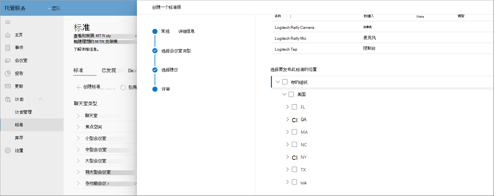

# 标准和会议室规划器

使用来自环境的智能建议，可以构建和策展标准。 然后，您可以将标准发布到区域、网站、建筑物或特定会议室，以与合作伙伴共享计划会议室以跟踪会议室部署。

## 查看会议室类型

在此页面上，可以查看组织内部的会议室或会议空间类型。 快速分解了会议室的标准数、发现的新设备数以及需要采取措施的设备数。

此页面还有一个命令栏，可在其中启动"创建标准"工作流或导航到"已发现设备、更改日志和存档"。

### 创建标准

使用 **"创建标准** "工作流创建标准。

**启动工作流**

1. 选择 **"创建一个标准版"**，然后提供一般详细信息，例如标准的名称和说明。

   

1. 为此标准选择你的会议室类型。

   

1. 在硬件清单中，从推荐的Teams选择会议室设备。

   

1. 查看"公司标准版"信息。

   

1. 将标准发布到区域、网站、建筑物或特定会议室。

   

完成工作流后，标准将成功创建并发布到网站、区域、建筑物或会议室。 现在，这些标准将用于规划目的。

### 已发现设备

在"标准" **中，选择** "已发现设备"，查看组织内部发现的所有非标准设备。

可以采取措施，查看和创建库存中这些已发现设备的标准。

## 会议室规划

使用会议室规划器向导规划具有会议 **扩展标准的** 会议室。

若要启动具有引导式体验的会议室规划器：：

1. 在左侧导航栏中，选择"清单"，然后选择" **规划会议室"**。

   

1. 从位置目录将会议室添加到规划器。

   

1. 设置标准分配首选项，如下所示：

   - 如果已记录计划合作伙伴，可以选择"让我的合作伙伴为所有这些会议室 **分配最佳解决方案"**。 此选项使合作伙伴能够为客户选择本地找到的最佳解决方案。

   - 如果计划内部会议扩展，请选择"组织管理员将使用组织标准为所有会议室 **分配最佳解决方案"**。 标准从组织在"标准"视图中已批准和发布的标准中自动分配。

1. 选择 **"组织管理员将分配最佳解决方案..."**

   

可以将标准批量分配给多个房间。

1. 检查"聊天室名称 **"下的多个房间**。

   

   

如果为位置、区域或网站提供了多个标准，请从"标准分配"列表中选择一个标准，以分配到"会议室名称"下方显示的 **会议室**。

查看标准作业并完成计划。 可以将计划打印为 PDF，以与合作伙伴共享。

## 访问控制

默认情况下，会议室规划器向导为托管服务管理员角色启用。 对于客户和所有其他内置角色，在"权限"选项卡下设置库存 **管理** 的权限。

