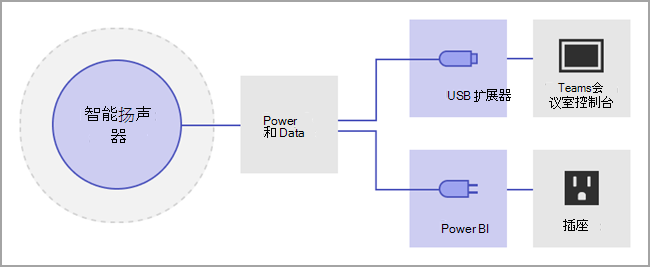
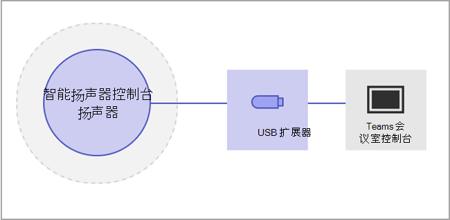
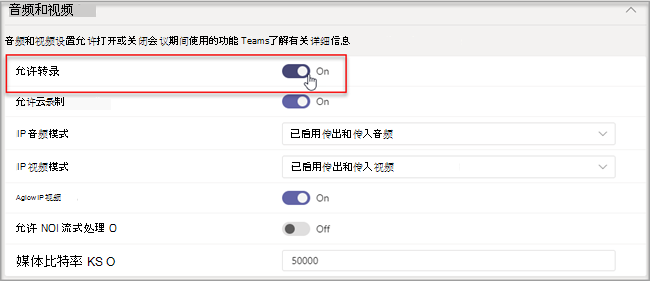

# 管理智能扬声器的语音识别技术控制

智能说话人使用语音配置文件信息来识别谁在实时听录中说哪些内容。 当Microsoft Teams 会议室会议室Windows智能扬声器时，可以在会议期间使用实时听录。 本文介绍租户管理员如何控制用于语音识别的语音分析，以生成实时听录。 你可以控制组织使用语音识别的程度以及以下功能：

- 在脚本中编辑发言人的姓名。
- 更改脚本中单个话语的说话人或更改脚本中所有话语中的 (，而不是在将来的脚本) 。
- 更改会议中列出的人的说话人标识。
- 删除每个脚本上标识为该发言人的一个或多个陈述的标识。

## 查看智能说话人要求

智能扬声器包括特殊的七麦克风阵列。 系统使用语音配置文件信息来识别会议室中最多 10 个人的声音。

以下各项是智能说话人要求：

- 客户租户必须位于北美 (美国) 。1
- 会议室应最多可有 10 人当场。
- 会议室具有至少 7 Mbps 的上载链接。

 1 智能扬声器和关联的语音配置文件和用法将仅以 EN-US 语言提供，对于美国、 (美国区域或) 可用。 租户用户注册并使用智能扬声器进行属性化听录时，这两个条件都必须成立。

## 设置智能扬声器

智能扬声器使用 USB 直接连接到Teams 会议室主机。 为获得最佳结果，应在 Yealink 品牌主机上使用 Yealink 品牌智能扬声器。

> [!NOTE]
> Yealink 智能 **扬声器必须与** Yealink 主机一同使用。

> [!NOTE]
> 我们不支持连接到 Logitech Surface Pro Microsoft Teams 会议室 的智能Surface Pro Microsoft Teams 会议室。 有一个已知Teams 会议室无法通过扩展坞识别智能扬声器。

智能扬声器应放置在至少 8 英寸 (20 厘米) 远离墙壁和大对象（如笔记本电脑）。 如果智能扬声器 USB 电缆对于设置来说不够长，请使用电缆扩展器。

1. 以管理员角色登录到主机。
2. 设置Teams设置以匹配智能扬声器麦克风和扬声器。
   也可通过 TAC 门户（而不是会议室控制台）完成此操作。

   该图显示了智能扬声器如何连接到设备（如果设备包含数据框）。

   

   该图显示了如果设备不包含数据框，智能扬声器如何连接到设备。

   

> [!Note]
> EPOS 和 Yealink 设备应具有"EPOS"或"Yealink"前缀，在扬声器名称中包含"UAC2_RENDER"，麦克风名称中包含"UAC2_TEAMS"。 如果在下拉菜单中找不到这些麦克风和扬声器名称，请重新启动智能扬声器设备。

## 启用智能说话人用户识别

语音配置文件数据可用于具有智能扬声器的任何会议。 有关[Teams设置](../meeting-policies-in-teams.md#allow-transcription)的信息，请参阅会议策略和 PowerShell 会议[cmdlet。](/powershell/module/skype/set-csteamsmeetingpolicy?view=skype-ps)

当策略设置为区分时，或者非会议被邀请者在会议期间加入时，将创建用户的语音配置文件数据。 语音配置文件数据在会议结束时关闭。

以下是设置智能说话人与用户识别所需的策略。

|策略|说明|值和行为|
|-|-|-|
|enrollUserOverride|使用 在租户的语音配置文件Teams设置中设置语音配置文件捕获或注册。 |**禁用** <ul><li> 从未注册的用户无法查看、注册或重新注册。<li>注册流的入口点将隐藏。<li>如果用户选择注册页面的链接，他们将看到一条消息，指出未为组织启用此功能。  <li>已注册的用户可以在设置中查看和删除其Teams配置文件。 删除其语音配置文件后，他们将无法查看、访问或完成注册流。</li></ul> **已启用** <ul><li> 用户可以查看、访问和完成注册流。<li>入口点会显示在"Teams"选项卡下的"设置 **"页面上**。</li></ul>|
|roomAttributeUserOverride|在会议室中控制基于语音的用户标识。 对于帐户，Teams 会议室此设置。| **禁用** <ul><li>Teams 会议室设备不会从会议室发送节省音频流的带宽。 <li>不会对会议室用户进行属性或区分，也不会检索或使用其语音签名。<li>会议室用户未知。</li></ul>  **属性** <ul><li>聊天室用户将基于其注册状态进行属性管理。<li>注册的用户在听录中显示其姓名。  <li>未注册的用户将显示为"发言人 n"。<li>设备Teams 会议室从会议室发送 7 个音频流。</ul>  **区分**  *此设置将在以后可用。*|
|AllowTranscription|用户和聊天室Teams必需。|**True** 和 **False**|
||||

在Teams管理中心中，设置"**允许听录"** 策略。 设置默认 **为"关闭**"。

## 常见问题 (FAQ)

**语音配置文件数据存储在何处？**

语音配置文件数据存储在包含用户Office 365云中。

**什么是保留时间线和策略？**

数据保留概述 中介绍了常规 [保留策略](/compliance/assurance/assurance-data-retention-deletion-and-destruction-overview)。 此外，如果用户未在 3 年内受邀参加智能扬声器的任何会议，则用户的语音配置文件数据将在 3 年后删除。 数据不会用于现有员工的任何会议。 如果员工离开了公司，则语音配置文件数据被视为用户内容，并按数据保留概述 中所述Office 365数据保留[策略处理](/compliance/assurance/assurance-data-retention-deletion-and-destruction-overview)。

**语音配置文件数据是否用于Microsoft 服务？**

否，语音配置文件数据仅用于用户已同意的目的。 Microsoft 不会使用语音配置文件数据，除非在Teams方案中。

例如，Microsoft 不会在下列情况下使用数据：

**当我加入另一组织的会议时，是否使用了我的语音配置文件数据？**

仅在由组织中用户组织的会议中为否。

**如何导出我的语音配置文件？**

IT 管理员可以随时导出音频数据。

## 相关主题

[支持文章：使用智能说话人识别聊天室内参与者 ](https://support.microsoft.com/office/use-teams-intelligent-speakers-to-identify-in-room-participants-in-meeting-transcription-a075d6c0-30b3-44b9-b218-556a87fadc00)
