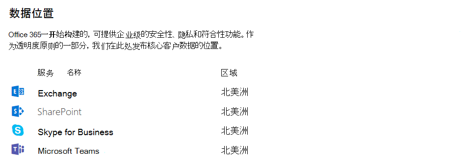

Microsoft Teams 中的安全性和合规性概述
======================================================

Microsoft Teams 建立在 Office 365 超大规模企业级云之上，提供我们的客户期望的高级安全性和合规性功能。

团队符合第 D 层。 这包括以下标准：ISO 27001、ISO 27018、SSAE16 SOC 1 和 SOC 2、HIPAA 以及欧盟模型条款 (EUMC)。 在 Microsoft 合规性框架中，Microsoft 将 Office 365 应用和服务分类为四种类别。 每种类别均按特定的合规性承诺定义，Office 365 服务或相关的 Microsoft 服务必须履行这些承诺才能列在相应类别中。

默认情况下启用合规性类别 C 和 D 中的服务，它们有行业领先的合规性承诺。 类别 A 和 B 中的服务提供了针对整个组织开启或关闭这些服务的控制功能。 有关详细信息，请参阅[行业标准和规章的合规性框架](https://go.microsoft.com/fwlink/?linkid=855777)。 Teams 还支持云安全联盟合规性。

Teams 还强制执行团队范围和组织范围的双重身份验证、通过 Active Directory 进行单一登录以及对正在传输的数据和静态数据加密。 文件存储在 SharePoint 中，并会进行 SharePoint 加密。 笔记存储在 OneNote 中，并会进行 OneNote 加密。 OneNote 数据存储在团队 SharePoint 网站中。 Wiki 选项卡还可以用于笔记记录, 并且它的内容也存储在团队 SharePoint 网站中。

我们还增加了以下支持：审核日志搜索、针对频道、聊天和文件的电子数据展示和法定保留，以及通过 Microsoft Intune 进行移动应用管理。 转到 Office 365 安全 & 合规中心以管理这些设置。 

若要了解有关 Office 365 安全 & 合规性的详细信息, 请阅读[配置 Office 365 租户以提高安全性](https://docs.microsoft.com/office365/securitycompliance/tenant-wide-setup-for-increased-security)

## 审核和报告

审核日志搜索直接插入到 Office 365 安全 & 合规性中心, 并通过将工作负荷的特定事件集、导出工作负荷或常规事件集提供给管理员使用和调查来公开设置警报和/或报告审核事件无限制审核日程表。 所有审核日志数据均可用于设置 Office 365 安全 & 合规中心内的警报, 以及用于进一步分析的筛选和导出。 请参阅此[链接](https://support.office.com/article/Search-the-audit-log-in-the-Office-365-Security-Compliance-Center-0d4d0f35-390b-4518-800e-0c7ec95e946c), 了解有关如何在 Office 365 安全 _AMP_ 合规中心中对 Microsoft 团队事件进行审核日志搜索的详细信息。 

## 合规性内容搜索

可使用内容搜索通过丰富的筛选功能搜索所有团队数据, 并将其导出到特定容器以实现合规性和诉讼支持。 在有无电子数据展示案例的情况下，均可执行此操作。 这使合规性管理员能够跨所有用户收集团队数据、查看和导出它以进行进一步处理。 请参阅此[链接](https://support.office.com/article/content-search-in-office-365-53390468-eec6-45cb-b6cd-7511f9c909e4), 了解有关如何在 Office 365 安全 _AMP_ 合规中心中对 Microsoft 团队内容进行合规性内容搜索的详细信息。 

提示: Microsoft 团队可用于筛选到仅限 Microsoft 团队的内容, 例如聊天和频道消息、会议和通话。 

## 电子数据展示

电子数据展示是为了回应法律诉讼或调查中提供文件的要求而找出、收集和生成电子方式存储的信息 (ESI) 的电子操作过程。 功能包括 "案例管理"、"保存"、"搜索"、"分析" 和 "工作组数据导出"。 这包括聊天、消息传递和文件、会议和通话摘要。 对于团队会议和通话, 将创建会议和通话中发生的事件的摘要, 并将其提供给电子数据展示。 

有关如何在安全 & 合规中心中执行电子数据展示和运行团队内容的合规性内容搜索的更多详细信息, 请访问以下链接: 

[电子数据展示](https://support.office.com/article/manage-legal-investigations-in-office-365-2e5fbe9f-ee4d-4178-8ff8-4356bc1b168e) 

[内容搜索](https://support.office.com/article/search-for-content-in-office-365-df2d1e0f-b476-42c9-aade-4a260b24f193)

客户可以根据其需求 (https://support.office.com/article/Office-365-Advanced-eDiscovery-fd53438a-a760-45f6-9df4-861b50161ae4)而不是使用现场电子数据展示或 [高级电子数据展示]。 下表概括列出了这两者之间的差异：

| |就地电子数据展示  |高级电子数据展示  |
|---------|---------|---------|
|案例管理     |X        |X         |
|访问控制  |X         |X         |
|内容搜索     |X         | X        |
|保留   |X         | X        |
|导出     |X         |X         |
|重复项检测     |-         |X         |
|使用机器学习的相关性搜索    |-         |X         |
|非结构化数据分析      |-         |X         |

## 法定保留

在诉讼期间, 经常需要将与用户 (保管人) 或团队关联的所有数据保留永久, 以便它可以用作案例的证据。 可通过将用户 (用户邮箱) 或团队置于法律封存来实现此目的。 当团队内的任何团队通过定向的查询或筛选的内容 (邮箱或网站集的子集) 或诉讼封存 (整个邮箱或网站集) 放置时, 保留在组邮箱中。 这可确保即使最终用户删除或编辑 ingested 到组邮箱中的频道消息, 该内容的不可变副本仍可在电子数据展示搜索中维护和使用。 通常在电子数据展示案例的上下文中应用法定保留。 请参阅[此](https://support.office.com/article/overview-of-preservation-policies-9c3b1d52-40ce-4ba3-a520-9ae0be15538a)帮助文章, 了解有关在 Office 365 安全 _AMP_ 合规中心中保留和保留的详细信息。 

## Microsoft 团队的信息保护体系结构。 

下图指示团队文件和邮件的团队数据到 Exchange 和 SharePoint 的接收流。 

下图指示团队会议和向 Exchange 调用数据的接收流程。

> [!IMPORTANT]
> 要发现团队内容, 最多可以有24小时的延迟。

许可
---------------

涉及到信息保护功能时，Office 365 订阅和关联的单独许可证将确定功能集。

| 信息保护功能 | Office 365 商业协作版 | Office 365 商业高级版 | Office 365 企业版 E1 | Office 365 企业版 E3/E4 | Office 365 企业版 E5 |
|-----------------------------------|--------------------------------|-----------------------------|--------------------------|-----------------------------|--------------------------|
|              存档              |               -                |              -              |            -             |             是             |           是            |
|        就地电子数据展示        |               -                |              -              |            -             |             是             |           是            |
|        高级电子数据展示        |               -                |              -              |            -             |              -              |           是            |
|            法定保留             |               -                |              -              |            -             |             是             |           是            |
|     合规性内容搜索     |               -                |             是             |           是            |             是             |           是            |
|      审核和报告       |              是               |             是             |           是            |             是             |           是            |
|       条件访问\*        |              是               |             是             |           是            |             是             |           是            |

> [!NOTE]
> \*条件访问需要额外的许可证

| |  |  |
|---------|---------|---------|
|     |决策点         |贵组织是否有所需的许可证来满足合规性和安全性业务需求？         |
|    |后续步骤         |查看组织的当前许可, 并确认它是否满足所有对合规性和安全的业务要求。         |

在启用任何这些功能之前, 请确保你有权访问 Microsoft 365 管理中心中的安全 & 合规中心。 默认情况下，租户管理员有访问权限。

内容搜索和电子数据展示不需要在安全 & 合规中心中启用。

Teams 中的数据的位置
-------------------------

Teams 中的数据位于与你的 Office 365 租户关联的地理区域。 目前, 团队支持澳大利亚、加拿大、印度、日本、英国、美洲、APAC 和 EMEA 地区。 

> [!IMPORTANT]
> 目前, 团队仅为新租户提供 "澳大利亚"、"加拿大"、"印度"、"日本" 和 "英国" 的数据。 新租户的定义是，该租户中没有任何一个用户登录过 Teams。 澳大利亚、印度和日本的现有租户将继续在 APAC 区域中存储其团队数据。 加拿大和英国的现有租户将分别存储在美洲和 EMEA 地区的数据。

要详细了解为 Teams 启动英国和印度数据驻留的信息，请阅读 Ansuman Acharya 的博客文章 [Microsoft Teams 启动印度数据驻留，其他地理位置不久将启动](https://techcommunity.microsoft.com/t5/Microsoft-Teams-Blog/Microsoft-Teams-Launches-Australia-and-Japan-Data-Residency/ba-p/237827)。 

有关针对团队的加拿大数据派驻服务的详细信息, 请阅读 Varun Sagar 的博客文章, [Microsoft 团队即将推出加拿大数据派驻、澳大利亚和日本](https://techcommunity.microsoft.com/t5/Microsoft-Teams-Blog/Microsoft-Teams-Launches-Canada-Data-Residency-Australia-and/ba-p/227178)。 

若要了解有关如何启动澳大利亚和日本数据派驻团队的详细信息, 请阅读 Varun Sagar 的博客文章, [Microsoft 团队启动澳大利亚和日本数据派驻服务](https://go.microsoft.com/fwlink/?linkid=867773)。 

若要查看哪个区域驻留你的租户的数据, 请转到[Microsoft 365 管理中心](https://portal.office.com/adminportal/home) > **设置** > **组织配置文件**。 向下滚动到“**数据位置**”。 

条件访问策略适用于团队？
-------------------------

Microsoft 团队很大程度上依赖于 Exchange Online、SharePoint Online 和 Skype for Business Online, 以获得核心生产力方案, 如会议、日历、互操作聊天和文件共享。 为这些云应用设置的条件访问策略在用户直接登录到 Microsoft 团队 (在任何客户端上) 时适用于 Microsoft 团队。 

Microsoft 团队作为 Azure Active Directory 条件访问策略中的云应用单独受支持。 为 Microsoft 团队云应用设置的条件访问策略在用户登录时适用于 Microsoft 团队。 但是, 如果在其他应用 (如 Exchange Online 和 SharePoint Online) 上没有正确的策略, 用户可能仍然能够直接访问这些资源。 有关在 azure 门户中设置条件访问策略的详细信息, 请转到: (https://docs.microsoft.com/azure/active-directory/active-directory-conditional-access-azure-portal-get-started) 

适用于 Windows 和 Mac 的 Microsoft 团队桌面客户端支持新式身份验证。 新式身份验证通过平台将基于 Azure Active Directory 身份验证库 (ADAL) 的登录引入 Microsoft Office 客户端应用程序。

Microsoft 团队桌面应用程序支持 AppLocker。  有关 AppLocker 先决条件的详细信息, 请参阅: 需要使用 AppLocker (https://docs.microsoft.com/windows/security/threat-protection/windows-defender-application-control/applocker/requirements-to-use-applocker)。

Teams 中的隐私
--------------------------

作为 Office 365 的客户，你拥有并控制你的数据。 除了为你提供你已订阅的服务外，Microsoft 不会将你的数据用于任何其他用途。 作为服务提供商，我们不会扫描你的电子邮件、文档或团队来做广告或用于与服务无关的用途。 Microsoft 无权访问上载的内容。 对于 OneDrive for Business 和 SharePoint Online，客户数据位于租户中。

在[Microsoft 信任中心](https://microsoft.com/trustcenter)查看有关我们的信任和安全相关信息的更多信息。 团队遵循与 Microsoft 信任中心相同的指南和原则。

相关主题
----------------------
[Office 365 ATP 安全链接](https://docs.microsoft.com/office365/securitycompliance/atp-safe-links#how-to-get-atp-safe-links-protection)
