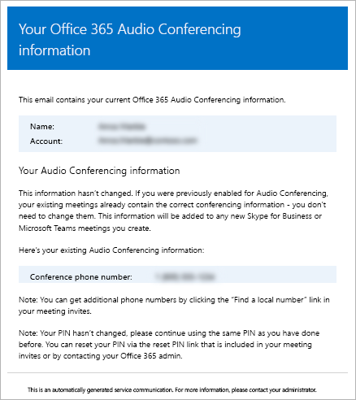

# 在 Microsoft Teams 中向用户发送包含其音频会议信息的电子邮件Send an email to a user with their Audio Conferencing information in Microsoft Teams

有时，Microsoft Teams 用户可能需要你向其发送电话音频会议信息。Sometimes Microsoft Teams users may need you to send them their Audio Conferencing information. 你可以单击用户的属性下的“**通过电子邮件发送会议信息**”来完成。You can do this by clicking **Send conference info via email** under the properties for a user. 当你发送此电子邮件时，它将包含所有音频会议信息，包括：When you send this email, it will contain all of the audio conferencing information, including:
  
- 用户的会议电话或拨入电话号码。The conference phone or dial-in phone number for the user.
    
- 用户的会议 ID。The user's conference ID.
    
   
下面是发送的电子邮件示例：Here is an example of the email that is sent:
  

> [!NOTE]
> [!INCLUDE [updating-admin-interfaces](includes/updating-admin-interfaces.md)]
  
## 向用户发送包含音频会议信息的电子邮件Send an email with audio conferencing information to a user

###  使用 Microsoft 团队管理中心Using the Microsoft Teams admin center

1. 在左侧导航中, 单击 "**用户**", 然后从可用用户列表中选择用户。In the left navigation, click **Users**, and then select the user from the list of available users.

2. 在页面的顶部，单击**编辑**。At the top of the page, click **Edit**.

3. 在 "**音频会议**" 下, 单击 "**通过电子邮件发送会议信息**"。Under **Audio Conferencing**, click **Send conference info in email**.

## 此电子邮件的其他须知事项。What else should you know about this email?

- 在为您的组织中的用户启用音频会议后, 会向他们发送多封电子邮件:There are several emails that are sent to users in your organization after they are enabled for audio conferencing:
    
  - 向其分配**音频会议**许可证时。When an **Audio Conferencing** license is assigned to them.
    
  - 当您手动重置用户的音频会议 PIN 时。When you manually reset the user's audio conferencing PIN.
    
  - 当你手动重置用户的会议 ID 时。When you manually reset the user's conference ID.
    
  - 删除**音频会议**许可证后。When an **Audio Conferencing** license is removed from them.
    
  - 当用户的音频会议提供商从 Microsoft 更改为另一个提供商或 "**无**" 时。When the audio conferencing provider for a user is changed from Microsoft to another provider or **None**.
    
  - 当用户的音频会议提供商更改为 Microsoft 时。When the audio conferencing provider for a user is changed to Microsoft.
  
## 想要了解有关 Windows PowerShell 的详细信息？Want to know more about Windows PowerShell?

Windows PowerShell Office 365 的功能是管理用户以及允许或不允许用户执行某些操作。使用 Windows PowerShell，可以通过单点管理来管理 ，这样做可在有多个任务需要执行时简化日常工作。若要开始使用 Windows PowerShell，请参阅下列主题：Windows PowerShell is all about managing users and what users are allowed or not allowed to do. With Windows PowerShell, you can manage Office 365 using a single point of administration that can simplify your daily work when you have multiple tasks to do. To get started with Windows PowerShell, see these topics:
    
  - [为什么要使用 Office 365 PowerShellWhy you need to use Office 365 PowerShell](https://go.microsoft.com/fwlink/?LinkId=525041)
    
  - [使用 Windows PowerShell 管理 Office 365 的最佳方式Best ways to manage Office 365 with Windows PowerShell](https://go.microsoft.com/fwlink/?LinkId=525142)
    
有关 Windows PowerShell 的详细信息，请参阅 [Microsoft Teams PowerShell 参考](https://docs.microsoft.com/powershell/module/teams/?view=teams-ps)了解详细信息。For more information about Windows PowerShell, see the [Microsoft Teams PowerShell reference](https://docs.microsoft.com/powershell/module/teams/?view=teams-ps) for more information.
    
  
## 相关主题Related topics

[试用或购买 Office 365 中的音频会议Try or purchase Audio Conferencing in Office 365](/SkypeForBusiness/audio-conferencing-in-office-365/try-or-purchase-audio-conferencing-in-office-365)
