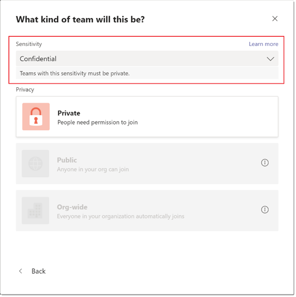
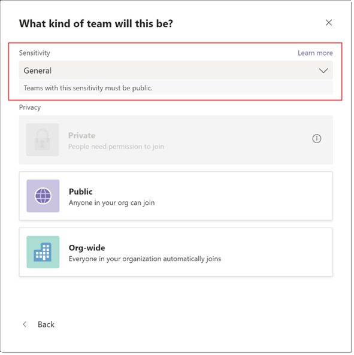

# 用于检测的敏感度Microsoft Teams

[敏感度标签](/microsoft-365/compliance/sensitivity-labels)允许Teams保护和管理对在团队内协作期间创建的敏感组织内容的访问。 在 [Microsoft](/microsoft-365/compliance/go-to-the-securitycompliance-center)合规性中心中配置敏感度标签及其关联策略后，这些标签可以应用于组织的团队。

对于使用教育 SKUS 的客户，课堂团队目前不支持Teams标签。 若要详细了解许可，请参阅Microsoft Teams[说明](/office365/servicedescriptions/teams-service-description)。

## 敏感度标签与分类标签Teams区别？

敏感度标签不同于分类标签，也称为 Azure AD 组分类。 分类标签是文本字符串，可以与Microsoft 365组相关联，但没有任何与之关联的实际策略。 使用分类标签作为元数据，然后必须使用其他方法（例如内部工具和脚本）强制实施策略。

使用敏感度标签的好处是，其策略是通过 Microsoft 365 Groups 平台、合规性中心和 Teams 服务的组合自动Teams强制实施。 敏感度标签提供强大的基础结构支持，用于保护组织的敏感数据并确保符合内部策略或法规。

如果当前使用分类标签，请参阅以下文档，详细了解如何将它们迁移到敏感度标签： [经典 Azure AD 组分类](/microsoft-365/compliance/sensitivity-labels-teams-groups-sites#classic-azure-ad-group-classification)。

## 敏感度标签的示例方案

如何将敏感度标签用于组织中Teams的示例方案：

- [为团队设置 (隐私级别) 隐私级别](#set-the-privacy-level-for-teams)
- [控制来宾对团队的访问](#control-guest-access-to-teams)

### 设置团队的隐私级别

可以创建和配置敏感度标签，在团队创建期间应用该标签时，允许用户创建具有特定隐私性 (公共或) 设置。

例如，创建并发布名为"机密"的敏感度标签，该标签隐私选项配置为"专用 **"。** 因此，使用此标签创建的任何团队都必须是专用团队。 

当用户创建新团队并选择"机密"标签时，可供用户使用的唯一隐私选项是"专用 **"。** 用户无法选择其他隐私选项，例如"公共"和"组织范围"：

同样，创建并发布名为"常规"的敏感度标签，该标签隐私选项配置为"**公共"。** 当用户创建新团队时，他们只能在选择此标签时创建公共团队或组织范围的团队：

创建团队时，敏感度标签显示在团队中频道的右上角。 

> [!NOTE]
> 如果使用分层父子标签（如"Confidential\Finance"），则频道标头中只会显示父标签。

团队所有者可以通过访问团队，然后单击"编辑团队"，随时更改该团队的敏感度标签和 **隐私设置**。

### 控制来宾对团队的访问

可以使用敏感度标签来控制来宾对团队的访问。 Teams不允许来宾访问的标签创建的用户仅适用于您的组织中的用户。 无法将组织外部人员添加到团队。

## Microsoft Teams管理中心

可以在管理中心内创建或编辑团队时应用Microsoft Teams标签。 

敏感度标签在团队属性中以及管理中心的"管理团队"页面上的"分类"Microsoft Teams可见。

## 限制

在将敏感度标签用于Teams，请注意以下限制：

- **子标签不显示父标签名称**
    
    Teams支持子标签，但不显示父标签的名称。 例如，"**机密** \\ **所有员工"** 显示为"**所有员工"。**

- **API、PowerShell cmdlet 和模板Teams Graph敏感度标签**
    
    用户无法通过 Teams Graph API、Teams PowerShell cmdlet 和自定义模板Teams敏感度标签。 但是，新式Graph API 和 PowerShell cmdlet 允许创建具有标签的组。 因此，用户可以首先使用"组"Graph或 PowerShell cmdlet 创建带标签的组，然后将这些组转换为Teams。

- **支持专用频道**
    
    在团队中创建的专用频道将继承应用于团队的敏感度标签。 该标签会自动应用于专用SharePoint网站集上。
    
    但是，如果用户直接更改专用通道SharePoint网站的敏感度标签，该标签更改不会反映在 Teams 客户端中。 在此方案中，用户继续在专用频道标题中看到应用于团队的原始敏感度标签。

## 如何为用户创建和配置敏感度Teams

按照以下文档Microsoft 365创建和配置敏感度标签，Teams： 

- [使用敏感度标签保护网站](/microsoft-365/compliance/sensitivity-labels-teams-groups-sites)Microsoft Teams、Microsoft 365组SharePoint的内容。
