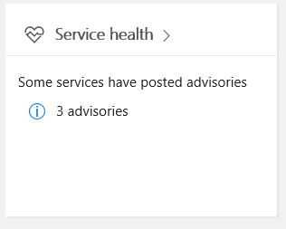

验证 Microsoft Teams 的服务运行状况
===========================================

Microsoft Teams 的服务运行状况显示在 Office 365 管理门户主页面上。 在对问题进行故障排除之前，建议验证 Teams 服务是否正常运行。

此外请注意，Microsoft Teams 建立在其他 Office 365 服务之上，因此，检查服务运行状况时，请记得还要检查 Exchange、SharePoint 和 OneDrive for Business 的状态。 这些其他服务的服务运行状况问题并不自动表示 Teams 受到影响（例如，Exchange 中的通讯簿下载不可用），但你应该查看针对这些受影响服务的建议，以确定是否影响 Microsoft Teams。

