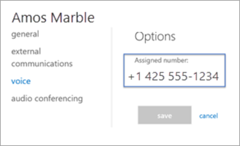

# 为 Microsoft Teams 设置公共区域电话许可证Set up the Common Area Phone license for Microsoft Teams
> [!NOTE]
> 常见的区域电话不支持语音邮件。Common area phones do not support voicemail.

常用的区域电话通常放置在一个区域中，该区域类似于供许多用户进行呼叫的前厅浏览区域或其他区域。例如，接收区域、会议厅或会议电话。A common area phone is typically placed in an area like a lobby or another area that is available to many people to make a call; for example, a reception area, lobby, or conference phone. 常用的区域电话设置为设备，而不是用户，并且可以自动登录到网络。Common area phones are set up as devices rather than users, and can automatically sign into a network.

在下面的步骤中，我们将帮助你设置电话系统的帐户，以便为你的组织部署公共的区域电话。In the steps below, we'll help you set up an account for Phone System to deploy common area phones for your organization. 要获得更完整的会议室体验（包括音频会议），请考虑使用会议室设备购买专用的会议室许可证。For a more complete meeting room experience, including audio conferencing, consider purchasing the dedicated Meeting Room license with a meeting room device. 

首先，您需要购买一个通用的区域电话（CAP）许可证，并确保您有经过认证的电话。First, you need to purchase a Common Area Phone (CAP) license and make sure that you have a certified phone. 若要搜索并了解有关已认证手机的详细信息，请转到 " [Microsoft 团队设备](https://products.office.com/microsoft-teams/across-devices?ms.url=officecomteamsdevices&rtc=1)"。To search for and learn more about certified phones, go to [Microsoft Teams devices](https://products.office.com/microsoft-teams/across-devices?ms.url=officecomteamsdevices&rtc=1). 

## 第 1 步 - 购买许可证Step 1 - Buy the licenses

1. 在 Microsoft 365 管理中心，转到 "**帐单** > **购买服务**"，然后展开 "**其他计划**"。In the Microsoft 365 admin center, go to **Billing** > **Purchase services** and then expand **Other plans**.

    

2. 选择 "**通用区域电话** > **立即购买**"。Select **Common Area Phone** > **Buy now**.

3. 在 "签出" 页面上，单击 "**立即购买**"。On the Checkout page, click **Buy now**.

4. 展开 **"加载项订阅**"，然后单击 "购买呼叫计划"。Expand **Add-on subscriptions** and then click to buy a Calling Plan. 选择 "**国内呼叫计划**" 或 "**国内和国际通话计划**"。Choose either the **Domestic Calling Plan** or **Domestic and International Calling Plan**.

> [!NOTE]
> 如果您使用的是 Microsoft Phone 系统直接路由，则不需要呼叫计划许可证。If you are using Microsoft Phone System Direct Routing, you do not need a Calling Plan license.

> [!NOTE]
> 无需添加电话系统许可证。You don't need to add a Phone System license. 许可证包含在公共区域电话许可证中。It's included with the Common Area Phone license.

有关许可证的详细信息，请参阅[Microsoft 团队加载项许可](teams-add-on-licensing/microsoft-teams-add-on-licensing.md)。For more information on licenses, see [Microsoft Teams add-on licensing](teams-add-on-licensing/microsoft-teams-add-on-licensing.md).

通用区域电话许可证支持：The Common Area Phone license supports: 

|   |  公共区域电话Common Area Phone  |
|---------|---------|
|Skype for BusinessSkype for Business |   &#x2714;&#x2714; |
|Microsoft TeamsMicrosoft Teams |   &#x2714;&#x2714; |
|电话系统Phone Systems |    &#x2714;&#x2714; |
|音频会议Audio Conferencing |       &#x2718; &sup1;&#x2718; &sup1;  |
|Microsoft IntuneMicrosoft Intune |        &#x2718; &sup2;&#x2718; &sup2; |
|全球可用性Worldwide Availability |    &#x2714;&#x2714; |
|频道可用性Channel Availability |    EA、EAS、CSP、GCC、EES、Web DirectEA, EAS, CSP, GCC, EES, Web Direct  |
|      |         |

&sup1;常见的区域电话可以通过会议组织者提供的拨入号码加入音频会议&sup1; Common Area Phones can join audio conferences via dial-in number provided by the meeting organizer

&sup2;在主权云中不可用&sup2; Not available in sovereign clouds  

## 第 2 步 - 为手机创建一个新的用户帐户并分配许可证Step 2 - Create a new user account for the phone and assign the licenses

1. 在 Microsoft 365 管理中心中，转到 "**用户** > **活动用户** > "**添加用户**。In the Microsoft 365 admin center, go to **users** > **active users** > **add a user**.

2. 输入用户名（如 "Main"）作为第一个名称，输入 "接收" 作为第二个名称。Enter a user name like "Main" for the first name and "Reception" for the second name.

3. 如果不自动生成类似 "主接收" 之类的显示名称，请输入一个显示名称。Enter a display name if it doesn't autogenerate one like "Main Reception."

4. 输入用户名，如 "MainReception" 或 "Mainlobby"。Enter a user name like "MainReception" or "Mainlobby."

5. 对于常见的区域电话，您可能需要手动设置密码或对所有公共区域电话设置密码。For common area phones, you might want to set a password manually or have the same password for all your common area phones. 此外，您可能会考虑清除 "**当用户首次登录时，使此用户更改其密码**" 复选框。Also, you might think about clearing the **Make this user change their password when they first sign in** check box.

6. 将许可证分配给用户。Assign the licenses to the user. 在同一页面上，点击展开**产品许可证**。On the same page, click to expand **Product licenses**. 打开公共区域电话，然后选择**国内呼叫计划**或**国内和国际通话计划**。Turn on the Common Area Phone and pick either a **Domestic Calling Plan** or a **Domestic and International Calling Plan**. 

    

> [!NOTE]
> 如果您使用的是 Microsoft Phone 系统直接路由，则无需分配呼叫计划许可证。If you are using Microsoft Phone System Direct Routing, you do not need to assign a Calling Plan license.

有关详细信息，请参阅[添加用户](https://docs.microsoft.com/office365/admin/add-users/add-users?redirectSourcePath=%252farticle%252f1970f7d6-03b5-442f-b385-5880b9c256ec&view=o365-worldwide)。For more information, see [Add a user](https://docs.microsoft.com/office365/admin/add-users/add-users?redirectSourcePath=%252farticle%252f1970f7d6-03b5-442f-b385-5880b9c256ec&view=o365-worldwide).

## 第 3 步 - 将电话号码分配给公共区域电话用户帐户Step 3 - Assign a phone number to the Common Area Phone user account

使用 "团队管理中心" 为用户分配一个号码。Use the Teams admin center to assign a number to the user.

1. 在 "团队" 管理中心中，选择 "**语音** > **电话号码**"。In the Teams admin center, select **Voice** > **Phone numbers**.

3.    从电话号码列表中选择一个号码，然后点击**分配**。Select a number from the list of phone numbers and click **Assign**.

4. 在 "**分配**" 页面上的 "语音用户" 框中，键入将使用该电话的用户的名称，然后在 "**选择语音用户**" 下拉列表中选择用户。On the **Assign** page, in the Voice user box, type the name of the user who will be using the phone, and then select the user in the **Select a voice user** drop-down list.

5. 接下来，你需要添加紧急地址。Next, you need to add an emergency address. 选择 "**按城市搜索**"、"**按说明搜索**" 或从下拉列表中选择 "**按位置搜索**"，然后在文本框中输入 "城市"、"说明" 或 "位置"。Choose **Search by city**, **Search by description**, or **Search by location** from the drop-down list, and then enter the city, description, or location in the text box. 搜索后，请在 "**选择紧急地址**" 下查看，选择合适的 "紧急地址"。Once you search, look under **Select emergency address** to pick the right one for you.

6. 点击**保存**，你的用户将显示如下：Click **Save** and your user should look like this:

   

> [!NOTE]
> 仅当用户已应用电话系统许可证时，用户才会显示。Users will only show up if they have a Phone System license applied. 如果你刚执行了该操作，用户可能需要经过一段时间才能在列表中显示。If you just did this, then sometimes it takes a bit for the user to show up in the list.

有关详细信息，请参阅[为用户获取电话号码](getting-phone-numbers-for-your-users.md)。For more information, see [Getting phone numbers for your users](getting-phone-numbers-for-your-users.md).

您还可以通过其他运营商和 "端口" 获取您的电话号码，或将其转移到 Office 365。You can also take your phone number that you have with another carrier and "port" or transfer it over to Office 365. 请参阅[将电话号码转移给团队](phone-number-calling-plans/transfer-phone-numbers-to-teams.md)。See [Transfer phone numbers to Teams](phone-number-calling-plans/transfer-phone-numbers-to-teams.md).

