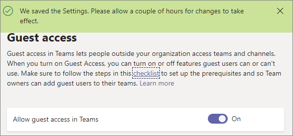

<a name="turn-on-or-off-guest-access-to-microsoft-teams"></a><span data-ttu-id="11fc8-103">开启或关闭对 Microsoft Teams 的来宾访问</span><span class="sxs-lookup"><span data-stu-id="11fc8-103">Turn on or off guest access to Microsoft Teams</span></span>
======================================

<span data-ttu-id="11fc8-104">作为 Office 365 管理员，你必须先启用来宾功能，你或贵组织的用户（具体来说是团队所有者）才能添加来宾。</span><span class="sxs-lookup"><span data-stu-id="11fc8-104">As the Office 365 admin, you must enable the guest feature before you or your organization's users (specifically, team owners) can add guests.</span></span> 

<span data-ttu-id="11fc8-105">在 Azure Active Directory 中设置来宾设置后，</span><span class="sxs-lookup"><span data-stu-id="11fc8-105">The guest settings are set in Azure Active Directory.</span></span> <span data-ttu-id="11fc8-106">更改在 Office 365 组织中生效需要 2 小时到 24 小时。</span><span class="sxs-lookup"><span data-stu-id="11fc8-106">It takes 2 hours to 24 hours for the changes to be effective across your Office 365 organization.</span></span> <span data-ttu-id="11fc8-107">如果用户会看到"请与管理员联系"的邮件如果他们尝试将来宾添加到其工作组，，则可能的来宾功能尚未启用或设置尚未有效。</span><span class="sxs-lookup"><span data-stu-id="11fc8-107">If a user sees the message "Contact your administrator" when they try to add a guest to their team, it's likely that either the guest feature hasn't been enabled or the settings aren't effective yet.</span></span>

> [!IMPORTANT]
> <span data-ttu-id="11fc8-108">要启用来宾访问功能的完全体验，非常重要的一点是理解 Microsoft Teams、Azure Active Directory 和 Office 365 之间的核心授权相关性。</span><span class="sxs-lookup"><span data-stu-id="11fc8-108">To enable the full experience of the guest access feature, it's important to understand the core authorization dependency between Microsoft Teams, Azure Active Directory, and Office 365.</span></span> <span data-ttu-id="11fc8-109">有关详细信息，请参阅[在 Microsoft Teams 中授权来宾访问](Teams-dependencies.md)。</span><span class="sxs-lookup"><span data-stu-id="11fc8-109">For more information, see [Authorize guest access in Microsoft Teams](Teams-dependencies.md).</span></span>

## <a name="guest-access-vs-external-access-federation"></a><span data-ttu-id="11fc8-110">来宾访问与外部访问 （联合身份验证）</span><span class="sxs-lookup"><span data-stu-id="11fc8-110">Guest access vs. external access (federation)</span></span>

[!INCLUDE [guest-vs-external-access](includes/guest-vs-external-access.md)]

## <a name="configure-guest-access-in-the-microsoft-teams-admin-center"></a><span data-ttu-id="11fc8-111">在管理中心中的 Microsoft 团队配置来宾访问</span><span class="sxs-lookup"><span data-stu-id="11fc8-111">Configure guest access in the Microsoft Teams admin center</span></span>

1.  <span data-ttu-id="11fc8-112">登录到 Microsoft 团队管理中心。</span><span class="sxs-lookup"><span data-stu-id="11fc8-112">Sign in to the Microsoft Teams admin center.</span></span>

2.  <span data-ttu-id="11fc8-113">选择**组织范围设置** > **来宾访问**。</span><span class="sxs-lookup"><span data-stu-id="11fc8-113">Select **Org-wide settings** > **Guest access**.</span></span>

3. <span data-ttu-id="11fc8-114">设置为**上**的**Microsoft 团队中的允许来宾访问**切换开关。</span><span class="sxs-lookup"><span data-stu-id="11fc8-114">Set the **Allow guest access in Microsoft Teams** toggle switch to **On**.</span></span>

    

4.  <span data-ttu-id="11fc8-116">设置在**调用**、**会议**和**消息**下的切换为**打开**或**关闭**，具体取决于您希望允许为来宾用户功能。</span><span class="sxs-lookup"><span data-stu-id="11fc8-116">Set the toggles under **Calling**, **Meeting**, and **Messaging** to **On** or **Off**, depending on the capabilities you want to allow for guest users.</span></span>

    - <span data-ttu-id="11fc8-117">**使接听私人电话**– 启用此设置**在**允许来宾进行对等呼叫。</span><span class="sxs-lookup"><span data-stu-id="11fc8-117">**Make private calls** – Turn this setting **On** to allow guests to make peer-to-peer calls.</span></span>
    - <span data-ttu-id="11fc8-118">**允许的 IP 视频**-启用此设置**在**允许来宾使用其呼叫和会议的视频。</span><span class="sxs-lookup"><span data-stu-id="11fc8-118">**Allow IP video** - Turn this setting **On** to allow guests to use video in their calls and meetings.</span></span>
    - <span data-ttu-id="11fc8-119">**屏幕共享模式**– 此设置控制屏幕共享来宾用户的可用性。</span><span class="sxs-lookup"><span data-stu-id="11fc8-119">**Screen sharing mode** – This setting controls the availability of screen sharing for guest users.</span></span> 
       - <span data-ttu-id="11fc8-120">启用此设置来**禁用**删除来宾共享其屏幕团队中的功能。</span><span class="sxs-lookup"><span data-stu-id="11fc8-120">Turn this setting to **Disabled** to remove the ability for guests to share their screens in Teams.</span></span> 
       - <span data-ttu-id="11fc8-121">启用此设置**单个应用程序**允许的单独的应用程序共享。</span><span class="sxs-lookup"><span data-stu-id="11fc8-121">Turn this setting to **Single application** to allow sharing of individual applications.</span></span> 
       - <span data-ttu-id="11fc8-122">打开到**整个屏幕**，确定允许完成的屏幕共享此设置。</span><span class="sxs-lookup"><span data-stu-id="11fc8-122">Turn this setting to **Entire screen** to allow complete screen sharing.</span></span>
    - <span data-ttu-id="11fc8-123">**立即允许开会**– 启用此设置**在**允许来宾中的 Microsoft 团队使用立即开会功能。</span><span class="sxs-lookup"><span data-stu-id="11fc8-123">**Allow Meet Now** – Turn this setting **On** to allow guests to use the Meet Now feature in Microsoft Teams.</span></span>
    - <span data-ttu-id="11fc8-124">**编辑发送的邮件**-启用此设置**在**允许来宾编辑消息它们以前发送。</span><span class="sxs-lookup"><span data-stu-id="11fc8-124">**Edit sent messages** - Turn this setting **On** to allow guests to edit messages they previously sent.</span></span>
    - <span data-ttu-id="11fc8-125">**来宾可以删除已发送的邮件**– 此设置**在**允许来宾删除消息他们打开以前发送。</span><span class="sxs-lookup"><span data-stu-id="11fc8-125">**Guests can delete sent messages** – Turn this setting **On** to allow guests to delete messages they previously sent.</span></span>
    - <span data-ttu-id="11fc8-126">**聊天**– 启用此设置**在**授予携带团队中使用聊天功能。</span><span class="sxs-lookup"><span data-stu-id="11fc8-126">**Chat** – Turn this setting **On** to give guests the ability to use chat in Teams.</span></span>
    - <span data-ttu-id="11fc8-127">**在对话中使用 Giphys** – 启用此设置**在**允许来宾用于 Giphys 对话中。</span><span class="sxs-lookup"><span data-stu-id="11fc8-127">**Use Giphys in conversations** – Turn this setting **On** to allow guests to use Giphys in conversations.</span></span> <span data-ttu-id="11fc8-128">Giphy 是联机数据库和搜索引擎，使用户可以搜索和共享动态的 GIF 文件。</span><span class="sxs-lookup"><span data-stu-id="11fc8-128">Giphy is an online database and search engine that allows users to search for and share animated GIF files.</span></span> <span data-ttu-id="11fc8-129">每个 Giphy 分配内容评级。</span><span class="sxs-lookup"><span data-stu-id="11fc8-129">Each Giphy is assigned a content rating.</span></span>
    - <span data-ttu-id="11fc8-130">**Giphy 内容评级**– 选择下拉列表中选择一个评级：</span><span class="sxs-lookup"><span data-stu-id="11fc8-130">**Giphy content rating** –  Select a rating from the drop-down list:</span></span>
       - <span data-ttu-id="11fc8-131">**允许的所有内容**-来宾都将能够在聊天，而不考虑内容评级中插入所有 Giphys。</span><span class="sxs-lookup"><span data-stu-id="11fc8-131">**Allow all content** - Guests will be able to insert all Giphys in chats, regardless of the content rating.</span></span>
       - <span data-ttu-id="11fc8-132">**中等**-来宾都将能够在聊天室中插入 Giphys，但将从成人内容适度限制。</span><span class="sxs-lookup"><span data-stu-id="11fc8-132">**Moderate** - Guests will be able to insert Giphys in chats, but will be moderately restricted from adult content.</span></span>
       - <span data-ttu-id="11fc8-133">**严格**– 来宾都将能够在聊天室中插入 Giphys，但将从插入成人内容严格限制。</span><span class="sxs-lookup"><span data-stu-id="11fc8-133">**Strict** – Guests will be able to insert Giphys in chats, but will be strictly restricted from inserting adult content.</span></span>
    - <span data-ttu-id="11fc8-134">**在对话中使用 Memes** -启用此设置**在**允许来宾用于 Memes 对话中。</span><span class="sxs-lookup"><span data-stu-id="11fc8-134">**Use Memes in conversations** - Turn this setting **On** to allow guests to use Memes in conversations.</span></span>
    - <span data-ttu-id="11fc8-135">**在对话中使用标签**– 启用此设置**在**允许来宾对话中使用标签。</span><span class="sxs-lookup"><span data-stu-id="11fc8-135">**Use Stickers in conversations** – Turn this setting **On** to allow guests to use stickers in conversations.</span></span> 


5.  <span data-ttu-id="11fc8-136">单击“**保存**”。</span><span class="sxs-lookup"><span data-stu-id="11fc8-136">Click **Save**.</span></span>

## <a name="use-powershell-to-turn-guest-access-on-or-off"></a><span data-ttu-id="11fc8-137">使用 PowerShell 打开或关闭来宾访问</span><span class="sxs-lookup"><span data-stu-id="11fc8-137">Use PowerShell to turn guest access on or off</span></span>

1.  <span data-ttu-id="11fc8-138">下载业务 Online PowerShell 模块 Skypehttps://www.microsoft.com/en-us/download/details.aspx?id=39366</span><span class="sxs-lookup"><span data-stu-id="11fc8-138">Download the Skype for Business Online PowerShell module from https://www.microsoft.com/en-us/download/details.aspx?id=39366</span></span>
 
2.  <span data-ttu-id="11fc8-139">连接到业务联机终结点的 Skype PowerShell 会话。</span><span class="sxs-lookup"><span data-stu-id="11fc8-139">Connect a PowerShell session to the Skype for Business Online endpoint.</span></span>

    ```
    Import-Module SkypeOnlineConnector
    $Cred = Get-Credential
    $CSSession = New-CsOnlineSession -Credential $Cred
    Import-PSSession -Session $CSSession
    ```
3.  <span data-ttu-id="11fc8-140">检查您的配置和如果`AllowGuestUser`是`$False`，使用[集 CsTeamsClientConfiguration](https://docs.microsoft.com/powershell/module/skype/set-csteamsclientconfiguration?view=skype-ps) cmdlet 可将其设置为`$True`。</span><span class="sxs-lookup"><span data-stu-id="11fc8-140">Check your configuration and if `AllowGuestUser` is `$False`, use the [Set-CsTeamsClientConfiguration](https://docs.microsoft.com/powershell/module/skype/set-csteamsclientconfiguration?view=skype-ps) cmdlet to set it to `$True`.</span></span>

    ```
    Get-CsTeamsClientConfiguration

    Identity                         : Global
    AllowEmailIntoChannel            : True
    RestrictedSenderList             :
    AllowDropBox                     : True
    AllowBox                         : True
    AllowGoogleDrive                 : True
    AllowShareFile                   : True
    AllowOrganizationTab             : True
    AllowSkypeBusinessInterop        : True
    AllowTBotProactiveMessaging      : False
    ContentPin                       : RequiredOutsideScheduleMeeting
    AllowResourceAccountSendMessage  : True
    ResourceAccountContentAccess     : NoAccess
    AllowGuestUser                   : True
    AllowScopedPeopleSearchandAccess : False
    
    Set-CsTeamsClientConfiguration -AllowGuestUser $True -Identity Global
    ```
<span data-ttu-id="11fc8-141">您现在可以来宾用户中团队为您的组织。</span><span class="sxs-lookup"><span data-stu-id="11fc8-141">You can now have guest users in Teams for your organization.</span></span>

## <a name="more-information"></a><span data-ttu-id="11fc8-142">更多信息</span><span class="sxs-lookup"><span data-stu-id="11fc8-142">More information</span></span>

<span data-ttu-id="11fc8-143">观看以下视频有关来宾访问的详细信息。</span><span class="sxs-lookup"><span data-stu-id="11fc8-143">Watch the following video for more details about guest access.</span></span>

|  |  |
|---------|---------|
| <span data-ttu-id="11fc8-144">在 Microsoft Teams 中添加来宾</span><span class="sxs-lookup"><span data-stu-id="11fc8-144">Adding Guests in Microsoft Teams</span></span>   | <iframe width="350" height="200" src="https://www.youtube.com/embed/1daMBDyBLZc" frameborder="0" allowfullscreen></iframe>   | 
