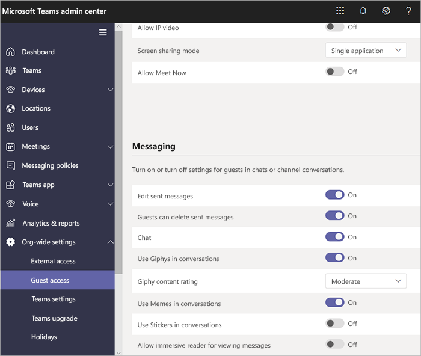

# 打开或关闭Microsoft Teams中的来宾访问权限

本文介绍如何在Teams中配置来宾访问设置（包括呼叫、会议和聊天）。 Teams中的来宾访问还需要在Microsoft 365中配置其他设置，包括Azure AD、Microsoft 365 组和SharePoint中的设置。 如果你已准备好开始邀请来宾加入 Teams，请阅读以下内容之一：

- 若要为 Teams 配置来宾访问以供一般使用，请参阅[在团队中与来宾协作](/microsoft-365/solutions/collaborate-as-team)。
- 若要与使用 Azure Active Directory 的合作伙伴组织进行协作，并允许来宾自行注册以实现团队访问，请参阅[创建托管有来宾的 B2B 外联网](/microsoft-365/solutions/b2b-extranet)。

> [!NOTE]
> 如果只希望查找、通话、聊天以及安排与其他组织人员的会议，请使用[外部访问](manage-external-access.md)。

## 在Teams管理中心配置来宾访问权限

1. 登录到 [Microsoft Teams 管理中心](https://admin.teams.microsoft.com/)。

2. 选择 **UsersGuest** >  **访问权限**。

3. 将 **“允许来宾访问Teams** 设置为 **”打开**”。

    

4. 在 **“呼叫**”、“ **会议**”和 **“消息传送**”下，选择“ **打开** ”或 **“关闭** ”作为每个功能，具体取决于你希望为来宾提供的内容。

      - **进行私人呼叫** – **启用** 此设置以允许来宾进行对等呼叫。
      - **IP 视频** - **打开** 此设置以允许来宾在通话和会议中使用视频。
      - **屏幕共享模式** - 此设置控制来宾的屏幕共享可用性。
          - 将此设置设为 **“已禁** 用”，以删除来宾在Teams中共享屏幕的功能。
          - 将此设置转为 **单个应用程序** 以允许共享单个应用程序。
          - 将此设置转到 **“整个”屏幕** 以允许完全共享屏幕。
      - **立即开会** – **打开** 此设置，允许来宾在Microsoft Teams中使用“立即见面”功能。
      - **编辑已发送的消息** - **打开** 此设置以允许来宾编辑他们以前发送的消息。
      - **删除已发送的消息** – **打开** 此设置以允许来宾删除之前发送的消息。
      - **聊天** - **打开** 此设置，使来宾能够在Teams中使用聊天。
      - **对话中的 Giphy** – **打开** 此设置以允许来宾在对话中使用 Giphys。 Giphy 是一个联机数据库和搜索引擎，允许用户搜索和共享动画 GIF 文件。 为每个 Giphy 分配一个内容分级。
      - **Giphy 内容分级** – 从下拉列表中选择分级：
          - **允许所有内容** - 来宾将能够在聊天中插入所有 Giphy，而不考虑内容分级。
          - **中等** - 来宾将能够在聊天中插入 Giphys，但会适度限制成人内容。
          - **严格** - 来宾可以在聊天中插入 Giphys，但将限制其插入成人内容。
      - **对话中的 Memes** - **打开** 此设置以允许来宾在对话中使用 Memes。
      - **对话中的贴纸** – **启用** 此设置以允许来宾在对话中使用贴纸。
      - **邮件的沉浸式阅读器** - **打开** 此设置以允许来宾 [在Teams中使用沉浸式阅读器](https://support.microsoft.com/topic/a700c0d0-bc53-4696-a94d-4fbc86ac7a9a)。

    

5. 选择“**保存**”。

## 关闭来宾访问权限

如果在 Teams 中关闭来宾访问权限，现有来宾将失去对其团队的访问权限。 但不会从团队中删除他们。 他们仍然对团队成员可见，并且后者可以 @提及他们。 如果再次启用 Teams 来宾访问权限，他们将重新获得访问权限。

如果计划关闭来宾访问权限，可能需要建议团队所有者手动从其团队中删除来宾帐户。 虽然这些来宾无权访问，但其帐户在团队中可见可能会导致其他团队成员感到困惑。

## 另请参阅

[与 Microsoft 365 建立安全协作](/microsoft-365/solutions/setup-secure-collaboration-with-teams)

[阻止来自特定团队的来宾](/microsoft-365/solutions/per-group-guest-access)

[Set-CsTeamsClientConfiguration](/powershell/module/skype/set-csteamsclientconfiguration)
