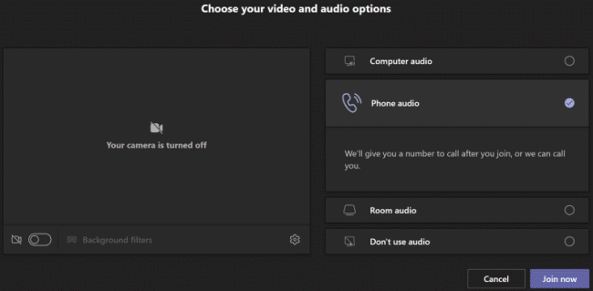
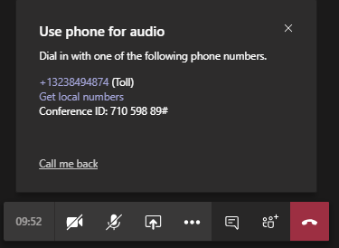
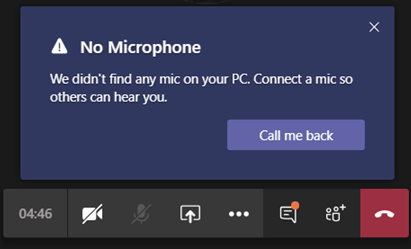

# 为用户设置“致电我”功能

在Microsoft Teams，"呼叫我"功能为用户提供了通过电话加入会议音频部分的方法。 当无法将计算机用于音频时，这非常方便。 用户通过其移动电话或座机获取会议的音频部分以及会议的内容部分，例如当其他会议参与者共享其屏幕或通过其计算机 &mdash; &mdash; 播放视频时。

> [!IMPORTANT]
> 
> 在会议容量较高期间（随着新型冠状肺炎 (COVID-19) 爆发，我们一直面临此问题），建议用户通过单击“加入团队会议”按钮来加入会议，而不是使用 PSTN 会议号码或“给我打电话”。<strong></strong><strong></strong> 这有助于在高容量会议造成 PSTN 网络拥堵时确保音频质量。

> [!NOTE]
> [!INCLUDE [updating-admin-interfaces](includes/updating-admin-interfaces.md)]

## 用户体验

### 使用电话进行音频加入会议

单击 **"** 加入"以 **加入** 会议，电话选择视频和音频选项屏幕上的音频，然后单击"立即 **加入"。** 在这里，用户可以进行会议呼叫并加入会议或手动拨入会议。

**让Teams会议呼叫**

在"**将电话用于音频**"屏幕上，用户输入其电话号码，然后单击"呼叫 **我"。** 会议将呼叫用户并加入会议。

**手动拨入**

加入的另一种方式是直接拨入会议。 在 **"将电话用于音频**"屏幕上，单击"手动拨入"，获取用于拨入会议的电话号码列表。

### 在会议期间音频出现问题时进行回电

如果用户在会议期间使用计算机时遇到音频问题，用户可以轻松地切换到使用手机进行音频处理。 Teams音频或设备问题何时发生，并显示"回叫我"选项，重定向用户使用 **其手机。**

下面是消息的示例，以及当未检测到 **麦克风时显示的**"Teams回叫"选项。

用户单击 **"回电"，** 显示"将 **手机用于音频"** 屏幕。 在这里，他们可以输入其电话号码，并Teams会议呼叫，并加入会议或手动拨入会议。

## 设置"呼叫我"功能

若要为组织中用户启用"呼叫我"功能，必须配置以下各项：

- 为组织中安排会议的用户启用音频会议 (组织者) 。 有关详细信息，请参阅[为](set-up-audio-conferencing-in-teams.md)用户设置音频[Teams和管理用户](manage-the-audio-conferencing-settings-for-a-user-in-teams.md)的音频会议设置Teams。

- 会议组织者可以从会议中拨出。 若要了解有关详细信息，请参阅在 中管理[用户的音频Teams。](manage-the-audio-conferencing-settings-for-a-user-in-teams.md)

如果会议组织者未启用会议拨出功能，则"选择视频和音频选项"屏幕上的 **电话** 音频选项对任何人都不可用，并且其他用户无法收到加入会议的呼叫。 对于启用了拨出功能的用户，加入会议后，他们可以加入其他人，通过"显示参与者"图标拨打 **其** 号码。
