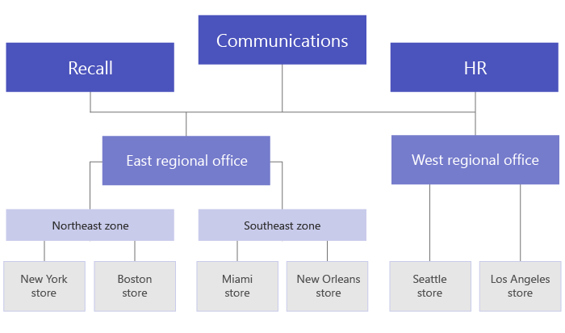

# <a name="set-up-your-team-targeting-hierarchy"></a>设置团队目标层次结构

设置团队目标层次结构将允许组织将内容发布到一大组团队。 团队目标层次结构定义层次结构中所有团队如何彼此关联、哪些用户可以发布任务，以及哪些团队用户有权发布到哪个团队。 除非为组织设置了面向团队的层次结构，否则所有用户都禁用发布功能。 若要设置团队目标层次结构，需要创建一个定义层次结构的文件，并将其上传到Teams以将其应用到组织。 上传架构后，Teams应用可以使用它。

> [!IMPORTANT]
> 对于初始版本，只有"任务"应用支持分层团队。  将团队目标层次结构应用于组织将在 ["任务"应用中](https://support.microsoft.com/office/publish-task-lists-to-create-and-track-work-in-your-organization-095409b3-f5af-40aa-9f9e-339b54e705df) 启用任务发布。 你不会在团队的"其他"区域看到团队Microsoft Teams。

下面是层次结构在任务应用中在任务应用中的表示Teams。 创建任务列表后，发布团队成员可以选择要向任务列表发送 () 的收件人团队。 选择团队时，发布团队可以按层次结构、属性或两者的组合进行筛选。<br>


## <a name="terminology"></a>术语

导航层次结构时，以下术语非常重要。 Teams将 **称为节点**。

* **根** 节点是层次结构中最顶层的节点。 在示例中，零售通信是根节点。
* **父节点****和子** 节点是表示两个已连接节点之间的关系的术语。 在示例中，区域 01 是区域 1 的子节点。
* 多个级别的子级称为 **后代**。 区域 01、Store 01、Store 03、Store 07、区域 02 和 03 都是区域 1 的后代。
* 没有子节点的节点称为叶 **节点**。 它们位于层次结构的底部。
* **收件人** 团队是已选择接收要发布的一组特定内容的团队。 它们必须是叶节点。

## <a name="plan-your-hierarchy"></a>规划层次结构

创建定义层次结构的架构之前，需要执行一些规划，并决定要如何塑造组织。  第一个优先级是确定哪些组织组需要将任务发布到其他组。 层次结构中的每个节点表示一个工作组或组组。

### <a name="permissions-to-publish"></a>发布权限

发布权限取决于用户是层次结构中任何团队的成员，以及该团队或一组团队与层次结构中其他团队的关系。

> [!NOTE]
> 团队的所有者还被授予发布权限。

* 如果用户是至少一个在层次结构中具有后代的团队的成员，该用户可以发布到这些后代，而无需成为他们想要发布到的所有团队的成员。
* 如果用户是层次结构中至少一个团队的成员，但不是该层次结构中具有后代的任何团队的成员，则该用户可以看到并接收来自其组织的已发布内容。
* 如果用户不是层次结构中任何团队的成员，该用户将看不到任何与发布相关的功能。

### <a name="guidelines"></a>指南

* 每个组织只能应用一个层次结构文件。 但是，可以将组织的不同部分作为不同层次结构一起包含到一个 CSV 文件中。 例如，Contoso Pharmaceuticals 有一个"药店"根节点和一个零售根节点。 这两个根节点具有多个后代行，并且它们之间没有重叠。
* 只有叶节点可以是出版物的接收者。 层次结构中的其他节点有助于选择出版物的收件人。
* 团队只能在层次结构中表示一次。
* 一个层次结构可以包含最多 15，000 个节点。 我们计划与客户合作，提高较大组织的此限制。

### <a name="example-hierarchy"></a>示例层次结构

例如，在下面的层次结构中，召回率、通信和 HR 可以将任务发布到层次结构中每个底部节点 (团队) ，但东北部区域只能将任务发布到纽约应用商店和波士顿商店团队。 示例层次结构允许召回、通信和人力资源组发布适用于整个公司的任务，例如 CEO 的权益信息或消息。 东北部区域只能向纽约应用商店和波士顿商店团队发布人员日程安排、天气信息等任务。



## <a name="create-your-hierarchy"></a>创建层次结构

> [!NOTE]
> 本文的其余部分讨论如何在将任务发布到收件人团队的上下文中设置团队层次结构。 有关[任务应用（启用时显示](./manage-tasks-app.md)任务发布Teams概述，请参阅在任务应用中管理组织的任务应用。

定义层次结构的架构基于 CSV 文件中以逗号分隔 () 值。 CSV 文件的每一行对应于团队层次结构中的一个节点。 每一行都包含在层次结构中为节点命名的信息，可以选择性地将节点链接到团队，并包含可用于在支持团队的应用中筛选团队的属性。

还可以定义 **存储桶**，这些类别是发布团队可用于组织发送给收件人团队的内容，以便他们更轻松地查看、排序和关注相关内容。

### <a name="add-required-columns"></a>添加所需的列

CSV 文件必须包含以下三列，顺序如下，从第一列开始。 节点必须链接到团队，团队接收任务。

| 列名称   | 是否必需 | 描述   |
----------------|----------|---------------|
| DisplayName    | 是      | 此字段是节点的名称。 名称最多包含 100 个字符，并且仅包含字符 A-Z、a-z 和 0-9。 节点名称必须唯一。 |
| ParentName    | 是       | 这是父节点的名称。 此处指定的值必须与父节点 **的 DisplayName** 字段中的值完全匹配。 如果要添加多个父节点，请用分号分隔每个父节点名称; (;) 。 可以添加多达 25 个父节点，每个父节点名称最多包含 2500 个字符。 只有当父节点是根节点时，一个节点才能具有多个父节点。   <br><br>**重要** 请注意不要创建循环，其中层次结构中较高级别的父级引用层次结构中较低级别的子节点。 不支持此操作。 |
| TeamId        | 是，如果团队发布任务或从父节点接收任务       | 其中包含要将节点链接到的团队的 ID。 每个节点必须引用一个唯一团队，因此每个 TeamId 值在层次结构文件中可能只出现一次。 若要获取想要将节点链接到的团队的 ID，请运行以下 PowerShell 命令 `Get-Team | Export-Csv TeamList.csv` ：。 此命令列出组织中团队，并包括每个团队的名称和 ID。 找到要链接到的团队的名称，然后将 ID 复制到此字段中。|

> [!NOTE]
> 如果节点不是根节点或叶节点，并且不需要团队成员身份来授予相应的发布和报告权限，可以将 TeamId 留空。 此方法可用于在选择收件人团队时添加更精细的粒度，或者用于在没有相应团队的情况下查看完成报告。

### <a name="add-attribute-columns"></a>添加属性列

添加三个必填列后，可以添加可选属性列。 这些属性可用于筛选节点，以便更轻松地选择要将任务发布到的节点。 有两种方法可定义属性，具体取决于该属性的值是否互斥。

|添加属性的方法|说明 |示例  |
|---|---------|---------|
|如果属性的值互斥，则指定的列名称将成为属性的名称。|每行可以包含一个属性值，每个属性列最多包含 50 个唯一值。 每个值最多包含 100 个字符。 使用团队目标层次结构选择收件人团队时，在属性列中指定的属性值集将显示为该属性的筛选器值。|您希望用户能够按布局筛选存储。 此属性的值互斥，因为存储只能有一个布局。 <br><br>若要添加属性以按布局筛选应用商店，请添加名为"应用商店布局"的列。 此示例中，应用商店布局属性的值为"压缩型、标准型"和"大"。
|如果需要为一个属性指示多个值，并且这些值不是互斥的，请对列名称使用 **AttributeName：UniqueValue** 格式。 <br><br>**重要** 请确保使用仅英语冒号 (：) ，因为不支持将 unicode 用作属性列分隔符。 |冒号 " (：) 之前的文本字符串将成为 属性的名称。 冒号之前包含相同文本字符串的所有列 (：) 分组到筛选菜单中的一个分区中。 冒号后的每个字符串将成为该节的值。<br><br>对于该属性，每一行的值 (0) 或 1。 值为 0 表示属性不适用于节点，值为 1 表示该属性应用于该节点。|您希望用户能够按部门筛选存储。 一个存储可以有多个部门，因此此属性的值不是互斥的。<br><br>本示例将"部门：服装、部门：电子、部门：食物、部门：住宅和公园、部门：体育用品"添加为属性列。 部门成为属性名称，用户可以按服装、电子、食品、住宅和住宅以及运动用品部门进行筛选。|

添加属性列时，请记住以下事项：

* 指定的列名或在冒号" (：) "之前指定的列名称将成为属性的名称。 此值将显示在使用该层次结构Teams应用。
* 层次结构中最多包含 50 个属性列。
* 列名称最多包含 100 个字符，并且仅包含字符 A-Z、a-z 和 0-9，以及空格。 列名称必须唯一。

### <a name="add-bucket-columns"></a>添加存储桶列

可以添加存储桶列以创建存储桶，这些存储桶是任务可以组织到的分组。 每个存储桶在 CSV 文件中获取其自己的列。 创建的存储桶可供发布团队使用。 然后，发布团队可以使用这些存储桶对收件人团队的任务进行分类。 如果团队中不存在存储桶，则发布任务时按需创建存储桶。

通过集中对工作项进行分类一次，发布团队可以预先组织收到任务列表的所有数十、数百或数千个收件人团队的任务列表。 然后，收件人团队可以按存储桶对任务进行排序和筛选，以重点关注与他们的工作最相关的区域。

添加存储桶列时，请注意以下事项：

* 列名称将成为存储桶的名称。 指定的每个存储桶将显示在使用该层次结构的Teams"存储桶"列表中。
* 建议不要在存储桶名称中包括敏感信息。 目前，发布团队无法通过创建存储桶后通过发布删除存储桶。
* 列名称前面必须带有井号标签 (#) 。 它最多可以包含 100 个字符，并且仅包含字符 A-Z、a-z 和 0-9。 例如，#Operations#Frozen商品。
* 一个层次结构可以包含最多 25 个存储桶列。 我们计划与客户合作，提高较大组织的此限制。

### <a name="example"></a>示例

下面是一个架构 CSV 文件的示例，该文件将创建该文件以支持上图所示的层次结构。 此架构包含以下内容：

* 名为 、 `TargetName` `ParentName` 和 的三个必需列 `TeamId`
* 名为 、 `Store layout` `Departments:Clothing` 和 的三个属性列 `Departments:Foods`
* 名为 、 `Fresh Foods` 和 的三 `Frozen Foods` 个存储桶列 `Women's Wear`

属性 `Store layout` 包含的值包括 `Compact` 、 `Standard` 和 `Large` 。 属性 `Departments` 列可以设置为值为零 (`0` 或) `1` 值。 上 `Store` `Departments` 图未显示布局和属性。 它们已添加到此处，以帮助显示如何将属性添加到节点条目。 这三个存储桶列也是如此。

```CSV
TargetName,ParentName,TeamId,Store layout,Departments:Clothing,Departments:Foods,#Fresh Foods,#Frozen Foods,#Women's Wear
Recall,,db23e6ba-04a6-412a-95e8-49e5b01943ba,,,,,,
Communications,,145399ce-a761-4843-a110-3077249037fc,,,,,,
HR,,125399ce-a761-4983-a125-3abc249037fc,,,,,,
East Regional Office,HR;Communications;Recall,,,,,,,
West Regional Office,HR;Communications;Recall,,,,,,,
Northeast Zone,East Regional Office,,,,,,,
Southeast Zone,East Regional Office,,,,,,,
New York Store,Northeast Zone,e2ba65f6-25e7-488b-b8f0-b8562d5de60a,Large,1,1,,,
Boston Store,Northeast Zone,0454f08a-0507-437c-969a-682eb2fae7fc,Standard,1,1,,,
Miami Store,Southeast Zone,619d6e4e-5f68-4b36-8e1f-16c98d7396c1,Compact,0,1,,,
New Orleans Store,Southeast Zone,6be960b8-72af-4561-a343-9ac4711874eb,Compact,0,1,,,
Seattle Store,West Regional Zone,487c0d20-4e55-4dc2-8187-a24c826e0fee,Standard,1,1,,,
Los Angeles Store,West Regional Zone,204a1287-2efb-4a8a-88e0-56fbaf5a2389,Large,1,1,,,
```

## <a name="apply-your-hierarchy"></a>应用层次结构

> [!NOTE] 
> 若要执行此步骤，必须安装并使用 PowerShell Teams PowerShell 公共预览版模块。 有关安装模块的步骤，请参阅安装 Teams PowerShell。

> [!NOTE]
> 政府社区云 (GCC) 客户必须使用[cmdlet 预览版 2.4.0-preview](https://www.powershellgallery.com/packages/MicrosoftTeams/2.4.0-preview)或更高版本来确保数据路由到 GCC 环境，而不是公有云环境。

在架构 CSV 文件中定义层次结构后，即可将其上传到Teams。 为此，请运行以下命令。 只有全局管理员或Teams才能执行此步骤。

```powershell
Set-TeamTargetingHierarchy -FilePath "C:\ContosoTeamSchema.csv"
```

### <a name="update-your-hierarchy"></a>更新层次结构

可以使用与上述相同的 PowerShell 命令上传新层次结构以替换旧层次结构。 每次上传新层次结构时，它将替换上一个层次结构。

### <a name="check-the-status-of-your-hierarchy"></a>检查层次结构的状态

可以运行以下命令来检查层次结构上传的状态。

```powershell
Get-TeamTargetingHierarchyStatus
```

该命令将返回以下字段：

字段|说明
-----|------------
ID | 上传的唯一 ID。
状态 | Upload状态。 值包括 **"正在启动****"、正在验证****、"成功"** 和"**失败"**
ErrorDetails | 出现上传错误时的详细信息。 有关错误详细信息的详细信息，请参阅故障排除部分。 如果没有错误，此字段为空。
LastUpdatedAt | 文件的上次更新时间戳和日期。
LastModifiedBy | 修改文件的最后一个用户 ID。
FileName | CSV 的文件名。

## <a name="remove-your-hierarchy"></a>删除层次结构

如果要立即禁用组织中所有用户的"已发布列表"选项卡，可以删除层次结构。 用户无法访问"已发布列表 **"选项卡或** 选项卡上的任何功能。 这包括创建新的任务列表以发布、访问草稿列表、发布、取消发布和重复列表以及查看报告的能力。 删除层次结构不会取消发布以前发布的任务。 这些任务仍可供收件人团队完成。

若要删除层次结构，请运行以下命令。 只有管理员才能执行此步骤。

```powershell
Remove-TeamTargetingHierarchy
```

确认删除时，状态消息仍显示以前的架构存在，尽管尝试再次删除会返回对象为 null 的错误。

## <a name="create-a-sample-hierarchy"></a>创建示例层次结构

### <a name="install-the-teams-powershell-module"></a>安装 Teams PowerShell 模块

> [!IMPORTANT]
> 若要执行此步骤，必须安装并使用 PowerShell 库中Teams PowerShell 公共预览[版模块](https://www.powershellgallery.com/packages/MicrosoftTeams/)。 有关安装模块的步骤，请参阅安装 Teams [PowerShell。](teams-powershell-install.md)

### <a name="sample-script"></a>示例脚本

以下脚本可用于创建团队，将.csv文件上传到Microsoft Teams租户。 如果有现有的层次结构，此脚本将替换它。

#### <a name="create-teams-for-a-simple-hierarchy"></a>为简单层次结构创建团队

```powershell
$tm1 = New-Team -DisplayName "HQ"
$tm2 = New-Team -DisplayName "North"
$tm3 = New-Team -DisplayName "Store 1"
$tm4 = New-Team -DisplayName "Store 2"
$tm5 = New-Team -DisplayName "South"
$tm6 = New-Team -DisplayName "Store 3"
$tm7 = New-Team -DisplayName "Store 4"
```

#### <a name="use-team-data-to-create-comma-separated-output-displayname-parentname-teamid"></a>使用团队数据创建以逗号分隔的输出 (DisplayName、ParentName、TeamId) 

```powershell
$csvOutput = "DisplayName" + "," + "ParentName" + "," + "TeamId" + "`n"
$csvOutput = $csvOutput + $tm1.DisplayName + "," + "," + $tm1.GroupID + "`n"
$csvOutput = $csvOutput + $tm2.DisplayName + "," + $tm1.DisplayName + "," + $tm2.GroupID + "`n"
$csvOutput = $csvOutput + $tm3.DisplayName + "," + $tm2.DisplayName + "," + $tm3.GroupID + "`n"
$csvOutput = $csvOutput + $tm4.DisplayName + "," + $tm2.DisplayName + "," + $tm4.GroupID + "`n"
$csvOutput = $csvOutput + $tm5.DisplayName + "," + $tm1.DisplayName + "," + $tm5.GroupID + "`n"
$csvOutput = $csvOutput + $tm6.DisplayName + "," + $tm5.DisplayName + "," + $tm6.GroupID + "`n"
$csvOutput = $csvOutput + $tm7.DisplayName + "," + $tm5.DisplayName + "," + $tm7.GroupID 
```

#### <a name="save-output-to-a-csv-file-in-the-downloads-folder"></a>将输出保存到.csv **下载文件夹中的一个文件**

```powershell
$csvOutputPath = $env:USERPROFILE + "\downloads\testhierarchy-" + (Get-Date -Format "yyyy-MM-dd-hhmmss") + ".csv" 
$csvOutput | Out-File $csvOutputPath
```

#### <a name="upload-the-hierarchy"></a>Upload层次结构

```powershell
Set-TeamTargetingHierarchy -FilePath $csvOutputPath
Get-TeamTargetingHierarchyStatus
```

## <a name="troubleshooting"></a>疑难解答

### <a name="how-to-view-error-details"></a>如何查看错误详细信息

可以运行以下命令，了解导致错误的原因并返回错误详细信息。

```powershell
(Get-TeamTargetingHierarchyStatus).ErrorDetails.ErrorMessage
```

### <a name="you-receive-an-error-message-when-you-upload-your-schema-csv-file"></a>上传架构 CSV 文件时收到错误消息

请记下错误消息，因为它应包含故障排除信息，指出无法上传架构的原因。 根据错误消息中的信息查看和编辑架构 CSV 文件，然后重试。

### <a name="you-receive-an-error-invalidteamid-error-message-when-you-upload-your-schema-csv-file"></a>上传架构 CSV 文件时，收到"错误： InvalidTeamId"错误消息

尝试上传架构 CSV 文件时，收到以下错误消息：

```console
Error: InvalidTeamId
Description: TeamID in row # doesn't match a valid Group ID. Please view our documentation to learn how to get the proper GroupID for each team.
```

检查以确保在架构 CSV 文件中为团队使用正确的 TeamId。 TeamId 应与支持团队Microsoft 365组的组 ID 相同。 可以在管理中心内查找团队的Microsoft Teams ID。

1. 在管理中心左侧导航 [Microsoft Teams，转到](https://admin.teams.microsoft.com/)**"Teams**  >  **管理团队"。**
2. 如果表中未显示"组 **ID"** 列，请选择表右上角的"编辑列"，然后打开"组 **ID"。**
3. 在列表中查找团队，然后找到"组 ID"。

请确保架构 CSV 文件中 TeamId 与管理中心中显示的组 ID Microsoft Teams ID。

## <a name="related-topics"></a>相关主题

* [在应用程序中管理组织的任务Teams](manage-tasks-app.md)
* [Teams PowerShell 概览](teams-powershell-overview.md)
