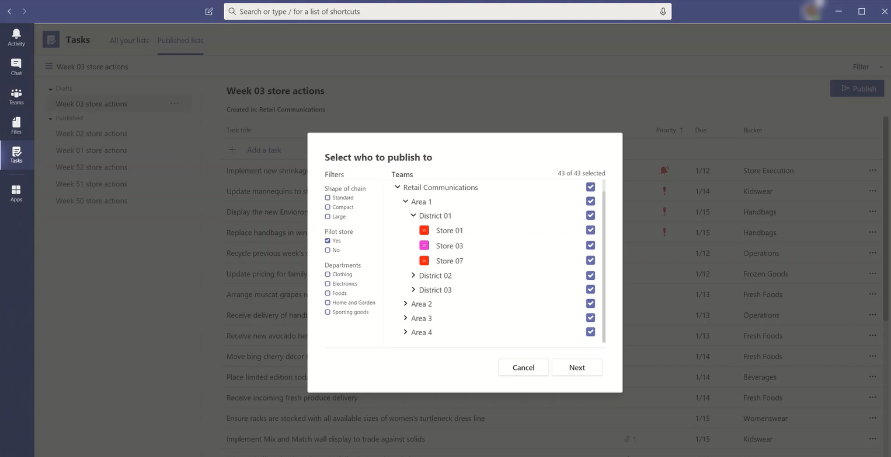

# <a name="set-up-your-team-targeting-hierarchy"></a><span data-ttu-id="3c49d-103">设置团队目标层次结构</span><span class="sxs-lookup"><span data-stu-id="3c49d-103">Set up your team targeting hierarchy</span></span>

<span data-ttu-id="3c49d-104">设置团队目标层次结构将允许组织将内容发布到一大组团队。</span><span class="sxs-lookup"><span data-stu-id="3c49d-104">Setting up a team targeting hierarchy will allow your organization to publish content to a large set of teams.</span></span> <span data-ttu-id="3c49d-105">团队目标层次结构定义层次结构中所有团队如何彼此关联、哪些用户可以发布任务，以及哪些团队用户有权发布任务。</span><span class="sxs-lookup"><span data-stu-id="3c49d-105">The team targeting hierarchy defines how all the teams in your hierarchy are related to each other, which users can publish tasks, and which teams users have permissions to publish to.</span></span> <span data-ttu-id="3c49d-106">除非为组织设置了面向团队的层次结构，否则将禁用所有用户的发布功能。</span><span class="sxs-lookup"><span data-stu-id="3c49d-106">Publishing features are disabled for all users unless a team targeting hierarchy is set up for your organization.</span></span> <span data-ttu-id="3c49d-107">要设置面向层次结构的团队，你需要创建一个定义层次结构的文件，然后将它上传到 Teams 以将其应用到组织。</span><span class="sxs-lookup"><span data-stu-id="3c49d-107">To set up a team targeting hierarchy, you'll need to create a file that defines the hierarchy and then upload it to Teams to apply it to your organization.</span></span> <span data-ttu-id="3c49d-108">上传架构后，Teams 中的应用可以使用它。</span><span class="sxs-lookup"><span data-stu-id="3c49d-108">After the schema is uploaded, apps within Teams can use it.</span></span> <span data-ttu-id="3c49d-109">可以在此处练习设置层次结构并将其上传到 Teams [租户](https://docs.microsoft.com/microsoftteams/set-up-your-team-hierarchy#Create-a-sample-hierarchy)。</span><span class="sxs-lookup"><span data-stu-id="3c49d-109">You can practice setting up a hierarchy and uploading it to your Teams tenant using a script [here](https://docs.microsoft.com/microsoftteams/set-up-your-team-hierarchy#Create-a-sample-hierarchy).</span></span>

> [!IMPORTANT]
> <span data-ttu-id="3c49d-110">对于初始版本，只有"任务"应用支持分层团队。</span><span class="sxs-lookup"><span data-stu-id="3c49d-110">For the initial release, only the Tasks app supports hierarchical teams.</span></span>  <span data-ttu-id="3c49d-111">将团队目标层次结构应用于组织将在 ["任务"应用中](https://support.microsoft.com/office/publish-task-lists-to-create-and-track-work-in-your-organization-095409b3-f5af-40aa-9f9e-339b54e705df) 启用任务发布。</span><span class="sxs-lookup"><span data-stu-id="3c49d-111">Applying a team targeting hierarchy to your organization will enable [task publishing](https://support.microsoft.com/office/publish-task-lists-to-create-and-track-work-in-your-organization-095409b3-f5af-40aa-9f9e-339b54e705df) in the Tasks app.</span></span> <span data-ttu-id="3c49d-112">在 Microsoft Teams 的另外一些方面，你不会看到团队的层次结构。</span><span class="sxs-lookup"><span data-stu-id="3c49d-112">You won't see a hierarchy of teams in other areas of Microsoft Teams.</span></span>

<span data-ttu-id="3c49d-113">下面是在 Teams 的"任务"应用中如何表示层次结构的示例。</span><span class="sxs-lookup"><span data-stu-id="3c49d-113">Here's an example of how the hierarchy is represented in the Tasks app in Teams.</span></span> <span data-ttu-id="3c49d-114">创建任务列表后，发布团队成员可以选择收件人团队 (将) 发布到任务列表。</span><span class="sxs-lookup"><span data-stu-id="3c49d-114">After a task list is created, members of the publishing team can then select the recipient teams to send (publish) the task list to.</span></span> <span data-ttu-id="3c49d-115">选择团队时，发布团队可以按层次结构、属性或两者的组合进行筛选。</span><span class="sxs-lookup"><span data-stu-id="3c49d-115">When selecting teams, the publishing team can filter by hierarchy, by attributes, or a combination of both.</span></span><br>



## <a name="terminology"></a><span data-ttu-id="3c49d-117">术语</span><span class="sxs-lookup"><span data-stu-id="3c49d-117">Terminology</span></span>

<span data-ttu-id="3c49d-118">导航层次结构时，以下术语非常重要。</span><span class="sxs-lookup"><span data-stu-id="3c49d-118">The following terms will be important as you navigate hierarchies.</span></span> <span data-ttu-id="3c49d-119">Teams 将称为 **节点**。</span><span class="sxs-lookup"><span data-stu-id="3c49d-119">Teams will be referred to as **nodes**.</span></span>

* <span data-ttu-id="3c49d-120">**根** 节点是层次结构中最顶端的节点。</span><span class="sxs-lookup"><span data-stu-id="3c49d-120">**Root nodes** are the topmost nodes in the hierarchy.</span></span> <span data-ttu-id="3c49d-121">在示例中，零售通信是根节点。</span><span class="sxs-lookup"><span data-stu-id="3c49d-121">In the example, Retail Communications is a root node.</span></span>
* <span data-ttu-id="3c49d-122">**父节点\*\*\*\*和子节点** 是表示两个已连接节点之间的关系的术语。</span><span class="sxs-lookup"><span data-stu-id="3c49d-122">**Parent nodes** and **child nodes** are terms that represent a relationship between two connected nodes.</span></span> <span data-ttu-id="3c49d-123">在示例中，区域 01 是区域 1 的子节点。</span><span class="sxs-lookup"><span data-stu-id="3c49d-123">In the example, District 01 is a child node of Area 1.</span></span>
* <span data-ttu-id="3c49d-124">多个级别的子级称为 **后代**。</span><span class="sxs-lookup"><span data-stu-id="3c49d-124">Multiple levels of children are referred to as **descendants**.</span></span> <span data-ttu-id="3c49d-125">区域 01、Store 01、Store 03、Store 07、区域 02 和 03 都是区域 1 的后代。</span><span class="sxs-lookup"><span data-stu-id="3c49d-125">District 01, Store 01, Store 03, Store 07, District 02, and District 03 are all descendants of Area 1.</span></span>
* <span data-ttu-id="3c49d-126">没有子节点的节点称为叶 **节点**。</span><span class="sxs-lookup"><span data-stu-id="3c49d-126">A node with no children is called a **leaf node**.</span></span> <span data-ttu-id="3c49d-127">它们位于层次结构的底部。</span><span class="sxs-lookup"><span data-stu-id="3c49d-127">They are at the bottom of a hierarchy.</span></span>
* <span data-ttu-id="3c49d-128">**接收** 团队是已选择接收要发布的一组特定内容的团队。</span><span class="sxs-lookup"><span data-stu-id="3c49d-128">**Recipient teams** are teams that have been selected to receive a specific set of content to be published.</span></span> <span data-ttu-id="3c49d-129">它们必须是叶节点。</span><span class="sxs-lookup"><span data-stu-id="3c49d-129">They must be leaf nodes.</span></span>

## <a name="plan-your-hierarchy"></a><span data-ttu-id="3c49d-130">规划层次结构</span><span class="sxs-lookup"><span data-stu-id="3c49d-130">Plan your hierarchy</span></span>

<span data-ttu-id="3c49d-131">创建定义层次结构的架构之前，需要执行一些规划，并决定要如何塑造组织。</span><span class="sxs-lookup"><span data-stu-id="3c49d-131">Before you create the schema that defines your hierarchy, you need to do some planning and decide how you want to shape your organization.</span></span>  <span data-ttu-id="3c49d-132">第一个优先级是确定哪些组织组需要将任务发布到其他组。</span><span class="sxs-lookup"><span data-stu-id="3c49d-132">One of the first priorities is deciding which organizational groups need to publish tasks to other groups.</span></span> <span data-ttu-id="3c49d-133">层次结构中的每个节点代表一个工作组或组组。</span><span class="sxs-lookup"><span data-stu-id="3c49d-133">Each node in the hierarchy represents a working group or group of groups.</span></span>

### <a name="permissions-to-publish"></a><span data-ttu-id="3c49d-134">发布权限</span><span class="sxs-lookup"><span data-stu-id="3c49d-134">Permissions to publish</span></span>

<span data-ttu-id="3c49d-135">发布权限取决于用户是否是层次结构中任何团队的成员，以及该团队或一组团队与层次结构中其他团队的关系。</span><span class="sxs-lookup"><span data-stu-id="3c49d-135">Permission to publish depends on whether a user is a member of any teams in the hierarchy plus the relationship of that team or set of teams to other teams in the hierarchy.</span></span>

> [!NOTE]
> <span data-ttu-id="3c49d-136">团队的所有者还被授予发布权限。</span><span class="sxs-lookup"><span data-stu-id="3c49d-136">The owner of a team is also granted publishing permissions.</span></span>

* <span data-ttu-id="3c49d-137">如果用户是至少一个在层次结构中具有后代的团队的成员，该用户可以发布到这些后代，而无需成为他们想要发布到的所有团队的成员。</span><span class="sxs-lookup"><span data-stu-id="3c49d-137">If a user is a member of at least one team that has descendants in the hierarchy, that user can publish to those descendants without being a member of all teams they want to publish to.</span></span>
* <span data-ttu-id="3c49d-138">如果用户是层次结构中至少一个团队的成员，但不是该层次结构中具有后代的任何团队的成员，该用户可以从其组织查看和接收已发布的内容。</span><span class="sxs-lookup"><span data-stu-id="3c49d-138">If a user is a member of a least one team in the hierarchy but isn't a member of any team with descendants in the hierarchy, that user can see and receive published content from their organization.</span></span>
* <span data-ttu-id="3c49d-139">如果用户不是层次结构中任何团队的成员，该用户将看不到任何与发布相关的功能。</span><span class="sxs-lookup"><span data-stu-id="3c49d-139">If a user isn't a member of any team in the hierarchy, that user won't see any publishing-related functionality.</span></span>

### <a name="guidelines"></a><span data-ttu-id="3c49d-140">指南</span><span class="sxs-lookup"><span data-stu-id="3c49d-140">Guidelines</span></span>

* <span data-ttu-id="3c49d-141">每个组织只能应用一个层次结构文件。</span><span class="sxs-lookup"><span data-stu-id="3c49d-141">There can only be one hierarchy file applied per organization.</span></span> <span data-ttu-id="3c49d-142">但是，可以将组织的不同部分作为不同的节点层次结构一起包括在一个 CSV 文件中。</span><span class="sxs-lookup"><span data-stu-id="3c49d-142">However, you can include different parts of your organization together as distinct hierarchies of nodes within one CSV file.</span></span> <span data-ttu-id="3c49d-143">例如，Contoso 也具有一个药物根节点和一个零售根节点。</span><span class="sxs-lookup"><span data-stu-id="3c49d-143">For example, Contoso Pharmaceuticals has a Pharmacy root node and a Retail root node.</span></span> <span data-ttu-id="3c49d-144">这两个根节点具有多个后代行，并且它们之间没有重叠。</span><span class="sxs-lookup"><span data-stu-id="3c49d-144">Both root nodes have multiple rows of descendants and there's no overlap between them.</span></span>
* <span data-ttu-id="3c49d-145">只有叶节点可以是出版物的接收者。</span><span class="sxs-lookup"><span data-stu-id="3c49d-145">Only leaf nodes can be recipients of a publication.</span></span> <span data-ttu-id="3c49d-146">层次结构中的其他节点有助于选择出版物的收件人。</span><span class="sxs-lookup"><span data-stu-id="3c49d-146">Other nodes in the hierarchy are helpful for selecting recipients of a publication.</span></span>
* <span data-ttu-id="3c49d-147">团队只能在层次结构中表示一次。</span><span class="sxs-lookup"><span data-stu-id="3c49d-147">A team can only be represented one time in a hierarchy.</span></span>
* <span data-ttu-id="3c49d-148">一个层次结构可以包含最多 15，000 个节点。</span><span class="sxs-lookup"><span data-stu-id="3c49d-148">A hierarchy can contain up to 15,000 nodes.</span></span> <span data-ttu-id="3c49d-149">我们计划与客户合作，提高较大组织的此限制。</span><span class="sxs-lookup"><span data-stu-id="3c49d-149">We plan to work with customers to raise this limit for larger organizations.</span></span>

### <a name="example-hierarchy"></a><span data-ttu-id="3c49d-150">示例层次结构</span><span class="sxs-lookup"><span data-stu-id="3c49d-150">Example hierarchy</span></span>

<span data-ttu-id="3c49d-151">例如，在下面的层次结构中，召回率、通信和 HR 可以将任务发布到层次结构中的每个底部节点 (团队) ，但东北部区域只能将任务发布到纽约应用商店和波士顿商店团队。</span><span class="sxs-lookup"><span data-stu-id="3c49d-151">For example, in the following hierarchy, Recall, Communications, and HR can publish tasks to every bottom node (team) in the hierarchy, but Northeast Zone can only publish tasks to the New York Store and Boston Store teams.</span></span> <span data-ttu-id="3c49d-152">示例层次结构允许召回、通信和 HR 组发布适用于整个公司的任务，例如福利信息或 CEO 的消息。</span><span class="sxs-lookup"><span data-stu-id="3c49d-152">The example hierarchy allows the Recall, Communications, and HR groups to publish tasks that apply to the entire company, such as benefits information or messages from the CEO.</span></span> <span data-ttu-id="3c49d-153">东北部区域只能向纽约应用商店和波士顿商店团队发布人员日程安排、天气信息等任务。</span><span class="sxs-lookup"><span data-stu-id="3c49d-153">Northeast Zone can publish tasks like personnel scheduling, weather information, and so on, only to the New York Store and Boston Store teams.</span></span>


## <a name="create-your-hierarchy"></a><span data-ttu-id="3c49d-155">创建层次结构</span><span class="sxs-lookup"><span data-stu-id="3c49d-155">Create your hierarchy</span></span>

> [!NOTE]
> <span data-ttu-id="3c49d-156">本文的其余部分讨论如何在将任务发布到收件人团队的上下文中设置团队层次结构。</span><span class="sxs-lookup"><span data-stu-id="3c49d-156">The remainder of this article discusses setting up a team hierarchy in the context of publishing tasks to recipient teams.</span></span> <span data-ttu-id="3c49d-157">有关 ["任务"应用的](https://docs.microsoft.com/MicrosoftTeams/manage-tasks-app) 概述，请参阅"在 Teams 中管理组织的任务"应用，其中任务发布在启用时显示。</span><span class="sxs-lookup"><span data-stu-id="3c49d-157">Refer to [Manage the Tasks app for your organization in Teams](https://docs.microsoft.com/MicrosoftTeams/manage-tasks-app) for an overview of the Tasks app, where task publishing appears when enabled.</span></span>

<span data-ttu-id="3c49d-158">定义层次结构的架构基于 CSV 文件中逗号 () 值。</span><span class="sxs-lookup"><span data-stu-id="3c49d-158">The schema that defines your hierarchy is based on a comma-separated values (CSV) file.</span></span> <span data-ttu-id="3c49d-159">CSV 文件的每一行对应于团队层次结构中的一个节点。</span><span class="sxs-lookup"><span data-stu-id="3c49d-159">Each row in the CSV file corresponds to one node within the hierarchy of teams.</span></span> <span data-ttu-id="3c49d-160">每一行都包含在层次结构中为节点命名的信息，可以选择性地将节点链接到团队，以及可用于筛选支持它的应用中的团队的属性。</span><span class="sxs-lookup"><span data-stu-id="3c49d-160">Each row contains information that names the node within the hierarchy, optionally links it to a team, and includes attributes that can be used to filter teams in apps that support it.</span></span>

<span data-ttu-id="3c49d-161">还可以定义存储桶，即发布团队可用于组织发送给收件人团队的内容的类别，以便他们更轻松地查看、排序和关注相关内容。</span><span class="sxs-lookup"><span data-stu-id="3c49d-161">You can also define **buckets**, which are categories that the publishing team can use to organize content sent to recipient teams to make it easier for them to view, sort, and focus on relevant content.</span></span>

### <a name="add-required-columns"></a><span data-ttu-id="3c49d-162">添加所需的列</span><span class="sxs-lookup"><span data-stu-id="3c49d-162">Add required columns</span></span>

<span data-ttu-id="3c49d-163">CSV 文件必须包含以下三列，顺序如下，从第一列开始。</span><span class="sxs-lookup"><span data-stu-id="3c49d-163">The CSV file must contain the following three columns, in the following order, starting at the first column.</span></span> <span data-ttu-id="3c49d-164">节点必须链接到团队，它必须能够接收任务。</span><span class="sxs-lookup"><span data-stu-id="3c49d-164">A node must be linked to a team for it to receive tasks.</span></span>

| <span data-ttu-id="3c49d-165">列名称</span><span class="sxs-lookup"><span data-stu-id="3c49d-165">Column name</span></span>   | <span data-ttu-id="3c49d-166">是否必需</span><span class="sxs-lookup"><span data-stu-id="3c49d-166">Required</span></span> | <span data-ttu-id="3c49d-167">描述</span><span class="sxs-lookup"><span data-stu-id="3c49d-167">Description</span></span>   |
----------------|----------|---------------|
| <span data-ttu-id="3c49d-168">DisplayName</span><span class="sxs-lookup"><span data-stu-id="3c49d-168">DisplayName</span></span>    | <span data-ttu-id="3c49d-169">是</span><span class="sxs-lookup"><span data-stu-id="3c49d-169">Yes</span></span>      | <span data-ttu-id="3c49d-170">此字段是节点的名称。</span><span class="sxs-lookup"><span data-stu-id="3c49d-170">This field is the name of the node.</span></span> <span data-ttu-id="3c49d-171">名称最多包含 100 个字符，并且仅包含 A-Z、a-z 和 0-9 字符。</span><span class="sxs-lookup"><span data-stu-id="3c49d-171">The name can be up to 100 characters long and contain only the characters A-Z, a-z, and 0-9.</span></span> <span data-ttu-id="3c49d-172">节点名称必须唯一。</span><span class="sxs-lookup"><span data-stu-id="3c49d-172">Node names must be unique.</span></span> |
| <span data-ttu-id="3c49d-173">ParentName</span><span class="sxs-lookup"><span data-stu-id="3c49d-173">ParentName</span></span>    | <span data-ttu-id="3c49d-174">是</span><span class="sxs-lookup"><span data-stu-id="3c49d-174">Yes</span></span>       | <span data-ttu-id="3c49d-175">这是父节点的名称。</span><span class="sxs-lookup"><span data-stu-id="3c49d-175">This is the name of the parent node.</span></span> <span data-ttu-id="3c49d-176">此处指定的值必须与父节点 **的 DisplayName** 字段中的值完全匹配。</span><span class="sxs-lookup"><span data-stu-id="3c49d-176">The value you specify here must match the value in the **DisplayName** field of the parent node exactly.</span></span> <span data-ttu-id="3c49d-177">如果要添加多个父节点，请用分号分隔每个父节点 (;) 。</span><span class="sxs-lookup"><span data-stu-id="3c49d-177">If you want to add more than one parent node, separate each parent node name with a semicolon (;).</span></span> <span data-ttu-id="3c49d-178">可以添加最多 25 个父节点，每个父节点名称最多包含 2500 个字符。</span><span class="sxs-lookup"><span data-stu-id="3c49d-178">You can add up to 25 parent nodes, and each parent node name can be up to 2500 characters long.</span></span> <span data-ttu-id="3c49d-179">只有当父节点是根节点时，一个节点才能具有多个父节点。</span><span class="sxs-lookup"><span data-stu-id="3c49d-179">A node can have multiple parent nodes only if the parent nodes are root nodes.</span></span>   <br><br><span data-ttu-id="3c49d-180">**重要** 请注意不要创建循环，其中层次结构中较高级别的父级引用层次结构中较低级别的子节点。</span><span class="sxs-lookup"><span data-stu-id="3c49d-180">**IMPORTANT** Be careful not to create a loop where a parent higher up in the hierarchy references a child node lower in the hierarchy.</span></span> <span data-ttu-id="3c49d-181">不支持此操作。</span><span class="sxs-lookup"><span data-stu-id="3c49d-181">This isn't supported.</span></span> |
| <span data-ttu-id="3c49d-182">TeamId</span><span class="sxs-lookup"><span data-stu-id="3c49d-182">TeamId</span></span>        | <span data-ttu-id="3c49d-183">是，如果团队发布任务或从父节点接收任务</span><span class="sxs-lookup"><span data-stu-id="3c49d-183">Yes, if the team publishes tasks or receives tasks from a parent node</span></span>       | <span data-ttu-id="3c49d-184">这包含要链接到节点的团队的 ID。</span><span class="sxs-lookup"><span data-stu-id="3c49d-184">This contains the ID of the team you want to link a node to.</span></span> <span data-ttu-id="3c49d-185">每个节点必须引用一个唯一团队，因此每个 TeamId 值在层次结构文件中可能只出现一次。</span><span class="sxs-lookup"><span data-stu-id="3c49d-185">Each node must refer to a unique team, so each TeamId value may appear only once in the hierarchy file.</span></span> <span data-ttu-id="3c49d-186">若要获取想要将节点链接到的团队的 ID，请运行以下 PowerShell 命令 `Get-Team | Export-Csv TeamList.csv` ：</span><span class="sxs-lookup"><span data-stu-id="3c49d-186">To get the ID of a team you want to link a node to, run the following PowerShell command: `Get-Team | Export-Csv TeamList.csv`.</span></span> <span data-ttu-id="3c49d-187">此命令列出组织中团队，并包括每个团队的名称和 ID。</span><span class="sxs-lookup"><span data-stu-id="3c49d-187">This command lists the teams in your organization and includes the name and ID for each team.</span></span> <span data-ttu-id="3c49d-188">找到要链接到的团队的名称，然后将 ID 复制到此字段中。</span><span class="sxs-lookup"><span data-stu-id="3c49d-188">Find the name of the team you want to link to, and then copy the ID into this field.</span></span>|

> [!NOTE]
> <span data-ttu-id="3c49d-189">如果节点不是根节点或叶节点，并且不需要团队成员身份来授予相应的发布和报告权限，可以将 TeamId 留空。</span><span class="sxs-lookup"><span data-stu-id="3c49d-189">If a node isn't a root node or a leaf node and you don't need the team membership to grant the corresponding permissions for publishing and reporting, you can leave the TeamId blank.</span></span> <span data-ttu-id="3c49d-190">此方法可用于在选择收件人团队时添加更多粒度，或用于在没有相应团队的情况下查看完成报告。</span><span class="sxs-lookup"><span data-stu-id="3c49d-190">This method can be used to add more granularity when choosing recipient teams or for viewing completion reports without having a corresponding team.</span></span>

### <a name="add-attribute-columns"></a><span data-ttu-id="3c49d-191">添加属性列</span><span class="sxs-lookup"><span data-stu-id="3c49d-191">Add attribute columns</span></span>

<span data-ttu-id="3c49d-192">添加三个必需列后，可以添加可选属性列。</span><span class="sxs-lookup"><span data-stu-id="3c49d-192">After you add the three required columns, you can add optional attribute columns.</span></span> <span data-ttu-id="3c49d-193">这些属性可用于筛选节点，以便更轻松地选择要将任务发布到的节点。</span><span class="sxs-lookup"><span data-stu-id="3c49d-193">These attributes can be used to filter nodes so that you can more easily select the ones you want to publish tasks to.</span></span> <span data-ttu-id="3c49d-194">有两种方法可定义属性，具体取决于该属性的值是否互斥。</span><span class="sxs-lookup"><span data-stu-id="3c49d-194">There are two ways to define your attributes, depending on whether values for that attribute are mutually exclusive.</span></span>

|<span data-ttu-id="3c49d-195">添加属性的方法</span><span class="sxs-lookup"><span data-stu-id="3c49d-195">Ways to add attributes</span></span>|<span data-ttu-id="3c49d-196">描述</span><span class="sxs-lookup"><span data-stu-id="3c49d-196">Description</span></span> |<span data-ttu-id="3c49d-197">示例</span><span class="sxs-lookup"><span data-stu-id="3c49d-197">Example</span></span>  |
|---|---------|---------|
|<span data-ttu-id="3c49d-198">如果属性的值互斥，则指定的列名称将成为属性的名称。</span><span class="sxs-lookup"><span data-stu-id="3c49d-198">If the values for an attribute are mutually exclusive, the column name you specify becomes the name of the attribute.</span></span>|<span data-ttu-id="3c49d-199">每行可以包含该属性的一个值，每个属性列最多包含 50 个唯一值。</span><span class="sxs-lookup"><span data-stu-id="3c49d-199">Each row can contain one value for that attribute, and each attribute column can have up to 50 unique values.</span></span> <span data-ttu-id="3c49d-200">每个值最多包含 100 个字符。</span><span class="sxs-lookup"><span data-stu-id="3c49d-200">Each value can be up to 100 characters long.</span></span> <span data-ttu-id="3c49d-201">使用团队目标层次结构选择收件人团队时，在属性列中指定的属性值集将显示为该属性的筛选器值。</span><span class="sxs-lookup"><span data-stu-id="3c49d-201">The set of attribute values you specify in the attribute column will be displayed as filter values for that attribute when selecting recipient teams using the team targeting hierarchy.</span></span>|<span data-ttu-id="3c49d-202">您希望用户能够按布局筛选存储。</span><span class="sxs-lookup"><span data-stu-id="3c49d-202">You want users to be able to filter stores by layout.</span></span> <span data-ttu-id="3c49d-203">此属性的值互斥，因为商店只能有一个布局。</span><span class="sxs-lookup"><span data-stu-id="3c49d-203">The values for this attribute are mutually exclusive because a store can have only one layout.</span></span> <br><br><span data-ttu-id="3c49d-204">若要添加属性以按布局筛选应用商店，请添加名为"应用商店布局"的列。</span><span class="sxs-lookup"><span data-stu-id="3c49d-204">To add an attribute to filter stores by layout, add a column named Store layout.</span></span> <span data-ttu-id="3c49d-205">此示例中，应用商店布局属性的值为"压缩"、"标准"和"大"。</span><span class="sxs-lookup"><span data-stu-id="3c49d-205">In this example, values for the Store layout attribute are Compact, Standard, and Large.</span></span>
|<span data-ttu-id="3c49d-206">如果需要指示属性的多个值，并且值不是互斥的，请对列名称使用 **AttributeName：UniqueValue** 格式。</span><span class="sxs-lookup"><span data-stu-id="3c49d-206">If you need to indicate multiple values for an attribute and the values aren't mutually exclusive, use the **AttributeName:UniqueValue** format for the column names.</span></span> <br><br><span data-ttu-id="3c49d-207">**重要** 请确保使用仅英语冒号 (：) ，因为不支持将 unicode 用作属性列分隔符。</span><span class="sxs-lookup"><span data-stu-id="3c49d-207">**IMPORTANT** Make sure to use the English-only colon (:) as unicode isn't supported as an attribute column delimiter.</span></span> |<span data-ttu-id="3c49d-208">冒号为 (：) 之前的文本字符串将成为属性的名称。</span><span class="sxs-lookup"><span data-stu-id="3c49d-208">The text string before the colon (:) becomes the name of the attribute.</span></span> <span data-ttu-id="3c49d-209">在冒号 (：) 之前包含同一文本字符串的所有列将组合到筛选菜单中的一个分区中。</span><span class="sxs-lookup"><span data-stu-id="3c49d-209">All columns that contain the same text string before the colons (:) are grouped together into a section in the filtering menu.</span></span> <span data-ttu-id="3c49d-210">冒号后的每个字符串将成为该节的值。</span><span class="sxs-lookup"><span data-stu-id="3c49d-210">Each of the strings after the colon become the values for that section.</span></span><br><br><span data-ttu-id="3c49d-211">对于该属性，每一行的值 (0) 或 1。</span><span class="sxs-lookup"><span data-stu-id="3c49d-211">Each row can have a value of 0 (zero) or 1 for that attribute.</span></span> <span data-ttu-id="3c49d-212">值为 0 表示该属性不适用于节点，值为 1 表示该属性适用于该节点。</span><span class="sxs-lookup"><span data-stu-id="3c49d-212">A value of 0 means that the attribute doesn't apply to the node and a value of 1 means that the attribute applies to that node.</span></span>|<span data-ttu-id="3c49d-213">希望用户能够按部门筛选存储。</span><span class="sxs-lookup"><span data-stu-id="3c49d-213">You want users to be able to filter stores by department.</span></span> <span data-ttu-id="3c49d-214">一个存储可以有多个部门，因此此属性的值不是互斥的。</span><span class="sxs-lookup"><span data-stu-id="3c49d-214">A store can have multiple departments and so the values for this attribute aren't mutually exclusive.</span></span><br><br><span data-ttu-id="3c49d-215">本示例将 Departments：Clothing、Departments：Electronics、Departments：Foods、Departments：Home and Garden、Departments：Electronics 商品添加为属性列。</span><span class="sxs-lookup"><span data-stu-id="3c49d-215">In this example, we add Departments:Clothing, Departments:Electronics, Departments:Foods, Departments:Home and Garden, Departments:Sporting goods as attribute columns.</span></span> <span data-ttu-id="3c49d-216">部门成为属性名称，用户可以按服装、电子、食品、住宅和住宅以及运动用品部门进行筛选。</span><span class="sxs-lookup"><span data-stu-id="3c49d-216">Departments becomes the attribute name and users can filter by the Clothing, Electronics, Foods, Home and Garden, and Sporting goods departments.</span></span>|

<span data-ttu-id="3c49d-217">添加属性列时，请记住以下事项：</span><span class="sxs-lookup"><span data-stu-id="3c49d-217">When you add an attribute column, keep the following in mind:</span></span>

* <span data-ttu-id="3c49d-218">指定的列名称或在冒号 (：) 之前指定的列名称将成为属性的名称。</span><span class="sxs-lookup"><span data-stu-id="3c49d-218">The column name you specify or the column name that you specify before the colon (:) becomes the name of the attribute.</span></span> <span data-ttu-id="3c49d-219">此值将显示在使用层次结构的 Teams 应用中。</span><span class="sxs-lookup"><span data-stu-id="3c49d-219">This value will be displayed in the Teams apps that use the hierarchy.</span></span>
* <span data-ttu-id="3c49d-220">层次结构中最多包含 50 个属性列。</span><span class="sxs-lookup"><span data-stu-id="3c49d-220">You can have up to 50 attribute columns in your hierarchy.</span></span>
* <span data-ttu-id="3c49d-221">列名最多包含 100 个字符，并且仅包含 A-Z、a-z 和 0-9 字符以及空格。</span><span class="sxs-lookup"><span data-stu-id="3c49d-221">The column name can be up to 100 characters long and contain only the characters A-Z, a-z, and 0-9, and spaces.</span></span> <span data-ttu-id="3c49d-222">列名称必须唯一。</span><span class="sxs-lookup"><span data-stu-id="3c49d-222">Column names must be unique.</span></span>

### <a name="add-bucket-columns"></a><span data-ttu-id="3c49d-223">添加存储桶列</span><span class="sxs-lookup"><span data-stu-id="3c49d-223">Add bucket columns</span></span>

<span data-ttu-id="3c49d-224">可以添加存储桶列以创建存储桶，这些存储桶是可组织任务的分组。</span><span class="sxs-lookup"><span data-stu-id="3c49d-224">You can add bucket columns to create buckets, which are groupings into which tasks can be organized.</span></span> <span data-ttu-id="3c49d-225">每个存储桶在 CSV 文件中都有其自己的列。</span><span class="sxs-lookup"><span data-stu-id="3c49d-225">Each bucket gets its own column in the CSV file.</span></span> <span data-ttu-id="3c49d-226">创建的存储桶可供发布团队使用。</span><span class="sxs-lookup"><span data-stu-id="3c49d-226">The buckets you create are made available to the publishing team.</span></span> <span data-ttu-id="3c49d-227">然后，发布团队可以使用这些存储桶对收件人团队的任务进行分类。</span><span class="sxs-lookup"><span data-stu-id="3c49d-227">The publishing team can then use these buckets to categorize tasks for the recipient teams.</span></span> <span data-ttu-id="3c49d-228">如果团队中不存在存储桶，则发布任务时，会按需创建存储桶。</span><span class="sxs-lookup"><span data-stu-id="3c49d-228">If a bucket doesn't already exist on a team, buckets are created on-demand when tasks are published.</span></span>

<span data-ttu-id="3c49d-229">通过集中对工作项进行分类一次，发布团队可以针对接收任务列表的所有数十、数百或数千个收件人团队预先组织任务列表。</span><span class="sxs-lookup"><span data-stu-id="3c49d-229">By categorizing the work items one time centrally, the publishing team can pre-organize the task list for all the tens, hundreds, or thousands of recipient teams that receive the task list.</span></span> <span data-ttu-id="3c49d-230">然后，收件人团队可以按存储桶对任务进行排序和筛选，以专注于与工作最相关的区域。</span><span class="sxs-lookup"><span data-stu-id="3c49d-230">The recipient teams can then sort and filter their tasks by bucket to focus on the area most relevant to their work.</span></span>

<span data-ttu-id="3c49d-231">添加存储桶列时，请注意以下事项：</span><span class="sxs-lookup"><span data-stu-id="3c49d-231">When you add a bucket column, note the following:</span></span>

* <span data-ttu-id="3c49d-232">列名称将成为存储桶的名称。</span><span class="sxs-lookup"><span data-stu-id="3c49d-232">The column name becomes the name of the bucket.</span></span> <span data-ttu-id="3c49d-233">指定的每个存储桶将显示在使用层次结构的 Teams 应用中的存储桶列表中。</span><span class="sxs-lookup"><span data-stu-id="3c49d-233">Each bucket you specify will appear in the Buckets list in the Teams apps that use the hierarchy.</span></span>
* <span data-ttu-id="3c49d-234">建议不要在存储桶名称中包括敏感信息。</span><span class="sxs-lookup"><span data-stu-id="3c49d-234">We recommend that you don't include sensitive information in bucket names.</span></span> <span data-ttu-id="3c49d-235">目前，发布团队无法通过创建存储桶后通过发布来删除存储桶。</span><span class="sxs-lookup"><span data-stu-id="3c49d-235">At this time, publishing teams can't remove a bucket through publishing after it's created.</span></span>
* <span data-ttu-id="3c49d-236">列名称前面必须带有井号标签 (#) 。</span><span class="sxs-lookup"><span data-stu-id="3c49d-236">The column name must be preceded by a hashtag (#).</span></span> <span data-ttu-id="3c49d-237">它最多包含 100 个字符，并且仅包含 A-Z、a-z 和 0-9 字符。</span><span class="sxs-lookup"><span data-stu-id="3c49d-237">It can be up to 100 characters long and contain only the characters A-Z, a-z, and 0-9.</span></span> <span data-ttu-id="3c49d-238">例如，#Operations#Frozen商品。</span><span class="sxs-lookup"><span data-stu-id="3c49d-238">For example, #Operations and #Frozen Goods.</span></span>
* <span data-ttu-id="3c49d-239">一个层次结构可以包含最多 25 个存储桶列。</span><span class="sxs-lookup"><span data-stu-id="3c49d-239">A hierarchy may contain up to 25 bucket columns.</span></span> <span data-ttu-id="3c49d-240">我们计划与客户合作，提高较大组织的此限制。</span><span class="sxs-lookup"><span data-stu-id="3c49d-240">We plan to work with customers to increase this limit for larger organizations.</span></span>

### <a name="example"></a><span data-ttu-id="3c49d-241">示例</span><span class="sxs-lookup"><span data-stu-id="3c49d-241">Example</span></span>

<span data-ttu-id="3c49d-242">下面是一个架构 CSV 文件示例，该文件将创建以支持上图所示的层次结构。</span><span class="sxs-lookup"><span data-stu-id="3c49d-242">Here's an example of a schema CSV file that would be created to support the hierarchy shown in the previous image.</span></span> <span data-ttu-id="3c49d-243">此架构包含以下内容：</span><span class="sxs-lookup"><span data-stu-id="3c49d-243">This schema contains the following:</span></span>

* <span data-ttu-id="3c49d-244">名为 、、和 `TargetName` 的三 `ParentName` 个必需列 `TeamId`</span><span class="sxs-lookup"><span data-stu-id="3c49d-244">Three required columns named `TargetName`, `ParentName`, and `TeamId`</span></span>
* <span data-ttu-id="3c49d-245">名为 、、和的 `Store layout` `Departments:Clothing` 三个属性列 `Departments:Foods`</span><span class="sxs-lookup"><span data-stu-id="3c49d-245">Three attribute columns named `Store layout`, `Departments:Clothing`, and `Departments:Foods`</span></span>
* <span data-ttu-id="3c49d-246">三个名为 `Fresh Foods` "， "的存储桶 `Frozen Foods` 列， `Women's Wear`</span><span class="sxs-lookup"><span data-stu-id="3c49d-246">Three bucket columns named `Fresh Foods`, `Frozen Foods`, and `Women's Wear`</span></span>

<span data-ttu-id="3c49d-247">该属性 `Store layout` 的值包括 `Compact` ， `Standard` 和 `Large` 。</span><span class="sxs-lookup"><span data-stu-id="3c49d-247">The `Store layout` attribute has values that include `Compact`, `Standard`, and `Large`.</span></span> <span data-ttu-id="3c49d-248">属性 `Departments` 列可以设置为零或 `0` (值 `1`) 值。</span><span class="sxs-lookup"><span data-stu-id="3c49d-248">The `Departments` attribute columns can be set to a value of `0` (zero) or `1`.</span></span> <span data-ttu-id="3c49d-249">上面的 `Store` `Departments` 图像中未显示布局和属性。</span><span class="sxs-lookup"><span data-stu-id="3c49d-249">The `Store` layout and `Departments` attributes aren't shown in the image above.</span></span> <span data-ttu-id="3c49d-250">它们已添加到此处，以帮助显示如何将属性添加到节点条目。</span><span class="sxs-lookup"><span data-stu-id="3c49d-250">They're added here to help show how attributes can be added to node entries.</span></span> <span data-ttu-id="3c49d-251">这三个存储桶列也是如此。</span><span class="sxs-lookup"><span data-stu-id="3c49d-251">The same is true for the three bucket columns.</span></span>

```CSV
"TargetName,ParentName,TeamId,Store layout,Departments:Clothing,Departments:Foods,#Fresh Foods,#Frozen Foods,#Women's Wear"
"Recall,,db23e6ba-04a6-412a-95e8-49e5b01943ba,,,,,,"
"Communications,,145399ce-a761-4843-a110-3077249037fc,,,,,,"
"HR,,,,,,,,,,"
"East Regional Office,,,,,,,,,,"
"West Regional Office,,,,,,,,,,"
"Northeast Zone,East Regional Office,,,,,,,,"
"Southeast Zone,East Regional Office,,,,,,,,"
"New York Store,Northeast Zone,e2ba65f6-25e7-488b-b8f0-b8562d5de60a,Large,1,1,,,"
"Boston Store,Northeast Zone,0454f08a-0507-437c-969a-682eb2fae7fc,Standard,1,1,,,"
"Miami Store,Southeast Zone,619d6e4e-5f68-4b36-8e1f-16c98d7396c1,Compact,0,1,,,"
"New Orleans Store,Southeast Zone,6be960b8-72af-4561-a343-9ac4711874eb,Compact,0,1,,,"
"Seattle Store,West Regional Zone,487c0d20-4e55-4dc2-8187-a24c826e0fee,Standard,1,1,,,"
"Los Angeles Store,West Regional Zone,204a1287-2efb-4a8a-88e0-56fbaf5a2389,Large,1,1,,,"
```

## <a name="apply-your-hierarchy"></a><span data-ttu-id="3c49d-252">应用层次结构</span><span class="sxs-lookup"><span data-stu-id="3c49d-252">Apply your hierarchy</span></span>

<span data-ttu-id="3c49d-253">在架构 CSV 文件中定义层次结构后，即可将其上传到 Teams。</span><span class="sxs-lookup"><span data-stu-id="3c49d-253">After you've defined your hierarchy in the schema CSV file, you're ready to upload it to Teams.</span></span> <span data-ttu-id="3c49d-254">为此，请运行以下命令。</span><span class="sxs-lookup"><span data-stu-id="3c49d-254">To do this, run the following command.</span></span> <span data-ttu-id="3c49d-255">只有全局管理员或 Teams 服务管理员才能执行此步骤。</span><span class="sxs-lookup"><span data-stu-id="3c49d-255">You must be a global admin or Teams service admin to do this step.</span></span>

```powershell
Set-TeamTargetingHierarchy -FilePath "C:\ContosoTeamSchema.csv"
```

### <a name="update-your-hierarchy"></a><span data-ttu-id="3c49d-256">更新层次结构</span><span class="sxs-lookup"><span data-stu-id="3c49d-256">Update your hierarchy</span></span>

<span data-ttu-id="3c49d-257">可以使用与上述相同的 PowerShell 命令上传新层次结构以替换旧层次结构。</span><span class="sxs-lookup"><span data-stu-id="3c49d-257">You can upload a new hierarchy to replace the old one using the same PowerShell command as above.</span></span> <span data-ttu-id="3c49d-258">每次上传新层次结构时，它将替换上一个层次结构。</span><span class="sxs-lookup"><span data-stu-id="3c49d-258">Each time you upload a new hierarchy, it replaces the previous hierarchy.</span></span>

### <a name="check-the-status-of-your-hierarchy"></a><span data-ttu-id="3c49d-259">检查层次结构的状态</span><span class="sxs-lookup"><span data-stu-id="3c49d-259">Check the status of your hierarchy</span></span>

<span data-ttu-id="3c49d-260">可以运行以下命令来检查层次结构上传的状态。</span><span class="sxs-lookup"><span data-stu-id="3c49d-260">You can run the following command to check the status of your hierarchy upload.</span></span>

```powershell
Get-TeamTargetingHierarchyStatus
```

<span data-ttu-id="3c49d-261">该命令将返回以下字段：</span><span class="sxs-lookup"><span data-stu-id="3c49d-261">The command will return the following fields:</span></span>

<span data-ttu-id="3c49d-262">字段</span><span class="sxs-lookup"><span data-stu-id="3c49d-262">Field</span></span>|<span data-ttu-id="3c49d-263">描述</span><span class="sxs-lookup"><span data-stu-id="3c49d-263">Description</span></span>
-----|------------
<span data-ttu-id="3c49d-264">ID</span><span class="sxs-lookup"><span data-stu-id="3c49d-264">Id</span></span> | <span data-ttu-id="3c49d-265">上传的唯一 ID。</span><span class="sxs-lookup"><span data-stu-id="3c49d-265">The unique ID for the upload.</span></span>
<span data-ttu-id="3c49d-266">状态</span><span class="sxs-lookup"><span data-stu-id="3c49d-266">Status</span></span> | <span data-ttu-id="3c49d-267">上传状态。</span><span class="sxs-lookup"><span data-stu-id="3c49d-267">Upload status.</span></span> <span data-ttu-id="3c49d-268">值包括Starting、Validating、Successful 和 Failed  </span><span class="sxs-lookup"><span data-stu-id="3c49d-268">Values include **Starting**, **Validating**, **Successful**, and **Failed**</span></span>
<span data-ttu-id="3c49d-269">ErrorDetails</span><span class="sxs-lookup"><span data-stu-id="3c49d-269">ErrorDetails</span></span> | <span data-ttu-id="3c49d-270">是否有上传错误的详细信息。</span><span class="sxs-lookup"><span data-stu-id="3c49d-270">Details if there's an upload error.</span></span> <span data-ttu-id="3c49d-271">有关错误详细信息的详细信息，请参阅"故障排除"部分。</span><span class="sxs-lookup"><span data-stu-id="3c49d-271">For more information about the error details, see the Troubleshooting section.</span></span> <span data-ttu-id="3c49d-272">如果没有错误，此字段为空。</span><span class="sxs-lookup"><span data-stu-id="3c49d-272">If there's no error, this field is blank.</span></span>
<span data-ttu-id="3c49d-273">LastUpdatedAt</span><span class="sxs-lookup"><span data-stu-id="3c49d-273">LastUpdatedAt</span></span> | <span data-ttu-id="3c49d-274">上次更新文件的时间戳和日期。</span><span class="sxs-lookup"><span data-stu-id="3c49d-274">Timestamp and date of when the file was last updated.</span></span>
<span data-ttu-id="3c49d-275">LastModifiedBy</span><span class="sxs-lookup"><span data-stu-id="3c49d-275">LastModifiedBy</span></span> | <span data-ttu-id="3c49d-276">最后一个修改文件的用户的 ID。</span><span class="sxs-lookup"><span data-stu-id="3c49d-276">The ID of the last user who modified the file.</span></span>
<span data-ttu-id="3c49d-277">FileName</span><span class="sxs-lookup"><span data-stu-id="3c49d-277">FileName</span></span> | <span data-ttu-id="3c49d-278">CSV 的文件名。</span><span class="sxs-lookup"><span data-stu-id="3c49d-278">The file name of the CSV.</span></span>

## <a name="remove-your-hierarchy"></a><span data-ttu-id="3c49d-279">删除层次结构</span><span class="sxs-lookup"><span data-stu-id="3c49d-279">Remove your hierarchy</span></span>

<span data-ttu-id="3c49d-280">如果要立即禁用组织中所有用户的"已发布列表"选项卡，可以删除层次结构。</span><span class="sxs-lookup"><span data-stu-id="3c49d-280">If you want to immediately disable the **Published lists** tab for all users in your organization, you can remove your hierarchy.</span></span> <span data-ttu-id="3c49d-281">用户无法访问"已发布列表 **"选项卡或** 选项卡上的任何功能。 这包括创建新任务列表以发布、访问草稿列表、发布、取消发布和重复列表以及查看报告的能力。</span><span class="sxs-lookup"><span data-stu-id="3c49d-281">Users won't have access to the **Published lists** tab or any of the functionalities on the tab.  This includes the ability to create new task lists to publish, access draft lists, publish, unpublish, and duplicate lists, and view reporting.</span></span> <span data-ttu-id="3c49d-282">删除层次结构不会取消发布以前发布的任务。</span><span class="sxs-lookup"><span data-stu-id="3c49d-282">Removing the hierarchy doesn't unpublish tasks that were previously published.</span></span> <span data-ttu-id="3c49d-283">这些任务仍可供收件人团队完成。</span><span class="sxs-lookup"><span data-stu-id="3c49d-283">These tasks will remain available for recipient teams to complete.</span></span>

<span data-ttu-id="3c49d-284">若要删除层次结构，请运行以下命令。</span><span class="sxs-lookup"><span data-stu-id="3c49d-284">To remove your hierarchy, run the following command.</span></span> <span data-ttu-id="3c49d-285">只有管理员才能执行此步骤。</span><span class="sxs-lookup"><span data-stu-id="3c49d-285">You must be an admin to perform this step.</span></span>

```powershell
Remove-TeamTargetingHierarchy
```

<span data-ttu-id="3c49d-286">确认删除时，状态消息仍显示以前的架构，尽管尝试再次删除会返回对象为 null 的错误。</span><span class="sxs-lookup"><span data-stu-id="3c49d-286">When confirming deletion, the status message will still display the previous schema is present, although attempting to delete again returns an error that the object is null.</span></span>

## <a name="create-a-sample-hierarchy"></a><span data-ttu-id="3c49d-287">创建示例层次结构</span><span class="sxs-lookup"><span data-stu-id="3c49d-287">Create a sample hierarchy</span></span>

### <a name="install-the-teams-powershell-module"></a><span data-ttu-id="3c49d-288">安装 Teams PowerShell 模块</span><span class="sxs-lookup"><span data-stu-id="3c49d-288">Install the Teams PowerShell module</span></span>

> [!IMPORTANT]
> <span data-ttu-id="3c49d-289">若要执行此步骤，必须从 PowerShell 库安装和使用 Teams PowerShell 公共 [预览版模块](https://www.powershellgallery.com/packages/MicrosoftTeams/)。</span><span class="sxs-lookup"><span data-stu-id="3c49d-289">To perform this step, you must install and use the Teams PowerShell public preview module from the [PowerShell Gallery](https://www.powershellgallery.com/packages/MicrosoftTeams/).</span></span> <span data-ttu-id="3c49d-290">有关安装模块的步骤，请参阅"[安装 Teams PowerShell"。](teams-powershell-install.md)</span><span class="sxs-lookup"><span data-stu-id="3c49d-290">For steps on how to install the module, see [Install Teams PowerShell](teams-powershell-install.md).</span></span>

### <a name="sample-script"></a><span data-ttu-id="3c49d-291">示例脚本</span><span class="sxs-lookup"><span data-stu-id="3c49d-291">Sample script</span></span>

<span data-ttu-id="3c49d-292">以下脚本可用于创建团队，以及将 .csv 文件上传到 Microsoft Teams 租户。</span><span class="sxs-lookup"><span data-stu-id="3c49d-292">The following script can be used to create the teams and upload a .csv file to your Microsoft Teams tenant.</span></span> <span data-ttu-id="3c49d-293">如果有现有的层次结构，此脚本将替换它。</span><span class="sxs-lookup"><span data-stu-id="3c49d-293">If you have an existing hierarchy, this script will replace it.</span></span>

#### <a name="create-teams-for-a-simple-hierarchy"></a><span data-ttu-id="3c49d-294">为简单层次结构创建团队</span><span class="sxs-lookup"><span data-stu-id="3c49d-294">Create teams for a simple hierarchy</span></span>

```powershell
$tm1 = New-Team -DisplayName "HQ"
$tm2 = New-Team -DisplayName "North"
$tm3 = New-Team -DisplayName "Store 1"
$tm4 = New-Team -DisplayName "Store 2"
$tm5 = New-Team -DisplayName "South"
$tm6 = New-Team -DisplayName "Store 3"
$tm7 = New-Team -DisplayName "Store 4"
```

#### <a name="use-team-data-to-create-comma-separated-output-displayname-parentname-teamid"></a><span data-ttu-id="3c49d-295">使用团队数据在 DisplayName、ParentName、TeamId (创建逗号分隔) </span><span class="sxs-lookup"><span data-stu-id="3c49d-295">Use team data to create comma-separated output (DisplayName, ParentName, TeamId)</span></span>

```powershell
$csvOutput = "DisplayName" + "," + "ParentName" + "," + "TeamId" + "`n"
$csvOutput = $csvOutput + $tm1.DisplayName + "," + "," + $tm1.GroupID + "`n"
$csvOutput = $csvOutput + $tm2.DisplayName + "," + $tm1.DisplayName + "," + $tm2.GroupID + "`n"
$csvOutput = $csvOutput + $tm3.DisplayName + "," + $tm2.DisplayName + "," + $tm3.GroupID + "`n"
$csvOutput = $csvOutput + $tm4.DisplayName + "," + $tm2.DisplayName + "," + $tm4.GroupID + "`n"
$csvOutput = $csvOutput + $tm5.DisplayName + "," + $tm1.DisplayName + "," + $tm5.GroupID + "`n"
$csvOutput = $csvOutput + $tm6.DisplayName + "," + $tm5.DisplayName + "," + $tm6.GroupID + "`n"
$csvOutput = $csvOutput + $tm7.DisplayName + "," + $tm5.DisplayName + "," + $tm7.GroupID 
```

#### <a name="save-output-to-a-csv-file-in-the-downloads-folder"></a><span data-ttu-id="3c49d-296">将输出保存到 **Downloads** 文件夹中的 .csv 文件</span><span class="sxs-lookup"><span data-stu-id="3c49d-296">Save output to a .csv file in the **Downloads** folder</span></span>

```powershell
$csvOutputPath = $env:USERPROFILE + "\downloads\testhierarchy-" + (Get-Date -Format "yyyy-MM-dd-hhmmss") + ".csv" 
$csvOutput | Out-File $csvOutputPath
```

#### <a name="upload-the-hierarchy"></a><span data-ttu-id="3c49d-297">上传层次结构</span><span class="sxs-lookup"><span data-stu-id="3c49d-297">Upload the hierarchy</span></span>

```powershell
Set-TeamTargetingHierarchy -FilePath $csvOutputPath
Get-TeamTargetingHierarchyStatus
```

## <a name="troubleshooting"></a><span data-ttu-id="3c49d-298">疑难解答</span><span class="sxs-lookup"><span data-stu-id="3c49d-298">Troubleshooting</span></span>

### <a name="how-to-view-error-details"></a><span data-ttu-id="3c49d-299">如何查看错误详细信息</span><span class="sxs-lookup"><span data-stu-id="3c49d-299">How to view error details</span></span>

<span data-ttu-id="3c49d-300">可以运行以下命令，了解导致错误的原因并返回错误详细信息。</span><span class="sxs-lookup"><span data-stu-id="3c49d-300">You can run the following command to understand what is causing an error and return the error details.</span></span>

```powershell
(Get-TeamTargetingHierarchyStatus).ErrorDetails.ErrorMessage
```

### <a name="you-receive-an-error-message-when-you-upload-your-schema-csv-file"></a><span data-ttu-id="3c49d-301">上传架构 CSV 文件时收到错误消息</span><span class="sxs-lookup"><span data-stu-id="3c49d-301">You receive an error message when you upload your schema CSV file</span></span>

<span data-ttu-id="3c49d-302">记下错误消息，因为它应包括故障排除信息，以指示无法上传架构的原因。</span><span class="sxs-lookup"><span data-stu-id="3c49d-302">Take note of the error message as it should include troubleshooting information to indicate why the schema couldn't be uploaded.</span></span> <span data-ttu-id="3c49d-303">根据错误消息中的信息查看和编辑架构 CSV 文件，然后重试。</span><span class="sxs-lookup"><span data-stu-id="3c49d-303">Review and edit your schema CSV file based on the information in the error message and then try again.</span></span>

### <a name="you-receive-an-error-invalidteamid-error-message-when-you-upload-your-schema-csv-file"></a><span data-ttu-id="3c49d-304">上传架构 CSV 文件时，收到"错误： InvalidTeamId"错误消息</span><span class="sxs-lookup"><span data-stu-id="3c49d-304">You receive an "Error: InvalidTeamId" error message when you upload your schema CSV file</span></span>

<span data-ttu-id="3c49d-305">尝试上传架构 CSV 文件时，收到以下错误消息：</span><span class="sxs-lookup"><span data-stu-id="3c49d-305">When you try to upload your schema CSV file, you get the following error message:</span></span>

```console
Error: InvalidTeamId
Description: TeamID in row # doesn't match a valid Group ID. Please view our documentation to learn how to get the proper GroupID for each team.
```

<span data-ttu-id="3c49d-306">检查以确保在架构 CSV 文件中为团队使用正确的 TeamId。</span><span class="sxs-lookup"><span data-stu-id="3c49d-306">Check to make sure that you're using the correct TeamId for the team in your schema CSV file.</span></span> <span data-ttu-id="3c49d-307">TeamId 应该与支持团队的 Microsoft 365 组的组 ID 相同。</span><span class="sxs-lookup"><span data-stu-id="3c49d-307">The TeamId should be the same as the Group ID of the Microsoft 365 group that backs the team.</span></span> <span data-ttu-id="3c49d-308">可以在 Microsoft Teams 管理中心中查找团队的组 ID。</span><span class="sxs-lookup"><span data-stu-id="3c49d-308">You can look up the Group ID of the team in the Microsoft Teams admin center.</span></span>

1. <span data-ttu-id="3c49d-309">在 [Microsoft Teams](https://admin.teams.microsoft.com/)管理中心的左侧导航栏中，转到 **"Teams**  >  **管理团队"。**</span><span class="sxs-lookup"><span data-stu-id="3c49d-309">In the left navigation of the [Microsoft Teams admin center](https://admin.teams.microsoft.com/), go to **Teams** > **Manage teams**.</span></span>
2. <span data-ttu-id="3c49d-310">如果表中未显示"组 **ID"** 列，请选择表右上角的"编辑列"，然后打开"组 **ID"。**</span><span class="sxs-lookup"><span data-stu-id="3c49d-310">If the **Group ID** column isn't displayed in the table, select **Edit columns** in the upper-right corner of the table, and then turn on **Group ID**.</span></span>
3. <span data-ttu-id="3c49d-311">在列表中查找团队，然后找到组 ID。</span><span class="sxs-lookup"><span data-stu-id="3c49d-311">Find the team in the list, and then locate the Group ID.</span></span>

<span data-ttu-id="3c49d-312">确保架构 CSV 文件中 TeamId 与 Microsoft Teams 管理中心中显示的组 ID 匹配。</span><span class="sxs-lookup"><span data-stu-id="3c49d-312">Make sure that the TeamId in your schema CSV file matches the Group ID that's displayed in the Microsoft Teams admin center.</span></span>

## <a name="related-topics"></a><span data-ttu-id="3c49d-313">相关主题</span><span class="sxs-lookup"><span data-stu-id="3c49d-313">Related topics</span></span>

* [<span data-ttu-id="3c49d-314">在 Teams 中为组织管理"任务"应用</span><span class="sxs-lookup"><span data-stu-id="3c49d-314">Manage the Tasks app for your organization in Teams</span></span>](manage-tasks-app.md)
* [<span data-ttu-id="3c49d-315">Teams PowerShell 概览</span><span class="sxs-lookup"><span data-stu-id="3c49d-315">Teams PowerShell overview</span></span>](teams-powershell-overview.md)
