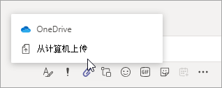

# 在 Microsoft Teams 中共享文件Sharing files in Microsoft Teams

在 Microsoft Teams 中，用户可以与组织内外的其他 Teams 用户共享内容。In Microsoft Teams, users can share content with other Teams users within and outside their organization. 在 Teams 中共享文件和文件夹基于 SharePoint 和 OneDrive 中配置的设置，因此为 SharePoint 和 OneDrive 设置的内容也会影响 Teams 中的共享。Sharing files and folders in Teams is based on the settings configured in SharePoint and OneDrive, so whatever you set up for SharePoint and OneDrive will affect sharing in Teams as well.

## 概述Overview

用户可以从 OneDrive、他们有权访问的团队和网站以及他们的计算机共享文件。Users can share files from OneDrive, from teams and sites they have access to, and from their computer. 若要共享文件，用户可以执行下列操作：To share a file, users can do the following:

- 在频道中，单击“**附加**”（曲别针图标），选择“**最近**”、“**浏览团队和频道**”、“**OneDrive**”或“**从我的计算机上传**”，然后选择要共享的文件。In a channel, click **Attach** (the paperclip icon), select **Recent**, **Browse Teams and Channels**, **OneDrive**, or **Upload from my computer**, and then choose the file they want to share.   
    
- 在聊天中，单击“**附加**”（曲别针图标），选择  或者“**OneDrive**”或“**从我的计算机上传**”，然后选择要共享的文件。In a chat, click **Attach** (the paperclip icon), select  or **OneDrive** or **Upload from my computer**, and then choose the file they want to share.  
    
- 复制并在撰写框中粘贴共享链接。Copy and paste the sharing link in the compose box. 
    

### 共享文件和共享链接的权限Permissions of shared files and sharing links

当用户在 Teams 中共享文件时，他们可以设置谁可以访问该文件，就像在 Microsoft 365 中所做的那样。When users share a file from within Teams, they can set who can access the file just like they do across Microsoft 365. 他们可以向任何人、你组织中的人员、具有现有访问权限的人员或特定人员授予访问权限（可以将人员包括在一对一聊天、群组聊天或频道中）。They can give access to anyone, people in your organization, people with existing access, or specific people (which can include the people in a 1:1 chat, group chat, or channel).  共享文件时，消息中将显示文件预览，同时还可执行所有文件操作，如“**在线打开**”、“**下载**”和“**复制链接**”。When a file is shared, the file preview is available in the message, along with all file actions such as **Open online**, **Download**, and **Copy link**. 默认情况下，该文件在 Teams 中打开。By default, the file opens in Teams.

当用户在聊天或频道中共享文件时，系统会通知他们是否有部分或全部收件人没有查看文件的权限。When users share a file in a chat or channel, they're notified whether some or all recipients don't have permission to view the file. 他们可以单击消息中现在显示的文件预览旁边的箭头，在共享文件之前更改文件的权限。They can change the permissions on the file before they share it by clicking the arrow next to the file preview that now appears in the message.

## 相关主题Related topics

[SharePoint Online 和 OneDrive for Business 与 Microsoft Teams 如何交互How SharePoint Online and OneDrive for Business interact with Microsoft Teams](sharepoint-onedrive-interact.md)

[更改网站的默认链接类型Change the default link type for a site](/sharepoint/change-default-sharing-link)

[在团队中与来宾协作Collaborate with guests in a team](/microsoft-365/solutions/collaborate-as-team)