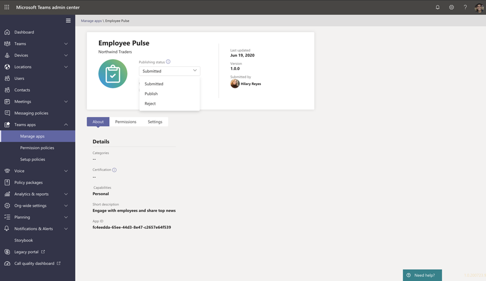

# 发布通过团队应用提交 API 提交的自定义应用Publish a custom app submitted through the Teams App Submission API

## 概述Overview

> [!NOTE]
> 发布自定义团队应用时，用户可在组织的应用商店中使用。When you publish a custom Teams app, it's available to users in your organization's app store. 发布自定义应用的方法有两种，使用方式取决于你获取该应用的方式。There are two ways to publish a custom app and the way that you use depends on how you get the app. **本文重点介绍如何批准和发布开发人员通过团队应用提交 API 提交的自定义应用**。**This article focuses on how to approve and publish a custom app that a developer submits through the Teams App Submission API**. 当开发人员以 .zip 格式发送应用包时，将使用另一种方法，即上载自定义应用。The other method, uploading a custom app, is used when a developer sends you an app package in .zip format. 若要了解有关该方法的详细信息，请参阅<a href="https://docs.microsoft.com/microsoftteams/upload-custom-apps" target="_blank">通过上载应用包发布自定义应用</a>。To learn more about that method, see <a href="https://docs.microsoft.com/microsoftteams/upload-custom-apps" target="_blank">Publish a custom app by uploading an app package</a>.
 
本文提供了有关如何将你的团队应用从开发转到部署到发现的端到端指南。This article provides end-to-end guidance for how to take your Teams app from development to deployment to discovery. 你将大致了解团队在应用生命周期中提供的连接体验，以简化如何在组织的应用商店中开发、部署和管理自定义应用。You'll get an overview of the connected experiences that Teams provides across the app lifecycle to streamline how to develop, deploy, and manage custom apps in your organization's app store.

我们将介绍生命周期的每个步骤，包括开发人员如何使用团队应用提交 API 将自定义应用直接提交到 Microsoft 团队管理中心供你查看和批准，如何设置策略以管理你组织中的用户的应用，以及你的用户如何在团队中发现这些应用。We'll cover each step of the lifecycle, including how developers can use the Teams App Submission API to submit custom apps directly to the Microsoft Teams admin center for you to review and approve, how to set policies to manage apps for users in your organization, and how your users discover them in Teams.

本指南重点介绍应用的团队方面，并面向管理员和 IT 专业人士。This guidance focuses on the Teams aspects of the app and is intended for admins and IT pros. 有关开发团队应用的信息，请参阅<a href="https://docs.microsoft.com/microsoftteams/platform" target="_blank">团队开发人员文档</a>。For information about developing Teams apps, see the <a href="https://docs.microsoft.com/microsoftteams/platform" target="_blank">Teams developer documentation</a>.

## 开发Develop

### 创建应用Create the app

Microsoft 团队开发人员平台使开发人员可以轻松地集成你自己的应用和服务，以提高工作效率、更快地做出决策以及围绕现有内容和工作流创建协作。The Microsoft Teams developer platform makes it easy for developers to integrate your own apps and services to improve productivity, make decisions faster, and create collaboration around existing content and workflows. 在团队平台上构建的应用是团队客户端和你的服务和工作流之间的桥梁，可直接将它们引入协作平台的上下文中。Apps built on the Teams platform are bridges between the Teams client and your services and workflows, bringing them directly into the context of your collaboration platform. 有关详细信息，请转到<a href="https://docs.microsoft.com/microsoftteams/platform" target="_blank">团队开发人员文档</a>。For more information, go to the <a href="https://docs.microsoft.com/microsoftteams/platform" target="_blank">Teams developer documentation</a>.

### 提交应用Submit the app

当应用准备好在生产中使用时，开发人员可以使用团队应用提交 API 提交应用，该 API 可以从 Graph API 中调用，集成开发环境 (IDE) （如 Visual Studio 代码）或诸如 Power App 和 Power Virtual Agent 之类的平台。When the app is ready for use in production, the developer can submit the app using the Teams App Submission API, which can be called from Graph API, an integrated development environment (IDE) such as Visual Studio Code, or a platform such as Power Apps and Power Virtual Agents. 执行此操作将使应用在 Microsoft 团队管理中心的 "<a href="https://docs.microsoft.com/microsoftteams/manage-apps" target="_blank">管理应用</a>" 页面上可用，你的管理员可以在其中查看和批准该应用。Doing this makes the app available on the <a href="https://docs.microsoft.com/microsoftteams/manage-apps" target="_blank">Manage apps</a> page of the Microsoft Teams admin center, where you, the admin, can review and approve it.this 

在 Microsoft Graph 上构建的团队应用提交 API 允许你的组织在你选择的平台上进行开发，并为团队中的自定义应用自动执行提交到审批流程。The Teams App Submission API, built on Microsoft Graph, allows your organization to develop on the platform of your choice and automates the submission-to-approval process for custom apps on Teams.

下面是此应用提交步骤在 Visual Studio 代码中的外观示例：Here's an example of what this app submission step looks like in Visual Studio Code:

请记住，这并不会将应用发布到你的组织的应用商店。Keep in mind that this doesn't publish the app to your organization's app store yet. 此步骤将应用提交到 Microsoft 团队管理中心，你可以在其中批准将其发布到你的组织的应用商店。This step submits the app to the Microsoft Teams admin center where you can approve it for publishing to your organization's app store.

## 复核Validate

Microsoft 团队管理中心 (中的 "<a href="https://docs.microsoft.com/microsoftteams/manage-apps" target="_blank">管理应用</a>" 页面在左侧导航中，转到 "**团队应用**  >  **管理应用**") ，为你的组织提供所有团队应用的视图。The <a href="https://docs.microsoft.com/microsoftteams/manage-apps" target="_blank">Manage apps</a> page in the Microsoft Teams admin center (in the left navigation, go to **Teams apps** > **Manage apps**), gives you a view into all Teams apps for your organization. 页面顶部的 "**待定审批**" 小组件可让你知道何时提交自定义应用以供审批。The **Pending approval** widget at the top of the page lets you know when a custom app is submitted for approval.

在表格中，新提交的应用会自动显示已提交**状态**的 "已**提交**" 和 "已**阻止**"**状态**。In the table, a newly submitted app automatically shows a **Publishing status** of **Submitted** and **Status** of **Blocked**. 可以按降序对 "**发布状态**" 列进行排序，以便快速找到该应用。You can sort the **Publishing status** column in descending order to quickly find the app.

单击应用名称以转到 "应用详细信息" 页面。Click the app name to go to the app details page. 在 "**关于**" 选项卡上，您可以查看有关应用的详细信息，包括说明、状态、提交者和应用 ID。On the **About** tab, you can view details about the app, including description, status, submitter, and app ID.

## 发布Publish

当你准备好使应用可供用户使用时，请发布应用。When you're ready to make the app available to users, publish the app.

1. 在 Microsoft 团队管理中心的左侧导航中，转到 "**团队应用**  >  **管理应用**"。In the left navigation of the Microsoft Teams admin center, go to **Teams apps** > **Manage apps**.
2. 单击应用名称转到 "应用程序详细信息" 页，然后在 "**发布状态**" 框中，选择 "**发布**"。Click the app name to go to the app details page, and then in the **Publishing status** box, select **Publish**.

    发布应用后，**发布状态**将更改为 "**已发布**"，"**状态**" 将自动更改为 "**允许**"。After you publish the app, the **Publishing status** changes to **Published** and the **Status** automatically changes to **Allowed**.

## 设置和管理Set up and manage

### 控制对应用的访问Control access to the app

默认情况下，组织中的所有用户都可以访问组织的应用商店中的应用。By default, all users in your organization can access the app in your organization's app store. 若要限制和控制谁有权使用该应用程序，你可以创建并分配应用权限策略。To restrict and control who has permission to use the app, you can create and assign an app permission policy. 若要了解详细信息，请参阅<a href="https://docs.microsoft.com/microsoftteams/teams-app-permission-policies" target="_blank">管理团队中的应用权限策略</a>。To learn more, see <a href="https://docs.microsoft.com/microsoftteams/teams-app-permission-policies" target="_blank">Manage app permission policies in Teams</a>.

### 固定并安装应用以供用户发现Pin and install the app for users to discover

默认情况下，用户可以使用该应用程序找到你的组织的应用商店所需的应用，然后浏览或搜索它。By default, for users to find the app they have to go to your organization's app store and browse or search for it. 若要使用户可以轻松访问应用，可以将应用固定到团队中的应用栏。To make it easy for users to get to the app, you can pin the app to the app bar in Teams. 若要执行此操作，请创建应用设置策略并将其分配给用户。To do this, create an app setup policy and assign it to users. 若要了解详细信息，请参阅<a href="https://docs.microsoft.com/microsoftteams/teams-app-setup-policies" target="_blank">管理团队中的应用设置策略</a>。To learn more, see <a href="https://docs.microsoft.com/microsoftteams/teams-app-setup-policies" target="_blank">Manage app setup policies in Teams</a>.

## 探索和采纳Discover and adopt

具有应用权限的用户可以在你的组织的应用商店中找到它。Users who have permissions to the app can find it in your organization's app store. 转到 "应用" 页面上的 "为\***你的组织名称\*生成**" 以查找你的组织的自定义应用。Go to **Built for *Your Organization Name*** on the Apps page to find your organization's custom apps.

如果你创建并分配了应用设置策略，应用将固定到团队中的应用栏，以便为分配了该策略的用户轻松访问。If you created and assigned an app setup policy, the app is pinned to the app bar in Teams for easy access for those users who were assigned the policy.

## 更新Update

若要更新应用，开发人员应继续按照 "[开发](#develop)" 部分中的步骤操作。To update an app, developers should continue to follow the steps in the [Develop](#develop) section.

当开发人员向已发布的自定义应用程序提交更新时，将在 "<a href="https://docs.microsoft.com/microsoftteams/manage-apps" target="_blank">管理应用程序</a>" 页面的 "**挂起审批**" 小组件中收到通知。When the developer submits an update to a published custom app, you'll get notified in the **Pending approval** widget of the <a href="https://docs.microsoft.com/microsoftteams/manage-apps" target="_blank">Manage apps</a> page. 在表中，应用的**发布状态**将设置为 "已**提交更新**"。In the table, the **Publishing status** of the app will be set to **Update submitted**.

要查看和发布应用更新，请执行以下操作：To review and publish an app update:

1. 在 Microsoft 团队管理中心的左侧导航中，转到 "**团队应用**  >  **管理应用**"。In the left navigation of the Microsoft Teams admin center, go to **Teams apps** > **Manage apps**.
2. 单击应用名称转到 "应用详细信息" 页面，然后选择 "**更新可用**" 以查看更新的详细信息。Click the app name to go to the app details page, and then select **Update available** to review details of the update.

    
3. 准备就绪后，选择 "**发布**" 以发布更新。When you're ready, select **Publish** to publish the update. 执行此操作将替换现有应用、更新版本号，并将**发布状态**更改为 "**已发布**"。Doing this replaces the existing app, updates the version number, and changes the **Publishing status** to **Published**. 所有应用权限策略和应用设置策略对于更新的应用均保持强制实施。All app permission policies and app setup policies remain enforced for the updated app.

    如果拒绝更新，则早期版本的应用仍将发布。If you reject the update, the earlier version of the app remains published.

请记住以下事项：Keep in mind the following:

- 当应用获得批准后，任何人都可以向应用提交更新。When an app is approved, any one can submit an update to the app. 这意味着其他开发人员（包括最初提交该应用的开发人员）可以提交对该应用的更新。This means other developers, including the developer who originally submitted the app, can submit an update to the app.
- 当开发人员提交应用且请求处于挂起状态时，仅该开发人员可以向该应用提交更新。When a developer submits an app and the request is pending, only that same developer can submit an update to the app. 其他开发人员只能在应用获得批准后提交更新。Other developers can submit an update only after the app is approved.

### 用户更新体验Update experience for users

在大多数情况下，发布应用更新后，将自动为用户显示新版本。In most cases, after you publish an app update, the new version automatically appears for users. 但是，对<a href="https://docs.microsoft.com/microsoftteams/platform/resources/schema/manifest-schema" target="_blank">Microsoft 团队清单</a>有一些更新需要用户接受才能完成：However, there are some updates to the <a href="https://docs.microsoft.com/microsoftteams/platform/resources/schema/manifest-schema" target="_blank">Microsoft Teams manifest</a> that require user acceptance to complete:

* 已添加或删除机器人A bot was added or removed
* 现有 bot 的 "botId" 属性已更改An existing bot's "botId" property changed
* 现有 bot 的 "isNotificationOnly" 属性已更改An existing bot's "isNotificationOnly" property changed
* Bot 的 "supportsFiles" 属性已更改The bot's "supportsFiles" property changed
* 添加或删除了消息传递扩展A messaging extension was added or removed
* 添加了新的连接器A new connector was added
* 添加了新的静态选项卡A new static tab was added
* 添加了新的 "可配置" 选项卡A new configurable tab was added
* "WebApplicationInfo" 中的属性已更改Properties inside "webApplicationInfo" changed

## 相关主题Related topics

- [通过上载应用包发布自定义应用Publish a custom app by uploading an app package](upload-custom-apps.md)
- [在 Microsoft 团队管理中心中管理你的应用Manage your apps in the Microsoft Teams admin center](manage-apps.md)
- [在 Teams 中管理自定义应用策略和设置Manage custom app policies and settings in Teams](teams-custom-app-policies-and-settings.md)
- [在 Teams 中管理应用权限策略Manage app permission policies in Teams](teams-app-permission-policies.md)
- [在 Teams 中管理应用设置策略Manage app setup policies in Teams](teams-app-setup-policies.md)
