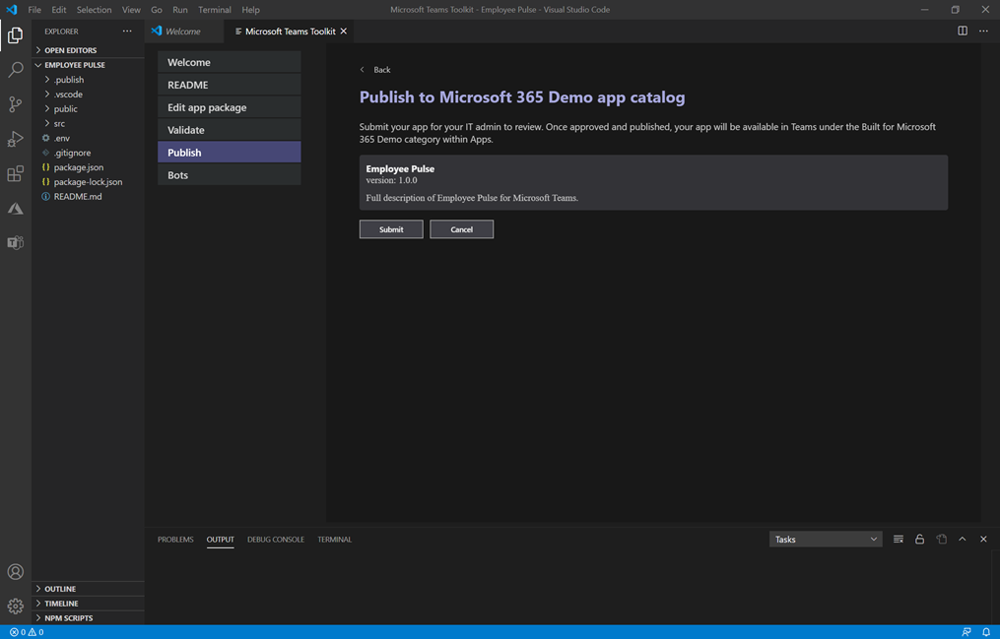

# 发布通过 Teams 应用提交 API 提交的自定义应用

## 概述

> [!NOTE]
> 发布自定义 Teams 应用时，该应用可供组织应用商店中的用户使用。 有两种方法可以发布自定义应用，使用方式取决于获取应用的方式。 **本文重点介绍如何批准和发布** 开发人员通过 Teams 应用提交 API 提交的自定义应用。 当开发人员以 .zip 格式发送给你应用包时，会使用上传自定义应用的另一种方法。 若要详细了解该方法，请参阅"通过<a href="https://docs.microsoft.com/microsoftteams/upload-custom-apps" target="_blank">上传应用包发布自定义应用"。</a>

本文提供有关如何将 Teams 应用从开发到部署到发现的端到端指南。 你将大致了解 Teams 在应用生命周期中提供的连接体验，以简化在组织的应用商店中开发、部署和管理自定义应用。

我们将介绍生命周期的每个步骤，包括开发人员如何使用 Teams 应用提交 API 将自定义应用直接提交到 Microsoft Teams 管理中心供你查看和批准、如何设置策略来管理组织中用户的应用，以及用户如何在 Teams 中发现它们。

本指南重点介绍应用的 Teams 方面，面向管理员和 IT 专业人员。 有关开发 Teams 应用的信息，请参阅 <a href="https://docs.microsoft.com/microsoftteams/platform" target="_blank">Teams 开发人员文档</a>。

## 开发

### 创建应用

使用 Microsoft Teams 开发人员平台，开发人员可以轻松集成自己的应用和服务，以提高工作效率、更快地做出决策，以及围绕现有内容和工作流创建协作。 基于 Teams 平台构建的应用是 Teams 客户端与服务和工作流之间的桥梁，可将它们直接引入协作平台的上下文中。 有关详细信息，请转到 Teams 开发人员 <a href="https://docs.microsoft.com/microsoftteams/platform" target="_blank">文档</a>。

### 提交应用

当应用准备好在生产环境中使用时，开发人员可以使用 Teams 应用提交 <a href="https://docs.microsoft.com/azure/virtual-desktop/teams-on-wvd" target="_blank">API（可以从图形 API、</a>集成开发环境 (IDE) （如 Visual Studio Code）或平台（如 Power Apps 和 Power Virtual Agents）调用该应用。 这样，应用就可以在 Microsoft  Teams 管理中心的"管理应用"页面上使用，你（管理员）可以在其中查看和批准该应用。

构建在 <a href="https://docs.microsoft.com/graph/api/teamsapp-publish?view=graph-rest-1.0&tabs=http#example-2-upload-a-new-application-for-review-to-an-organizations-app-catalog" target="_blank">Microsoft Graph</a>上的 Teams 应用提交 API 允许组织在选择的平台上进行开发，并自动执行 Teams 上自定义应用的提交到审批过程。

下面是此应用提交步骤在应用代码中的外观Visual Studio示例：

请记住，这不会将应用发布到组织的应用商店。 此步骤将应用提交到 Microsoft Teams 管理中心，可在其中批准该应用发布到组织的应用商店。

有关使用图形 API 提交应用的信息，请参阅 <a href="https://docs.microsoft.com/graph/api/teamsapp-publish?view=graph-rest-1.0&tabs=http#example-2-upload-a-new-application-for-review-to-an-organizations-app-catalog" target="_blank">此处</a>。

## 验证

Microsoft  Teams 管理中心中的"管理应用" (左侧导航栏中，转到 **"管理** 应用") ，查看组织的所有  >  Teams 应用。 页面 **顶部的** "待定审批"小组件可让你了解何时提交自定义应用进行审批。

在表中，新提交的应用会自动显示"已提交"和"已 **阻止状态****"的发布状态**。 你可以按降 **序对"发布** 状态"列进行排序以快速找到该应用。

单击应用名称转到应用详细信息页。 在 **"关于** "选项卡上，可以查看有关应用的详细信息，包括说明、状态、提交者以及应用 ID。

已提交应用的 ！应用详细信息页] (媒体/custom-app-lifecycle-app-details.png) 

有关使用图形 API 检查发布 **状态的信息**，请参阅 <a href="https://docs.microsoft.com/graph/api/teamsapp-list?view=graph-rest-1.0&tabs=http#example-3-list-applications-with-a-given-id-and-return-the-submission-review-state" target="_blank">此处</a>。

## 发布

当你准备好使应用可供用户使用时，请发布该应用。

1. 在 Microsoft Teams 管理中心的左侧导航栏中，转到 **"Teams 应用**  >  **管理应用"。**
2. 单击应用名称转到应用详细信息页，然后在"发布状态"框中选择"发布 **"。**

    发布应用后，"发布"**状态将更改** 为 **"** 已发布"，"**状态"会自动** 更改为"允许 **"。**

## 设置和管理

### 控制对应用的访问

默认情况下，组织中的所有用户都可以访问组织应用商店中的应用。 若要限制和控制谁有权使用应用，可以创建并分配应用权限策略。 若要了解有关详细信息，请参阅<a href="https://docs.microsoft.com/microsoftteams/teams-app-permission-policies" target="_blank">"在 Teams 中管理应用权限策略"。</a>

### 固定并安装应用供用户发现

默认情况下，用户若要查找应用，必须转到组织的应用商店并浏览或搜索该应用。 为了方便用户访问该应用，你可以将应用固定到 Teams 中的应用栏。 为此，请创建应用设置策略并将其分配给用户。 若要了解有关详细信息，请参阅<a href="https://docs.microsoft.com/microsoftteams/teams-app-setup-policies" target="_blank">"在 Teams 中管理应用设置策略"。</a>

### 在审核日志搜索 Teams 应用事件

可以搜索应用审核日志查看组织中 Teams 应用活动。 若要详细了解如何搜索 审核日志并查看记录在 审核日志 中的 Teams 活动列表，请参阅"在 审核日志 中搜索 <a href="https://docs.microsoft.com/microsoftteams/audit-log-events" target="_blank">活动</a>。

在搜索安全中心审核日志，首先必须打开安全中心& <a href="https://protection.office.com" target="_blank">审核</a>。 若要了解有关详细信息，请参阅 <a href="https://support.office.com/article/Turn-Office-365-audit-log-search-on-or-off-e893b19a-660c-41f2-9074-d3631c95a014" target="_blank">审核日志打开或关闭搜索</a>。 请记住，只有启用审核时，审核数据才可用。

## 发现和采用

对应用具有权限的用户可以在组织的应用商店中查找它。 转到 **"应用 *"页上*** 的"为组织名称构建"，查找组织的自定义应用。

如果创建并分配了应用设置策略，该应用将固定到 Teams 中的应用栏，以便分配有该策略的用户轻松访问。

## 更新

若要更新应用，开发人员应继续按照"开发"部分中 [的步骤](#develop) 操作。

当开发人员将更新提交到已发布的自定义应用时，您将在"管理应用"页面的"待定 **审批** " <a href="https://docs.microsoft.com/microsoftteams/manage-apps" target="_blank">小组件中收到通知</a> 。 在表中，**应用的发布** 状态将设置为 **"已提交更新"。**

查看和发布应用更新：

1. 在 Microsoft Teams 管理中心的左侧导航栏中，转到 **"Teams 应用**  >  **管理应用"。**
2. 单击应用名称转到应用详细信息页，然后选择"可用更新"查看更新的详细信息。

    
3. 准备就绪后，选择" **发布** "以发布更新。 执行此操作会替换现有应用、更新版本号，以及将 **发布状态更改** 为 **"已发布"。** 对于更新的应用，所有应用权限策略和应用设置策略仍强制实施。

    如果你拒绝更新，则应用的早期版本将保持已发布状态。

请记住以下事项：

- 应用获得批准后，任何一个都可以向应用提交更新。 这意味着其他开发人员（包括最初提交该应用的开发人员）可以提交应用更新。
- 当开发人员提交应用并且请求挂起时，只有该开发人员才能向应用提交更新。 其他开发人员只能在应用获得批准后提交更新。

有关使用图形 API 更新应用的信息，请参阅 <a href="https://docs.microsoft.com/graph/api/teamsapp-update?view=graph-rest-1.0#example-2-update-a-previously-reviewed-and-published-application-to-the-teams-app-catalog" target="_blank">此处</a>。

### 用户的更新体验

在大多数情况下，发布应用更新后，新版本会自动显示给用户。 但是，Microsoft <a href="https://docs.microsoft.com/microsoftteams/platform/resources/schema/manifest-schema" target="_blank">Teams</a> 清单的一些更新需要用户验收才能完成：

* 添加或删除了机器人
* 现有机器人的"botId"属性已更改
* 现有机器人的"isNotificationOnly"属性已更改
* 机器人的"supportsFiles"属性已更改
* 添加或删除了消息传送扩展
* 添加了一个新连接器
* 添加了新的静态选项卡
* 添加了新的"可配置"选项卡
* "webApplicationInfo"中的属性已更改

## 相关主题

- [通过上传应用包发布自定义应用](upload-custom-apps.md)
- [在 Microsoft Teams 管理中心管理应用](manage-apps.md)
- [在 Teams 中管理自定义应用策略和设置](teams-custom-app-policies-and-settings.md)
- [在 Teams 中管理应用权限策略](teams-app-permission-policies.md)
- [在 Teams 中管理应用设置策略](teams-app-setup-policies.md)
- <a href="https://docs.microsoft.com/graph/api/resources/teamsapp?view=graph-rest-1.0" target="_blank">Microsoft Graph API for Teams 应用</a>
