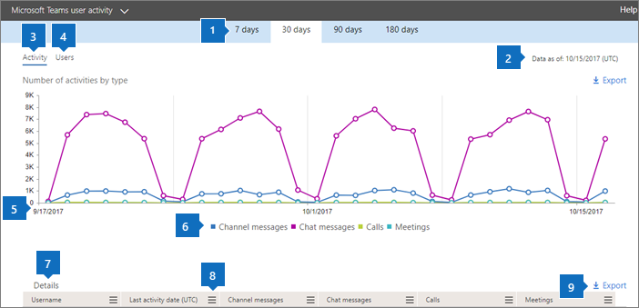
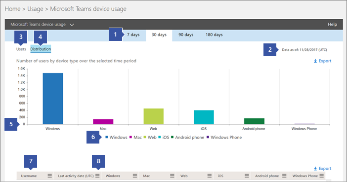

用于 Microsoft 团队活动报告 
========================================

可以使用在 Microsoft 365 管理中心活动报告以查看您的组织中的用户如何使用 Microsoft 团队。 例如，如果某些不尚未使用的 Microsoft 团队，它们可能不知道如何开始或了解如何使用团队是更提高生产效率和协作。 组织可以使用活动报告来决定在何处优先安排培训和沟通工作。

## 如何在报表的仪表板中查看团队报告

1. 在[Microsoft 365 管理中心](https://portal.office.com/adminportal/home)中，选择**报告** > **使用率**。
 
2. 在**使用率**页中，选择**选择报表**，然后下**的 Microsoft 团队**的报告列表中选择您要查看的报告。

## 可用的团队活动报告

目前有两个活动报告，您可以查看：

- [Microsoft Teams 用户活动报告](#microsoft-teams-user-activity-report) 
- [Microsoft Teams 设备使用情况报告](#microsoft-teams-device-usage-report) 

### Microsoft Teams 用户活动报告

团队用户活动报告提供您的用户执行团队中的最常见活动视图。 这包括多少人参与通道中聊天、 通过私人聊天消息多少通信和多少参与呼叫或会议中。 为整个组织，以及每个用户，您可以看到此信息。

#### 解释的 Microsoft 团队用户活动报告

您可以通过查看**活动**和**用户**图表到团队用户活动获取视图。

|标号 |说明  |
|--------|-------------|
|**1**   |可以最近 7 天，30 天，90 天或 180 天内的趋势查看团队用户活动报告。 但是，如果您单击报表中的特定时间范围，表 (7) 将显示数据 30 天，最多的日期 (2) 的时生成报表。 |
|**2**   |每个报表包含此报表的生成日期。报表通常反映活动时间的 24 至 48 小时延迟。 |
|**3**   |**活动**视图显示了由活动类型的 Microsoft 团队活动的数目。 活动类型是号码的团队聊天消息、 专用聊天消息、 呼叫和会议。 |
|**4**   |**用户**视图显示了由活动类型的用户数。 活动类型是号码的团队聊天消息、 专用聊天消息、 呼叫和会议。 |
|**5**   |图表上的 X 轴是特定报告的所选的日期范围。 <ul><li>在**活动**图表中，Y 轴是活动的指定的计数。</ul></li> <ul><li>在**用户**图表中，Y 轴是参与团队聊天、 专用的聊天、 呼叫或会议的用户数。</ul></li> |
|**6**   |你可以通过单击图例上的项目筛选你在图表上看到的系列。 例如，在**活动**图表中，单击或点击**通道邮件**、**聊天消息**、**呼叫**或**会议**以查看仅与每个相关的信息。 更改此选项不会更改网格表中的信息。 |
|**7**   |跨最宽 （180 天） 报告时间段的活动团队的列表。  活动计数根据日期选择不同而有所不同。    若要查看表中的以下信息，请确保将列添加到表。 <ul><li>**Username**是用户的电子邮件地址。 您可以显示的实际的电子邮件地址或使此字段匿名。</ul></li> <ul><li>**最后一个活动日期 (UTC)** 指用户参与的 Microsoft 团队活动的最后一个日期。</ul></li> <ul><li>**通道消息**是唯一的用户发布的消息数团队聊天在指定的时间段中。</ul></li> <ul><li>**聊天消息**是唯一的用户发布在专用聊天指定的时间段内的消息数。</ul></li> <ul><li>**呼叫**是用户所参与的呼叫数在指定的时间段。</ul></li> <ul><li>**会议**的用户参加在指定的时间段内的联机会议数。</ul></li> <ul><li>**其他活动**是由用户某些包括，并不局限于其他团队活动的数目： 喜好消息、 文件、 搜索、 以下团队和通道和 favoriting 上使用它们的应用程序。</ul></li> <ul><li>**Deleted**指示是否团队将被删除。 如果团队被删除，但具有报告期间的活动，它将显示在网格中已删除设置为 true。</ul></li> <ul><li>**已删除日期**是用户已删除的日期。</ul></li> <ul><li>**将产品分配**是分配给用户的产品的列表。</ul></li>如果贵组织的策略会阻止您查看报告可识别用户信息在哪里，您可以更改所有这些报告的隐私设置。 签出**如何隐藏用户级别的详细信息？** [in Office 365 Admin Center Preview 活动报告](https://support.office.com/article/activity-reports-in-the-office-365-admin-center-0d6dfb17-8582-4172-a9a9-aed798150263)中的部分。</ui> |
|**8**   |单击或点击要添加或删除表中的列的**列**。 |
|**9**   |单击或点击**导出**报表数据导出至 Excel.csv 文件。 此操作会导出所有用户数据并允许你执行简单的排序和筛选以进行更详细的分析。 如果您有少于 2,000 个用户，您可以排序和筛选报告本身中的表中。 如果您有 2,000 多个用户，必须将导出的数据进行筛选和排序报表。 

### Microsoft Teams 设备使用情况报告

团队设备使用情况报告提供有关如何将您的用户连接到团队，包括移动应用程序的信息。 报告可帮助您了解哪些设备是在您的组织中常见以及多少用户在工作。

### 解释 Microsoft 团队设备使用情况报告

您可以通过查看**用户**和**通讯组**图表团队设备使用情况获取视图。

|标号 |说明  |
|--------|-------------|
|**1**   |团队设备报告可以在最近 7 天，30 天，90 天或 180 天内的趋势查看。 但是，如果您单击报表中的特定时间范围，表 (7) 将显示数据 30 天，最多的日期 (2) 的时生成报表。 |
|**2**   |每个报表包含此报表的生成日期。报表通常反映活动时间的 24 至 48 小时延迟。 |
|**3**   |**用户**视图显示按设备类型的每日用户数。 |
|**4**   |**通讯**视图显示您的用户数按设备在选定的时间段。  |
|**5**   | <ul><li>**用户**图表上的 X 轴报表选定的日期范围，并且 Y 轴的设备类型的用户数。</ul></li> <ul><li>在**通讯**图表中，X 轴显示不同的设备用来连接到团队和 Y 轴是使用设备的用户数。</ul></li> |
|**6**   |你可以通过单击图例上的项目筛选你在图表上看到的系列。 例如，在**分发**图表中，单击或点击**Windows**、 **Mac**、 **Web**、 **iOS**或**Android**以查看仅与每个相关的信息。 更改此选项不会更改网格表中的信息。 |
|**7**   |跨最宽 （180 天） 报告时间段的活动团队的列表。  活动计数根据日期选择不同而有所不同。    若要查看表中的以下信息，请确保将列添加到表。 <ul><li>**Username**是用户的电子邮件地址。 您可以显示的实际的电子邮件地址或使此字段匿名。</ul></li> <ul><li>**最后一个活动日期 (UTC)** 指用户参与团队活动的最后一个日期。</ul></li> <ul><li>**Deleted**指示是否团队将被删除。 如果团队被删除，但具有报告期间的活动，它将显示在网格中已删除设置为 true。</ul></li><ul><li>**已删除日期**是用户已删除的日期。</ul></li> <ul><li>**Windows**处于选中状态，如果用户的基于 Windows 的计算机上的团队桌面客户端中处于活动状态。</ul></li> <ul><li>如果用户已 macOS 计算机上的团队桌面客户端中处于活动状态，则选中**Mac** 。</ul></li>  <ul><li>如果用户处于活动状态团队 web 客户端上，则选中**web** 。</ul></li> <ul><li>**iOS**处于选中状态，如果用户处于活动状态的 iOS 团队移动客户端上。</ul></li> <ul><li>如果用户上处于活动状态团队移动客户端的 Android， **android 移动电话**处于选中状态。</ul></li></li> <ui>如果贵组织的策略会阻止您查看报告可识别用户信息在哪里，您可以更改所有这些报告的隐私设置。签出**如何隐藏用户级别的详细信息？** [in Office 365 Admin Center Preview 活动报告](https://support.office.com/article/activity-reports-in-the-office-365-admin-center-0d6dfb17-8582-4172-a9a9-aed798150263)中的部分。</ui> |
|**8**   |单击或点击要添加或删除表中的列的**列**。 |
|**9**   |单击或点击**导出**报表数据导出至 Excel.csv 文件。 此操作会导出所有用户数据并允许你执行简单的排序和筛选以进行更详细的分析。 如果您有少于 2,000 个用户，您可以排序和筛选报告本身中的表中。 如果您有 2,000 多个用户，必须将导出的数据进行筛选和排序报表。 

## 谁可以访问团队活动报告

可由已分配的用户活动报告：

- Office 365 全局管理员角色
- 特定于产品的管理员角色 （Exchange，Skype 业务，或 SharePoint）
- 报告读者角色

### 报告读者角色

非 IT 人员他们想要有权访问这些报告，您可以分配*报告读者*角色。 通过将此角色分配给培训经理或业务利益干系人，您可以确保他们可以访问驱动器和跟踪应用的工作组有用见解。

## 报告仪表板上的其他信息

### 一览活动小部件

报告仪表板中一览活动小部件，让您的用户进行通信和协作 Office 365 中使用的其他各种服务的方式跨产品查看包括团队中的使用情况数据。

### 团队活动卡片

报告仪表板上的团队活动卡片提供中包括的活动用户数量，以便您可以快速了解多少用户使用该服务的团队活动的概述。 单击仪表板上的活动卡片可转到团队用户活动报告。 

