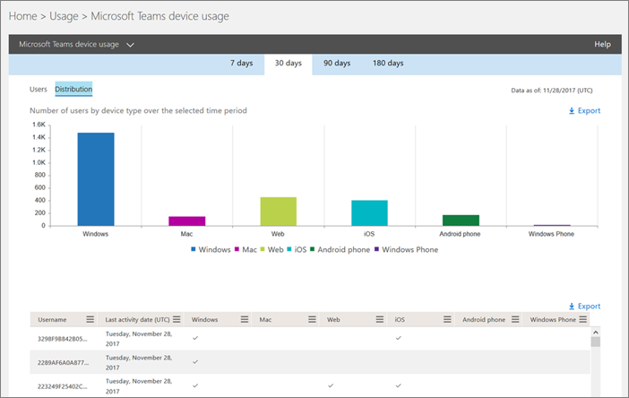

用于 Microsoft 团队活动报告 
========================================

您可以使用活动报告以查看您的组织中的用户如何使用 Microsoft 团队。 例如，如果一些不用团队，它们可能不知道如何开始或了解如何使用团队是更提高生产效率和协作。 您的组织可以使用活动报告来决定培训和通信针对性的位置。

## 如何获取对报表的仪表板

1. 在[Office 365 管理中心](https://portal.office.com/adminportal/home)中，选择**报告** > **使用率**。
 
2. 在**使用情况**页上，选择**选择报表**，以从可用的报告列表中选择。 

## 可用的团队活动报告

目前有两个活动报告，您可以查看：

- Microsoft 团队用户活动报告 
- Microsoft 团队设备使用情况报告 

### Microsoft 团队用户活动报告

Microsoft 团队用户活动报告提供您的用户执行的 Microsoft 团队中的最常见活动视图。 这包括多少人参与通道中聊天、 通过私人聊天消息多少通信和多少参与呼叫或会议中。 您可以看到此信息在租户级别，以及每个用户。

#### 解释的 Microsoft 团队用户活动报告

您可以通过查看**活动**和**用户**图表为视图进入 Microsoft 团队用户活动。

|标号 |说明  |
|--------|-------------|
|**1**   |最近 7 天，30 天，90 天或 180 天内的 Microsoft 团队用户活动报告可以查看的趋势。 但是，如果您单击到报告中某一天，表 (7) 将显示数据 30 天，最多的日期 (2) 的时生成报表。 |
|**2**   |每个报表包含此报表的生成日期。报表通常反映活动时间的 24 至 48 小时延迟。 |
|**3**   |**活动**视图显示了由活动类型的 Microsoft 团队活动的数目。 活动类型是数团队聊天消息、 专用聊天消息、 呼叫或会议。 |
|**4**   |**用户**视图显示了由活动类型的用户数。 活动类型是数团队聊天消息、 专用聊天消息、 呼叫或会议。 |
|**5**   |图表上的 X 轴是特定报告的所选的日期范围。 <ul><li>在**活动**图表中，Y 轴是活动的指定的计数。</ul></li> <ul><li>在**文件**图表中，Y 轴是参与团队聊天、 专用的聊天、 呼叫或会议的用户数。</ul></li> |
|**6**   |你可以通过单击图例上的项目筛选你在图表上看到的系列。 例如，在**活动**图表中，单击或点击**通道邮件**、**聊天消息**、**呼叫**或**会议**以查看仅与每个相关的信息。 更改此选项不会更改网格表中的信息。 |
|**7**   |显示组的列表由存在的所有组的集合 （或者没有被删除） 跨最宽 （180 天） 报告时间段。  活动计数根据日期选择不同而有所不同。 <ul><li>**Username**是用户的电子邮件地址。 您可以显示的实际的电子邮件地址或使此字段匿名。</ul></li> <ul><li>**最后一个活动日期 (UTC)** 指用户参与的 Microsoft 团队活动的最后一个日期。</ul></li> <ul><li>**通道消息**是唯一的用户发布的消息数团队聊天在指定的时间段中。</ul></li> <ul><li>**聊天消息**是唯一的用户发布在专用聊天指定的时间段内的消息数。</ul></li> <ul><li>**呼叫**是用户所参与的呼叫数在指定的时间段。</ul></li> <ul><li>**会议**的用户参加在指定的时间段内的联机会议数。</ul></li> <ul><li>**其他活动**是其他团队活动用户数。</ul></li> <ul><li>**Deleted**指示是否团队将被删除。 如果团队被删除，但具有报告期间的活动，它将显示在网格中已删除设置为 true。</ul></li> <ul><li>**已删除日期**是团队已删除的日期。</ul></li> <ul><li>**将产品分配**是分配给用户的产品的列表。</ul></li> <ui>**注意：** 添加它们之前，可能看不到在下表中的列中的所有项目。 </ul>   <ui>如果贵组织的策略会阻止您查看报告可识别用户信息在哪里，您可以更改所有这些报告的隐私设置。签出**如何隐藏用户级别的详细信息？** [in Office 365 Admin Center Preview 活动报告](https://support.office.com/article/activity-reports-in-the-office-365-admin-center-0d6dfb17-8582-4172-a9a9-aed798150263)中的部分。</ui> |
|**8**   |单击或点击" **列**"可在报告中添加或删除列。 |
|**9**   |您可以通过单击或点击导出链接将报表数据导出到 Excel.csv 文件。 此操作会导出所有用户数据并允许你执行简单的排序和筛选以进行更详细的分析。 如果您有少于 2,000 个用户，您可以排序和筛选报告本身中的表中。 如果筛选和排序的顺序有超过 2,000 个用户，您需要将数据导出。 |

### Microsoft 团队设备使用情况报告

Microsoft 团队应用程序使用情况报告提供有关如何将您的用户连接到 Microsoft 团队，包括移动应用程序的信息。 报告可帮助您了解哪些设备是在您的组织中常见以及多少用户在工作。

## 谁可以访问团队活动报告

可由已分配的用户活动报告：

- Office 365 全局管理员角色
- 特定于产品的管理员角色 （Exchange，Skype 业务，或 SharePoint）
- 报告读者角色

### 报告读者角色

非 IT 人员他们想要有权访问这些报告，您可以分配*报告读者*角色。 通过将此角色分配给培训经理或业务利益干系人，您可以确保他们可以访问驱动器和跟踪应用的工作组有用见解。

## 报告仪表板上的其他信息

### 一览活动小部件

报告仪表板中一览活动小部件，让您的用户进行通信和协作 Office 365 中使用的其他各种服务的方式跨产品查看包括来自 Microsoft 团队的使用率数据。

### 团队活动卡片

Microsoft 团队，报告仪表板还包括的新卡片。 卡片提供中包括的活动用户数量，以便您可以快速了解多少用户使用该服务的团队活动的概述。

