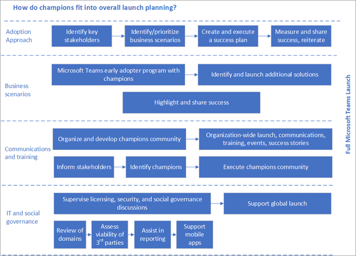

# 为 Microsoft Teams 创建支持者计划

拥护程序对推动组织中的意识、采纳和教育至关重要。 拥护者是一个人, 主要通过帮助其他人 (特别是团队) 对其他技术感兴趣和帮助其他员工使用它与你的最佳做法进行协调来帮助其他人。 根据你的组织的规模, 你可能会将其作为人员角色的正式部分, 但员工通常会承担此角色, 因为其核心动机有助于其他人。

冠军将以各种方式适应您的整体启动计划, 如下所示。

拥护人士应:

- 进行正式培训以提高其知识深度和广度
- 鼓励他们指导、讲授和培训同事
- 具有一致和积极的 reinforcement, 可 affirms 其工作的影响
- 要执行明确计划

使用我们的[冠军拥护程序指南](https://go.microsoft.com/fwlink/?linkid=854665)在你的组织中构建此计划。 本社区的最佳做法是:

- 加入 Office 365 拥护者计划: 确保在拥护者 (及其所有公司拥护者) 最少的领导者是[Microsoft Office 365 拥护者计划](https://aka.ms/O365Champions)的成员。 这一免费的每月社区通话将提供有价值的信息来运行您自己的程序并充分利用团队和其他 Office 365 服务。 可以在自己的内部程序中重用程序资料。

- 使用团队成员冠军团队: 你的拥护者应使用你为其设置的团队, 以获得所有程序通信、反馈和查找资源。  在执行此操作时, 他们将越来越熟悉产品及其好处。

- 保留正常的每月会议: 通过举行定期会议来宣传社区的激情和 cohesiveness。 它们可以是人员和虚拟会议的组合, 但它们的一致性是拥有兴旺冠军社区的关键。

    > [!TIP]
    > 若要帮助构建你的议程, 请在公共社区通话后的一周内安排你的会议。 

- 清楚地了解程序要求: 某些拥护者要求成员参与每月会议, 为他们支持的用户组保留 office 小时数, 并向新用户提供培训。 无论您的要求如何, 都要确保拥护程序清楚地参与该计划。

- 明显奖励你的拥护人员: 你的拥护人员将向你提供有关你的项目的进度和潜在缺陷的重要见解。 经常奖励他们的参与。 小型手势的使用方式很长, 并且员工通常不会寻求资金收益, 而是希望奖励其贡献。 查找感谢您的社区的适当有趣的方法。 

- 尽早、更频繁地培训拥护者: 你的计划开始工作, 每月会议可用于构建你的冠军社区中的技能。 利用这些机会将他们带入董事会、开展他们的初始培训、鼓励他们参加我们的课程, 并确保他们可以在 "实验" 阶段继续使用员工来支持他们的员工。  

的图标:[完成调控快速入门](teams-adoption-governance-quick-start.md)

