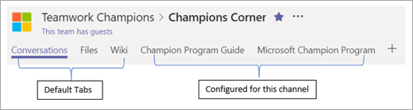

# 在 Microsoft Teams 中创建首批团体

推动采用新应用Teams是使用产品。 我们建议使用 Teams 管理 Microsoft 365 或 Office 365 部署。 还应创建专注于团队合作和工作效率的员工社区。  (这些初始团队可能会随着时间的推移而更改。) 建议的团队包括：

| 团队名称 | 建议的频道名称 |
| --------- | ---------------------- |
| 了解Teams | 常规  打招呼  如何？ 反馈   将来团队的理念   支持 |
| Microsoft Teams实现 | 常规   认知和采用   Business Engagement   早期采用者计划   反馈Insights   安全性和符合性   策略和规划   服务运行状况和事件   培训   Watercooler Chat |
| Teamwork 冠军 | 常规   最佳做法、培训和操作方法   冠军角   反馈和支持   计划潜在顾客   社交中心 |

在Microsoft Teams中，选项卡库可让你访问管理员Microsoft 365 Office 365启用的所有应用或第三方应用。 为了从产品获得最大价值，我们建议在每个相应的频道中将关键资源固定为选项卡。 请参阅以下示例。

在初始团队中，我们建议固定以下项目，方便在团队频道中参考。 这些资产是笔记本分区OneNote资源。 如果你正在与我们的团队FastTrack，他们将帮助你配置这些第一个团队。 

|团队/频道名称 | 固定选项卡 |
|----------------- | ---------- |
| **Microsoft Teams部署** ||
| 常规 | Web 选项卡[：Teams文档](./index.yml) |
| 认知和采用 | [Teams采用中心](https://aka.ms/DriveTeamsAdoption) [Microsoft Teams Customer Success Kit](https://aka.ms/TeamsCustomerSuccess)|
| 业务参与 | Wiki - 参与指南 表单 - 请求Teams咨询 列表 - Engagement 请求 |
|早期采用者 | 固定的反馈社区   OneNote常见问题解答和常见主题 |
| 反馈和报告 | 仅Microsoft 365或Office 365管理员 (固定Microsoft 365 Office 365报表)  |
| 安全性和合规性 | Microsoft 信任门户   [安全性和符合性文档](/office365/securitycompliance/index)  [路线图](/office365/securitycompliance/security-roadmap) |
| 策略和规划 | 协作 North Star PowerPoint   服务采用Project计划 |
| 培训 | 自定义学习培训门户   [Teams 联机培训](https://aka.ms/TeamsTraining) |
| **Teamwork 冠军**|  |
| 常规 | 用于计划公告   固定冠军计划概述 |
| 最佳做法 | 团队、频道和聊天功能PowerPoint   团队生命周期 |
| 冠军角 | 会议笔记和演示文稿 |
| 社交中心 | RSS 连接器：Teams博客和推动采用博客 |
| 培训和方法 | 培训门户链接 |

## 切换到 Microsoft Teams

当您开始使用 Teams 时，您和项目团队的其余部分必须承诺使用 Teams 聊天、频道和资源来运行项目。 您自己的应用Teams采用项目的质量至关重要。 我们建议你继续通过电子邮件与核心项目团队对话，以抵御项目碎片化。 通过切换到Teams，你将为最终希望员工接受的行为建模。 设置语气，首先开始将项目信息放在一个地方！  

 [Microsoft Teams？](teams-adoption-assess-readiness.md)