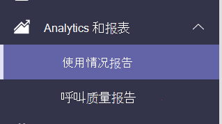

# Microsoft Teams应用使用情况报表

Teams管理中心中的"Microsoft Teams应用使用情况"报表提供有关用户在应用中使用哪些应用Teams。  

## 查看应用使用情况报表

1. 在管理中心的左侧导航栏中，单击 <https://admin.teams.microsoft.com> "分析"&**报告**  >  **"使用情况报告"。**  
2. 在"**查看报表"选项卡上的**"报表 **"下**，选择"**应用使用情况"。**

3. 在“**数据范围**”下，选择一个范围，然后单击“**运行报告**”。 可以查看Teams应用使用情况报告，了解过去 7、30 或 90 天的趋势。  

## 解释报告

:::image type="content" alt-text="屏幕截图：Teams管理中心内具有标注Teams应用使用情况报表。" source="media/app-usage-report5.png" lightbox="media/app-usage-report5.png":::

1. 每个报表左上角都有一个日期，显示报表的创建时间。 报告通常反映从打开应用起 24 小时的延迟。

2. 图表上的 Y 轴表示通过将鼠标悬停在图表上选择的日期的用户数被视为活动用户，因为 至少打开了一次应用。

3. 图表上的 X 轴是为报表选择的日期范围。

4. 将鼠标悬停在表示任何日期应用使用情况的点上，以查看该日期该应用的活动用户总数。

5. 若要选择其他应用，请在右上角单击"筛选器"图标，选择或键入新条件，然后单击"应用 **"。**

6. 报表底部的表按应用名称显示活动用户和团队。

   - **应用** 名称是显示名称应用的名称Teams。
   - **活动** 用户是指定时段内至少打开应用一次的用户数。
   - **应用类型** 是"Microsoft"或"第三方"的静态值。
   - **活动** 团队是团队中至少一个成员在指定的时段内打开应用的团队数。
   - **Publisher** 是应用的软件发布者。
   - **版本** 是应用的软件版本，来自应用发布者。

   > [!NOTE]
   > **仅针对****频道中使用的** 应用计算活动用户和活跃团队。

7. 若要添加或删除表中的列，请在右上角单击"编辑列"图标，在"编辑列"选项卡上，选择新条件，然后单击"应用 **"。**

8. 若要将报表导出到 CSV 文件进行脱机分析，请在右上角选择"导出到 **Excel"** 图标，然后在"下载"选项卡上的"状态"下，单击"下载 **"。**

   :::image type="content" alt-text=""下载"窗格的屏幕截图。" source="media/app-usage-report7.png" lightbox="media/app-usage-report7.png":::

9. 在报表视图中查看Excel，还会看到一个 **ID** 列，它表示应用 ID，通常是字母数字字符串。 如果 **ID** **\n**，这意味着用户要求删除其信息。

   

## 相关主题

- [Teams 分析和报告](teams-reporting-reference.md)
