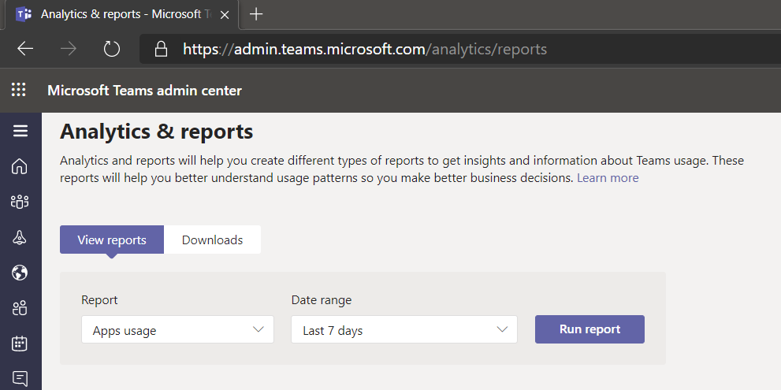
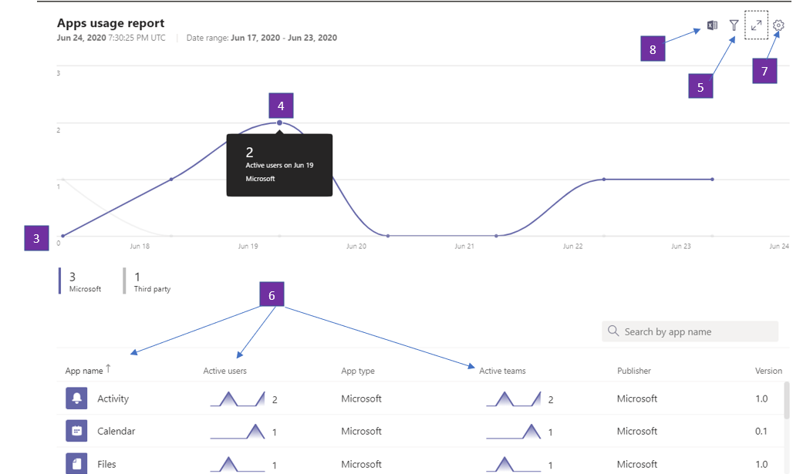

# Microsoft Teams应用使用情况报表

Teams管理中心中的"Microsoft Teams应用使用情况"报表提供有关用户在应用中使用哪些应用Teams。  

## 查看应用使用情况报表

1.  在管理中心的左侧导航栏中，单击" <https://admin.teams.microsoft.com> **分析**"& \> **报告"使用情况报告"。** 在"**查看报表"选项卡上的**"报表 **"下**，选择"**应用使用情况"。**

     :::image type="content" source="media/app-usage-report1.png" alt-text="使用情况报告菜单项的屏幕截图。":::

2.  在“**数据范围**”下，选择一个范围，然后单击“**运行报告**”。

      :::image type="content" source="media/app-usage-report2.png" alt-text="应用使用情况报表的屏幕截图。":::

## 解释报告

|标注 |说明  |
|--------|-------------|
|**1**   |可以查看Teams应用使用情况报告，了解过去 7、30 或 90 天的趋势。 |
|**2**   |每个报表都有一个生成报告的日期。 报告通常反映从打开应用起 24 小时的延迟。   |
|**3**    | <ul><li>图表上的 X 轴是特定报表的选定日期范围。</li><li>Y 轴表示在图表中悬停在给定日期的用户数，这些用户已打开应用至少一次，因此被视为活动用户，并累算鼠标悬停时看到的总用户数。</li></ul>|
|**4**   |将鼠标悬停在表示给定日期的应用使用情况的点上，以查看该给定日期该应用的活动用户总数的实例数。  |
|**5**   |将包含所有应用，但通过选择"筛选器"图标，可以使用其他筛选器。  |
|**6**   |下表按应用名称提供了活动用户和团队的细分。 <ul><li>**应用** 名称是显示名称应用的名称Teams。</li><li>**活动** 用户是指定时段内至少打开应用一次的用户数。</li><li>**应用类型** 是"Microsoft"或"第三方"的静态值。</li><li>**活动** 团队是团队中至少一个成员在指定的时段内打开应用的团队数。</li><li>**Publisher** 是应用的软件发布者。</li><li>**版本** 是应用的软件版本，来自应用发布者。</li></ul><b> 注意：</b> 目前，"活动用户"和"活动团队"仅针对频道中使用的应用计算。     

   | |**7**  |选择 **"编辑** 列"以添加或删除表中的列。    | |**8**  |可以将报表导出到 CSV 文件进行脱机分析。 单击 **"导出Excel"，** 然后在 **"下载"** 选项卡上单击"下载"，在报表准备就绪后下载报表。   | |**9** |在报表视图中查看Excel，还将看到一个 **ID** 列，它表示应用 ID。 团队 ID 通常是字母数字字符串。 如果 **Id** 列显示为 **\n****，这意味着用户请求删除其信息。   |

## 相关主题

- [Teams 分析和报告](teams-reporting-reference.md)