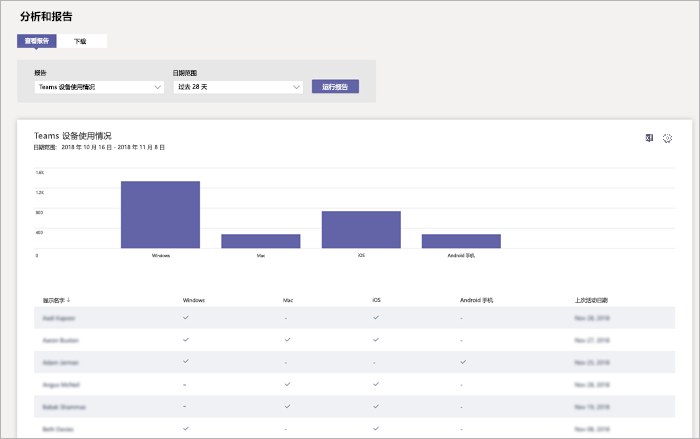

# Microsoft 团队设备使用情况报告

团队设备使用情况报告中的 Microsoft 团队业务管理中心的 Skype 为您提供了有关如何将用户连接到团队的信息。 您可以使用报表以在整个组织，包括多少从其移动设备时转上使用团队中查看使用的设备。  

## 查看报告

1. 转到 Microsoft 团队业务管理中心的左侧导航中的 Skype 中，单击**分析和报告**、，然后在**报告**下选择**团队设备用法**。 
2. 在**日期范围**选择区域，，然后单击**运行报告**。 

## 解释报表

|标号 |说明  |
|--------|-------------|
|**1**   |可以随最近 7 天或 28 天趋势查看团队设备使用率报告。  |
|**2**   |每个报告具有报告生成的时间的日期。 报表通常反映活动时间的 24 至 48 小时延迟。 |
|**3**   |<ul><li>图表上的 X 轴表示用于连接到团队的不同设备 (**Windows**、 **Mac**， **iOS**， **android 移动电话**)。 </li><li>Y 轴是选定的时间段内使用的设备的用户数。</li> </ul>将鼠标悬停在栏表示设备，以查看使用设备连接到团队的用户数。|
|**4**   |表为您提供了设备使用用户细分。 <ul><li>**显示名称**是用户的显示名称。 您可以单击转到用户的设置页中的 Microsoft 团队业务管理中心的 Skype 的显示名称。 </li><li>**Windows**处于选中状态，如果用户的基于 Windows 的计算机上的团队桌面客户端中处于活动状态。</li><li>如果用户已 macOS 计算机上的团队桌面客户端中处于活动状态，则选中**Mac** 。 </li> <li>**iOS**处于选中状态，如果用户处于活动状态的 iOS 团队移动客户端上。</li><li>如果用户上处于活动状态团队移动客户端的 Android， **android 移动电话**处于选中状态。 <li>**最后一次活动**是用户参与团队活动的最后一个日期 (UTC)。</li> </ul> 若要查看表中所需的信息，请确保将列添加到表。 |
|**5**   |选择**编辑列**添加或删除表中的列。 |
|**6**   |选择**˙˙˙**，然后**打印图表**打印图表。 |

## 相关主题
- [团队分析和报告](teams-reporting-reference.md)
- [团队使用情况报告](teams-usage-report.md)
- [团队用户活动报告](user-activity-report.md)