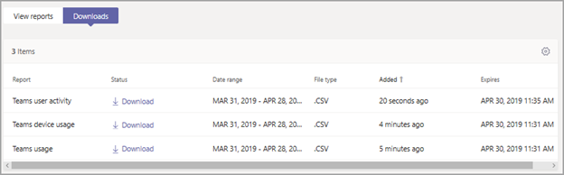

# Microsoft Teams 设备使用情况报告Microsoft Teams device usage report

Microsoft 团队管理中心中的 "团队设备使用情况" 报表为你提供有关用户如何连接到团队的信息。The Teams device usage report in the Microsoft Teams admin center provides you with information about how users connect to Teams. 你可以使用报表查看你的组织中使用的设备，包括在旅途中使用的多个团队使用的移动设备。You can use the report to see the devices that are used across your organization, including how many use Teams from their mobile devices when on-the-go.  

## 查看报告View the report

1. 在 Microsoft 团队管理中心的左侧导航中，单击 "**分析" & 报告** > **使用情况报告**。In the left navigation of the Microsoft Teams admin center, click **Analytics & reports** > **Usage reports**. 在 "**查看报表**" 选项卡上的 "**报表**" 下，选择 "**团队设备使用情况**"。On the **View reports** tab, under **Report**, select **Teams device usage**.
2. 在“**数据范围**”下，选择一个范围，然后单击“**运行报告**”。Under **Date range**, select a range, and then click **Run report**.

    团队![管理员中心中使用标注的团队设备使用情况报告的屏幕截图]团队(../media/teams-reports-device-usage-with-callouts.png "管理员中心中使用标注的团队设备使用情况报告的屏幕截图")

## 解释报告Interpret the report

|标注Callout |说明Description  |
|--------|-------------|
|**1****1**   |可以查看 "团队设备使用情况" 报表，了解过去7天或28天的趋势。The Teams device usage report can be viewed for trends over the last 7 days or 28 days.  |
|**2****2**   |每个报表都具有生成报表的日期。Each report has a date for when the report was generated. 报表通常反映活动时间的 24 至 48 小时延迟。The reports usually reflect a 24 to 48 hour latency from time of activity. |
|**3****3**   |<ul><li>图表上的 X 轴表示用于连接到团队的不同设备（**Windows**、 **Mac**、 **iOS**、 **Android 手机**）。The X axis on the chart represents the different devices (**Windows**, **Mac**, **iOS**, **Android Phone**) used to connect to Teams. </li><li>Y 轴是在选定时间段内使用设备的用户数。The Y axis is the number of users using the device over the selected time period.</li> </ul>将鼠标悬停在表示设备的栏上，可查看使用设备连接到团队的用户数。Hover over the bar representing a device to see the number of users using the device to connect to Teams.|
|**4****4**   |此表提供了用户的设备使用情况的细目。The table gives you a breakdown of device usage by user. <ul><li>"**显示名称**" 是用户的显示名称。**Display name** is the display name of the user. 你可以单击 "显示名称" 以转到 Microsoft 团队管理中心中的用户设置页面。You can click the display name to go to the user's setting page in the Microsoft Teams admin center. </li><li>如果用户在基于 Windows 的计算机上的团队桌面客户端中处于活动状态，则选择 " **Windows** "。**Windows** is selected if the user was active in the Teams desktop client on a Windows-based computer.</li><li>如果用户在 macOS 计算机上的团队桌面客户端中处于活动状态，则会选择**Mac** 。**Mac** is selected if the user was active in the Teams desktop client on a macOS computer. </li> <li>如果用户在 iOS 的团队移动客户端上处于活动状态，则选择**ios** 。**iOS** is selected if the user was active on the Teams mobile client for iOS.</li><li>如果用户在 Android 的团队移动客户端上处于活动状态，则选择 " **Android 手机**"。**Android phone** is selected if the user was active on the Teams mobile client for Android. <li>"**上次活动**" 是用户参与团队活动的最后日期（UTC）。**Last activity** is the last date (UTC) that the user participated in a Teams activity.</li> </ul> 请注意，如果用户帐户在 Azure AD 中不再存在，则用户名在表中显示为 "-"。Note that if a user account no longer exists in Azure AD, the user name is displayed as "--" in the table.   要查看希望在表格中显示的信息，请确保向表格添加了相关列。To see the information that you want in the table, make sure to add the columns to the table. |
|**5****5**   |选择“**编辑列**”可在表格中添加或删除列。Select **Edit columns** to add or remove columns in the table. |
|**6****6**   |你可以将报表导出到 CSV 文件，以便脱机分析。You can export the report to a CSV file for offline analysis. 单击 "**导出到 Excel**"，然后在 "**下载**" 选项卡上，单击 "**下载**" 以在准备就绪后下载报告。Click **Export to Excel**, and then on the **Downloads** tab, click **Download** to download the report when it's ready.  |

## 相关主题Related topics

- [Teams 分析和报告Teams analytics and reporting](teams-reporting-reference.md)