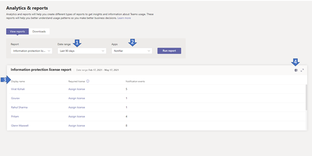

# Microsoft Teams信息保护许可证报告

通过 Teams 信息保护许可证报告，可以深入了解订阅更改通知事件以侦听在租户级别 (（即 /teams/getAllMessage 或 /chats/getAllMessages) ）创建、更新或删除的消息的应用。 只有在用户具有所需的许可证时，才成功发送与消息 [对应的更改通知](/graph/teams-licenses)。  可以看到给定用户触发了多少个更改通知。

## 查看信息保护许可证报告

必须是 Teams 服务管理员才能管理这些策略。 请参阅 [Teams 管理员角色管理 Teams](../using-admin-roles.md) ，了解管理员角色和权限。

1. 在管理中心的左侧导航Microsoft Teams，选择 **"分析"&报告**  >  **"使用情况报告"。** 在"**查看报表"选项卡上的**"报表 **"下**，选择"**信息保护许可证"。**
2. 在 **"日期范围"** 下，选择一个范围。
3. 在 **"应用**"下，选择一个应用，然后选择"**运行报表"。**

    

## 解释报告

|标注 |说明  |
|--------|-------------|
|**1**   |可以查看信息保护许可证报告，了解过去 7 天、30 天或 90 天的趋势。 |
|**2**   |应用名称将显示过去 n 天内已订阅更改消息通知事件的所有应用的列表，如日期范围内所选。 |
|**3**   |下表提供了所选应用的每个用户使用情况的细分。<ul><li>**显示** 名称显示名称用户的名称。 选择显示名称，转到用户管理中心中用户Microsoft Teams页面。</li><li>**如果用户具有** 此处 [] 中定义的所需许可证之一，则 (许可证) https://docs.microsoft.com/en-us/graph/teams-licenses 为 yes。 如果用户没有所需的许可证，则会显示"分配许可证"链接，该链接导航到 Microsoft 管理中心中的用户的许可证详细信息页 ("用户活动用户">选择用户名  >  ) 。</li><li>**"许可证保护的事件** "是针对该用户创建、更新或删除的消息发送到应用的唯一更改通知事件数。</li></ul> |
|**4**   |将报表导出到 CSV 文件进行脱机分析。 选择 **"导出Excel"，** 然后选择"**下载"** 选项卡。选择 **"** 下载"，在报表准备就绪后下载报表。 |
|**5**   |将报表导出到 CSV 文件进行脱机分析。 选择 **"导出Excel"，** 然后选择"**下载"** 选项卡。选择 **"** 下载"，在报表准备就绪后下载报表。 查看报表时Excel，还会看到 **"ID"** 和"电子邮件"列，表示用户的用户 ID 和电子邮件地址。 |

## 使用户特定的数据匿名

若要使用户活动Teams数据匿名，你必须是全局管理员。 这会在报表及其导出显示名称隐藏可识别信息，例如电子邮件、电子邮件和 Azure AD ID。

1. 在Microsoft 365 管理中心，转到 \> **"设置"设置"，在**"服务"选项卡下，选择"报表 **"。** 
    
2. 选择 **"报告**"，然后选择"**显示匿名标识符"。** 此设置同时应用于管理中心Microsoft 365 管理中心使用情况Teams报表。
  
3. 选择"**保存更改"。**
