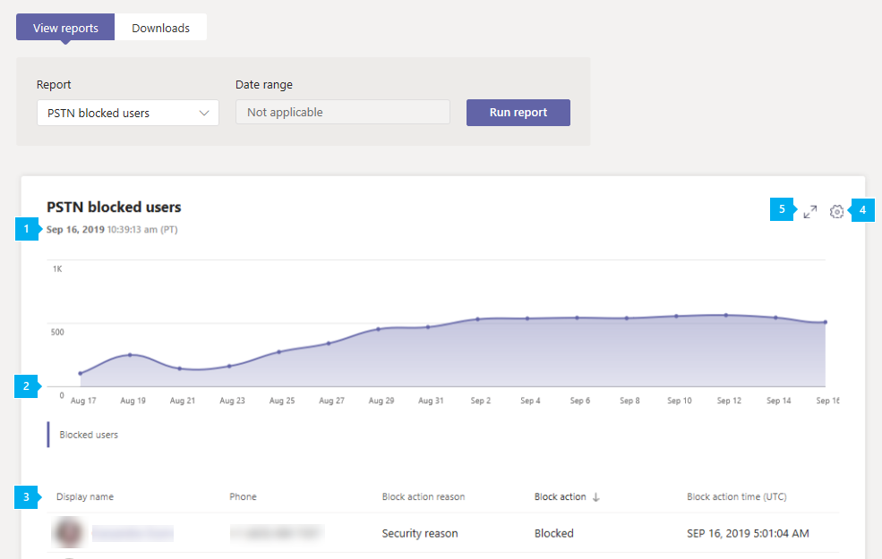

# Microsoft Teams PSTN 阻止的用户报告Microsoft Teams PSTN blocked users report

Microsoft Teams 管理中心中的 PSTN 被阻止用户报告显示组织中被阻止在 Teams 中拨打 PSTN 呼叫的用户。The PSTN blocked users report in the Microsoft Teams admin center shows you the users in your organization who are blocked from making PSTN calls in Teams. 您可以查看有关每个被阻止用户（包括其分配的电话号码）以及阻止他们进行呼叫的原因的信息。You can view more information about each blocked user, including their assigned phone number and the reason they were blocked from making calls.

## 查看 PSTN 阻止的用户报告View the PSTN blocked users report

在 Microsoft Teams 管理中心的左侧导航栏中，单击 **"分析&报告**  >  **使用情况报告**。In the left navigation of the Microsoft Teams admin center, click **Analytics & reports** > **Usage reports**. 在"**查看报告"** 选项卡上的 **"报告"** 下，选择 **"PSTN 阻止** 的用户"，然后单击"运行 **报告"。**On the **View reports** tab, under **Report**, select **PSTN blocked users**, and then click **Run report**.

## 解释报告Interpret the report

|标注Callout |说明Description  |
|--------|-------------|
|**1****1**   |每个报表都有一个生成日期。Each report has a date for when it was generated. 报表通常反映活动时间的 24 至 48 小时延迟。The reports usually reflect a 24 to 48 hour latency from time of activity. |
|**2****2**   |X 轴是日期。The X axis is the date. Y 轴表示用户数。The Y axis is the number of users.  将鼠标悬停在给定日期上的点上以查看该日期被阻止的用户数。Hover over the dot on a given date to see the number of users blocked on that date. |
|**3****3**   |下表提供了阻止进行 PSTN 呼叫的所有用户的细分。The table gives a breakdown of all users who are blocked from making PSTN calls.  它显示分配有电话系统或音频会议的所有用户，并为你提供有关每个用户的信息。It shows all users who have Phone System or Audio Conferencing assigned and gives you more information about each user. <ul><li>**显示** 名称显示名称用户的名称。**Display name** is the display name of the user. 可以单击显示名称转到 Microsoft Teams 管理中心中的用户设置页面。You can click the display name to go to the user's setting page in the Microsoft Teams admin center. </li> <li>**电话** 是分配给用户的号码。**Phone** is the number that's assigned to the user.</li> <li>**被阻止** 的原因是阻止用户进行调用的原因。**Blocked reason** is the reason the user is blocked from making calls.</li><li>**阻止的操作**  会告知用户被阻止还是被阻止在 Teams 中拨打 PSTN 呼叫。**Blocked action**  tells you whether the user is blocked or unblocked from making PSTN calls in Teams.</li> <li>**阻止时间** 是用户被 (UTC) 的日期和时间。**Blocked time** is the date and time (UTC) that the user was blocked from making calls.</li></li> </ul>要查看希望在表格中显示的信息，请确保向表格添加了相关列。To see the information that you want in the table, make sure to add the columns to the table. |
|**4****4**   |选择“**编辑列**”可在表格中添加或删除列。Select **Edit columns** to add or remove columns in the table.|
|**5****5**   |选择 **"全屏** "以全屏模式查看报表。Select **Full screen** to view the report in full screen mode.|

## 相关主题Related topics

- [Teams 分析和报告Teams analytics and reporting](teams-reporting-reference.md)