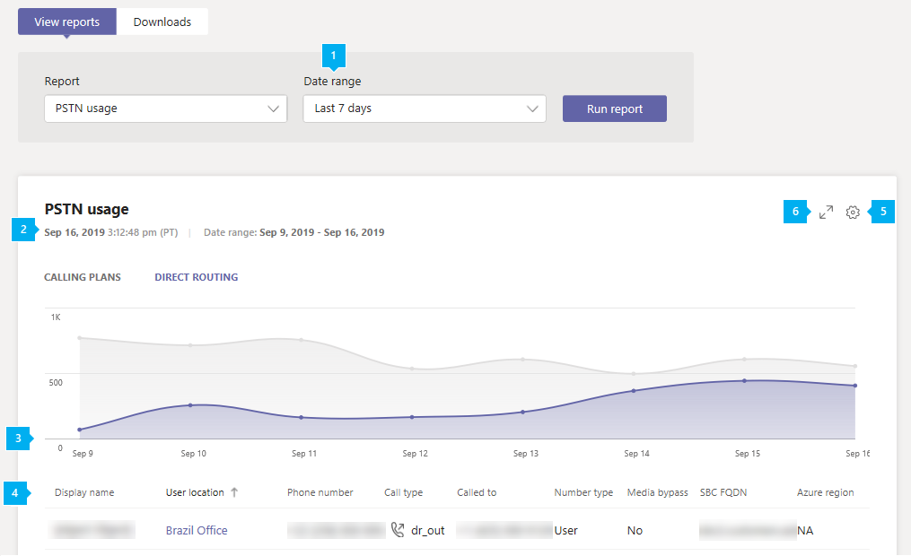

# Microsoft 团队 PSTN 使用报告Microsoft Teams PSTN usage report

Microsoft 团队管理中心中的 "团队 PSTN 使用情况" 报表概括介绍了您的组织中的通话和音频会议活动。The Teams PSTN usage report in the Microsoft Teams admin center gives you an overview of calling and audio conferencing activity in your organization. 如果您使用的是电话运营商，则可以查看呼叫计划的详细呼叫活动，以及使用自己的电话运营商时的直接路由。You can view detailed calling activity for Calling Plans if you use Microsoft as your telephony carrier and for Direct Routing if you use your own telephony carrier.

"**呼叫计划**" 选项卡显示信息，包括用户在入站和出站 PSTN 呼叫中花费的分钟数以及这些呼叫的开销。The **Calling Plans** tab shows information including the number of minutes that users spent in inbound and outbound PSTN calls and the cost of these calls. **直接路由**选项卡显示您的信息，包括 SIP 地址和通话开始和结束时间。The **Direct Routing** tab shows you information including the SIP address and call start and end times. 使用此报告中的信息可深入了解你的组织中的 PSTN 使用情况，并帮助你调查、规划和制定业务决策。Use the information in this report to gain insight into PSTN usage in your organization and help you to investigate, plan, and make business decisions.

## 查看报告View the report

1. 在 Microsoft 团队管理中心的左侧导航中，单击 "**分析" & 报告** > **使用情况报告**。In the left navigation of the Microsoft Teams admin center, click **Analytics & reports** > **Usage reports**. 在 "**查看报表**" 选项卡上的 "**报表**" 下，选择 " **PSTN 使用情况报告**"。On the **View reports** tab, under **Report**, select **PSTN usage report**.
2. 在 "**日期范围**" 下，选择7天或28天的预定义范围，或设置自定义范围，然后选择 "**运行报表**"。Under **Date range**, select a predefined range of 7 or 28 days, or set a custom range, and then select **Run report**.

## 解释报告Interpret the report

### 通话套餐Calling Plans

|标注Callout |说明Description  |
|--------|-------------|
|**1****1**   |可查看最近7天、28天或您设置的自定义日期范围内的趋势的报表The report can be viewed for trends over the last 7 days, 28 days, or a custom date range that you set |
|**2****2**   |每个报表都有一个生成日期的日期。Each report has a date for when it was generated. 报表通常反映活动时间的 24 至 48 小时延迟。The reports usually reflect a 24 to 48 hour latency from time of activity. |
|**3****3**   |X 轴表示特定报表的选定日期范围。The X axis is the selected date range for the specific report. Y 轴是选定时间段内的调用总数。The Y axis is the total number of calls over the selected time period.  将鼠标悬停在给定日期的点上可查看该日期的总通话。Hover over the dot on a given date to see the total calls on that date.  |
|**4****4**   |该表为您提供了每次通话的 PSTN 使用情况的细目。The table gives you a breakdown of PSTN usage per call. <ul><li>**时间戳（UTC）** 是呼叫开始的时间。**Time stamp (UTC)** is the time the call started.</li><li>"**显示名称**" 是用户的显示名称。**Display name** is the display name of the user. 你可以单击 "显示名称" 以转到 Microsoft 团队管理中心中的用户设置页面。You can click the display name to go to the user's setting page in the Microsoft Teams admin center.</li><li>**用户名**是用户的登录名。**Username** is the user's sign in name.</li><li>"**电话号码**" 是为拨入电话接收呼叫的号码，或者是为拨出电话拨出的号码。**Phone number** is the number that received the call for inbound calls or the number dialed for outbound calls.</li><li>**呼叫类型**指示呼叫是 PSTN 出站通话还是入站呼叫以及呼叫类型，例如由用户或音频会议发出的呼叫。**Call type** is whether the call was a PSTN outbound or inbound call and the type of call such as a call placed by a user or an audio conference. 您可能看到的通话类型包括：The calls types you may see include:  **团队用户呼叫类型****Teams user call types**<ul><li>**user_in** -用户收到了入站 PSTN 呼叫。**user_in** - the user received an inbound PSTN call.</li><li>**user_out** -用户发出了出站 PSTN 呼叫**user_out** - the user placed an outbound PSTN call</li><li>**user_out_conf** -用户向呼叫添加了两个或多个 PSTN 参与者，例如三向电话会议**user_out_conf** - the user added two or more PSTN participants to the call such as a three-way conference call</li><li>**user_out_transfer** -用户已将呼叫转移到 PSTN 号码**user_out_transfer** - the user transferred the call to a PSTN number</li><li>**user_out_forwarding** -用户将呼叫转移到 PSTN 号码**user_out_forwarding** - the user forwarded the call to a PSTN number</li><li>**conf_in** -到音频会议桥的入站呼叫**conf_in** - an inbound call to the Audio Conferencing bridge</li><li>**conf_out** -来自音频会议桥的出站呼叫通常是向会议添加 PSTN 号码**conf_out** - an outbound call from the Audio Conferencing bridge usually to add a PSTN number to the conference</li></ul> **团队机器人呼叫类型****Teams bots call types**<ul><li>**ucap_in** -到团队机器人（如自动助理或呼叫队列）的入站 PSTN 呼叫**ucap_in** - an inbound PSTN call to Teams bot such as auto attendant or call queue</li><li>**ucap_out** -来自团队机器人（如自动助理或呼叫队列）的出站 PSTN 呼叫**ucap_out** - an outbound PSTN call from a Teams bot such as auto attendant or call queue</li></ul> <li>拨**叫的**号码。**Called to** is the number dialed.</li><li>"**国家或地区**" 是已拨打的国家或地区。**To country or region** is the country or region dialed.</li><li>"**来源**" 表示发出呼叫的号码。**Called from** is the number that placed the call.</li><li>**从 "国家或地区**" 是呼叫所在的国家或地区。**From country or region** is the country or region from where the call was placed.</li><li>"**费用**" 表示为您的帐户收取的通话金额或通话费用。**Charge** is the amount of money or cost of the call that's charged to your account. </li><li>**货币**是用于计算通话费用的货币类型。**Currency** is the type of currency used to calculate the cost of the call. </li><li>" **持续时间**"是接听呼叫的时间。**Duration** is how long the call was connected.</li><li>**国内/国际**根据用户的位置告诉你呼叫是国内（在国家或地区）还是国际（位于国家或地区外）。**Domestic/International** tells you whether the call was domestic (within a country or region) or international (outside a country or region) based on the user's location.</li><li>通话**id**是呼叫的呼叫 id。**Call ID** is the call ID for a call. 它是呼叫 Microsoft 支持时可以使用的呼叫的唯一标识符。It's a unique identifier for the call you can use when calling Microsoft Support.</li><li>"**号码类型**" 是用户的电话号码类型，例如免费号码的服务。**Number type** is the user's phone number type, such as a service of toll-free number. </li><li>**国家或地区**是使用位置。**Country or region** is the usage location. </li> <li>"**会议 id** " 是音频会议的会议 id。**Conference ID** is the conference ID of the audio conference. </li><li>**功能**是用于通话的许可证。**Capability** is the license used for the call. 您可能看到的许可证类型包括：The license types you may see include:<ul><li>**MCOPSTNPP** -通讯信用点数**MCOPSTNPP** - Communications Credits</li><li>**MCOPSTN1** -国内通话计划（3000，美国/1200 最少欧盟计划）**MCOPSTN1** - Domestic Calling Plan (3000 min US / 1200 min EU plans)</li><li>**MCOPSTN2** -国际通话计划**MCOPSTN2** - International Calling Plan</li><li>**MCOPSTN5** -国内通话计划（120分钟通话计划）**MCOPSTN5** - Domestic Calling Plan (120 min calling plan)</li><li>**MCOPSTN6** -国内通话计划（240分钟通话计划）**MCOPSTN6** - Domestic Calling Plan (240 min calling plan)</li><li>**MCOMEETADD** -音频会议**MCOMEETADD** - Audio Conferencing</li><li>**MCOMEETACPEA** -每分钟支付的音频会议**MCOMEETACPEA** - Pay Per Minute Audio Conferencing</li></ul></li></ul> 要查看希望在表格中显示的信息，请确保向表格添加了相关列。To see the information that you want in the table, make sure to add the columns to the table.|
|**5****5**   |选择“**编辑列**”可在表格中添加或删除列。Select **Edit columns** to add or remove columns in the table. |
|**6****6**   |选择 "**筛选**" 以按用户名或呼叫类型筛选报告Select **Filter** to filter the report by username or call type |
|**7****7**   |选择 "**全屏**" 以全屏模式查看报表。Select **Full screen** to view the report in full screen mode. |
|**个****8**   |你可以将报表导出到 CSV 文件，以便脱机分析。You can export the report to a CSV file for offline analysis. 单击 "**导出到 Excel**"，然后在 "**下载**" 选项卡上，单击 "**下载**" 以在准备就绪后下载报告。Click **Export to Excel**, and then on the **Downloads** tab, click **Download** to download the report when it's ready.|

### 直接路由Direct Routing

|标注Callout |说明Description  |
|--------|-------------|
|**1****1**   |可查看过去7天或28天的趋势的报告。The report can be viewed for trends over the last 7 days or 28 days. |
|**2****2**   |每个报表都有一个生成日期的日期。Each report has a date for when it was generated. 报表通常反映活动时间的 24 至 48 小时延迟。The reports usually reflect a 24 to 48 hour latency from time of activity. |
|**3****3**   |X 轴表示特定报表的选定日期范围。The X axis is the selected date range for the specific report. Y 轴是选定时间段内的调用总数。The Y axis is the total number of calls over the selected time period. 将鼠标悬停在给定日期的点上可查看该日期的总通话。Hover over the dot on a given date to see the total calls on that date.  |
|**4****4**   |该表为您提供了每次通话的 PSTN 使用情况的细目。The table gives you a breakdown of PSTN usage per call. <ul><li>**时间戳（UTC）** 是呼叫开始的时间。**Time stamp (UTC)** is the time the call started.</li><li>"**显示名称**" 是用户的显示名称。**Display name** is the display name of the user. 你可以单击 "显示名称" 以转到 Microsoft 团队管理中心中的用户设置页面。You can click the display name to go to the user's setting page in the Microsoft Teams admin center.</li><li>**Sip 地址**是接收或进行呼叫的用户的 sip 地址。**SIP address** is the SIP address of the user who received or made the call.</li><li>**电话号码**是发出呼叫的用户的号码。**Phone number** is the number of the user who made the call. </li><li>**呼叫类型**指示呼叫是 PSTN 出站通话还是入站呼叫以及呼叫类型，例如由用户或音频会议发出的呼叫。**Call type** is whether the call was a PSTN outbound or inbound call and the type of call such as a call placed by a user or an audio conference. 您可能看到的通话类型包括：The calls types you may see include:  **团队用户呼叫类型****Teams user call types**<ul><li>**dr_in** -用户收到了入站 PSTN 呼叫**dr_in** - the user received an inbound PSTN call</li><li>**dr_out** -用户发出了出站 PSTN 呼叫**dr_out** - the user placed an outbound PSTN call</li><li>**dr_out_user_conf** -用户向呼叫添加了 PSTN 参与者**dr_out_user_conf** - the user added a PSTN participant to the call</li><li>**user_out_transfer** -用户已将呼叫转移到 PSTN 号码**user_out_transfer** - the user transferred the call to a PSTN number</li><li>**dr_out_user_forwarding** -用户将呼叫转移到 PSTN 号码**dr_out_user_forwarding** - the user forwarded the call to a PSTN number</li><li>**dr_out_user_transfer** -用户已将呼叫转移到 PSTN 号码**dr_out_user_transfer** - the user transferred the call to a PSTN number</li><li>**dr_emergency_out** -用户拨打紧急电话**dr_emergency_out** - the user makes an emergency call</li></ul> **团队机器人呼叫类型****Teams bots call types**<ul><li>**dr_in_ucap** -到团队机器人（如自动助理或呼叫队列）的入站 PSTN 呼叫**dr_in_ucap** - an inbound PSTN call to a Teams bot such as auto attendant or call queue</li><li>**dr_out_ucap** -来自团队机器人（如自动助理或呼叫队列）的出站 PSTN 呼叫**dr_out_ucap** - an outbound PSTN call from a Teams bot such as auto attendant or call queue</li></ul> <li>**被叫**方指接收呼叫的用户的号码。**Called to** is the number of the user who received the call.</li><li>"**开始时间（UTC）** " 是呼叫连接的时间。**Start time (UTC)** is the time the call connected.</li><li>**邀请时间（UTC）** 是启动呼叫的时间。**Invite time (UTC)** is the time when the call was initiated.</li><li>**失败时间（UTC）** 是呼叫失败的时间。**Failure time (UTC)** is the time the call failed. （仅限失败的通话。）(For failed calls only.)</li><li>**结束时间（UTC）** 是通话结束的时间。**End time (UTC)** is the time the call ended. （仅限成功通话。）(For successful calls only.)</li><li>" **持续时间**"是接听呼叫的时间。**Duration** is how long the call was connected.</li><li>"**号码类型**" 是用户的电话号码类型，例如免费号码的服务。**Number type** is the user's phone number type, such as a service of toll-free number. </li><li>**媒体绕过**指示是否已为媒体旁路启用了主干**Media bypass** indicates whether the trunk was enabled for media bypass </li> <li>**SBC FQDN**是会话边界控制器（SBC）的完全限定的域名（FQDN）。**SBC FQDN** is the fully qualified domain name (FQDN) of the Session Border Controller (SBC). </li><li>**Azure 区域**是用于发送信号的数据中心。**Azure region** is the datacenter used for signaling.</li><li>**事件类型**是通话的事件类型。**Event type** is the event type for the call. 您将看到成功的通话成功，并且尝试进行失败的通话。You'll see Success for successful calls and Attempt for failed calls. </li><li>**最终 SIP 代码**是通话结束的代码。**Final SIP code** is the code with which the call ended.</li><li>**最终 Microsoft 子代码**是指示发生的特定操作的代码。**Final Microsoft subcode** is a code that indicates specific actions that occurred.</li><li>**最终 sip 短语**是 sip 代码和 Microsoft 子代码的说明。**Final SIP phrase** is the description of the SIP code and Microsoft subcode.</li><li>**COORELATION ID**是呼叫的唯一标识符，可在呼叫 Microsoft 支持时使用。**Coorelation ID** is a unique identifier for the call that you can use when calling Microsoft Support.</li></ul> 要查看希望在表格中显示的信息，请确保向表格添加了相关列。To see the information that you want in the table, make sure to add the columns to the table.|
|**5****5**   |选择“**编辑列**”可在表格中添加或删除列。Select **Edit columns** to add or remove columns in the table. |
|**6****6**   |选择 "**全屏**" 以全屏模式查看报表。Select **Full screen** to view the report in full screen mode. |

## 相关主题Related topics

- [Teams 分析和报告Teams analytics and reporting](teams-reporting-reference.md)