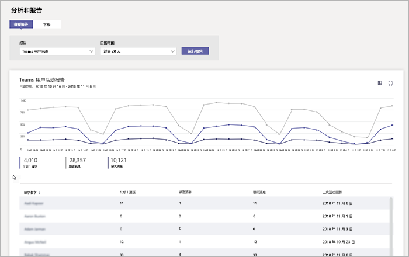

# Microsoft Teams 用户活动报告Microsoft Teams user activity report

团队用户活动报告提供深入的组织中的用户执行团队中的活动的类型。The Teams user activity report gives you insight into the types of activities that users in your organization perform in Teams. 例如，您可以看到多少用户进行通信 1 对 1 呼叫通过、 多少用户进行通信通道邮件通过和多少用户参与专用聊天消息。For example, you can see how many users communicate through 1:1 calls, how many users communicate through channel messages, and how many users engage in private chat messages.

## 查看报告View the report

1. 转到 Microsoft 团队管理中心中，在左侧导航窗格中，单击**分析 & 报告**，，然后在**报告**下选择**工作组用户活动**。Go to the Microsoft Teams admin center, in the left navigation, click **Analytics & reports**, and then under **Report**, select **Teams user activity**. 
2. 在“**数据范围**”下，选择一个范围，然后单击“**运行报告**”。Under **Date range**, select a range, and then click **Run report**. 

## 解释报告Interpret the report

|标注Callout |说明Description  |
|--------|-------------|
|**1****1**   |可以随最近 7 天或 28 天趋势查看团队用户活动报告。The Teams user activity report can be viewed for trends over the last 7 days or 28 days. |
|**2****2**   |每个报表包含此报表的生成日期。报表通常反映活动时间的 24 至 48 小时延迟。Each report has a date for when this report was generated. The reports usually reflect a 24 to 48 hour latency from time of activity. |
|**3****3**   |<ul><li>图表上的 X 轴是特定报告的所选的日期范围。The X axis on the charts is the selected date range for the specific report. </li><li>Y 轴的参与活动用户数量。The Y axis is the number of users participating in the activity.</li></ul>悬停在给定日期的给定日期查看该活动的实例数目代表活动的点。Hover over the dot representing an activity on a given date to see the number of instances of that activity on that given date. |
|**4****4**   |可单击图例上的项目筛选要在图表上查看的内容。You can filter what you see on the chart by clicking an item in the legend. 例如，单击**呼叫 1:1**、**通道消息**或**聊天消息**以查看仅与每个相关的信息。For example, click **1:1 calls**, **Channel messages**, or **Chat messages** to see only the info related to each one. 更改所选内容不会更改表中的信息。Changing the selection doesn’t change the information in the table. |
|**5****5**   |表为您提供了使用用户细分。The table gives you a breakdown of usage by user.   <ul><li>**显示名称**是用户的显示名称。**Display name** is the display name of the user. 您可以单击转到 Microsoft 团队管理中心中的用户的设置页的显示名称。You can click the display name to go to the user's setting page in the Microsoft Teams admin center.</li><li>**1:1 呼叫**是用户所参与的 1 对 1 呼叫数在指定的时间段。**1:1 calls** is the number of 1:1 calls that the user participated in during the specified time period.</li><li>**通道消息**是唯一的用户发布的消息数团队聊天在指定的时间段中。**Channel messages** is the number of unique messages that the user posted in a team chat during the specified time period.</li> <li>**聊天消息**是唯一的用户发布在专用聊天指定的时间段内的消息数。**Chat messages** is the number of unique messages that the user posted in a private chat during the specified time period.</li>  <li>**最后一次活动**是用户参与团队活动的最后一个日期 (UTC)。**Last activity** is the last date (UTC) that the user participated in a Teams activity.</li> </ul>要查看希望在表格中显示的信息，请确保向表格添加了相关列。To see the information that you want in the table, make sure to add the columns to the table.
|**6****6**   |选择“**编辑列**”可在表格中添加或删除列。Select **Edit columns** to add or remove columns in the table. |
|**7****7**   |选择“**˙˙˙**”，然后选择“**打印图表**”可打印图表。Select **˙˙˙**, and then **Print chart** to print the chart. |

## 相关主题Related topics
- [Teams 分析和报告Teams analytics and reporting](teams-reporting-reference.md)
- [Teams 使用情况报告Teams usage report](teams-usage-report.md)
- [Teams 设备使用报告Teams device usage report](device-usage-report.md)