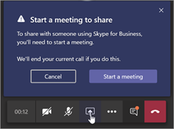

# 了解 Microsoft 团队和 Skype for business 共存和互操作性Understand Microsoft Teams and Skype for Business coexistence and interoperability

本文是你的升级过程的项目定义阶段的一部分，在你创建赞助联盟和项目团队并为你的项目定义范围、目标和构想之后，你完成了一个活动。This article is part of the Project Definition stage of your upgrade journey, an activity you complete after you create a sponsorship coalition and project team and define the scope, goals, and vision for your project. 继续之前，请确认你已完成以下活动：Before proceeding, confirm that you've completed the following activities:

- [已登记项目利益干系人Enlisted your project stakeholders](upgrade-enlist-stakeholders.md)
- [已定义项目范围Defined your project scope](https://aka.ms/SkypetoTeams-Scope)

如果您的组织目前使用 Skype for Business，并且您开始使用多个团队和 Skype for business，或者您开始升级到团队，那么了解这两个应用程序是如何共存、何时以及如何进行互操作，以及如何管理用户的迁移一直到最终从 Skype for Business 升级到团队。If your organization uses Skype for Business today and you are starting to use Teams alongside Skype for Business—or you are starting to upgrade to Teams—it's important to understand how the two applications coexist, when and how they interoperate, and how to manage users' migration all the way to their eventual upgrade from Skype for Business to Teams.

> [!Tip]
> 观看以下会话以了解[共存和互操作性](https://aka.ms/teams-upgrade-coexistence-interop)。Watch the following session to learn about [Coexistence and Interoperability](https://aka.ms/teams-upgrade-coexistence-interop).
>
> 此外，您可以加入我们的实时交互式研讨会，我们将分享指南、最佳做法和资源，以便开始开始升级规划和实施。Additionally, you can join us for live, interactive workshops in which we'll share guidance, best practices, and resources designed to kick start upgrade planning and implementation.
>
> 首先加入[升级](https://aka.ms/SkypeToTeamsPlanning)会话的计划以开始使用。Join the [Plan your upgrade](https://aka.ms/SkypeToTeamsPlanning) session first to get started.

## 团队和 Skype for business 的共存Coexistence of Teams and Skype for Business

除了协作功能之外，团队还提供聊天、通话和会议功能。In addition to collaboration capabilities, Teams delivers chat, calling, and meeting capabilities. 根据你选择的部署团队的方式，这些功能可能与特定用户的 Skype for Business 所提供的功能重叠。Depending on how you choose to deploy Teams, these capabilities may overlap with the capabilities delivered by Skype for Business for a given user. 默认模式是与 Skype for Business 一起运行具有这些功能重叠的团队;但是，可以为用户分配几种共存模式（也称为升级模式）之一，以确保这些功能不会与该用户重叠（在这种情况下，团队和 Skype for business 之间有互操作）。The default mode is to run Teams alongside Skype for Business with the capabilities overlap; however, a user can be assigned one of several coexistence modes (also known as upgrade modes) that were designed to ensure that these capabilities don't overlap for that user (in which case interoperability between Teams and Skype for Business is available). 例如，如果您有大量的 Skype for Business 服务器内部部署资源和复杂的企业语音部署，但希望您的用户尽可能快地体验新式会议，则您可能希望首先将[会议](meetings-first.md)作为备用路径进行评估。For example, if you have significant Skype for Business Server on-premises assets with a complex Enterprise Voice deployment but want your users to enjoy modern meetings as quickly as possible, you might want to evaluate [Meetings First](meetings-first.md) as an alternative path.

我们建议你查看以下共存模式，以帮助确定哪种路径适合你的组织。We recommend that you review the following coexistence modes to help determine which path is right for your organization.

> [!Important]
> 向用户提供新技术或对现有的、熟悉的 Skype for business 环境进行更改，同时为用户带来巨大的新业务好处。Introducing new technology or making changes to your existing, familiar Skype for Business environment, while delivering great new business benefits, can be disruptive for users. 在实施本文中所述的任何更改之前，请花一些时间来评估用户准备情况并实施通信和培训计划。Take time to assess user readiness and implement a communication and training plan before you implement any of the changes outlined in this article. 此外，我们强烈建议你先使用选定的一组用户试验你的计划，然后再在你的组织中实施。In addition, we strongly encourage you to pilot your plan with a selected group of users before implementing it across your organization.

### 孤岛模式Islands mode

默认情况下，用户可以将 Skype for Business 中的团队作为两个单独的解决方案一起运行，提供类似的和重叠的功能，如状态、聊天、通话和会议。By default, users can run Teams alongside Skype for Business as two separate solutions that deliver similar and overlapping capabilities such as presence, chat, calling, and meetings. 团队用户还可以利用新的协作功能，如团队和频道、访问 Office 365 中的文件和应用程序。Teams users also can take advantage of new collaboration capabilities such as teams and channels, access to files in Office 365, and applications.

在此共存模式（名为 "**岛**"）中，每个客户端应用程序都作为单独的岛运行。In this coexistence mode, called **Islands**, each of the client applications operates as a separate island. Skype for business 与 Skype for Business 交谈，团队与团队进行协作。Skype for Business talks to Skype for Business, and Teams talks to Teams. 用户应始终运行这两个客户端，并且可以在发起通信的客户端中以本机方式进行通信。Users are expected to run both clients at all times and can communicate natively in the client from which the communication was initiated. 因此，无需在**孤岛**模式下实现互操作。As such, there's no need for interoperability in **Islands** mode.

为避免令人困惑或 regressed 的 Skype for business 体验、外部（联合）通信、PSTN 语音服务和语音应用程序、Office 集成、USB 设备的 HID 控件以及其他一些集成将继续由 Skype for Business 处理，并且在以**孤岛**模式使用的团队中不可用。To avoid a confusing or regressed Skype for Business experience, external (federated) communications, PSTN voice services and voice applications, Office integration, HID controls for USB devices, and several other integrations continue to be handled by Skype for Business and are not available in Teams in **Islands** mode. 在**孤岛**模式下，团队不支持电话系统。在此模式下，唯一的企业语音客户端是 Skype for business。Phone System is not supported in Teams in **Islands** mode; in this mode, the only Enterprise Voice client is Skype for Business.

> [!Important]
> 在 "**孤岛**" 模式下，来自联盟用户（组织外部的人员）的所有消息和呼叫都将发送到 Skype for business。In **Islands** mode, all messages and calls from federated users (people outside your organization) are delivered to Skype for Business. 升级到 "**仅限团队**" 模式后，您的组织外部的所有消息和呼叫都将发送给团队。After upgrading to **Teams Only** mode, all messages and calls from outside your organization are delivered to Teams.

> [!Tip]
> Skype for Business Online 客户推荐的路径是从默认的**孤岛**模式开始，推动团队在组织中采用饱和，然后快速转到 "**仅团队**" 模式。Skype for Business Online customers recommended path is to start with the default **Islands** mode, drive Teams adoption saturation in the organization, and then move to **Teams Only** mode rapidly. 在本地和混合客户（尤其是复杂的客户）中，**使用团队协作模式将 Skype For business**部署为一个起点（而不是 "**岛**模式"），并通过**使用团队协作和会议**模式（即 "会议优先"）和 "**仅限团队**" 模式（在组织准备好使用团队时）将 skype for business 部署到 skype for business。On premises and hybrid customers, especially complex ones, might benefit from deploying the **Skype for Business with Teams Collaboration** mode as a starting point rather than **Islands** mode, and progress from there to **Skype for Business with Teams Collaboration and Meetings** mode (that is, Meetings First), if appropriate, and to **Teams Only** mode when the organization is ready to adopt Teams.

### 仅 Skype for BusinessSkype for Business only

在此共存模式下，用户将保留在 Skype for Business 中，而不是团队-用于聊天、会议和呼叫功能，并且不使用团队和频道团队。In this coexistence mode, users remain in Skype for Business—not Teams—for chat, meeting, and calling capabilities, and they don't use Teams for teams and channels. 目前可以使用此模式;但是，在当前实现中，团队和频道不会自动为用户关闭。This mode is available today; however, in the current implementation, teams and channels are not automatically turned off for the user. 可通过使用应用权限策略隐藏团队和频道来实现此目的。This can be achieved by using the App Permissions policy to hide teams and channels.

此模式可以在启动团队的托管部署之前使用，以防止用户开始使用已建立准备就绪的团队，或作为在适用于 Skype for business 用户的团队会议中启用身份验证参与的方法（前提是用户为团队授权。This mode can be used prior to starting a managed deployment of Teams to prevent users from starting to use Teams ahead of having built readiness, or as a way to enable authenticated participation in Teams meetings for Skype for Business users, provided the users are licensed for Teams.

### 仅限团队Teams Only

> [!IMPORTANT]
> 如果在将用户移动到“仅 Teams”\*\*\*\* 模式后卸载 Skype for Business 客户端，则在 Outlook 和其他 Office 应用程序中，状态将停止工作。If you uninstall the Skype for Business client after you move a user to **Teams Only** mode, presence stops working in Outlook and other Office apps. 状态在 Teams 中显示良好。Presence works fine in Teams. 解决方法：若要在 Outlook （以及其他 Office 应用）中查看状态，必须安装 Skype for business，即使你是在 "**仅团队**" 模式下运行团队也是如此。Workaround: To see presence in Outlook (and other Office apps), Skype for Business must be installed, even if you're running Teams in **Teams Only** mode. Microsoft 已发现此问题且正在开发修补程序。Microsoft is aware of this problem and is working on a fix.

**只有团队**用户（也称为已*升级*用户）可以访问团队中的所有功能。A **Teams Only** user (also called an *upgraded* user) has access to all the capabilities in Teams. 他们可以保留 Skype for Business 客户端，以便在已由非升级用户或外部团体组织的 Skype for business 上加入会议。They may retain the Skype for Business client to join meetings on Skype for Business that have been organized by non-upgraded users or external parties. 通过使用团队和 Skype for business 之间的互操作性功能（前提是这些 Skype for business 用户未处于**孤岛**模式），升级后的用户可以继续与仍在使用 Skype for business 的组织中的其他用户进行通信。An upgraded user can continue to communicate with other users in the organization who are still using Skype for Business by using the interoperability capabilities between Teams and Skype for Business (provided these Skype for Business users are not in **Islands** mode). 但是，升级后的用户无法启动 Skype for Business 聊天、通话或会议。However, an upgraded user can't initiate a Skype for Business chat, call, or meeting.

一旦你的组织准备好让部分或所有用户使用团队作为唯一的通信和协作工具，你可以将这些用户升级到 "**仅团队**" 模式。As soon as your organization is ready for some or all users to use Teams as their only communications and collaboration tool, you can upgrade those users to **Teams Only** mode. 如果你从**孤岛**模式升级，我们建议你首先让团队在开始升级过程之前饱和整个组织中的团队。If you are upgrading from **Islands** mode, we advise that you first saturate Teams adoption throughout your organization before beginning the upgrade process. 这可避免由于**孤岛**模式不提供互操作而导致的通信方案中断。This avoids broken communication scenarios due to **Islands** mode not providing interoperability.

有关移动到 "**仅团队**" 模式的其他注意事项，请参阅[仅团队模式注意事项](teams-only-mode-considerations.md)。For additional considerations about moving to **Teams Only** mode, see [Teams Only mode considerations](teams-only-mode-considerations.md).

### 具有团队协作的 Skype for BusinessSkype for Business with Teams Collaboration

使用此模式可在你的环境中引入团队，同时继续利用 Skype for Business 中的现有投资。Use this mode to introduce Teams in your environment while you continue to leverage your existing investment in Skype for Business. 在此模式下，你可以让 Skype for Business 保持不变，以便聊天、通话和会议功能，并添加团队协作功能-团队和频道，在 Office 365 和应用程序中访问文件。In this mode, you leave Skype for Business unchanged for chat, calling, and meeting capabilities, and you add Teams collaboration capabilities—teams and channels, access to files in Office 365, and applications. 团队通信功能（私人聊天、通话和安排会议）在此模式下默认情况下处于关闭状态。Teams communications capabilities—private chat, calling, and scheduling meetings—are off by default in this mode.

在本地或混合使用 Skype for business Server 起点的组织应将此模式视为**孤岛**模式的备用模式（如果他们希望为其用户提供其通信的互操作性和可预见性），以及为团队升级的可预测时间线（而不是在**岛**模式下依赖采纳的饱和度）。Organizations with a starting point of Skype for Business Server on premises or hybrid should consider this mode as an alternative to **Islands** mode if they want to give their users interoperability and predictability for their communications, as well as having a predictable timeline for their upgrade to Teams (as opposed to relying on adoption saturation in **Islands** mode).

### 具有团队协作和会议的 Skype for business，也称为会议优先Skype for Business with Teams Collaboration and Meetings, also known as Meetings First

除了协作功能外，还可使用此共存模式加速团队会议功能的可用性，使用户能够充分利用出色的团队会议体验-优质创新功能（如设备和翻译或后台模糊处理）和跨所有平台（包括移动设备和浏览器）的卓越用户体验。Use this coexistence mode to accelerate the availability of Teams meeting capabilities in your organization, in addition to its collaboration capabilities, enabling your users to take advantage of the superior Teams meetings experience-great quality, innovative capabilities such as transcription and translation or background blurring, and superior user experience across all platforms, including mobile devices and browsers.

在此模式下，与团队和基于频道的对话一起使用团队，用户将使用团队安排和开展会议。Along with using Teams for teams and channels–based conversations in this mode, users will use Teams to schedule and conduct their meetings. Skype for Business 上的私人聊天和通话保持。Private chat and calling remain on Skype for Business. 团队和 Skype for business 受益于一系列 "更好地协作" 功能，如状态对、自动保留/unhold 以及在两个应用程序中支持 HID 设备支持。Teams and Skype for Business benefit from a range of "better together" capabilities, such as presence reconciliation, automatic hold/unhold, and HID device support across both applications. 请注意，如果需要使用应用权限策略，则可以隐藏团队和频道。Note that it is possible to hide teams and channels if desired using the App Permissions policy.

此共存模式对于具有企业语音的 Skype for Business 本地部署的组织非常有用，他们很可能需要花费一些时间来升级到团队，并且希望尽快获得高级团队会议。This coexistence mode is especially useful for organizations with Skype for Business on-premises deployments with Enterprise Voice, who are likely to take some time to upgrade to Teams and want to benefit from the superior Teams meetings as soon as possible.

> [!Note]
> 在除**孤岛**之外的任何共存模式下部署时，团队和 Skype for business 可以[互操作](#interoperability-of-teams-and-skype-for-business)，使用户能够与他人进行聊天，并确保在升级到团队期间通信在整个组织内保持流畅。When deployed in any coexistence mode except **Islands**, Teams and Skype for Business can [interoperate](#interoperability-of-teams-and-skype-for-business), enabling users to chat with and call one another, and ensuring that communications remain fluid across your organization during your upgrade journey to Teams. 共存模式控制互操作性。Coexistence modes govern interoperability. 接收方的共存模式确定互操作是否可用。The coexistence mode of the receiver determines whether interoperability will be available. 例如，如果接收器处于一种模式下，聊天仅在一台客户端（如团队）中可用，则在发起方使用其他客户端（在此情况下为 Skype for Business）开始聊天时，聊天互操作性通常将可用。For example, if the receiver is in a mode in which chat is only available in one client (say, Teams), chat interoperability will generally be available in case the initiator uses the other client (in this case, Skype for Business) to start the chat. 另一方面，如果接收器处于可在两个客户端（即孤岛模式）中提供聊天的模式，则不能对聊天提供互操作。On the other hand, if the receiver is in the mode in which chat is available in both clients (Islands mode), interoperability won't be available for the chat. 接收方将在发起聊天的同一客户端中接收消息。The message will be received by the receiver in the same client in which the initiator started the chat. 因此，在 "**孤岛**" 模式下正确通信需要团队采用饱和。也就是说，所有用户主动使用和监视这两个客户端。Therefore, proper communication in **Islands** mode requires Teams adoption saturation; that is, all users actively using and monitoring both clients.

> [!TIP]
> 若要帮助在 Skype for Business 仍在使用时根据希望在团队中启用的功能确定推荐的升级模式，请利用[skype To 团队升级向导](https://aka.ms/SkypeToTeamsWizard)。To help identify the recommended upgrade mode based on the capabilities you want to enable in Teams while Skype for Business is still in use, leverage the [Skype to Teams Upgrade Wizard](https://aka.ms/SkypeToTeamsWizard).

有关共存模式、先决条件和管理的更多详细信息，请参阅使用团队与 Skype for Business 结合使用和[设置共存和升级设置](https://aka.ms/SkypeToTeams-SetCoexistence)[的组织的迁移和互操作指南](https://aka.ms/SkypeToTeams-Interop)。For more details about coexistence modes, prerequisites, and management, see [Migration and interoperability guidance for organizations using Teams together with Skype for Business](https://aka.ms/SkypeToTeams-Interop) and [Setting your coexistence and upgrade settings](https://aka.ms/SkypeToTeams-SetCoexistence).

| | | |
|---|---|---|
||决策点Decision point|<ul><li>哪种共存模式最适合你的组织和用户的需要？Which coexistence mode(s) best fit your organization's and users' needs?</li></ul>|
||后续步骤Next step|<ul><li>选择升级旅程的最佳方法。Choose the best approach for your upgrade journey.</li></ul>|

## 团队和 Skype for business 的互操作性Interoperability of Teams and Skype for Business

互操作性是团队和 Skype for business 用户在团队和 Skype for business 之间通信的能力。Interoperability is the ability for Teams and Skype for Business users in the same organization to communicate across Teams and Skype for Business.

互操作性由接收方的共存模式（也称为升级模式）控制。Interoperability is governed by the coexistence mode (also known as upgrade mode) of the receiver. 接收器处于**孤岛**模式时，没有互操作性。There is no interoperability when the receiver is in **Islands** mode.

### 本机互操作和互操作升级Native interop and interop escalation

有两种类型的互操作体验：本机和互操作提升。There are two types of interop experiences: native and interop escalation.

- 用户当前正在使用的客户端中出现_本机互操作_体验。A _native interop_ experience occurs in the client that the user is currently using. 一个用户将位于 Skype for Business 客户端，另一个用户位于团队中。One user will be in the Skype for Business client, the other in Teams. 本机互操作体验不会将它们转到另一个客户端进行通信，用户将能够在当前使用的客户端中执行其对话。A native interop experience won't take them to another client to communicate, the users will be able to conduct their conversation in the client they're currently using. 本机互操作体验是一对一的聊天和通话。The native interop experiences are one-to-one chat and calling.
- _互操作提升_体验意味着，在帮助用户执行高级操作（如共享其桌面）的过程中，客户端有助于创建用户可加入的会议，以便在该会议中继续体验。An _interop escalation_ experience means that as part of helping users perform an advanced action (such as sharing their desktop), the client facilitates the creation of a meeting which users can join to continue the experience in that meeting. 将在操作发起人的平台上创建会议。The meeting is created on the platform of the initiator of the action. 不在该平台上的用户将收到会议加入链接。The user or users who aren't on that platform receive a meeting join link. 当他们单击此链接时，会将其加入到兼容的客户端（浏览器、web 应用或完整客户端中，具体取决于配置）。As they click this link, they are joined to the meeting in a compatible client (browser, web app, or full client, depending on configuration). Skype for Business 的互操作性提升需要最近的客户端。Interop escalation from Skype for Business requires a recent client. 来自团队的互操作性提升现已推出。Interop escalation from Teams is now available. 两者均受租户中的互操作性体验和联合通信交叉租户支持。Both are supported in interoperability experiences in-tenant, and for federated communication cross-tenants.

### 本机互操作体验Native interop experiences

根据分配给用户的共存模式（如前面所述），可以使用以下本机互操作体验：Depending on the coexistence modes assigned to users (as previously described), the following native interop experiences are available:

Skype for Business 用户可以与团队用户一对一聊天，反之亦然。Skype for Business users can chat one-on-one with Teams users, and vice versa. 互操作性聊天需要通过 "互操作网关"，这是团队云服务的一部分（因此仅在联机状态下才存在）。An interop chat needs to go through an interop gateway that's part of Teams cloud services (and therefore only exists online). 互操作聊天为纯文本：不支持格式文本和表情符号。Interop chats are plain text: rich text and emoticons aren't supported. 已通知团队和 Skype for business 中的用户对话是互操作对话。Users in Teams and in Skype for Business are notified that the conversation is an interop conversation.

<!---->

Skype for Business 用户可以与团队用户进行一对一的语音和视频通话，反之亦然。Skype for Business users can make one-on-one voice and video calls to Teams users, and vice versa.

<!---->

> [!Important]
> 使用 Skype for Business 的本地部署的互操作体验要求本地环境处于 Office 365 Skype for Business 的混合模式中。Interop experiences with an on-premises deployment of Skype for Business require that the on-premises environment is in hybrid mode with Office 365 Skype for Business. 有关详细信息，请参阅[迁移和互操作性指南](https://aka.ms/SkypeToTeams-Interop)。For details, see [Migration and interoperability guidance](https://aka.ms/SkypeToTeams-Interop).

这些互操作体验在以下情况下适用于已分配以下共存模式之一的用户： **skype for business 与团队协作**、**使用团队协作和会议的 skype**for business、**仅 Skype**for business 或**仅限团队**。These interop experiences are available to and between users who have one of the following coexistence modes assigned: **Skype for Business with Teams Collaboration**, **Skype for Business with Teams Collaboration and meetings**, **Skype for Business Only**, or **Teams Only**. 在**孤岛**模式下不存在与用户的互操作性。There is no interoperability to users in **Islands** mode.

### 本机互操作体验限制Native interop experience limitations

由于协议和技术之间的差异，因此不能以本机方式支持所有功能。Because of the difference in protocols and technology, it is not possible to support all capabilities natively. 具体说来，以下功能不可用：Specifically, the following capabilities are not available:

- 标记、格式文本和完整的表情符集不受团队或 Skype for business 支持。Markdown, rich text, and the full emoticon set aren't supported either from Teams or Skype for Business. 不支持团队聊天中撰写框的其他本机功能。Other native features of the compose box in Teams chats aren't supported.
- 团队和 Skype for business 之间的屏幕共享（桌面或应用共享）本身不受支持。Screen sharing (desktop or app sharing) between Teams and Skype for Business isn't supported natively. 但是，它通过互操作提升进行支持。However, it is supported through interop escalation.
- 团队中的群组聊天（多方对话）只能包括使用团队的参与者。Group chats (multiple-party conversations) in Teams can only include participants who are using Teams.
- Skype for Business 中的多方 IM 对话（群组聊天）只能包括使用 Skype for business 的参与者。Multiple-party IM conversations (group chats) in Skype for Business can only include participants who are using Skype for Business. 但是，Skype for Business 可通过互操作提升到多方。However, interop escalation to multiple-party is available from Skype for Business.
- 不支持与团队和 Skype for business 用户进行的多方呼叫（不支持正在进行的对等语音或视频呼叫。Escalating an ongoing peer-to-peer voice or video call to a multiple-party call involving both Teams and Skype for Business users isn't supported.
- 不支持来自两方聊天的文件传输，或组聊天中的文件附件（从团队到 Skype for business，反之亦然）。File transfer for two-party chats, or file attachment in group chats, from Teams to Skype for Business—and vice versa—aren't supported.
- Skype for Business 持久聊天没有互操作性。There is no interoperability with Skype for Business Persistent Chat.

对于所有这些限制（永久聊天除外），一种可能的解决方法是让一个用户启动会议并邀请其他用户加入会议。For all these limitations (except for Persistent Chat), one possible workaround is for one user to start a meeting and invite the other user to join it.

此解决方法是互操作升级的基础。This workaround is the basis for interop escalation. 特别是，对多方的屏幕共享和升级本身不可实现，但它们通过互操作提升进行支持。In particular, screen sharing and escalation to multiparty are not achievable natively but they are supported via interop escalation.

### 互操作提升体验Interop escalation experiences

互操作性提升包含对与会议的托管升级的本机互操作功能的补充。Interop escalation consists in supplementing the native interop capabilities with managed escalations to meetings. 无论他们拥有哪种客户，会议都提供丰富的体验供任何人使用。Meetings offer rich experiences available to anyone, regardless of which client they have.

当团队用户触发互操作提升时，将创建团队会议。When interop escalation is triggered by the Teams user, a Teams meeting is created. 当 Skype for Business 用户触发时，将创建 Skype for business 会议。When it is triggered by the Skype for Business user, a Skype for Business meeting is created. 在这两种情况下，创建的会议都是 "**立即开会**" 会议，它不会反映在用户的日历中。In both cases, the meeting created is a **Meet now** meeting, which is not reflected on the user's calendar.
 
另一方通过单击该链接，通过互操作聊天和连接接收会议加入链接。The other party receives the meeting join link through interop chat and joins by clicking that link. 如果 Skype for Business 用户拥有团队帐户，并且被团队用户邀请，他们将加入经过身份验证的会议。If the Skype for Business user has a Teams account and is invited by the Teams user, they will join the meeting authenticated. 否则，它们将作为匿名参与者加入。Otherwise, they will join as an anonymous participant. 相反，团队用户几乎始终拥有 Skype for business 帐户和 Skype for business 客户端，他们可以使用它们将 Skype for Business 会议作为经过身份验证的参与者加入，但它们也可能作为匿名参与者加入，例如使用 Skype会议应用。Conversely, Teams users almost always have a Skype for Business account and a Skype for Business client they can use to join a Skype for Business meeting as an authenticated participant, but they might also join as an anonymous participant, for example using the Skype Meeting App.

当双方加入会议后，他们可以在会议中执行任何受支持的活动，例如桌面或内容共享、文件共享或传输、添加其他参与者等。Once the parties have joined the meeting, they can conduct any activity supported in meetings, such as desktop or content sharing, file sharing or transfer, adding other participants, and so on.

#### Skype for Business 中的互操作提升Interop escalation from Skype for Business

Skype for Business 中的互操作性和互操作性升级已于7月2019日的 C2R 版本更新。Interop and interop escalation from Skype for Business was updated in the July 2019 build of monthly C2R. 以前，Skype for business 没有事先意识到远程方在使用团队。Previously, Skype for Business did not have advance awareness that the remote party was using Teams. 它仅 surmised 在建立会话后收到的信号。It only surmised that from the signaling received after a session was established.

当信号指示响应来自互操作网关（或通过）互操作网关时，它将显示黄色的业务栏（横幅），指示另一方未使用 Skype for Business。When the signaling indicated that the response came from (or through) the interop gateway, it would display the yellow business bar (banner) indicating the other party was not using Skype for Business. 随着我们的服务的发展，这会产生误报，在这种情况下，Skype for Business 用户在连接到云语音邮件服务或其他云语音服务时将看到业务栏，而不是实际的**团队**用户。With the evolution of our service, this resulted in false positives where Skype for Business users would see the business bar when they were connected to the Cloud Voicemail Service or other cloud voice services, rather than to an actual **Teams Only** user.
 
为了避免这些误报，联机状态服务现在将在另一方是一个**团队仅**是一个团队的实际用户时通知 Skype for business 客户端。To prevent these false positives, the presence service is now informing the Skype for Business client when the other party is a **Teams Only** actual user. 这使 Skype for business 能够意识到它需要在已创建的互操作对话中创建，并且对话窗口特定于互操作。This allows Skype for Business to be aware that it needs to create an interop conversation ahead of it having been created, and the conversation window to be specific to interop.

如果 Skype for Business 用户想要共享其桌面，例如，他们将收到一则通知，告知我们我们将启动会议并引导完成步骤。If the Skype for Business user wants to share their desktop for example, they are informed that we will start a meeting and guided through the steps.

同时，团队用户接收与会议的链接的传入聊天消息，并引导他们加入会议。Meanwhile, the Teams user receives an incoming chat message with the link to the meeting and are guided to join.

此对 Skype for business 会议的升级适用于租户互操作和互租户联合呼叫和聊天。This escalation to a Skype for Business meeting is available for both in-tenant interop and cross-tenant federated calls and chats. 它在默认情况下处于打开状态，并且管理员尚未提供任何设置。It is on by default and there is no setting the admin has to provision.

#### 来自团队的互操作提升Interop escalation from Teams

当团队用户在具有 Skype for Business 用户或跨租户互操作联合的线程中选择 "桌面共享" 按钮时，可从团队的互操作性升级到团队会议。Interop escalation from Teams to a Teams meeting is now available when the Teams user selects the desktop sharing button in an in-tenant interop thread with a Skype for Business user or in a cross-tenant interop federation thread. 互操作性提升可通过1:1 聊天对话或从1:1 通话中进行支持。Interop escalation is supported from a 1:1 chat conversation or from a 1:1 call.

在 Windows 的团队桌面客户端、适用于 Mac 的团队桌面客户端中以及团队 web 客户端的团队 web 客户端中，在与任何 Skype for Business 客户端版本通信时，该功能受支持。The capability is supported in the Teams desktop client for Windows, in the Teams desktop client for Mac, and in the Teams web client on browsers where content sharing is supported, while in communication with any Skype for Business client version.

在互操作性线程和联合身份验证互操作线程中，团队用户现在拥有控件（按钮）来开始内容共享。In interoperability threads, and in federation interoperability threads, the Teams user now has the controls (button) to start content sharing. 当团队用户选择该按钮时，将显示一个附加菜单，通知他们共享内容，需要启动团队会议。When the Teams user selects the button, they are presented with an additional menu that informs them that to share content, they will need to start a Teams meeting.

如果用户正在呼叫，则该菜单还会向他们发出警告，团队和 Skype for business 之间的当前通话将在他们加入团队会议时终止。If the users were in a call, the menu also warns them that their current call between Teams and Skype for Business will be terminated as they are put into a Teams meeting. 如果他们选择，他们可以在接受之前向 Skype for business 用户发出警告。If they so choose, they can warn the Skype for Business user prior to accepting.

接受后，他们将加入团队会议;他们必须从会议中的共享送纸器开始共享。Upon acceptance, they are put in the Teams meeting; they must start sharing from the sharing tray in the meeting.
 
同时，Skype for Business 用户将收到一条传入聊天消息，其中包含指向会议的链接，并引导您加入会议。Meanwhile, the Skype for Business user receives an incoming chat message with the link to the meeting and are guided to join.

此向团队会议的升级适用于租户互操作和跨租户联合呼叫和聊天。This escalation to a Teams meeting is available for both in-tenant interop and cross-tenant federated calls and chats. 它在默认情况下处于打开状态，并且管理员尚未提供任何设置。It is on by default and there is no setting the admin has to provision. 但是，如果管理员设置``-AllowPrivateMeetNow`` ``CsTeamsMeetingPolicy``为``$false``，将对用户关闭该功能。However, it is turned off for the user if the admin sets ``-AllowPrivateMeetNow`` in ``CsTeamsMeetingPolicy`` to ``$false``.

查看本文后，请参阅[选择升级旅行](upgrade-and-coexistence-of-skypeforbusiness-and-teams.md)、[迁移和互操作性指南](https://aka.ms/SkypeToTeams-Interop)、[与 Skype for business 共存](coexistence-chat-calls-presence.md)，以及为实施详细信息[设置你的共存和升级设置](https://aka.ms/SkypeToTeams-SetCoexistence)。After you review this article, see [Choose your upgrade journey](upgrade-and-coexistence-of-skypeforbusiness-and-teams.md), [Migration and interoperability guidance](https://aka.ms/SkypeToTeams-Interop), [Coexistence with Skype for Business](coexistence-chat-calls-presence.md), and [Setting your coexistence and upgrade settings](https://aka.ms/SkypeToTeams-SetCoexistence) for implementation details.

## 相关链接Related Links

[视频：管理 SfB 和团队之间的共存和互操作性Video: Manage Coexistence and Interoperability between SfB and Teams](https://www.youtube.com/watch?v=wEc9u4S3GIA&list=PLaSOUojkSiGnKuE30ckcjnDVkMNqDv0Vl&index=11)
