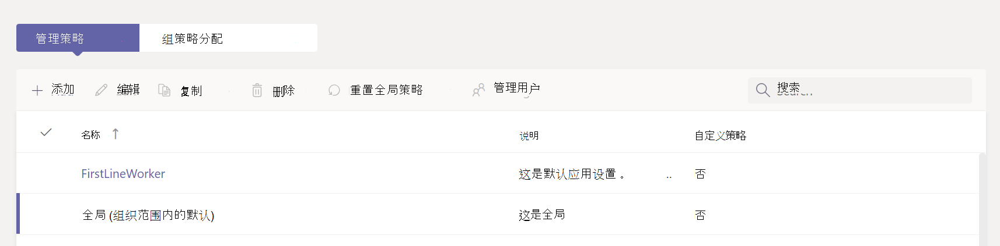

# 在 Microsoft Teams 中管理应用设置策略

作为管理员，可以使用应用设置策略来安装和固定应用，并允许用户上传自定义应用。 固定有助于促进组织中相关应用的采用。

* **固定应用：** 应用设置策略允许你选择要固定的应用，设置应用在 Teams 应用栏或撰写消息区域中为用户显示的顺序。 管理员还可以控制最终用户是否可以固定自己的应用。 请参阅 [Pin 应用](#pin-apps)。
* **安装应用：** 应用设置策略允许你在启动 Teams 时和会议期间代表用户安装应用。 有关详细信息，请参阅 [“安装应用](#install-apps)”。
* **上传自定义应用：** 应用设置策略允许用户将自定义应用上传到 Teams。 有关详细信息，请参阅 [上传自定义应用](#upload-custom-apps)。

## 固定应用

固定应用可以突出显示组织中用户最需要的应用。 固定适用于 Microsoft、ISV 公司和组织内开发人员提供的应用。 通过应用设置策略固定应用也会安装它。 使用应用设置策略可以执行以下任务：

* 自定义 Teams 以突出显示对用户最为重要的应用。 选择要固定的应用并设置它们显示的顺序。
* 控制用户是否可以固定应用。

应用固定到 Teams 桌面客户端左侧和 Teams 移动客户端底部的应用栏。

|Teams 桌面客户端  |Teams 移动客户端 |
|---------|---------|
|.  |         |

消息传递扩展插件在撰写消息区域的底部可用。

若要创建用于固定应用的应用设置策略，请执行以下步骤：

1. 登录到 [Microsoft Teams 管理中心](https://admin.teams.microsoft.com)。

1. 在左窗格中，转到 **Teams 应用** > **设置策略**。

1. 选择“**添加**”。

1. 输入策略的名称和说明。

1. 启用 **用户固定**。

   > [!NOTE]
   > 用户 **固定** 设置在 Microsoft 365 政府社区云 (GCC) 环境的 Teams 管理中心中可用， (GCC、GCC High 和 DoD) ，但目前不起作用。

1. 在 **固定应用** 下，选择 **“添加应用**”。

1. 在 **“添加固定应用** ”窗格中，搜索要添加的应用，然后选择 **“添加**”。 还可以按应用权限策略筛选应用。

1. 选择“**添加**”。

1. 在 **“应用栏** ”或 **“消息传递”扩展** 名下，按希望应用在 Teams 中显示的顺序排列应用。

   :::image type="content" source="media/pin-messaging-extensions.png" alt-text="固定应用部分"border="true":::

1. 选择“**保存**”。

> [!NOTE]
> 在Teams 教育版中，分配应用默认固定在全局策略中，即使未在全局策略中列出。

> [!NOTE]
> 对于组织中的一线员工，我们建议使用定制的一线应用体验。 此功能为拥有 [F 许可证](https://www.microsoft.com/en-us/microsoft-365/enterprise/frontline?rtc=1#office-SKUChooser-0dbn8nt)的用户固定 Teams 中最相关的应用。 若要了解详细信息，请参阅 [一线员工的裁缝 Teams 应用](/microsoft-365/frontline/pin-teams-apps-based-on-license?bc=%2fmicrosoftteams%2fbreadcrumb%2ftoc.json&toc=%2fmicrosoftteams%2ftoc.json)。

## 安装应用

使用应用设置策略，管理员可以完成以下任务：

* 默认情况下，在其个人 Teams 环境中为最终用户安装应用。
* 为最终用户安装应用作为 [消息传递扩展](/microsoftteams/platform/messaging-extensions/what-are-messaging-extensions)。
* 在会议组织者的会议中安装应用。

如果 [应用权限](teams-app-permission-policies.md) 策略允许，最终用户可以自行安装应用。

若要创建应用安装策略以安装应用，请执行以下步骤：

1. 登录到 Teams 管理中心并访问 **Teams 应用** > **设置策略**。

2. 选择“**添加**”。

3. 提供策略的名称和说明。

4. 在 **“已安装的应用**”下，选择 **“添加应用**”。

5. 在 **“添加已安装的应用** ”窗格中，搜索要为用户安装的应用。 还可以按应用权限策略筛选应用。

6. 选择“**添加**”。

> [!IMPORTANT]
> 用户无法卸载管理员安装的应用。

>[!NOTE]
> 使用此过程，无法使用可配置选项卡安装自定义应用。

## 上传自定义应用

若要创建允许用户上传自定义应用的自定义策略，请执行以下步骤：

1. 登录到 Teams 管理中心并访问 **Teams 应用** > **设置策略**。

2. 选择“**添加**”。

3. 提供策略的名称和说明。

4. 打开或关闭 **上传自定义应用**。

> [!NOTE]
> 若要更改此设置，租户的 [组织范围应用设置](manage-apps.md#manage-org-wide-app-settings) 必须允许 **第三方应用**。

## 管理应用设置策略

在 Microsoft Teams 管理中心管理应用设置策略。 使用全局 (组织范围的默认) 策略或创建和分配自定义策略。 最终用户获取全局策略。 如果创建自定义策略，它将替代全局策略。 全局管理员或 Teams 服务管理员可以管理这些策略。

编辑全局策略中的设置以包含所需的应用。 若要为组织中的不同用户组自定义 Teams，请创建并分配一个或多个自定义策略。

### 编辑应用设置策略

可以使用 Microsoft Teams 管理中心编辑策略，包括创建的全局 (组织范围的默认) 策略和自定义策略。

1. 在 Microsoft Teams 管理中心的左侧导航中，转到“**Teams 应用**” > “**设置策略**”。

2. 选择要编辑的策略，然后选择 **“编辑**”。

3. 进行所需的更改。

4. 选择“**保存**”。

### 向用户和组分配自定义应用设置策略

有关向用户和组分配策略的详细信息，请参阅 [为用户和组分配策略](assign-policies-users-and-groups.md)。

## 常见问题 解答

<!--- TBD: Incorporate these pointers in the content itself.
--->

### 使用应用设置策略

#### Microsoft Teams 管理中心包含哪些内置应用设置策略

* **全局 (组织范围的默认)**：此默认策略适用于组织中的所有用户，除非你分配了另一个策略。 编辑全局策略以固定对用户最重要的应用。

* **前线工人**：这项政策适用于一线工人。 可以将其分配给组织中的一线工作者。 请务必知道，与创建的自定义策略一样，必须将策略分配给用户才能使设置处于活动状态。 有关详细信息，请转到本文的“ [向用户分配自定义应用设置策略](#assign-a-custom-app-setup-policy-to-users-and-groups) ”部分。

#### 为什么在“添加固定应用”窗格中找不到应用

并非所有应用都可以通过应用设置策略固定到 Teams。 某些应用可能不支持此功能。 若要查找可固定的应用，请在 **“添加固定应用** ”窗格中搜索应用。 具有个人作用域的选项卡 (静态选项卡) 和机器人可以固定到 Teams 桌面客户端，这些应用在 **“添加固定应用** ”窗格中可用。

请记住，Teams 应用商店列出了所有 Teams 应用。 **“添加固定应用**”窗格仅包含可通过策略固定到 Teams 的应用。

#### 我是Teams 教育版管理员在Teams 教育版中，我需要了解哪些应用设置策略

通话应用在Teams 教育版中不可用。 创建新的自定义应用设置策略时，呼叫应用会显示在应用列表中。 但是，应用不会固定到 Teams 客户端，Teams 教育版用户不会在 Teams 中看到“呼叫”应用。

#### 可将多少个固定应用添加到策略

 (iOS 和 Android) ，至少必须将两个应用固定到 Teams 移动客户端。 如果策略的应用少于两个，则移动客户端不会反映策略设置，而是将继续使用现有配置。

可以添加到策略的固定应用数量没有限制。

#### 策略更改生效需要多长时间

编辑或分配策略后，更改可能需要几个小时才能生效。

### 用户体验

#### 用户如何在 Teams 中查看其所有固定应用

若要查看为用户固定的所有应用，用户可能需要执行以下操作，具体取决于已安装应用的数量及其 Teams 客户端窗口的大小。

|Teams 桌面客户端 |Teams 移动客户端 |
|---------|---------|
|在 Teams 一侧的应用栏中，选择 **...更多应用**。| 在 Teams 底部附近的应用栏中，向上轻扫。|
|   |  

#### 关于 Teams 移动体验，我需要了解哪些内容

 (iOS 和 Android) Teams 移动客户端支持具有静态选项卡的个人应用。 固定到 Teams 桌面客户端的应用将显示在 Teams 移动客户端中。 个人机器人将显示在移动客户端上的聊天中。

第三方应用 (可从 Teams 应用商店下载) 需要获得批准，然后才能在移动设备上显示。 如果管理员固定了 Microsoft for Mobile 未批准的应用，它将显示在 Teams 桌面上，但不会显示在移动设备上。 有关详细信息，请参阅 [移动客户](/microsoftteams/platform/tabs/what-are-tabs#mobile-clients) 端。

借助 Teams 移动客户端，用户将看到核心 Teams 应用，如活动、聊天和 Teams，你可以固定 Microsoft 的一些第一方应用，例如 Shifts。

#### 用户是否可以更改通过策略固定的应用的顺序

如果启用了 **“用户固定** ”选项，则用户可以在 Teams 桌面和移动客户端上更改其固定应用的顺序。 用户无法更改其在 Teams Web 客户端上固定应用的顺序。

#### 用户固定是否优先

管理员固定始终优先。 如果启用 **了“用户固定** ”选项，则用户会将其固定的应用保留在管理员固定应用下面。 如果“ **用户固定** ”选项被关闭，则用户将丢失其预先存在的引脚，并且应用栏中将仅存在管理员固定的应用。

### 自定义 Teams 应用

#### 我的组织生成了自定义 Teams 应用并将其发布到 AppSource 或租户应用目录，但当应用固定到 Teams 中的应用栏时，应用图标不会按预期显示。 如何实现修复它？

提交应用之前，请确保遵循徽标准则。 若要了解详细信息，请参阅 [卖家仪表板提交清单](/microsoftteams/platform/concepts/deploy-and-publish/appsource/prepare/overview)。

## 另请参阅

* [Teams 中应用的管理设置](admin-settings.md)
* [在 Teams 中向最终用户分配策略](assign-policies-users-and-groups.md)
