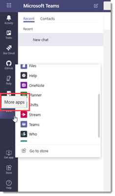

# <a name="manage-app-setup-policies-in-microsoft-teams"></a>在 Microsoft Teams 中管理应用设置策略

> [!NOTE]
> 如果启用了组织范围的应用权限策略设置，**允许与自定义应用交互**，则你可能看不到 Microsoft 团队管理中心中的应用安装策略。 它目前正在推出，即将在您的组织中提供。

作为管理员，你可以使用应用设置策略自定义 Microsoft 团队，以突出显示对你的用户最重要的应用。 你可以选择要固定的应用，并设置它们的显示顺序。 应用设置策略允许你展示你的组织需要的用户所需的应用，包括由第三方或你组织中的开发人员构建的应用。 你还可以使用应用设置策略来管理内置功能的显示方式。

应用程序将固定到应用栏。 这是团队桌面客户端和团队移动客户端（iOS 和 Android）底部的栏。 

|团队桌面客户端  |团队移动客户端 |
|---------|---------|
|<br>  |         |

在 Microsoft 团队管理中心中管理应用设置策略。 你可以使用全局（组织范围默认）策略或创建自定义策略并将其分配给用户。 除非你创建并分配自定义策略，否则你组织中的用户将自动获取全局策略。

你可以编辑全局策略中的设置以包括所需的应用。 如果要为组织中的不同组用户自定义团队，请创建并分配一个或多个自定义策略。 如果向用户分配了自定义策略，则该策略将应用于用户。 如果未向用户分配自定义策略，则全局策略将应用于该用户。


> [!NOTE]
> 如果你有团队教育版，请务必了解，默认情况下，作业应用固定在全局策略中，即使当前，你也看不到全局策略中列出了该应用。 它将是团队客户端上的固定应用列表中的第四个应用。

## <a name="create-a-custom-app-setup-policy"></a>创建自定义应用设置策略

你可以使用 Microsoft 团队管理中心创建自定义策略。

1. 在 Microsoft 团队管理中心的左侧导航中，转到 "**团队应用** > **设置策略**"。
2. 单击“添加”****。
3. 输入策略的名称和说明，然后单击 "**添加应用程序**"。
4. 打开或关闭 "**允许上载自定义应用**"，具体取决于是否希望允许用户将自定义应用程序上载到团队。 如果在应用权限策略中[组织范围内的应用设置](teams-app-permission-policies.md#manage-org-wide-app-settings)中禁用 "**允许第三方" 或 "自定义应用**"，你将无法更改此设置。
5. 在 "**添加固定的应用**" 窗格中，搜索要添加的应用，然后单击 "**添加**"。 你还可以按应用权限策略筛选应用。 选择应用列表后，单击 "**添加**"。

     

6. 按希望在团队中显示的顺序排列应用，然后单击 "**保存**"。

    

## <a name="edit-an-app-setup-policy"></a>编辑应用设置策略

你可以使用 Microsoft 团队管理中心编辑策略，包括全局（组织范围默认）策略和你创建的自定义策略。

1. 在 Microsoft 团队管理中心的左侧导航中，转到 "**团队应用** > **设置策略**"。
2. 通过单击策略名称左侧，然后单击 "**编辑**"，选择策略。
3. 在此处进行所需的更改。 你可以添加、删除和更改应用的顺序。
4. 单击“**保存**”。

## <a name="assign-a-custom-app-setup-policy-to-users"></a>向用户分配自定义应用设置策略

你可以使用 Microsoft 团队管理中心向单个用户或 Skype for business PowerShell 模块分配自定义策略，以将自定义策略分配给用户组，如安全组或通讯组。

### <a name="assign-a-custom-app-setup-policy-to-users"></a>向用户分配自定义应用设置策略

1. 在 Microsoft 团队管理中心的左侧导航中，转到 "**用户**"，然后单击 "用户"。
2. 通过单击用户名左侧的用户选择用户，然后单击 "**编辑设置**"。
3. 在 "**应用设置策略**" 下，选择要分配的应用设置策略，然后单击 "**应用**"。

若要一次为多个用户分配策略，请参阅[批量编辑团队用户设置](edit-user-settings-in-bulk.md)。

或者，您也可以执行以下操作：

1. 在 Microsoft 团队管理中心的左侧导航中，转到 "**团队应用** > **设置策略**"。
2. 通过单击策略名称的左侧，选择策略。
3. 选择 "**管理用户**"。
4. 在 "**管理用户**" 窗格中，按 "显示名称" 或 "按用户名搜索用户"，选择名称，然后选择 "**添加**"。 对要添加的每个用户重复此步骤。
5. 添加完用户后，请选择 "**保存**"。

### <a name="assign-a-custom-app-setup-policy-to-users-in-a-group"></a>为组中的用户分配自定义应用设置策略

你可能需要将自定义应用设置策略分配给已标识的多个用户。 例如，你可能想要向安全组中的所有用户分配策略。 你可以通过连接到 Azure Active Directory PowerShell for Graph 模块和 Skype for Business PowerShell 模块来执行此操作。 有关使用 PowerShell 管理团队的详细信息，请参阅[团队 PowerShell 概述](teams-powershell-overview.md)。

在此示例中，我们为 Contoso 制药人力资源项目组中的所有用户分配一个名为 "HR App Setup 策略" 的自定义应用设置策略。  

> [!NOTE]
> 请按照[连接到单个 Windows PowerShell 窗口中的所有 Office 365 服务](https://docs.microsoft.com/office365/enterprise/powershell/connect-to-all-office-365-services-in-a-single-windows-powershell-window)中的步骤，确保首先连接到用于 Graph 模块和 Skype For business powershell 模块的 Azure Active Directory powershell。

获取特定组的 GroupObjectId。
```
$group = Get-AzureADGroup -SearchString "Contoso Pharmaceuticals HR Project"
```
获取指定组的成员。
```
$members = Get-AzureADGroupMember -ObjectId $group.ObjectId -All $true | Where-Object {$_.ObjectType -eq "User"}
```
将组中的所有用户分配到特定应用设置策略。 在此示例中，它是 HR 应用设置策略。
```
$members | ForEach-Object { Grant-CsTeamsAppSetupPolicy -PolicyName "HR App Setup Policy" -Identity $_.EmailAddress}
``` 
此命令可能需要几分钟才能执行，具体取决于组中的成员数量。

## <a name="faq"></a>常见问题解答

### <a name="working-with-app-setup-policies"></a>使用应用设置策略

#### <a name="what-built-in-app-setup-policies-are-included-in-the-microsoft-teams-admin-center"></a>Microsoft 团队管理中心中包括哪些内置应用设置策略？

- **全局（组织范围默认值）**：此默认策略适用于你组织中的所有用户，除非你分配其他策略。 编辑全局策略以固定对你的用户最重要的应用。
- **FirstLineWorker**：此政策适用于一线工作者。 你可以将其分配给你的组织中的一线工作人员。 请务必知道，例如你创建的自定义策略，你必须将策略分配给用户才能使设置处于活动状态。 有关详细信息，请转到本文的 "向[用户分配自定义应用设置策略](#assign-a-custom-app-setup-policy-to-users)" 部分。

#### <a name="why-cant-i-find-an-app-in-the-add-pinned-apps-pane"></a>为什么我无法在 "添加固定的应用" 窗格中找到应用？

并非所有应用都可以通过应用设置策略固定到团队。 某些应用可能不支持此功能。 若要查找可固定的应用，请在 "**添加固定的应用**" 窗格中搜索该应用。 具有个人作用域（静态选项卡）和机器人的选项卡可以固定到团队桌面客户端，并且这些应用在 "**添加固定应用**" 窗格中可用。

请记住，"团队" 应用商店将列出所有团队应用，而 "**添加固定的应用**" 窗格仅包括可通过策略固定到团队的应用。 

#### <a name="im-a-teams-for-education-admin-what-do-i-need-to-know-about-app-setup-policies-in-teams-for-education"></a>我是教育版管理员的团队。我需要了解有关团队教育版中的应用设置策略的哪些信息？

"呼叫" 应用在教育版团队中不可用。 创建新的自定义应用设置策略时，将在应用列表中显示调用应用。 但是，应用不会固定到团队客户端和团队，教育用户将看不到团队中的 "调用" 应用。

#### <a name="how-many-apps-can-be-added-to-a-policy"></a>可以向策略添加多少个应用？

必须将两个应用中的至少一个应用固定到团队移动客户端（iOS 和 Android）。 如果策略的应用少于两个，则移动客户端不会反映策略设置，而是将继续使用现有配置。

对可添加到策略中的应用数没有限制。

#### <a name="how-long-does-it-take-for-policy-changes-to-take-effect"></a>策略更改需要多长时间才能生效？

编辑全局策略或分配策略后，所做的更改可能需要长达24小时才能生效。

### <a name="user-experience"></a>用户体验

#### <a name="how-can-users-see-all-their-pinned-apps-in-teams"></a>用户如何能够查看团队中的所有固定应用？

若要查看为用户固定的所有应用，用户可能需要执行以下操作，具体取决于已安装应用的数量以及其团队客户端窗口的大小。

|团队桌面客户端 |团队移动客户端 |
|---------|---------|
|在团队侧面的应用栏中，单击 **.。。更多应用**。| 在团队底部附近的应用栏中，向上轻扫。|
|<br>   |  

#### <a name="what-do-i-need-to-know-about-the-teams-mobile-experience"></a>我需要了解有关团队移动体验的哪些信息？

团队移动客户端（iOS 和 Android）目前不支持带有静态选项卡的个人应用。 根据策略中设置的应用，固定到团队桌面客户端的应用可能不会显示在团队移动客户端中。 在移动客户端上，个人机器人仍将显示在聊天中。

通过团队移动客户端，用户将看到核心团队应用（如活动、聊天和团队），并且你可以固定 Microsoft 的一些第三方应用，例如倒班。 

#### <a name="can-users-change-the-order-of-apps-pinned-through-a-policy"></a>用户是否可以更改通过策略固定的应用顺序？

当前，用户可以更改团队移动客户端上的固定应用的顺序，但不能更改团队桌面或 web 客户端上的应用。 

### <a name="custom-teams-apps"></a>自定义团队应用

#### <a name="my-organization-built-a-custom-teams-app-and-published-it-either-to-appsource-or-the-tenant-app-catalog-but-the-app-icon-isnt-displayed-as-expected-when-the-app-is-pinned-to-the-app-bar-in-teams-how-do-i-fix-it"></a>我的组织构建了一个自定义团队应用，并已将其发布到 AppSource 或租户应用目录，但当应用固定到团队中的应用栏时，应用图标不会按预期显示。 如何解决此问题？ 

在提交应用之前，请确保遵循徽标指南。 若要了解详细信息，请参阅[卖方仪表板提交清单](https://docs.microsoft.com/microsoftteams/platform/publishing/office-store-checklist)。 

 ## <a name="related-topics"></a>相关主题
- [Teams 中适用于应用的管理设置](admin-settings.md)
- [从团队客户端将应用发布到租户应用目录](tenant-apps-catalog-teams.md)
