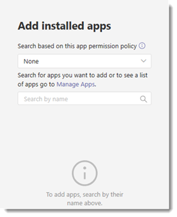

# 在 Microsoft Teams 中管理应用设置策略Manage app setup policies in Microsoft Teams

作为管理员，可以使用应用设置策略执行以下任务：As an admin, you can use app setup policies to do the following tasks:

- 自定义 Teams 以突出显示对用户最为重要的应用。Customize Teams to highlight the apps that are most important for your users. 选择要固定的应用并设置它们显示的顺序。You choose the apps to pin and set the order that they appear. 固定应用允许你展示组织中用户所需的应用，包括由第三方或你组织的开发人员构建的应用。Pinning apps lets you showcase apps that users in your organization need, including apps built by third parties or by developers in your organization.
- 控制用户是否可以将应用固定到 Teams。Control whether users can pin apps to Teams.
- 代表用户安装应用。Install apps on behalf of users. 选择在用户启动应用时默认安装哪些Teams。You choose which apps are installed by default for users when they start Teams. 请记住，如果分配给用户的应用权限策略允许，用户仍然可以自行安装应用。Keep in mind that users can still install apps themselves if the [app permission policy](teams-app-permission-policies.md) that's assigned to them allows it.

> [!Note]
> 对于管理员安装的应用，用户无法卸载这些应用。For apps installed by admins, users can't uninstall those apps.

应用固定到应用栏，应用栏位于 Teams 桌面客户端一侧，位于 Teams 移动客户端 (iOS 和 Android) 。Apps are pinned to the app bar, which is the bar on the side of the Teams desktop client and at the bottom of the Teams mobile clients (iOS and Android).

|Teams桌面客户端Teams desktop client  |Teams 移动客户端Teams mobile client |
|---------|---------|
|   |         |

若要查看管理员安装的应用，请在应用栏中 **选择"...桌面** 和Teams客户端中的更多应用，在移动客户端中向上轻扫。To see the apps installed by admins, in the app bar, users select **... More apps** in the Teams desktop and web clients and swipe up in the mobile clients.

在管理中心内管理Microsoft Teams策略。You manage app setup policies in the Microsoft Teams admin center. 使用全局 (组织范围的默认) 策略，或者创建和分配自定义策略。Use the global (Org-wide default) policy or create and assign custom policies.  除非你创建并分配自定义策略，否则你组织中的用户将自动获取全局策略。Users in your organization will automatically get the global policy unless you create and assign a custom policy. 必须是全局管理员或 Teams 服务管理员才能管理这些策略。You must be a global admin or Teams service admin to manage these policies.

编辑全局策略中的设置，以包含需要的应用。You edit the settings in the global policy to include the apps that you want. 若要为Teams组用户自定义策略，请创建并分配一个或多个自定义策略。To customize Teams for different groups of users in your organization, create and assign one or more custom policies.

> [!NOTE]
> 如果你拥有Teams应用，必须知道"作业"应用默认已固定在全局策略中，即使当前未在全局策略中列出该应用。If you have Teams for Education, it's important to know that the Assignments app is pinned by default in the global policy even though currently, you don't see it listed in the global policy. 它将是客户端上已固定应用列表中的第四Teams应用。It will be the fourth app in the list of pinned apps on Teams clients.

## 创建自定义应用设置策略Create a custom app setup policy

可以使用 Microsoft Teams 管理中心创建自定义策略。You can use the Microsoft Teams admin center to create a custom policy.

1. 在管理中心的左侧导航Microsoft Teams，转到"Teams **设置**  >  **策略"。**In the left navigation of the Microsoft Teams admin center, go to **Teams apps** > **Setup policies**.

2. 选择“**添加**”。Select **Add**.

   

3. 输入策略的名称和说明。Enter a name and description for the policy.

4. 打开或 **关闭Upload应用**，具体取决于是否要让用户将自定义应用上传到Teams。Turn on or turn off **Upload custom apps**, depending on whether you want to let users upload custom apps to Teams. 如果在组织范围的应用设置 中关闭"允许第三方应用"，[则不能更改此设置](manage-apps.md#manage-org-wide-app-settings)。You can't change this setting if **Allow third-party apps** is turned off in [org-wide app settings](manage-apps.md#manage-org-wide-app-settings).

5. 打开或关闭 **"允许用户** 固定"，具体取决于是否要让用户通过将应用固定到应用栏来个性化其应用栏。Turn on or turn off **Allow user pinning**, depending on whether you want to let users personalize their app bar by pinning apps to it.

   > [!NOTE]
   > Microsoft 365 政府社区云 (GCC) 环境 (GCC、GCC High 和 DoD) 中的 Teams 管理中心中提供了"允许用户固定"设置，但目前不起作用。The **Allow user pinning** setting is available in the Teams admin center in Microsoft 365 Government Community Cloud (GCC) environments (GCC, GCC High and DoD), but currently it has no effect.

6. 若要为用户安装应用，请执行以下任务：To install apps for users, do the following tasks:

    1. 在 **"已安装的应用"** 下，选择 **"添加应用"。**Under **Installed apps**, select **Add apps**.

    2. 在 **"添加已安装的应用**"窗格中，搜索希望用户在启动应用时自动安装Teams。In the **Add installed apps** pane, search for the apps you want to automatically install for users when they start Teams. 还可以按应用权限策略筛选应用。You can also filter apps by app permission policy. 选择应用列表后，选择"添加 **"。**When you've chosen your list of apps, select **Add**.

       

7. 若要固定应用，请执行以下步骤：To pin apps, do the following steps:

    1. 在 **"固定的应用"下**，选择"**添加应用"。**Under **Pinned apps**, select **Add apps**.

    2. 在"**添加固定的应用"** 窗格中，搜索要添加的应用，然后选择"添加 **"。**In the **Add pinned apps** pane, search for the apps you want to add, and then select **Add**. 还可以按应用权限策略筛选应用。You can also filter apps by app permission policy. 选择要固定的应用列表后，选择"添加 **"。**When you've chosen your list of apps to pin, select **Add**.

       

    3. 按照希望应用在应用中显示的顺序排列Teams，然后选择"保存 **"。**Arrange the apps in the order that you want them to appear in Teams, and then select **Save**.

       

## 编辑应用设置策略Edit an app setup policy

可以使用 Microsoft Teams 管理中心编辑策略，包括 (组织范围的) 策略和自定义策略。You can use the Microsoft Teams admin center to edit a policy, including the global (Org-wide default) policy and custom policies that you create.

1. 在管理中心的左侧导航Microsoft Teams，转到"Teams **设置**  >  **策略"。**In the left navigation of the Microsoft Teams admin center, go to **Teams apps** > **Setup policies**.

2. 通过单击策略名称的左侧选择策略，然后选择 **“编辑”**。Select the policy by clicking to the left of the policy name, and then select **Edit**.

3. 在此处根据需要进行更改。From here, make the changes that you want.

4. 选择“**保存**”。Select **Save**.

## 向用户分配自定义应用设置策略Assign a custom app setup policy to users

[!INCLUDE [assign-policy](includes/assign-policy.md)]

## 常见问题FAQ

### 使用应用设置策略Working with app setup policies

#### 应用管理中心包含哪些内置应用Microsoft Teams策略What built-in app setup policies are included in the Microsoft Teams admin center

- **全局 (组织范围内的** 默认) ：此默认策略适用于组织中的所有用户，除非分配了其他策略。**Global (Org-wide default)**: This default policy applies to all users in your organization unless you assign another policy. 编辑全局策略以固定对用户最重要的应用。Edit the global policy to pin apps that are most important for your users.

- **FrontlineWorker：** 此策略适用于前端工作人员。**FrontlineWorker**: This policy is for Frontline Workers. 你可以将其分配给你组织的一线员工。You can assign it to Frontline Workers in your organization. 必须知道，与创建的自定义策略一样，必须向用户分配策略，使设置处于活动状态。It's important to know that like custom policies that you create, you have to assign the policy to users for the settings to be active. 有关详细信息，请转到本文的向用户分配 [自定义](#assign-a-custom-app-setup-policy-to-users) 应用设置策略部分。For more information, go to the [Assign a custom app setup policy to users](#assign-a-custom-app-setup-policy-to-users) section of this article.

#### 为什么在"添加固定的应用"窗格中找不到应用Why can't I find an app in the Add pinned apps pane

并非所有应用都可以通过应用设置Teams固定到其他应用。Not all apps can be pinned to Teams through an app setup policy. 某些应用可能不支持此功能。Some apps may not support this functionality. 若要查找可固定的应用，请搜索"添加固定的应用" **窗格中的应用** 。To find apps that can be pinned, search for the app in the **Add pinned apps** pane. 具有个人范围的选项卡 (静态选项卡) 和机器人可以固定到 Teams 桌面客户端，这些应用在"添加固定应用"**窗格中可用。**Tabs that have a personal scope (static tabs) and bots can be pinned to the Teams desktop client and these apps are available in the **Add pinned apps** pane.

请记住，应用商店Teams列出所有Teams应用。Keep in mind that the Teams app store lists all Teams apps. "**添加固定应用"** 窗格仅包含可以通过策略固定Teams应用。The **Add pinned apps** pane includes only apps that can be pinned to Teams through a policy.

#### 我是教育Teams管理员。在适用于教育的 Teams 中，我需要了解哪些应用设置策略I'm a Teams for Education admin. What do I need to know about app setup policies in Teams for Education

呼叫应用在教育Teams不可用。The Calling app isn't available in Teams for Education. 创建新的自定义应用设置策略时，"呼叫"应用会显示在应用列表中。When you create a new custom app setup policy, the Calling app is displayed in the list of apps. 但是，该应用未固定到Teams客户端，Teams教育用户不会在应用中看到"呼叫"Teams。However, the app isn't pinned to Teams clients and Teams for Education users won't see the Calls app in Teams.

#### 可以将多少个固定应用添加到策略How many pinned apps can be added to a policy

必须将至少两个应用固定到 iOS Teams Android (移动客户端) 。A minimum of two apps must be pinned to the Teams mobile clients (iOS and Android). 如果策略的应用少于两个，移动客户端不会反映策略设置，而是继续使用现有配置。If a policy has fewer than two apps, the mobile clients won't reflect the policy settings and instead will continue to use the existing configuration.

可以添加到策略的固定应用数量没有限制。There's no limit on the number of pinned apps you can add to a policy.

#### 策略更改生效需要多久How long does it take for policy changes to take effect

编辑或分配策略后，更改可能需要几个小时才能生效。After you edit or assign a policy, it can take a few hours for changes to take effect.

### 用户体验User experience

#### 用户如何在应用中查看其所有固定TeamsHow can users see all their pinned apps in Teams

若要查看为用户固定的所有应用，用户可能需要执行以下操作，具体取决于已安装的应用数及其Teams窗口的大小。To view all apps that are pinned for a user, users might have to do the following depending on the number of installed apps and the size of their Teams client window.

|Teams桌面客户端Teams desktop client |Teams 移动客户端Teams mobile client |
|---------|---------|
|在应用栏的"应用Teams，选择 **"...更多应用**。In the app bar on the side of Teams, select **... More apps**.| 在屏幕底部附近的应用Teams向上轻扫。In the app bar near the bottom of Teams, swipe up.|
|    |  

#### 关于移动体验，Teams哪些信息What do I need to know about the Teams mobile experience

iOS Teams Android (移动客户端) 静态选项卡支持个人应用。The Teams mobile clients (iOS and Android) support personal apps with static tabs. 固定到 Teams 桌面客户端的应用将显示在Teams客户端中。Apps pinned to the Teams desktop client will appear in the Teams mobile clients. 个人机器人将显示在移动客户端上的聊天中。Personal bots will appear in Chat on mobile clients.

可以从应用商店 (下载的第三方Teams应用) 在移动设备上显示之前需要获得批准。Third-party apps (which can be downloaded from Teams Store) need to be approved before they show up on mobile. 如果管理员固定应用（未经 Microsoft 移动版批准）将在桌面Teams上显示，但不在移动设备上显示。If an admin pins an app, which is unapproved by Microsoft for Mobile, it will show up on the Teams Desktop, but not show up on mobile. 有关详细信息 [，请参阅](/microsoftteams/platform/tabs/what-are-tabs#mobile-clients) 移动客户端。See [Mobile clients](/microsoftteams/platform/tabs/what-are-tabs#mobile-clients) for more information.

使用 Teams 移动客户端，用户将看到核心 Teams 应用，如活动、聊天和 Teams，并且你可以固定来自 Microsoft 的一些第一方应用，例如 Shifts。With the Teams mobile clients, users will see core Teams apps such as Activity, Chat, and Teams, and you can pin some first-party apps from Microsoft, such as Shifts.

#### 用户能否更改通过策略固定的应用的顺序Can users change the order of apps pinned through a policy

如果"允许用户固定"选项打开，用户可以在桌面Teams移动客户端上更改其固定应用的顺序。Users can change the order of their pinned apps on Teams desktop and mobile clients if the **Allow user pinning** option is turned on. 用户不能更改其固定应用在 Web 客户端上Teams的顺序。Users can't change the order of their pinned apps on Teams web clients.

#### 用户固定是否优先Does user pinning take precedence

管理图钉始终优先。Admin pins always take precedence. 如果 **"允许用户固定"** 选项已打开，则用户将保留其固定应用在管理员固定应用下方。If the **Allow user pinning** option is turned on, then users will retain their pinned apps below admin pinned apps. 如果 **"允许用户固定"** 选项已关闭，则用户将丢失其预先存在的固定项，并且应用栏中将只显示管理员固定的应用。If the **Allow user pinning** option is turned off, then users will lose their pre-existing pins, and only admin-pinned apps will be present in the app bar.

### 自定义Teams应用Custom Teams apps

我的组织构建了Teams应用并发布到 AppSource 或租户应用目录，但在应用固定到 Teams 中的应用栏时，应用图标不会按预期显示。My organization built a custom Teams app and published it, either to AppSource or the tenant app catalog, but the app icon isn't displayed as expected when the app is pinned to the app bar in Teams. 如何修复它How do I fix it

在提交应用之前，请确保遵循徽标准则。Make sure that you follow the logo guidelines before you submit the app. 有关详细信息，请参阅卖方 [仪表板提交清单](/microsoftteams/platform/concepts/deploy-and-publish/appsource/prepare/overview)。To learn more, see [Checklist for Seller Dashboard submission](/microsoftteams/platform/concepts/deploy-and-publish/appsource/prepare/overview).

## 相关主题Related topics

[Teams 中应用的管理设置Admin settings for apps in Teams](admin-settings.md)

[向 Teams 中的用户分配策略Assign policies to your users in Teams](assign-policies.md)
