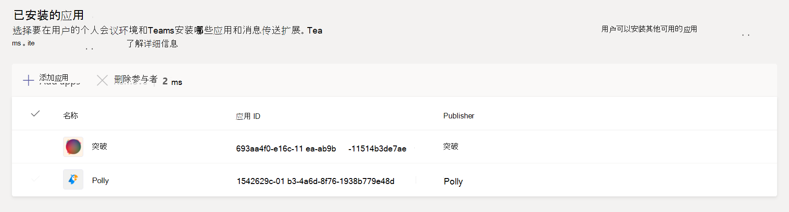

# 在 Microsoft Teams 中管理应用设置策略

作为管理员，可以使用应用设置策略来安装和固定应用以推广组织中最常用的应用，以及决定是否希望用户将自定义应用上传到 Teams。

- 固定 **应用**：应用设置策略允许选择要固定的应用、设置它们显示给用户的顺序，以及控制用户是否可以将其应用固定到 Teams 应用栏。 有关详细信息，请参阅固定 [应用](#pin-apps)。
- **安装应用：** 应用设置策略让你在用户启动应用时代表用户Teams会议期间安装应用。 有关详细信息，请参阅 [安装应用](#install-apps)。
- **Upload自定义应用**：应用设置策略允许用户将自定义应用上传到Teams。 有关详细信息，请参阅自定义[Upload应用。](#upload-custom-apps)

## 固定应用

固定应用允许你展示组织中用户所需的应用，包括由第三方或你组织的开发人员构建的应用。

使用应用设置策略可以执行以下任务：

- 自定义 Teams 以突出显示对用户最为重要的应用。 选择要固定的应用并设置它们显示的顺序。
- 控制用户是否可以将应用固定到 Teams。

应用固定到应用栏，应用栏位于 Teams 桌面客户端一侧，位于 Teams 移动客户端 (iOS 和 Android) 。

|Teams 桌面客户端  |Teams 移动客户端 |
|---------|---------|
|   |         |

> [!NOTE]
> 如果有Teams 教育版，必须知道"分配"应用默认已固定在全局策略中，即使当前未看到它在全局策略中列出。 它将是客户端上已固定应用列表中的第四Teams应用。

若要创建应用设置策略以固定应用，请执行以下步骤：

1. 在管理中心的左侧导航Microsoft Teams，转到"Teams **设置**  >  **策略"。**

2. 选择“**添加**”。

3. 输入策略的名称和说明。

4. 打开或关闭 **"允许用户** 固定"，具体取决于是否要让用户通过将应用固定到应用栏来个性化其应用栏。

   > [!NOTE]
   > Microsoft 365 政府社区云 (GCC) 环境 (GCC、GCC High 和 DoD) 中的 Teams 管理中心中提供了"允许用户固定"设置，但目前不起作用。

5. 在 **"固定的应用"下**，选择"**添加应用"。**

6. 在"**添加固定的应用"** 窗格中，搜索要添加的应用，然后选择"添加 **"。** 还可以按应用权限策略筛选应用。

7. 选择“**添加**”。

8. 按照希望应用在应用中显示的顺序排列Teams。

   

9. 选择“**保存**”。

## 安装应用

你可以选择默认为用户安装在其个人游戏环境中Teams应用，将应用安装为消息传送扩展，以及指定要安装在会议中的应用。

使用应用设置策略可以执行以下任务：

- 在用户的个人应用环境中安装Teams应用
- 为用户安装应用作为消息传送扩展
- 在会议组织者的会议中安装应用

> [!NOTE]
> 如果分配给用户的应用权限策略允许，用户仍然可以自行安装应用。

若要创建应用设置策略以安装应用，请执行以下步骤：

1. 在管理中心的左侧导航Microsoft Teams，转到"Teams **设置**  >  **策略"。**

2. 选择“**添加**”。

3. 输入策略的名称和说明。

4. 在 **"已安装的应用"** 下，选择 **"添加应用"。**

5. 在 **"添加已安装的应用** "窗格中，搜索要自动为用户安装的应用。 还可以按应用权限策略筛选应用。

6. 选择“**添加**”。

> [!IMPORTANT]
> 用户无法卸载管理员安装的应用。

## Upload自定义应用

可以使用 Microsoft Teams 管理中心创建自定义策略，允许用户将自定义应用上传到Teams。

若要创建应用设置策略以允许用户将自定义应用上传到 Teams，请执行以下步骤：

1. 在管理中心的左侧导航Microsoft Teams，转到"Teams **设置**  >  **策略"。**

2. 选择“**添加**”。

3. 输入策略的名称和说明。

4. 打开或 **关闭Upload应用**，具体取决于是否要让用户将自定义应用上传到Teams。

> [!NOTE]
> 如果在组织范围的应用设置 中关闭"允许第三方应用"，[则不能更改此设置](manage-apps.md#manage-org-wide-app-settings)。

## 管理应用设置策略

在管理中心内管理Microsoft Teams策略。 使用全局 (组织范围的默认) 策略，或者创建和分配自定义策略。  除非你创建并分配了自定义策略，你组织中的用户将自动获取全局策略。 必须是全局管理员或 Teams 服务管理员才能管理这些策略。

编辑全局策略中的设置，以包含需要的应用。 若要为Teams组用户自定义策略，请创建并分配一个或多个自定义策略。

### 编辑应用设置策略

可以使用 Microsoft Teams 管理中心编辑策略，包括 (组织范围的) 策略和自定义策略。

1. 在管理中心的左侧导航Microsoft Teams，转到"Teams **设置**  >  **策略"。**

2. 选择要编辑的策略，然后选择"编辑 **"。**

3. 进行您需要的更改。

4. 选择“**保存**”。

### 向用户分配自定义应用设置策略

有关向用户分配策略详细信息，请参阅 [向用户和组分配策略](assign-policies-users-and-groups.md)。

## 常见问题

### 使用应用设置策略

#### 能否将应用设置策略分配给组

可以使用 PowerShell 将应用设置策略分配给组。 有关使用 PowerShell 将策略分配到组的信息，请参阅 [向用户和组分配策略](assign-policies-users-and-groups.md#use-the-powershell-option)。

#### 应用管理中心包含哪些内置应用Microsoft Teams策略

- **全局 (组织范围内的** 默认) ：此默认策略适用于组织中的所有用户，除非分配了其他策略。 编辑全局策略以固定对用户最重要的应用。

- **FrontlineWorker：** 此策略适用于前端工作人员。 你可以将其分配给你组织的一线员工。 必须知道，与创建的自定义策略一样，必须向用户分配策略，使设置处于活动状态。 有关详细信息，请转到本文的向用户分配 [自定义](#assign-a-custom-app-setup-policy-to-users) 应用设置策略部分。

#### 为什么在"添加固定的应用"窗格中找不到应用

并非所有应用都可以通过应用设置Teams固定到其他应用。 某些应用可能不支持此功能。 若要查找可固定的应用，请搜索"添加固定的应用" **窗格中的应用** 。 具有个人范围的选项卡 (静态选项卡) 和机器人可以固定到 Teams 桌面客户端，这些应用在"添加固定应用"**窗格中可用。**

请记住，应用商店Teams列出所有Teams应用。 "**添加固定应用"** 窗格仅包含可以通过策略固定Teams应用。

#### 我是管理员Teams 教育版管理员。我需要了解应用中的应用设置策略Teams 教育版

呼叫应用在 Teams 教育版 中不可用。 创建新的自定义应用设置策略时，"呼叫"应用会显示在应用列表中。 但是，该应用未固定到Teams客户端，Teams 教育版用户将看不到应用中的"呼叫"Teams。

#### 可以将多少个固定应用添加到策略

必须将至少两个应用固定到 iOS Teams Android (移动客户端) 。 如果策略的应用少于两个，移动客户端不会反映策略设置，而是继续使用现有配置。

可以添加到策略的固定应用数量没有限制。

#### 策略更改生效需要多久

编辑或分配策略后，更改可能需要几个小时才能生效。

### 用户体验

#### 用户如何在应用中查看其所有固定Teams

若要查看为用户固定的所有应用，用户可能需要执行以下操作，具体取决于已安装的应用数及其Teams窗口的大小。

|Teams 桌面客户端 |Teams 移动客户端 |
|---------|---------|
|在应用栏的"应用Teams，选择 **"...更多应用**。| 在屏幕底部附近的应用Teams向上轻扫。|
|    |  

#### 关于移动体验，Teams哪些信息

iOS Teams Android (移动客户端) 静态选项卡支持个人应用。 固定到 Teams 桌面客户端的应用将显示在Teams客户端中。 个人机器人将显示在移动客户端上的聊天中。

可以从应用商店 (下载的第三方Teams应用) 在移动设备上显示之前需要获得批准。 如果管理员固定应用（未经 Microsoft 移动版批准）将在桌面Teams上显示，但不在移动设备上显示。 有关详细信息 [，请参阅](/microsoftteams/platform/tabs/what-are-tabs#mobile-clients) 移动客户端。

使用 Teams 移动客户端，用户将看到核心 Teams 应用，如活动、聊天和 Teams，并且你可以固定来自 Microsoft 的一些第一方应用，例如 Shifts。

#### 用户能否更改通过策略固定的应用的顺序

如果"允许用户固定"选项打开，用户可以在桌面Teams移动客户端上更改其固定应用的顺序。 用户不能更改其固定应用在 Web 客户端上Teams的顺序。

#### 用户固定是否优先

管理图钉始终优先。 如果 **"允许用户固定"** 选项已打开，则用户将保留其固定应用在管理员固定应用下方。 如果 **"允许用户固定"** 选项已关闭，则用户将丢失其预先存在的固定项，并且应用栏中将只显示管理员固定的应用。

### 自定义Teams应用

#### 我的组织构建了Teams应用并发布到 AppSource 或租户应用目录，但在应用固定到 Teams 中的应用栏时，应用图标不会按预期显示。 如何修复它

在提交应用之前，请确保遵循徽标准则。 有关详细信息，请参阅卖方 [仪表板提交清单](/microsoftteams/platform/concepts/deploy-and-publish/appsource/prepare/overview)。

## 相关主题

[Teams 中应用的管理设置](admin-settings.md)

[向 Teams 中的用户分配策略](assign-policies-users-and-groups.md)
