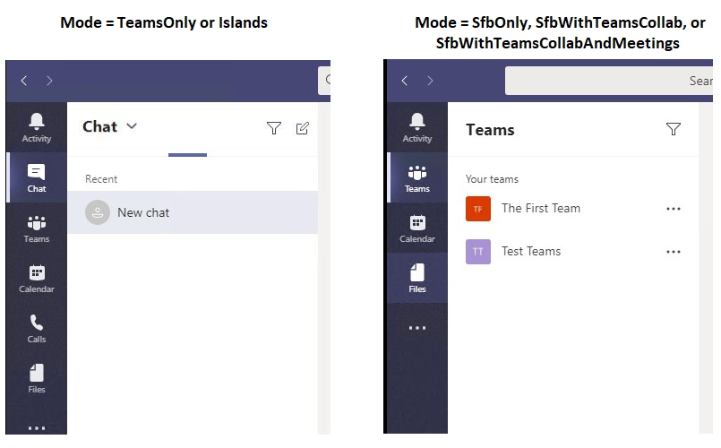

# Teams 客户端体验和共存模式的一致性Teams client experience and conformance to coexistence modes

> [!NOTE]
> 此页面介绍团队客户端在用户处于任何 Skype for Business 模式 (SfBOnly、SfBWithTeamsCollab、SfBWithTeamsCollabAndMeetings) 时的行为中的重要、最近发布的更改。This page describes important, recently released changes in the behavior of Teams client when users are in any of the Skype for Business modes (SfBOnly, SfBWithTeamsCollab, SfBWithTeamsCollabAndMeetings).

当组织从 Skype for Business 切换到团队时, 共存模式的用途是为最终用户提供简单且可预测的体验。The purpose of co-existence modes is to provide a simple, predictable experience for end users as organizations transition from Skype for Business to Teams.  对于迁移到团队的组织, TeamsOnly 模式是每个用户的最终目标, 但并非所有用户都需要同时分配 TeamsOnly (或任何其他模式)。For an organization moving to Teams, the TeamsOnly mode is the final destination for each user, though not all users need to be assigned TeamsOnly (or any other mode) at the same time.  在用户到达 TeamsOnly 模式之前, 组织可以使用任何 Skype for Business 模式 (SfBOnly、SfBWithTeamsCollab、SfBWithTeamsCollabAndMeetings) 确保 TeamsOnly 用户和尚未使用的用户之间可预测的通信。Prior to users reaching TeamsOnly mode, organizations can use any of the Skype for Business modes (SfBOnly, SfBWithTeamsCollab, SfBWithTeamsCollabAndMeetings) to ensure predictable communication between users who are TeamsOnly and those who aren’t yet. 

当用户处于任何 Skype for Business 模式时, 所有传入聊天和通话都将路由到用户的 Skype for business 客户端。When a user is in any of the Skype for Business modes, all incoming chats and calls are routed to the user’s Skype for Business client. 为避免最终用户混淆和确保正确路由, 当用户处于任何 Skype for Business 模式时, 将禁用团队客户端中的 "调用和聊天" 功能。To avoid end user confusion and ensure proper routing, calling and chat functionality in the Teams client is disabled when a user is in any of the Skype for Business modes. 同样, 当用户处于 SfBOnly 或 SfBWithTeamsCollab 模式时, 将显式禁用团队中的会议计划, 并在用户处于 SfBWithTeamsCollabAndMeetings 模式时显式启用。Similarly, meeting scheduling in Teams is explicitly disabled when users are in the SfBOnly or SfBWithTeamsCollab modes, and explicitly enabled when a user is in the SfBWithTeamsCollabAndMeetings mode.   

## 团队客户端中的可用功能如何根据模式更改How the available functionality in Teams client changes based on mode
团队中的可用功能取决于用户的共存模式 (由 TeamsUpgradePolicy 设置)。The available functionality in Teams depends on the user's coexistence mode, as set by TeamsUpgradePolicy. 下表总结了该行为:The table below summarizes the  behavior:

|用户的有效模式User's effective mode|团队客户端中的体验Experience in Teams client|
|---|---|
|任何 Skype for Business 模式Any Skype for Business mode|已禁用通话和聊天。Calling and Chat are disabled.|
|SfBWithTeamsCollabAndMeetingsSfBWithTeamsCollabAndMeetings|会议计划可用Meeting scheduling is available|
|SfBWithTeamsCollab 或 SfBOnly1SfBWithTeamsCollab or SfBOnly1|会议日程安排不可用Meeting scheduling is not available|
|||

下面的屏幕截图演示了 TeamsOnly 或孤岛模式与所有其他模式之间的差异。The following screenshots illustrate the difference between TeamsOnly or Islands mode and all other modes. 请注意, 聊天和呼叫图标可通过 TeamsOnly 或孤岛模式 (左屏幕截图) 使用, 但不适用于其他模式 (右屏幕截图):Note that the chat and calling icons are available with TeamsOnly or Islands mode (left screenshot), but not with the other modes (right screenshot):

 
**注意:**
1现在, SfBwithTeamsCollab 和 SfBOnly 的行为相同, 但意图适用于 SfBOnly 模式以禁用团队中的频道和文件功能;但是, 当前没有任何可允许团队中的此功能被禁用的设置。**Note:**
1 For now, SfBwithTeamsCollab and SfBOnly behave the same, but the intent is for SfBOnly mode to also disable Channels and Files functionality in Teams; however, there is currently no setting that allows this functionality in Teams to be disabled.

## 模式对其他策略设置的影响Impact of Mode on other policy settings
如上所述, 用户的共存模式影响的是用户的团队客户端提供的功能。As described above, a user's coexistence mode impact's what functionality is available in the user's Teams client. 这意味着, mode 的值可以优先于其他策略设置的值, 具体取决于模式。This means that the value of mode can take precedence over the value of other policy settings, depending on the mode. 特别是, 共存模式会影响是否遵守下列策略设置:Specifically,  coexistence mode impacts whether the following policy settings are honored:

|**模态 (应用)****Modality (App)**|**策略。设置****Policy.Setting**|
|---|---|
|聊天Chat|TeamsMessagingPolicy.AllowUserChatTeamsMessagingPolicy.AllowUserChat|
|通话Calling|TeamsCallingPolicy.AllowPrivateCallingTeamsCallingPolicy.AllowPrivateCalling|
|会议计划Meeting scheduling|TeamsMeetingPolicy.AllowPrivateMeetingSchedulingTeamsMeetingPolicy.AllowPrivateMeetingScheduling TeamsMeetingPolicy.AllowChannelMeetingSchedulingTeamsMeetingPolicy.AllowChannelMeetingScheduling|
|||

管理员*无*需在使用共存模式时显式设置这些策略设置, 但重要的是要了解这些设置在给定模式下的行为方式是有效的。Administrators need *not* explicitly set these policy settings when using co-existence mode, but it's important to understand that these settings effectively behave as follows for a given mode. 

|众Mode|AllowUserChatAllowUserChat|AllowPrivateCallingAllowPrivateCalling|AllowPrivateMeetingSchedulingAllowPrivateMeetingScheduling|AllowChannelMeetingSchedulingAllowChannelMeetingScheduling|
|---|---|---|---|---|
|TeamsOnly 或孤岛TeamsOnly or Islands|已启用Enabled|已启用Enabled|已启用Enabled|已启用Enabled|
|SfBWithTeamsCollabAndMeetingsSfBWithTeamsCollabAndMeetings|已禁用Disabled|已禁用Disabled|已启用Enabled|已启用Enabled|
|SfBWithTeamsCollab 或 SfBOnlySfBWithTeamsCollab or SfBOnly|已禁用Disabled|已禁用Disabled|已禁用Disabled|已禁用Disabled|
||||||

使用 PowerShell 时, `Grant-CsTeamsUpgradePolicy` Cmdlet 检查 TeamsMessagingPolicy、TeamsCallingPolicy 和 TeamsMeetingPolicy 中的相应设置的配置, 以确定这些设置是否会被 TeamsUpgradePolicy 取代, 如果是, 则PowerShell 中提供了信息性消息。When using PowerShell, the `Grant-CsTeamsUpgradePolicy` cmdlet checks the configuration of the corresponding settings in TeamsMessagingPolicy, TeamsCallingPolicy, and TeamsMeetingPolicy to determine if those settings would be superceded by TeamsUpgradePolicy and if so, an informational message is provided in PowerShell.  如上所述, 不需要再设置其他策略设置。As noted above,  is no longer necessary to set these other policy settings. 下面是 PowerShell 警告的示例如下:Below is an example of what the PowerShell warning looks like:

`Grant-CsTeamsUpgradePolicy -Identity user1@contoso.com -PolicyName SfBWithTeamsCollab`

`WARNING: The user 'user1@contoso.com' currently has enabled values for: AllowUserChat, AllowPrivateCalling, AllowPrivateMeetingScheduling, AllowChannelMeetingScheduling, however these values will be ignored. This is because you are granting this user TeamsUpgradePolicy with mode=SfBWithTeamsCollab, which causes the Teams client to behave as if they are disabled.`

# 相关主题Related topics

[面向同时使用 Teams 和 Skype for Business 的组织的迁移和互操作性指导Migration and interoperability guidance for organizations using Teams together with Skype for Business](https://docs.microsoft.com/en-us/microsoftteams/migration-interop-guidance-for-teams-with-skype)

