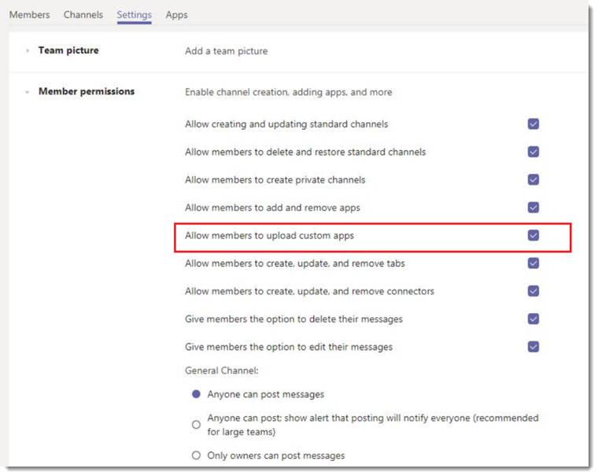

# 在 Microsoft Teams 中管理自定义应用策略和设置

> [!NOTE]
> 若要使用应用 Studio，请参阅[Microsoft 团队平台上使用 c #/.NET 和应用 studio 的入门](https://docs.microsoft.com/microsoftteams/platform/get-started/get-started-dotnet-app-studio)。最后一步尚不起作用，因此你需要下载 zip 并在将[应用包上载到 Microsoft 团队](https://docs.microsoft.com/microsoftteams/platform/concepts/apps/apps-upload)时以旧方式安装它。

作为管理员，你可以使用自定义应用策略和设置来控制你的组织中哪些人可以将自定义应用上载到 Microsoft 团队。 管理员决定哪些用户可以上载自定义应用，管理员和团队所有者可以确定你的组织中的特定团队是否允许将自定义应用添加到其中。  

## 自定义应用概述

用户可以直接将应用包（在 .zip 文件中）上载到团队或个人上下文中，将自定义应用添加到团队。 这不同于通过团队应用商店添加应用的方式。 通过上载应用包（也称为旁加载）添加自定义应用，可以在开发应用程序之前对其进行测试，然后才可以广泛分发。 它还允许你构建仅供内部使用的应用，并与你的团队共享它，而无需将其提交到团队应用商店中的团队应用程序目录。

## 自定义应用策略和设置

三个组件确定用户是否可以将自定义应用上载到团队，使你可以精确控制哪些人可以向团队添加自定义应用，以及可将哪些团队自定义应用添加到：

- [用户自定义应用策略](#user-custom-app-policy)
- [团队自定义应用设置](#team-custom-app-setting)
- [组织范围的自定义应用设置](#org-wide-custom-app-setting)

这些设置不会影响阻止第三方应用程序的功能。  

### 用户自定义应用策略

作为[应用设置策略](teams-app-setup-policies.md)的一部分，管理员可以使用策略设置 "**允许上载自定义应用**" 来控制用户是否可以将自定义应用上载到团队。
 
如果此设置已关闭：

- 用户不能将自定义应用上载到组织中的任何团队或个人上下文中。
- 用户可以与自定义应用交互，具体取决于组织范围内的自定义应用设置。

如果启用此设置，请执行以下操作：

- 根据组织范围内的自定义应用设置，用户可以将自定义应用上载到允许其所有者和团队的团队。
- 用户可将自定义应用程序上载到个人上下文。 
- 用户可以与自定义应用交互，具体取决于组织范围内的自定义应用设置。

你可以编辑全局应用设置策略中的设置以包括所需的应用。 如果要为组织中的不同组用户自定义团队，请创建并分配一个或多个自定义应用设置策略。

#### 设置用户自定义应用策略

1. 在 Microsoft 团队管理中心的左侧导航中，转到 "**团队应用** > **设置策略**"。
2. 单击“添加”****。
3. 打开或关闭 "**允许上载自定义应用**"。
4. 为策略选择所需的任何其他设置。
5. 单击“**保存**”。

### 团队自定义应用设置

管理员和团队所有者可以控制是否允许将自定义应用添加到该团队。 此设置，**允许成员上载自定义应用**，以及用户的自定义应用策略确定谁可以向特定团队添加自定义应用。
 
如果此设置已关闭：

- 如果其自定义应用策略允许，团队所有者可以添加自定义应用。
- 不是团队所有者的团队成员无法将自定义应用添加到团队。

如果启用此设置，请执行以下操作：

- 如果其自定义应用策略允许，团队所有者可以添加自定义应用。
- 不是团队所有者的团队成员可以添加自定义应用（如果其自定义应用策略允许）。

#### 配置团队自定义应用设置

1. 在团队中，转到团队，单击 "**更多选项" ̇̇̇** > "**管理团队**"。
2. 单击 "**设置**"，然后展开 "**成员权限**"。
3. 选中或清除 "**允许成员上载自定义应用**" 复选框。

    

### 组织范围的自定义应用设置

组织范围的自定义应用设置（**允许与自定义应用交互**）适用于你的组织中的所有人，并控制他们是否可以上传或与自定义应用交互。 此设置将替代用户和团队自定义应用策略和设置。 它旨在充当安全事件期间的主开/关切换。

#### 配置组织范围的自定义应用设置

1. 在 Microsoft 团队管理中心的左侧导航中，转到 "**团队应用** > **权限策略**"。
2. 单击 "**组织范围的应用设置**"。
3. 在 "**自定义应用**" 下，打开或关闭 "**允许与自定义应用交互**"。

    

## 自定义应用策略和设置的协同工作方式

下表汇总了自定义应用策略和设置、它们如何协同工作以及它们的合并效果，用于控制组织中的哪些人可以将自定义应用上载到团队。

例如，你希望仅允许团队所有者将自定义应用上载到特定团队。 您将设置以下内容：
- 在 Microsoft 团队管理中心中启用 "**允许与自定义应用交互**" 设置。
- 关闭允许成员上载要限制访问的每个团队的**自定义应用**。
- 在 Microsoft 团队管理中心创建和分配自定义应用设置策略，**用户可以上载 "自定义应用**" 设置，并将其分配给团队所有者。

|组织范围的自定义应用设置 |团队自定义应用设置 |用户自定义应用策略 |事实上  |
|---------|---------|---------|---------|
| 关    | 关    | 关     |将阻止你的组织与所有自定义应用进行交互。 任何人都无法上载自定义应用。 可以使用 PowerShell 删除自定义应用程序。   |
| 关     | 关     | 开        |将阻止你的组织与所有自定义应用进行交互。 任何人都无法上载自定义应用。 可以使用 PowerShell 删除自定义应用程序。         |
| 关    | 开        | 关        |将阻止你的组织与所有自定义应用进行交互。 任何人都无法上载自定义应用。 你可以使用 Windows PowerShell 删除自定义应用。         |
| 关    | 开      | 开       |将阻止你的组织与所有自定义应用进行交互。 任何人都无法上载自定义应用。 可以使用 PowerShell 删除自定义应用程序。         |
| 开    | 关       | 关         |  用户无法上载自定义应用程序。      |
| 开     | 关       | 开         | 如果用户是团队所有者，则他们可以将自定义应用上载到团队。 如果用户不是团队所有者，则他们无法将自定义应用上载到团队。 用户可以在个人上下文中上载自定义应用程序。     |
| 开     | 开     | 关         | 用户无法上载自定义应用程序。       |
| 开    | 开        | 开        | 用户可以将自定义应用上载到团队，无论用户是否是团队所有者。 用户可以在个人上下文中上载自定义应用程序。       |

 ## 相关主题
- [Teams 中适用于应用的管理设置](admin-settings.md)
