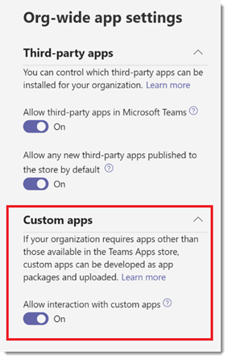

# 在 Microsoft Teams 中管理自定义应用策略和设置

> [!NOTE]
> 若要使用 App Studio，请参阅[使用 C#/.NET 和 App Studio 的Microsoft Teams平台上的开始](/microsoftteams/platform/get-started/get-started-dotnet-app-studio)。最后一步尚不起作用，因此需要下载 zip 并按旧方式在[应用包Upload安装它来Microsoft Teams](/microsoftteams/platform/concepts/apps/apps-upload)。

作为管理员，可以使用自定义应用策略和设置来控制组织中谁可以将自定义应用上传到Microsoft Teams。 管理员决定哪些用户可以上传自定义应用，管理员和团队所有者可以确定组织中的特定团队是否允许向其添加自定义应用。  编辑自定义应用策略后，更改可能需要几个小时才能生效。 必须是全局管理员或 Teams 服务管理员才能管理这些策略。

## 自定义应用概述

用户可以通过将.zip文件中的应用包 (直接上传到团队或个人上下文) ，将自定义应用添加到Teams。 这不同于通过应用存储Teams添加应用的方式。 通过上传应用包（也称为旁加载）来添加自定义应用，可让你在开发应用时对其进行测试，然后才能将其广泛分发。 它还允许你构建仅供内部使用的应用，并与团队共享它，而无需将其提交到Teams应用商店中的Teams应用目录。

## 自定义应用策略和设置

三个组件确定用户是否可以将自定义应用上传到团队，让你能够精细地控制谁可以向团队添加自定义应用，以及哪些团队可以将自定义应用添加到：

- [用户自定义应用策略](#user-custom-app-policy)
- [团队自定义应用设置](#team-custom-app-setting)
- [组织范围的自定义应用设置](#org-wide-custom-app-setting)

这些设置不会影响阻止第三方应用的能力。  

### 用户自定义应用策略

作为 [应用设置策略](teams-app-setup-policies.md)的一部分，管理员可以使用 **策略设置Upload自定义应用** 来控制用户是否可以将自定义应用上传到Teams。

如果关闭此设置：

- 用户无法将自定义应用上传到组织中或个人上下文中的任何团队。
- 用户可以与自定义应用交互，具体取决于组织范围的自定义应用设置。

如果启用此设置：

- 用户可以根据组织范围的自定义应用设置，将自定义应用上传到允许自定义应用的团队及其所有者所在的团队。
- 用户可以将自定义应用上传到个人上下文。
- 用户可以与自定义应用交互，具体取决于组织范围的自定义应用设置。

可以编辑全局应用设置策略中的设置以包含所需的应用。 如果要为组织中的不同用户组自定义Teams，请创建并分配一个或多个自定义应用设置策略。

#### 设置用户自定义应用策略

1. 在Microsoft Teams管理中心的左侧导航中，转到 **Teams应用** > **设置策略**。
2. 单击“**添加**”。
3. 打开或关闭 **Upload自定义应用**。
4. 选择要用于策略的任何其他设置。
5. 单击“**保存**”。

### 团队自定义应用设置

管理员和团队所有者可以控制团队是否允许向其添加自定义应用。 此设置 **允许成员上传自定义应用**，以及用户的自定义应用策略确定谁可以将自定义应用添加到特定团队。

如果关闭此设置：

- 团队所有者可以添加自定义应用（如果他们的自定义应用策略允许）。
- 不是团队所有者的团队成员无法向团队添加自定义应用。

如果启用此设置：

- 团队所有者可以添加自定义应用（如果他们的自定义应用策略允许）。
- 不是团队所有者的团队成员可以添加自定义应用（如果他们的自定义应用策略允许）。

#### 配置团队自定义应用设置

1. 在Teams中，转到团队，单击 **“更多选项...** > ”**管理团队**。
2. 单击 **设置**，然后展开 **成员权限**。
3. 选中或清除 **“允许成员上传自定义应用** ”复选框。

    

### 组织范围的自定义应用设置

“管理应用”页上允许 **与自定义应用** 组织范围的自定义 [应用](manage-apps.md) 设置交互适用于组织中的每个人，并控制他们是否可以上传或与自定义应用交互。 此设置充当用户和团队自定义应用策略设置的主开/关开关。 它旨在在安全事件期间充当主开/关开关。 因此，用户和团队自定义应用策略设置不会生效，除非启用组织范围的自定义应用设置，即使启用了用户和团队自定义应用策略设置。

#### 配置组织范围的自定义应用设置

1. 在 Microsoft Teams 管理中心的左侧导航中，转到“**Teams 应用**” > “**管理应用**”。
2. 单击 **组织范围的应用设置**。
3. 在 **“自定义应用**”下，打开或关闭 **允许与自定义应用交互**。

    

## 自定义应用策略和设置如何协同工作

下表汇总了自定义应用策略和设置、它们如何协同工作，以及它们对控制组织中谁可以将自定义应用上传到Teams的综合作用。

例如，你希望仅允许团队所有者将自定义应用上传到特定团队。 你将设置以下内容：

- 在Microsoft Teams管理中心启用 **允许与自定义应用** 设置的交互。
- 关闭允许成员为要限制其访问权限的每个团队 **上传自定义应用** 。
- 在Microsoft Teams管理中心创建并分配自定义应用设置策略，并启用 **Upload自定义应用** 设置，并将其分配给团队所有者。

|组织范围的自定义应用设置 |团队自定义应用设置 |用户自定义应用策略 |影响  |
|---------|---------|---------|---------|
| 关闭    | 关闭    | 关闭     |组织会阻止与所有自定义应用的交互。 除Teams服务管理员或全局管理员外，任何人都无法上传自定义应用。可以使用 PowerShell 删除自定义应用。   |
| 关闭     | 关闭     | 开        |组织会阻止与所有自定义应用的交互。 除Teams服务管理员或全局管理员外，任何人都无法上传自定义应用。可以使用 PowerShell 删除自定义应用。         |
| 关闭    | 开        | 关闭        |组织会阻止与所有自定义应用的交互。 除Teams服务管理员或全局管理员外，任何人都无法上传自定义应用。可以使用Windows PowerShell删除自定义应用。         |
| 关闭    | 开      | 开       |组织会阻止与所有自定义应用的交互。 除Teams服务管理员或全局管理员外，任何人都无法上传自定义应用。可以使用 PowerShell 删除自定义应用。         |
| 开    | 关闭       | 关闭         |  用户无法上传自定义应用。      |
| 开     | 关闭       | 开         | 如果用户是团队所有者，则他们可以将自定义应用上传到团队。 如果用户不是团队所有者，则无法将自定义应用上传到团队。 用户可以在个人上下文中上传自定义应用。     |
| 开     | 开     | 关闭         | 用户无法上传自定义应用。       |
| 开    | 开        | 开        | 无论用户是否是团队所有者，用户都可以将自定义应用上传到团队。 用户可以在个人上下文中上传自定义应用。       |

## 相关主题

[Teams 中应用的管理设置](admin-settings.md)

[向 Teams 中的用户分配策略](assign-policies-users-and-groups.md)
