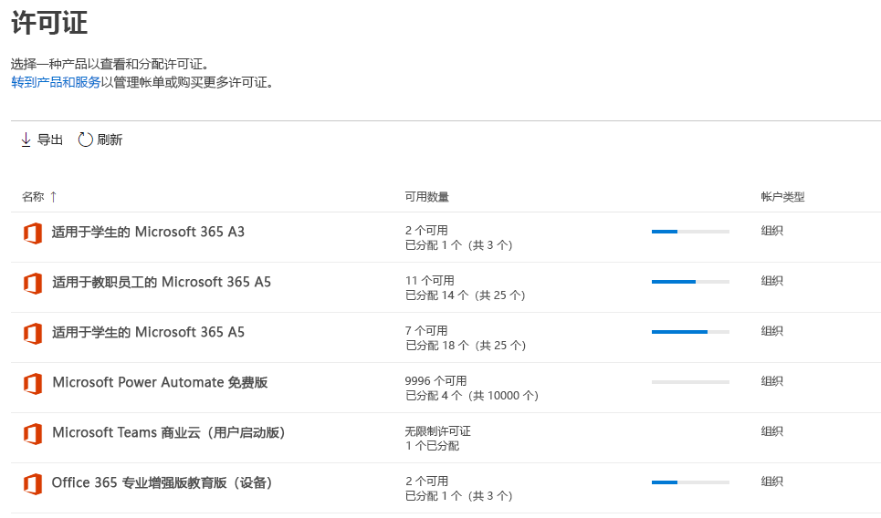
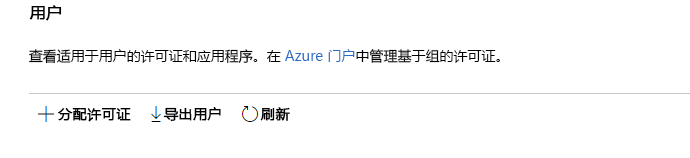
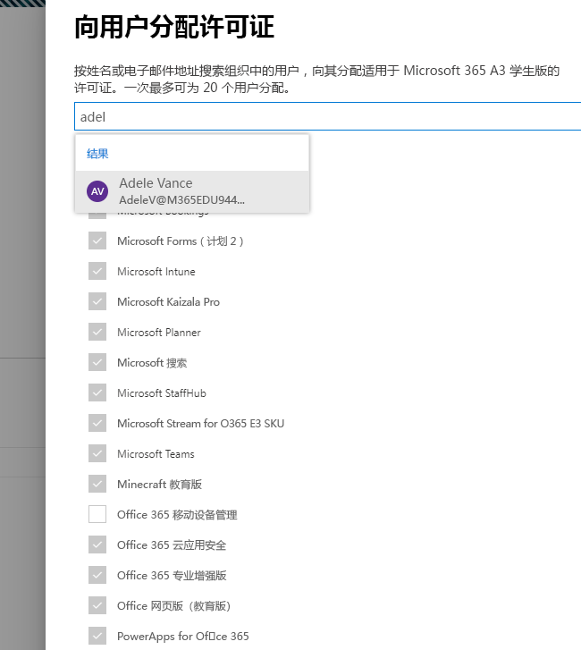
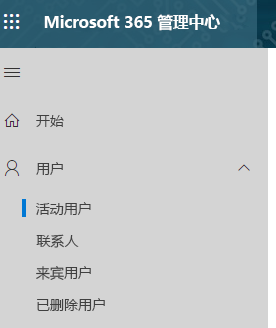
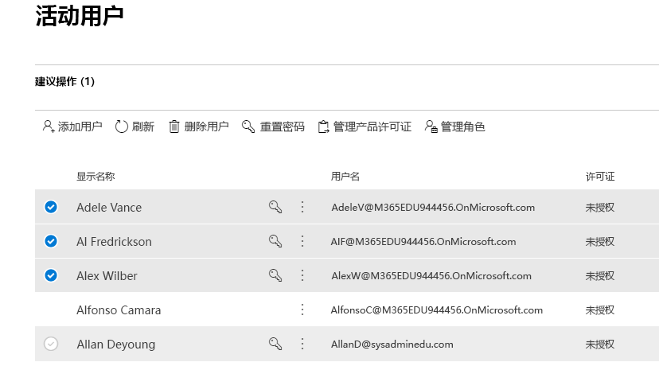
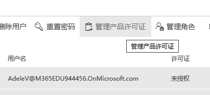
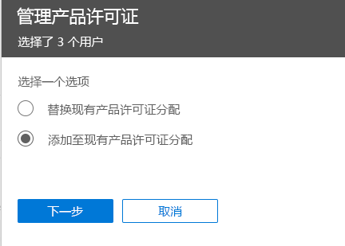
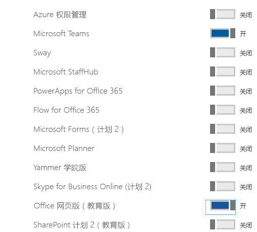

# 为教育版分配 Microsoft Teams 许可证Assign Microsoft Teams licenses for EDU

Microsoft Teams 是一个数字中心，其中汇聚了对话、内容及应用。Microsoft Teams is a digital hub that brings conversations, content, and apps together in one place. 由于它是基于 Office 365 构建的，因此学校可以从与他们熟悉的 Office 应用和服务的集成中受益。Because it's built on Office 365, schools benefit from integration with their familiar Office apps and services. 你的机构可以使用 Microsoft Teams 创建协作式教室、连接专业学校社区并与学校教职员工进行沟通 - 一切皆可通过 Office 365 教育版中的单一体验来实现。Your institution can use Microsoft Teams to create collaborative classrooms, connect in professional learning communities, and communicate with school staff all from a single experience in Office 365 for Education.

首先，IT 管理员需要使用 Microsoft 365 管理中心[为你的学校启用 Microsoft Teams](/microsoft-365/education/intune-edu-trial/enable-microsoft-teams)。To get started, IT administrators need to use the Microsoft 365 Admin Center to [enable Microsoft Teams for your school](/microsoft-365/education/intune-edu-trial/enable-microsoft-teams).
完成后，你必须为用户帐户分配许可证，以便你的教职员工和学生可以访问 Office 365 服务，例如 Microsoft Teams。Once complete, you must assign licenses to user accounts so your faculty, staff, and students can access Office 365 services, such as Microsoft Teams.

可通过组成员身份单独或自动向用户帐户分配许可证。You can assign licenses to user accounts either individually or automatically through group membership. 本文将向你介绍如何通过 Microsoft 365 管理中心将 Office 365 许可证分配给单个或一小组用户帐户。This article will walk you through how to assign Office 365 licenses to an individual or a small set of user accounts via the Microsoft 365 admin center. 要通过组成员身份自动分配许可证，请参阅我们的以下支持文章之一：To assign licenses automatically through group membership, see one of our supporting articles:

- [Office 365 PowershellOffice 365 Powershell](/office365/enterprise/powershell/assign-licenses-to-user-accounts-with-office-365-powershell)
- [Active Directory 中基于组的许可Group-based Licensing in Active Directory](/azure/active-directory/users-groups-roles/licensing-groups-assign)

可在“**许可证**”页面或“**活动用户**”页面上向用户分配许可证。You can assign licenses to users on either the **Licenses** page, or on the **Active Users** page. 使用哪种方法取决于是要向特定用户分配产品许可证还是向特定产品分配用户许可证。Which method you use depends on whether you want to assign product licenses to specific users, or assign users licenses to specific products.

> [!NOTE]
> 如果未使用新的 Microsoft 365 管理中心，可通过选择“**试用新的管理中心**”切换按钮（位于主页顶部）将其打开。If you're not using the new Microsoft 365 admin center, you can turn it on by selecting the **Try the new admin center** toggle located at the top of the Home page.

## 在“许可证”页面上向用户分配许可证Assign licenses to users on the Licenses page

> [!NOTE]
> 你必须是全局管理员、账单管理员、许可证管理员或用户管理管理员。有关详细信息，请参阅[关于 Office 365 管理员角色](/microsoft-365/admin/add-users/about-admin-roles)。You must be a Global admin, Billing admin, License admin, or User management admin. For more information, see [About Office 365 admin roles](/microsoft-365/admin/add-users/about-admin-roles).

使用“**许可证**”页面分配许可证时，最多可向 20 名用户分配特定产品的许可证。When you use the **Licenses** page to assign licenses, you assign licenses for a specific product for up to 20 users. 在“**许可证**”页面上，你会看到你已订阅的所有产品的列表，还有每个产品的许可证总数、已分配的许可证数以及可用的许可证数。On the **Licenses** page, you see a list of all the products you have subscriptions for, together with the total number of licenses for each product, how many licenses are assigned, and how many are available.

1. 在管理中心，转到“**账单**” > “[许可证](https://go.microsoft.com/fwlink/p/?linkid=842264)”页面。In the admin center, go to the **Billing** > [Licenses](https://go.microsoft.com/fwlink/p/?linkid=842264) page.

   
2. 选择要为其分配许可证的产品。Select a product for which you want to assign licenses. Microsoft Teams 是免费的 Office 365 A1 学生版 SKU 的一部分。Microsoft Teams is part of the free Office 365 A1 for Students SKU.

   
3. 选择“**分配许可证**”。Select **Assign licenses**.

   
4. 在“**向用户分配许可证**”窗格中，开始键入名称，该名称应生成一个名称列表。In the **Assign licenses to users** pane, begin typing a name, which should generate a list of names. 从结果中选择要查找的名称，以将其添加到列表中。Choose the name you're looking for from the results to add it to the list. 一次最多可添加 20 名用户。You can add up to 20 users at a time.

   
5. 选择“**打开或关闭应用和服务**”，向特定项目（例如 Microsoft Teams）分配访问权限或删除其访问权限。Select **Turn apps and services on or off** to assign or remove access to specific items, such as Microsoft Teams. 请确保已选中 **Microsoft Teams** 和 **Office 网页版（教育版）**。Ensure **Microsoft Teams** and **Office for the web (Education)** are selected.
6. 完成后，选择“**分配**”，然后选择“**关闭**”。When you're finished, select **Assign**, then select **Close**.

要更改应用和服务，用户需有权限：To change the apps and services a user has access to:

1. 选择包含该用户的行。Select the row that contains the user.
1. 在右侧窗格中，选择或取消选择要授予或取消访问权限的应用和服务。In the right pane, select or deselect the apps and services that you want to give access to, or remove access from.
1. 完成后，选择“**保存**”，然后选择“**关闭**”。When you're finished, select **Save**, then select **Close**.

## 在“活动用户”页面上向单个或多个用户分配许可证Assign licenses to an individual or multiple users on the Active users page

1. 在管理中心，转到“**用户**” > “[活动用户](https://go.microsoft.com/fwlink/p/?linkid=834822)”页面。In the admin center, go to the **Users** > [Active users](https://go.microsoft.com/fwlink/p/?linkid=834822) page.

   
2. 选中要向其分配许可证的用户姓名旁边的圆圈。Select the circles next to the name(s) of the user(s) you want to assign license(s) to.

   
3. 在顶部，选择“**管理产品许可证**”。At the top select **Manage product licenses**.

   
4. 在“**管理产品许可证**”窗格中，选择“**添加到现有产品许可证分配**” > “**下一步**”。In the **Manage product licenses** pane, select **Add to existing product license assignments** > **Next**.

   
5. 在“**添加到现有产品**”窗格中，将希望所选用户具备的许可证的开关切换到“**开**”位置。In the **Add to existing products** pane, switch the toggle to the **On** position for the license that you want the selected users to have. 请确保已选中 **Microsoft Teams** 和 **Office 网页版（教育版）**。Ensure **Microsoft Teams** and **Office for the web (Education)** are selected.

   

   默认情况下，与这些许可证关联的所有服务都将自动分配给该用户。By default, all services associated with those license(s) are automatically assigned to the user(s). 可限制能提供给用户的具体服务。You can limit which services are available to the users. 将不希望所选用户具备的服务的开关切换到“**关**”。Switch the toggles to the **Off** position for the services that you don't want the users to have.
6. 在窗格底部，选择“添加”>“关闭”。At the bottom of the pane, select Add > Close.