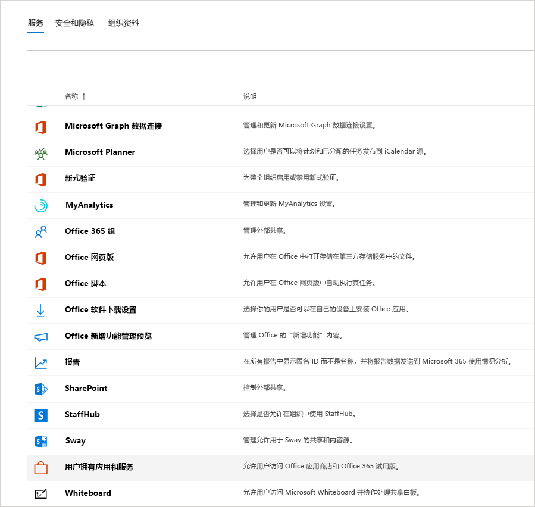
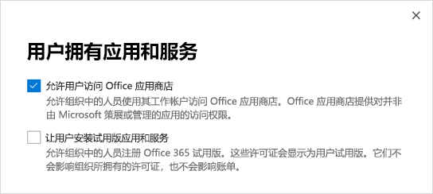

管理 Microsoft Teams Exploratory 许可证Manage the Microsoft Teams Exploratory license
=======================================================

借助 Microsoft Teams Exploratory 体验，组织中拥有 Azure Active Directory (AAD) 且未获得 Teams 许可的用户可以启用 Teams 的探索体验。The Microsoft Teams Exploratory experience lets users in your organization who have Azure Active Directory (AAD) and are not licensed for Teams initiate an exploratory experience of Teams. 管理员可以为组织中的用户打开或关闭此功能。Admins can switch this feature on or off for users in their organization. 以前的 [Microsoft 商业云试用版](iw-trial-teams.md)现在替换为 Teams Exploratory 体验。The earlier [Microsoft Commercial Cloud Trial](iw-trial-teams.md) is now replaced by The Teams Exploratory experience.

## Teams Exploratory 体验中包含哪些服务？What's in the Teams Exploratory experience?

管理员将在 Teams Exploratory 体验中看到的服务计划有：The service plans that an admin will see as part of the Teams Exploratory experience are:
 - Exchange Online（计划 1)Exchange Online (Plan 1)
 - 适用于 Microsoft 365 或 Office 365 的流Flow for Microsoft 365 or Office 365
 - MyAnalytics 提供的见解Insights by MyAnalytics
 - Microsoft Forms（计划 E1）Microsoft Forms (Plan E1)
 - Microsoft PlannerMicrosoft Planner
 - Microsoft 搜索Microsoft Search
 - Microsoft StaffHubMicrosoft StaffHub
 - 适用于 Microsoft 365 和 Office 365 E1 SKU 的 Microsoft StreamMicrosoft Stream for Microsoft 365 and Office 365 E1 SKUs
 - Microsoft TeamsMicrosoft Teams
 - 适用于 Microsoft 365 或 Office 365 的移动设备管理Mobile Device Management for Microsoft 365 or Office 365
 - 适用于 Office 365 的 Office 移动应用Office Mobile Apps for Office 365 
 - Office OnlineOffice Online
 - 适用于 Microsoft 365 或 Office 365 的 PowerAppsPowerApps for Microsoft 365 or Office 365
 - SharePoint Online（计划 1）SharePoint Online (Plan 1)
 - SwaySway
 - 待办事项（计划 1）To-Do (Plan 1)
 - Whiteboard（计划 1）Whiteboard (Plan 1)
 - Yammer 企业版Yammer Enterprise

## 谁有资格使用？Who's eligible?

只要用户拥有托管 AAD 域电子邮件地址，且当前没有/尚未分配有 Teams 许可证，则有资格运行此体验。As long as the user has a managed AAD domain email address and currently does not have/haven't been assigned a Teams license, they are eligible for this experience. 例如，如果用户拥有 Microsoft 365 商业应用版（不包括 Teams），则他们符合获取 Teams Exploratory 体验的条件。For example, if a user has Microsoft 365 Apps for business (which doesn't include Teams), they're eligible for the Teams Exploratory experience.

必须允许用户注册应用和试用版（在 Microsoft 365 管理中心中）。Users must be enabled to sign up for apps and trials (in the Microsoft 365 admin center). 有关详细信息，请参阅本文后面部分的[管理 Teams Exploratory 体验](#manage-the-teams-exploratory-experience)。For more information, see [Manage the Teams Exploratory experience](#manage-the-teams-exploratory-experience), later in this article. 

## 谁没有资格使用Who isn't eligible

如果你是联合合作伙伴客户，或者是 GCC、GCC High、DoD 或 EDU 客户，则你的组织没有资格使用该服务。Your organization isn't eligible for this offer if you're a Syndication Partner Customer or a GCC, GCC High, DoD, or EDU customer.

## 如何注册 Teams Exploratory 体验？How users sign up for the Teams Exploratory experience

符合条件的用户可通过登录到 Teams ([teams.microsoft.com](https://teams.microsoft.com)) 注册 Teams Exploratory 体验。Eligible users can sign up for the Teams Exploratory experience by signing in to Teams ([teams.microsoft.com](https://teams.microsoft.com)). 将自动向其分配此许可证，并且租户管理员会在组织中有人首次启动 Teams Exploratory 体验时收到一封电子邮件通知。They will be assigned this license automatically and the tenant admin will receive an email notification the first time someone in your org starts the Teams Exploratory experience.

## 管理 Teams 探索性体验Manage the Teams Exploratory experience

Teams Exploratory 体验设计为由单独的最终用户启动，你不能代表最终用户员工启动此服务。The Teams Exploratory experience is meant to be initiated by individual end users, and you may not initiate this offer on behalf of end-user employees.

Teams Exploratory 体验附带 Exchange Online 许可证，但它不会在管理员进行分配前分配给用户。The Teams Exploratory experience comes with an Exchange Online license but it won't be assigned to the user until the admin assigns it. 如果用户没有 Exchange 许可证并且管理员尚未分配 Exchange Online 许可证，则用户将无法在 Teams 中计划会议，并且可能无法使用其他 Teams 功能。If the user doesn't have an Exchange license already and the admin has yet to assign the Exchange Online license, the user won't be able to schedule meetings in Teams and may be missing other Teams functionality.

管理员可以通过使用**试用版应用和服务**开关，禁用最终用户在其组织内运行 Teams Exploratory 体验的功能。Admins can disable the ability for end users to run the Teams Exploratory experience within their organization by using the **Trial apps and services** switch.

### 阻止用户安装试用版应用和服务Prevent users from installing trial apps and services

可禁止用户安装试用版应用和服务，这会阻止用户运行 Teams 探索体验。You can turn off a user's ability to install trial apps and services, which would prevent the user from running the Teams Exploratory experience. 

1. 从 Microsoft 365 管理中心，转到“**设置**” > “**组织设置**”，选择“**服务**”，然后选择“**用户自有应用和服务**”。From the Microsoft 365 admin center, go to **Settings** > **Org settings**, select **Services**, and then select **User owned apps and services**.

    

2. 清除**允许用户安装试用版应用和服务**复选框。Clear the **Let users install trial apps and services** check box.

    

    > [!NOTE]
    > 如果你的组织不符合获取 Teams Exploratory 的条件，你将看不到“**允许用户安装试用版应用和服务**”选项。If your organization is ineligible for the Teams Exploratory experience, you won't see the **Let users install trial apps and services** option.

### 为拥有包含 Teams 的许可证的用户管理可用性Manage availability for a user with a license that includes Teams

分配了包含 Teams 的许可证的用户不符合获取 Teams Exploratory 的条件。A user who is assigned a license that includes Teams isn't eligible for the Teams Exploratory experience. 启用 Teams 服务计划时，用户可登录并使用 Teams。When the Teams service plan is turned on, the user can sign in and use Teams. 如果禁用服务计划，则用户无法登录，并且 Teams Exploratory 体验不可用。If the service plan is disabled, the user can't sign in and the Teams Exploratory experience isn't available. 必须具有管理员权限。You must have admin privileges. 

关闭对 Teams 的访问：To turn off access to Teams:

1. 在 Microsoft 365 管理中心中，选择“**用户**” > “**活动用户**”。In the Microsoft 365 admin center, select **Users** > **Active users**.

2. 选择用户姓名旁的框。Select the box next to the name of the user.

3. 在右侧的“**产品许可证**”行中，选择“**编辑**”。On the right, in the **Product licenses** row, choose **Edit**.

4. 在“**产品许可证**”窗格中，将开关切换为“**关闭**”。In the **Product licenses** pane, switch the toggle to **Off**.

    

### 为已在使用 Teams Exploratory 体验的用户管理团队可用性Manage Teams availability for users who are already using the Teams Exploratory experience

如果用户运行 Teams Exploratory 体验，则可以通过删除许可证或服务计划将其关闭。If a user is running the Teams Exploratory experience, you can turn it off by removing the license or service plan. 必须具有管理员权限。You must have admin privileges. 

若要关闭 Teams Exploratory 体验许可证，请执行以下操作：To turn off the the Teams Exploratory experience license:

1. 在 Microsoft 365 管理中心中，选择“**用户**” > “**活动用户**”。In the Microsoft 365 admin center, select **Users** > **Active users**.

2. 选择用户姓名旁的框。Select the box next to the name of the user.

3. 在右侧的“**产品许可证**”行中，选择“**编辑**”。On the right, in the **Product licenses** row, choose **Edit**.

4. 在“**产品许可证**”窗格中，将此 Exploratory 许可证的开关切换为“**关**”。In the **Product licenses** pane, switch the toggle for this exploratory license to **Off**.
   
    >[!Note]
    >组织中的第一位用户启动 Teams Exploratory 体验后，将显示 Teams Exploratory 切换开关。The Teams Exploratory toggle switch will appear after the first user in the organization launches the Teams Exploratory experience.

### 为拥有 Teams Exploratory 许可证的用户管理 TeamsManage Teams for users who have the Teams Exploratory license

你可以管理拥有 Teams Exploratory 许可证的用户，就像管理具有常规付费许可证的用户一样。You can manage users who have the Teams Exploratory license just like you manage users who have a regular paid license. 有关详细信息，请参阅[为你的组织管理 Teams 设置](enable-features-office-365.md)。For more information, see [Manage Teams settings for your organization](enable-features-office-365.md).

### 从 Teams Exploratory 许可证升级用户Upgrade users from the Teams Exploratory license

要从 Teams Exploratory 许可证升级用户（必须拥有管理员权限），请执行以下操作：To upgrade users from the Teams Exploratory license (you must have admin privileges), do the following:

1. 购买包含 Teams 的订阅。Purchase a subscription that includes Teams.

2. 删除用户的 Teams Exploratory 订阅。Remove the Teams Exploratory subscription from the user.

3. 分配新购买的许可证。Assign the newly purchased license.

有关详细信息，请参阅 [Microsoft Teams 服务说明](https://docs.microsoft.com/office365/servicedescriptions/teams-service-description)。For more information, see [Microsoft Teams service description](https://docs.microsoft.com/office365/servicedescriptions/teams-service-description).

> [!NOTE]
> 如果 Teams Exploratory 许可证到期，而用户未立即升级到包含 Teams 的订阅，则不删除该用户数据。If the Teams Exploratory license ends and a user isn't immediately upgraded to a subscription that includes Teams, the user data is not removed. 该用户仍保留在 Azure Active Directory 中，且 Teams 中的所有数据都将保留。The user still exists in Azure Active Directory and all data within Teams still remains. 一旦向该用户分配新的许可证来重新启用 Teams 功能，则所有内容仍将存在。Once a new license is assigned to the user to enable Teams functionality again, all content will still exist. 

## 这对旧版 Microsoft Teams 商业云试用版许可证有何影响？What happens to legacy Microsoft Teams Commercial Cloud Trial licenses?

从 2020 年 2 月起，符合条件的用户可开始使用最新的 Microsoft Teams Exploratory 体验。As of February, 2020, eligible users can begin using the latest Microsoft Teams Exploratory experience. 所有旧版 Teams 商业云试用版许可证将在试用版到期前自动转换为新的服务。All legacy Teams Commercial Cloud Trial licenses will be automatically converted to the new offer before their trial expires.

当用户首次登录到其过期的 Teams 商业云试用版时，我们会自动向该用户分配 Teams Exploratory 体验许可证。When a user signs in to their expired Teams Commercial Cloud Trial for the first time, we automatically assign a Teams Exploratory experience license to that user. 用户在登录前不会进行转换。Users aren't converted until they sign in.

### 删除 Teams Exploratory 许可证Remove a Teams Exploratory license

- 如果要通过 PowerShell 删除此许可证，请参阅：[使用 Office 365 PowerShell 删除用户帐户的许可证](https://docs.microsoft.com/office365/enterprise/powershell/remove-licenses-from-user-accounts-with-office-365-powershell)If you would like to remove this license by using PowerShell, see: [Remove licenses from user accounts with Office 365 PowerShell](https://docs.microsoft.com/office365/enterprise/powershell/remove-licenses-from-user-accounts-with-office-365-powershell)

- 如果要通过管理门户删除此许可证，请参阅[从组织删除用户](https://docs.microsoft.com/microsoft-365/admin/add-users/delete-a-user)If you would like to remove this license through the admin portal, see: [Delete a user from your organization](https://docs.microsoft.com/microsoft-365/admin/add-users/delete-a-user)

## Teams Exploratory 体验持续多长时间？How long does the Teams Exploratory experience last?

在 2021 年 1 月或之后的下一个**协议周年日**或**续订**前，使用 Microsoft Teams 探索体验都是免费的。The Microsoft Teams Exploratory experience is available at no additional cost until your next **agreement anniversary** or **renewal** on or after January 2021. 届时，Microsoft Exploratory 体验许可证的最终用户需要迁移到包含 Teams 的付费许可证。At that time, end users on a Microsoft Exploratory experience license will need to move to a paid license that includes Teams. 此后启动的任何 Microsoft 探索体验许可证在下一个**周年日**或**续订**周期前一直都是免费的。Any Microsoft Exploratory experience licenses initiated after that will remain available at no additional cost until your next **anniversary** or **renewal** cycle. 

### 如果最终用户刚好在我的周年纪念或续订日期前启动 Microsoft Teams Exploratory 体验，会发生什么情况？What happens if an end user initiates the Microsoft Teams Exploratory experience just before my anniversary or renewal date?

在**协议周年日**或**续订**后的 90 天内启动的 Microsoft Teams 探索体验许可证无需迁移到付费许可证，直到下一个周年日或续订周期。Microsoft Teams Exploratory experience licenses initiated within 90 days of your **agreement anniversary** or **renewal** will not be required to move to a paid license until the subsequent anniversary or renewal cycle. 

### 如果我的协议没有周年日或每年的续约日期（例如逐月协议），该怎么办？What if my agreement doesn’t have an anniversary or yearly renewal date (for example, month-to-month agreements)?

对于无周年日或年度续订日期的协议，第一位最终用户后面的年份激活 Microsoft 团队探索体验许可证将被视为周年日或续订日期。For agreements without an anniversary or yearly renewal date, the subsequent year after the first end user activates the Microsoft Teams Exploratory experience licenses will be treated as the anniversary or renewal date. 根据上述策略，必须在每年的此日期之前将拥有 Microsoft Teams 探索许可证的用户转换为付费许可证。Users on the Microsoft Teams Exploratory license must be converted to a paid license by that date each year, according to the policies outlined above.

例如，如果第一位最终用户在 2020 年 6 月 19 日激活了 Microsoft Teams 探索，则他们和客户租户中的所有其他符合条件的用户必须在 2021 年 6月 19 日之前转换为 Teams 付费许可证。For example, if the first end user activates Microsoft Teams Exploratory on June 19, 2020, then they and all other eligible users in the customer tenant must convert to a paid license with Teams by June 19, 2021. 
