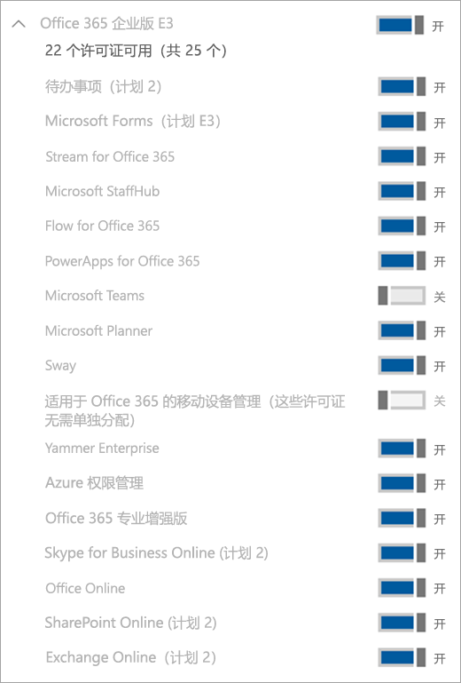

# 管理 Microsoft Teams Exploratory 许可证

The Microsoft Teams Exploratory experience lets users in your organization who have Azure Active Directory (Azure AD) and aren't licensed for Teams initiate an exploratory experience of Teams. Admins can switch this feature on or off for users in their organization.

## Teams Exploratory 体验中包含哪些服务

管理员将在 Teams Exploratory 体验中看到的服务计划有：

- Exchange Online（计划 1)
- 适用于 Microsoft 365 或 Office 365 的流
- MyAnalytics 提供的见解
- Microsoft Forms（计划 E1）
- Microsoft Planner
- Microsoft 搜索
- Microsoft StaffHub
- 适用于 Microsoft 365 和 Office 365 E1 SKU 的 Microsoft Stream1</1>
- Microsoft Teams
- 适用于 Microsoft 365 或 Office 365 的移动设备管理
- 适用于 Office 365 的 Office 移动应用
- Office Online
- 适用于 Microsoft 365 或 Office 365 的 Power Apps
- SharePoint Online（计划 1）
- Sway
- 待办事项（计划 1）
- Whiteboard（计划 1）
- Yammer 企业版

  1 The change from using Microsoft Stream to [OneDrive for Business and SharePoint for meeting recordings](tmr-meeting-recording-change.md) will be a phased approach. At launch, you'll be able to opt in to this experience. In November, you'll have to opt out if you want to continue using Stream. Sometime in early 2021, we'll require all customers to use OneDrive for Business and SharePoint for new meeting recordings.

## 符合资格的人员

用户符合 Teams 探索体验的标准，如果他们：

- 具有托管 Azure AD 域电子邮件地址。
- 属于付费订阅的租户。
- 没有有效的 Teams 许可证。
- 不在创建许可证分配策略的租户中。

Users must be enabled to sign up for apps and trials (in the Microsoft 365 admin center). For more information, see [Manage the Teams Exploratory experience](#manage-the-teams-exploratory-experience), later in this article.

## 谁没有资格使用

用户在以下情况下不适合条件：

- 当前拥有来自付费许可证或试用许可证的 Teams，或以前具有试用许可证
- 位于至少已使用或收到一个特殊 COVID 优惠的租户中。

如果你是联合合作伙伴客户，或者是 GCC、GCC High、DoD 或 EDU 客户，则你的组织没有资格使用该服务。

## 如何注册 Teams 探索体验？

符合条件的用户可通过登录到 Teams 桌面版或 Web 版 ([teams.microsoft.com](https://teams.microsoft.com)) 来注册 Teams Exploratory 体验。 目前，不支持通过移动设备启用 Exploratory。 当他们注册时，系统将自动向其分配此许可证，并且租户管理员会在组织中有人首次启动 Teams Exploratory 体验时收到一封电子邮件通知。

## 管理 Teams 探索体验

Teams 探索体验设计为由单独的最终用户启动，你不能代表最终用户员工启动此服务。

The Teams Exploratory experience comes with an Exchange Online license, but it won't be assigned to the user until the admin assigns it. If the user doesn't have an Exchange license already, and the admin has yet to assign the Exchange Online license, the user won't be able to schedule meetings in Teams and might be missing other Teams functionality.

管理员可以通过使用 **试用版应用和服务** 开关，禁用最终用户在其组织内运行 Teams 探索体验的功能。

### 阻止用户安装试用版应用和服务

可禁止用户安装试用版应用和服务，这会阻止用户运行 Teams 探索体验。

1. 从 Microsoft 365 管理中心，转到“**设置**” > “**组织设置**”，选择“**服务**”，然后选择“**用户自有应用和服务**”。

    

2. 清除“**允许用户安装试用版应用和服务**”的复选标记。

    

    > [!NOTE]
    > 如果你的组织不符合获取 Teams 探索体验的条件，你将看不到“**允许用户安装试用版应用和服务**”选项。

### 为拥有包含 Teams 的许可证的用户管理可用性

A user who is assigned a license that includes Teams isn't eligible for the Teams Exploratory experience. When the Teams service plan is turned on, the user can sign in and use Teams. If the service plan is disabled, the user can't sign in and the Teams Exploratory experience isn't available. You must have admin privileges.

关闭对 Teams 的访问：

1. 在 Microsoft 365 管理中心中，选择“**用户**” > “**活动用户**”。

2. 选择用户姓名旁边的框。

3. 在“**产品许可证**”行中，选择“**编辑**”。

4. 在“**产品许可证**”窗格中，将开关切换为“**关闭**”。

    

### 为已在使用 Teams 探索体验的用户管理 Teams 可用性

If a user is running the Teams Exploratory experience, you can turn it off by removing the license or service plan. You must have admin privileges.

若要关闭 Teams 探索体验许可证，请执行以下操作：

1. 在 Microsoft 365 管理中心中，选择“**用户**” > “**活动用户**”。

2. 选择用户姓名旁边的框。

3. 在“**产品许可证**”行中，选择“**编辑**”。

4. 在“**产品许可证**”窗格中，将此探索许可证的开关切换为“**关**”。

    > [!NOTE]
    > 组织中的第一位用户启动 Teams Exploratory 体验后，将显示 Teams Exploratory 切换开关。

### 为拥有 Teams 探索许可证的用户管理 Teams

You can manage users who have the Teams Exploratory license just like you manage users who have a regular paid license. For more information, see [Manage Teams settings for your organization](enable-features-office-365.md).

### 从 Teams 探索升级用户

必须具有管理员权限才能从 Teams 探索升级用户。 有关详细信息，请参阅 [从 Teams 探索试用版升级用户](upgrade-from-teams-exploratory.md)。

> [!NOTE]
> If the Teams Exploratory license ends and a user isn't immediately upgraded to a subscription that includes Teams, they lose access to Teams after a 30-days grace period. Another 30 days after which, the data is deleted. The user still exists in Azure Active Directory. Once a new license is assigned to the user to enable Teams functionality again, all content will still exist if the user is added within the grace period time frame.

### 删除 Teams 探索许可证

- 如果要通过 PowerShell 删除此许可证，请参阅：[使用 Office 365 PowerShell 删除用户帐户的许可证](/office365/enterprise/powershell/remove-licenses-from-user-accounts-with-office-365-powershell)

- 如果要通过管理门户删除此许可证，请参阅：[从组织删除用户](/microsoft-365/admin/add-users/delete-a-user)

## 什么是数据保留策略？

请参阅 [Microsoft 365 订阅信息](/microsoft-365/commerce/subscriptions/what-if-my-subscription-expires?view=o365-worldwide)。

## Teams 探索体验持续多长时间

Teams 探索向所有新客户提供为期 12 个月的订阅（从初始用户注册开始）。 当组织中第一个用户注册 Teams Exploratory 时，新的 Teams Exploratory 订阅将启动，并且将在 12 个月后过期。 12个月的期限从第一个用户的注册日开始，这有效期将适用于同一租户中的所有用户。

> [!NOTE]
> 体验的结束日期是在组织层面进行配置的，这意味着它将适用于同一组织的所有用户。 例如，用户 1 于 2021 年 1 月 1 日注册订阅。 这将在 2021 年 12 月 31 日启动订阅结束日期。 另一个用户 User 2 于 2021 年 10 月 1 日注册订阅。 用户 2 可使用 Teams Exploratory 两个月，因为用户 1 和 用户 2 都属于同一个组织都订阅，所以他们的订阅都将于2021年12月31日结束。

### 在 12 个月的 Teams Exploratory 体验结束后，管理员应该怎么做

在 12 个月的订阅结束时，管理员应将其所有 Teams Exploratory 用户转换为包括 Teams 的付费许可证。 确保在Teams Exploratory订阅到期前完成这项工作至关重要，以避免对用户的体验造成任何干扰。

> [!NOTE]
> 在上一个探索体验许可证到期后的 3 个月内客户将被禁用并阻止开始新的探索试用许可证。

有关详细信息，请参阅上文中的 [从 Teams 探索中升级用户](#upgrade-users-from-teams-exploratory)。
