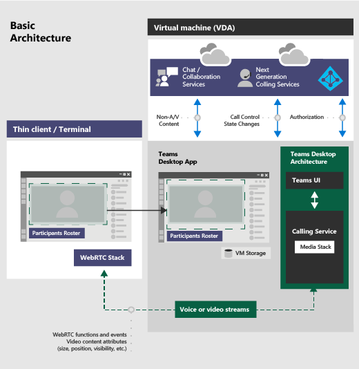

# <a name="teams-for-virtualized-desktop-infrastructure"></a><span data-ttu-id="1cfbd-103">适用于虚拟化桌面基础结构的 Teams</span><span class="sxs-lookup"><span data-stu-id="1cfbd-103">Teams for Virtualized Desktop Infrastructure</span></span>

<span data-ttu-id="1cfbd-104">本文介绍在虚拟化环境中使用 Microsoft 团队的要求和限制。</span><span class="sxs-lookup"><span data-stu-id="1cfbd-104">This article describes the requirements and limitations for using Microsoft Teams in a virtualized environment.</span></span>

## <a name="what-is-vdi"></a><span data-ttu-id="1cfbd-105">什么是 VDI？</span><span class="sxs-lookup"><span data-stu-id="1cfbd-105">What is VDI?</span></span>

<span data-ttu-id="1cfbd-106">虚拟桌面基础结构 (VDI) 是在数据中心的集中式服务器上托管桌面操作系统和应用程序的虚拟技术。</span><span class="sxs-lookup"><span data-stu-id="1cfbd-106">Virtual Desktop Infrastructure (VDI) is virtualization technology that hosts a desktop operating system and applications on a centralized server in a data center.</span></span> <span data-ttu-id="1cfbd-107">这使具有完全安全和合规的集中源的用户能够获得完全个性化的桌面体验。</span><span class="sxs-lookup"><span data-stu-id="1cfbd-107">This enables a fully personalized desktop experience to users with a fully secured and compliant centralized source.</span></span>

<span data-ttu-id="1cfbd-108">虚拟环境中的 Microsoft 团队支持聊天和协作。</span><span class="sxs-lookup"><span data-stu-id="1cfbd-108">Microsoft Teams in a virtualized environment supports chat and collaboration.</span></span> <span data-ttu-id="1cfbd-109">通过 Windows 虚拟桌面版或 Citrix 平台，也支持呼叫和会议功能。</span><span class="sxs-lookup"><span data-stu-id="1cfbd-109">And with the Windows Virtual Desktop or Citrix platforms, calling and meeting functionality also are supported.</span></span>

<span data-ttu-id="1cfbd-110">虚拟环境中的团队支持多个配置。</span><span class="sxs-lookup"><span data-stu-id="1cfbd-110">Teams in a virtualized environment supports multiple configurations.</span></span> <span data-ttu-id="1cfbd-111">这些模式包括 VDI、专用、共享、永久和非持久模式。</span><span class="sxs-lookup"><span data-stu-id="1cfbd-111">These include VDI, dedicated, shared, persistent, and non-persistent modes.</span></span> <span data-ttu-id="1cfbd-112">功能在连续开发中且定期添加，并且功能将在未来的几个月和几年内扩展。</span><span class="sxs-lookup"><span data-stu-id="1cfbd-112">Features are in continuous development and are added on a regular basis, and functionality will expand in the coming months and years.</span></span>

<span data-ttu-id="1cfbd-113">在虚拟环境中使用团队可能与在非虚拟化环境中使用团队稍有不同。</span><span class="sxs-lookup"><span data-stu-id="1cfbd-113">Using Teams in a virtualized environment might be somewhat different from using Teams in a non-virtualized environment.</span></span> <span data-ttu-id="1cfbd-114">例如，某些高级功能在虚拟化环境中可能不可用，并且视频分辨率可能有所不同。</span><span class="sxs-lookup"><span data-stu-id="1cfbd-114">For example, some advanced features might not be available in a virtualized environment, and video resolution might differ.</span></span>

<span data-ttu-id="1cfbd-115">若要确保获得最佳的用户体验，请按照本文中的指南操作。</span><span class="sxs-lookup"><span data-stu-id="1cfbd-115">To ensure an optimal user experience, follow the guidance in this article.</span></span>

## <a name="teams-on-vdi-components"></a><span data-ttu-id="1cfbd-116">VDI 组件上的团队</span><span class="sxs-lookup"><span data-stu-id="1cfbd-116">Teams on VDI components</span></span>

<span data-ttu-id="1cfbd-117">在虚拟化环境中使用团队需要以下组件。</span><span class="sxs-lookup"><span data-stu-id="1cfbd-117">Using Teams in a virtualized environment requires the following components.</span></span>

- <span data-ttu-id="1cfbd-118">**虚拟化代理**：针对虚拟化提供程序的资源和连接管理器，例如 Azure</span><span class="sxs-lookup"><span data-stu-id="1cfbd-118">**Virtualization broker**: The resource and connection manager to the virtualization provider, such as Azure</span></span>
- <span data-ttu-id="1cfbd-119">**虚拟桌面**：运行 Microsoft 团队的虚拟机 (VM) 堆栈</span><span class="sxs-lookup"><span data-stu-id="1cfbd-119">**Virtual desktop**: The Virtual Machine (VM) stack that runs Microsoft Teams</span></span>
- <span data-ttu-id="1cfbd-120">**瘦客户端**：用户使用物理接口的终结点</span><span class="sxs-lookup"><span data-stu-id="1cfbd-120">**Thin client**: The endpoint that the user physically interfaces with</span></span>
- <span data-ttu-id="1cfbd-121">**团队桌面应用**：团队桌面客户端应用程序</span><span class="sxs-lookup"><span data-stu-id="1cfbd-121">**Teams desktop app**: The Teams desktop client app</span></span>

## <a name="teams-on-vdi-requirements"></a><span data-ttu-id="1cfbd-122">VDI 要求的团队</span><span class="sxs-lookup"><span data-stu-id="1cfbd-122">Teams on VDI requirements</span></span>

### <a name="virtualization-provider-requirements"></a><span data-ttu-id="1cfbd-123">虚拟化提供商要求</span><span class="sxs-lookup"><span data-stu-id="1cfbd-123">Virtualization provider requirements</span></span>

<span data-ttu-id="1cfbd-124">团队桌面应用已通过主流虚拟化解决方案提供商进行验证。</span><span class="sxs-lookup"><span data-stu-id="1cfbd-124">The Teams desktop app was validated with leading virtualization solution providers.</span></span> <span data-ttu-id="1cfbd-125">有了多个市场提供商，我们建议你咨询你的虚拟化解决方案提供商，确保你满足最低要求。</span><span class="sxs-lookup"><span data-stu-id="1cfbd-125">With multiple market providers, we recommend that you consult your virtualization solution provider to ensure that you meet the minimum requirements.</span></span>
  
<span data-ttu-id="1cfbd-126">目前，通过 Windows 虚拟桌面和 Citrix 对具有音频/视频 (AV) 优化的 VDI 团队进行认证。</span><span class="sxs-lookup"><span data-stu-id="1cfbd-126">Currently, Teams on VDI with audio/video (AV) optimization is certified with Windows Virtual Desktop and Citrix.</span></span> <span data-ttu-id="1cfbd-127">查看本部分中的信息，确保满足所有对正确功能的要求。</span><span class="sxs-lookup"><span data-stu-id="1cfbd-127">Review the information in this section to ensure that you meet all requirements for proper functionality.</span></span>

### <a name="platforms-certified-for-teams"></a><span data-ttu-id="1cfbd-128">为团队认证的平台</span><span class="sxs-lookup"><span data-stu-id="1cfbd-128">Platforms certified for Teams</span></span>

<span data-ttu-id="1cfbd-129">以下平台具有团队的虚拟桌面基础结构解决方案。</span><span class="sxs-lookup"><span data-stu-id="1cfbd-129">The following platforms have virtual desktop infrastructure solutions for Teams.</span></span>

|<span data-ttu-id="1cfbd-130">平台</span><span class="sxs-lookup"><span data-stu-id="1cfbd-130">Platform</span></span>|<span data-ttu-id="1cfbd-131">解决方案</span><span class="sxs-lookup"><span data-stu-id="1cfbd-131">Solution</span></span>|
|----|---|
|| <span data-ttu-id="1cfbd-133"><a href="https://docs.microsoft.com/azure/virtual-desktop/teams-on-wvd" target="_blank">Windows 虚拟桌面</a></span><span class="sxs-lookup"><span data-stu-id="1cfbd-133"><a href="https://docs.microsoft.com/azure/virtual-desktop/teams-on-wvd" target="_blank">Windows Virtual Desktop</a></span></span> |
|| <span data-ttu-id="1cfbd-135"><a href="https://www.citrix.com/products/citrix-virtual-apps-and-desktops/" target="_blank">Citrix 虚拟应用和桌面</a></span><span class="sxs-lookup"><span data-stu-id="1cfbd-135"><a href="https://www.citrix.com/products/citrix-virtual-apps-and-desktops/" target="_blank">Citrix Virtual Apps and Desktops</a></span></span> |

### <a name="windows-virtual-desktop"></a><span data-ttu-id="1cfbd-136">Windows 虚拟桌面</span><span class="sxs-lookup"><span data-stu-id="1cfbd-136">Windows Virtual Desktop</span></span>

<span data-ttu-id="1cfbd-137">Windows 虚拟桌面为适用于 VDI 的团队提供 AV 优化。</span><span class="sxs-lookup"><span data-stu-id="1cfbd-137">Windows Virtual Desktop provides AV optimization for Teams on VDI.</span></span> <span data-ttu-id="1cfbd-138">若要了解详细信息和要求和安装，请参阅[在 Windows 虚拟桌面版上使用团队](https://docs.microsoft.com/azure/virtual-desktop/teams-on-wvd)。</span><span class="sxs-lookup"><span data-stu-id="1cfbd-138">To learn more and requirements and installation, see [Use Teams on Windows Virtual Desktop](https://docs.microsoft.com/azure/virtual-desktop/teams-on-wvd).</span></span>

### <a name="citrix-virtual-apps-and-desktops-requirements"></a><span data-ttu-id="1cfbd-139">Citrix 虚拟应用和桌面要求</span><span class="sxs-lookup"><span data-stu-id="1cfbd-139">Citrix Virtual Apps and Desktops requirements</span></span>

<span data-ttu-id="1cfbd-140">Citrix 虚拟应用和桌面 (以前称为 XenApp 和 XenDesktop) 为适用于 VDI 的团队提供 AV 优化。</span><span class="sxs-lookup"><span data-stu-id="1cfbd-140">Citrix Virtual Apps and Desktops (formerly known as XenApp and XenDesktop) provides AV optimization for Teams on VDI.</span></span> <span data-ttu-id="1cfbd-141">通过 Citrix 虚拟应用和桌面，VDI 上的团队不仅支持聊天和协作，还支持呼叫和会议功能。</span><span class="sxs-lookup"><span data-stu-id="1cfbd-141">With Citrix Virtual Apps and Desktops, Teams on VDI supports calling and meeting functionality in addition to chat and collaboration.</span></span>

<span data-ttu-id="1cfbd-142">你可以在[citrix 下载网站](https://www.citrix.com/downloads/citrix-virtual-apps-and-desktops/)下载最新版本的 Citrix 虚拟应用和桌面。</span><span class="sxs-lookup"><span data-stu-id="1cfbd-142">You can download the latest version of Citrix Virtual Apps and Desktops at [the Citrix downloads site](https://www.citrix.com/downloads/citrix-virtual-apps-and-desktops/).</span></span> <span data-ttu-id="1cfbd-143"> (你需要首先登录。 ) 必要的组件捆绑到[Citrix 工作区应用 (CWA) ](https://www.citrix.com/downloads/workspace-app/)和虚拟交付代理 (VDA) 默认情况下。</span><span class="sxs-lookup"><span data-stu-id="1cfbd-143">(You'll need to sign in first.) The necessary components are bundled into the [Citrix Workspace app (CWA)](https://www.citrix.com/downloads/workspace-app/) and Virtual Delivery Agent (VDA) by default.</span></span> <span data-ttu-id="1cfbd-144">无需在 CWA 或 VDA 上安装任何其他组件或插件。</span><span class="sxs-lookup"><span data-stu-id="1cfbd-144">You don't need to install any additional components or plugins on CWA or the VDA.</span></span>

<span data-ttu-id="1cfbd-145">有关最新的服务器和客户端要求，请参阅[此 Citrix 网站](https://docs.citrix.com/en-us/citrix-virtual-apps-desktops/multimedia/opt-ms-teams.html)。</span><span class="sxs-lookup"><span data-stu-id="1cfbd-145">For the latest server and client requirements, see [this Citrix website](https://docs.citrix.com/en-us/citrix-virtual-apps-desktops/multimedia/opt-ms-teams.html).</span></span>

## <a name="install-or-update-the-teams-desktop-app-on-vdi"></a><span data-ttu-id="1cfbd-146">在 VDI 上安装或更新团队桌面应用</span><span class="sxs-lookup"><span data-stu-id="1cfbd-146">Install or update the Teams desktop app on VDI</span></span>

<span data-ttu-id="1cfbd-147">你可以使用 MSI 程序包使用每台计算机安装或每用户安装来部署适用于 VDI 的团队桌面应用。</span><span class="sxs-lookup"><span data-stu-id="1cfbd-147">You can deploy the Teams desktop app for VDI using a per-machine installation or per-user installation using the MSI package.</span></span> <span data-ttu-id="1cfbd-148">决定使用哪种方法取决于您使用的是持久设置还是非持久设置以及您的组织的相关功能需求。</span><span class="sxs-lookup"><span data-stu-id="1cfbd-148">Deciding on which approach to use depends on whether you use a persistent or non-persistent setup and the associated functionality needs of your organization.</span></span>

<span data-ttu-id="1cfbd-149">对于专用的永久设置，这两种方法都适用。</span><span class="sxs-lookup"><span data-stu-id="1cfbd-149">For a dedicated persistent setup, either approach would work.</span></span> <span data-ttu-id="1cfbd-150">但是，对于非持久设置，团队需要按计算机安装才能高效工作。</span><span class="sxs-lookup"><span data-stu-id="1cfbd-150">However, for a non-persistent setup, Teams requires a per-machine installation in order to work efficiently.</span></span> <span data-ttu-id="1cfbd-151">请参阅[非持久设置](#non-persistent-setup)部分。</span><span class="sxs-lookup"><span data-stu-id="1cfbd-151">See the [Non-persistent setup](#non-persistent-setup) section.</span></span>

<span data-ttu-id="1cfbd-152">对于每台计算机安装，自动更新已禁用。</span><span class="sxs-lookup"><span data-stu-id="1cfbd-152">With per-machine installation, automatic updates is disabled.</span></span> <span data-ttu-id="1cfbd-153">这意味着，若要更新团队应用，必须卸载当前版本才能更新到较新的版本。</span><span class="sxs-lookup"><span data-stu-id="1cfbd-153">This means that to update the Teams app, you must uninstall the current version to update to a newer version.</span></span> <span data-ttu-id="1cfbd-154">对于每用户安装，自动更新已启用。</span><span class="sxs-lookup"><span data-stu-id="1cfbd-154">With per-user installation, automatic updates is enabled.</span></span> <span data-ttu-id="1cfbd-155">对于大多数 VDI 部署，建议使用每台计算机安装部署团队。</span><span class="sxs-lookup"><span data-stu-id="1cfbd-155">For most VDI deployments, we recommend you deploy Teams using per-machine installation.</span></span>

<span data-ttu-id="1cfbd-156">若要更新到最新的团队版本，请从卸载过程开始，后跟最新的团队版本部署。</span><span class="sxs-lookup"><span data-stu-id="1cfbd-156">To update to the latest Teams version, start with the uninstall procedure followed by latest Teams version deployment.</span></span>

<span data-ttu-id="1cfbd-157">为了使 VDI 环境中的团队防病毒优化正常工作，瘦客户端终结点必须有权访问 internet。</span><span class="sxs-lookup"><span data-stu-id="1cfbd-157">For Teams AV optimization in VDI environments to work properly, the thin client endpoint must have access to the internet.</span></span> <span data-ttu-id="1cfbd-158">如果在瘦客户端终结点上无法访问 internet，优化启动将不会成功。</span><span class="sxs-lookup"><span data-stu-id="1cfbd-158">If internet access isn't available at the thin client endpoint, optimization startup won't be successful.</span></span> <span data-ttu-id="1cfbd-159">这意味着用户处于非优化的媒体状态。</span><span class="sxs-lookup"><span data-stu-id="1cfbd-159">This means that the user is in a non-optimized media state.</span></span>

#### <a name="dedicated-persistent-setup"></a><span data-ttu-id="1cfbd-160">专用永久设置</span><span class="sxs-lookup"><span data-stu-id="1cfbd-160">Dedicated persistent setup</span></span>

<span data-ttu-id="1cfbd-161">在专用的永久设置中，用户注销后，将保留用户的本地操作系统更改。</span><span class="sxs-lookup"><span data-stu-id="1cfbd-161">In a dedicated persistent setup, users' local operating system changes are retained after users log off.</span></span> <span data-ttu-id="1cfbd-162">对于永久设置，团队同时支持每用户和每计算机安装。</span><span class="sxs-lookup"><span data-stu-id="1cfbd-162">For persistent setup, Teams supports both per-user and per-machine installation.</span></span>

<span data-ttu-id="1cfbd-163">以下是推荐的最低 VM 配置。</span><span class="sxs-lookup"><span data-stu-id="1cfbd-163">The following is the recommended minimum VM configuration.</span></span>

|<span data-ttu-id="1cfbd-164">参数</span><span class="sxs-lookup"><span data-stu-id="1cfbd-164">Parameter</span></span>  |<span data-ttu-id="1cfbd-165">工作站操作系统</span><span class="sxs-lookup"><span data-stu-id="1cfbd-165">Workstation operating system</span></span>  |<span data-ttu-id="1cfbd-166">服务器操作系统</span><span class="sxs-lookup"><span data-stu-id="1cfbd-166">Server operating system</span></span>  |
|---------|---------|---------|
|<span data-ttu-id="1cfbd-167">vCPU</span><span class="sxs-lookup"><span data-stu-id="1cfbd-167">vCPU</span></span>   |    <span data-ttu-id="1cfbd-168">2核</span><span class="sxs-lookup"><span data-stu-id="1cfbd-168">2 cores</span></span>     |  <span data-ttu-id="1cfbd-169">4、6或8</span><span class="sxs-lookup"><span data-stu-id="1cfbd-169">4,6, or 8</span></span><br><span data-ttu-id="1cfbd-170">了解基础非统一内存访问 (NUMA) 配置并相应地配置 Vm 非常重要。</span><span class="sxs-lookup"><span data-stu-id="1cfbd-170">It's important to understand the underlying non-uniform memory access (NUMA) configuration and configure your VMs accordingly.</span></span>     |
|<span data-ttu-id="1cfbd-171">RAM</span><span class="sxs-lookup"><span data-stu-id="1cfbd-171">RAM</span></span>     |   <span data-ttu-id="1cfbd-172">4 GB</span><span class="sxs-lookup"><span data-stu-id="1cfbd-172">4 GB</span></span>      | <span data-ttu-id="1cfbd-173">每个用户512到 1024 MB</span><span class="sxs-lookup"><span data-stu-id="1cfbd-173">512 to 1024 MB per user</span></span>        |
|<span data-ttu-id="1cfbd-174">存储空间</span><span class="sxs-lookup"><span data-stu-id="1cfbd-174">Storage</span></span>    | <span data-ttu-id="1cfbd-175">8 GB</span><span class="sxs-lookup"><span data-stu-id="1cfbd-175">8 GB</span></span>        | <span data-ttu-id="1cfbd-176">40到 60 GB</span><span class="sxs-lookup"><span data-stu-id="1cfbd-176">40 to 60 GB</span></span>        |

#### <a name="non-persistent-setup"></a><span data-ttu-id="1cfbd-177">非持久设置</span><span class="sxs-lookup"><span data-stu-id="1cfbd-177">Non-persistent setup</span></span>

<span data-ttu-id="1cfbd-178">在非持久设置中，用户注销后将不保留用户的本地操作系统更改。</span><span class="sxs-lookup"><span data-stu-id="1cfbd-178">In a non-persistent setup, users' local operating system changes are not retained after users log off.</span></span> <span data-ttu-id="1cfbd-179">此类设置通常共享多用户会话。</span><span class="sxs-lookup"><span data-stu-id="1cfbd-179">Such setups are commonly shared multi-user sessions.</span></span> <span data-ttu-id="1cfbd-180">VM 配置根据用户数量和可用的物理箱资源而有所不同。</span><span class="sxs-lookup"><span data-stu-id="1cfbd-180">VM configuration varies based on the number of users and available physical box resources.</span></span>

<span data-ttu-id="1cfbd-181">对于非持久设置，必须将团队桌面应用安装到黄金图像的每台计算机上。</span><span class="sxs-lookup"><span data-stu-id="1cfbd-181">For a non-persistent setup, the Teams desktop app must be installed per-machine to the golden image.</span></span> <span data-ttu-id="1cfbd-182"> (若要了解详细信息，请参阅[在 VDI 部分安装或更新团队桌面应用](#install-or-update-the-teams-desktop-app-on-vdi)。 ) 这可确保在用户会话期间有效启动团队应用。</span><span class="sxs-lookup"><span data-stu-id="1cfbd-182">(To learn more, see the [Install or update the Teams desktop app on VDI](#install-or-update-the-teams-desktop-app-on-vdi) section.) This ensures an efficient launch of the Teams app during a user session.</span></span>

<span data-ttu-id="1cfbd-183">将团队与非持久性设置配合使用时，还需要配置文件缓存管理器才能高效团队运行时数据同步。这可确保在用户会话期间缓存用户数据、配置文件和设置) 的相应特定于用户的信息 (。</span><span class="sxs-lookup"><span data-stu-id="1cfbd-183">Using Teams with a non-persistent setup also requires a profile caching manager for efficient Teams runtime data sync. This ensures that the appropriate user-specific information (for example, user data, profile, and settings) is cached during the user session.</span></span> <span data-ttu-id="1cfbd-184">请确保这两个文件夹中的数据已同步。</span><span class="sxs-lookup"><span data-stu-id="1cfbd-184">Make sure data in these two folders are synced.</span></span>  

- <span data-ttu-id="1cfbd-185">C:\Users\username\AppData\Local\Microsoft\IdentityCache (%localAppdata%\Microsoft\IdentityCache) </span><span class="sxs-lookup"><span data-stu-id="1cfbd-185">C:\Users\username\AppData\Local\Microsoft\IdentityCache (%localAppdata%\Microsoft\IdentityCache)</span></span>
- <span data-ttu-id="1cfbd-186">C:\Users\username\AppData\Roaming\Microsoft\Teams (%appdata%\Microsoft\Teams) </span><span class="sxs-lookup"><span data-stu-id="1cfbd-186">C:\Users\username\AppData\Roaming\Microsoft\Teams (%appdata%\Microsoft\Teams)</span></span>

<span data-ttu-id="1cfbd-187">有多种可用的缓存管理器解决方案。</span><span class="sxs-lookup"><span data-stu-id="1cfbd-187">There are a variety of caching manager solutions available.</span></span> <span data-ttu-id="1cfbd-188">例如， [FSLogix](https://docs.microsoft.com/fslogix/overview)。</span><span class="sxs-lookup"><span data-stu-id="1cfbd-188">For example, [FSLogix](https://docs.microsoft.com/fslogix/overview).</span></span> <span data-ttu-id="1cfbd-189">有关特定配置说明，请咨询您的缓存管理器提供程序。</span><span class="sxs-lookup"><span data-stu-id="1cfbd-189">Consult your caching manager provider for specific configuration instructions.</span></span>

##### <a name="teams-cached-content-exclusion-list-for-non-persistent-setup"></a><span data-ttu-id="1cfbd-190">用于非持久设置的工作组缓存的内容排除列表</span><span class="sxs-lookup"><span data-stu-id="1cfbd-190">Teams cached content exclusion list for non-persistent setup</span></span>

<span data-ttu-id="1cfbd-191">从 "团队缓存" 文件夹（% appdata%/Microsoft/Teams.）中排除以下项</span><span class="sxs-lookup"><span data-stu-id="1cfbd-191">Exclude the following from the Teams caching folder, %appdata%/Microsoft/Teams.</span></span> <span data-ttu-id="1cfbd-192">排除这些项目有助于减少用户缓存大小，从而进一步优化非持久设置。</span><span class="sxs-lookup"><span data-stu-id="1cfbd-192">Excluding these items helps reduce the user caching size to further optimize your non-persistent setup.</span></span>

- <span data-ttu-id="1cfbd-193">.txt 文件</span><span class="sxs-lookup"><span data-stu-id="1cfbd-193">.txt files</span></span>
- <span data-ttu-id="1cfbd-194">媒体堆叠文件夹</span><span class="sxs-lookup"><span data-stu-id="1cfbd-194">Media-stack folder</span></span>
- <span data-ttu-id="1cfbd-195">meeting-addin\Cache (%appdata%\Microsoft\Teams\meeting-addin\Cache) </span><span class="sxs-lookup"><span data-stu-id="1cfbd-195">meeting-addin\Cache (%appdata%\Microsoft\Teams\meeting-addin\Cache)</span></span>

### <a name="microsoft-365-apps-for-enterprise-considerations"></a><span data-ttu-id="1cfbd-196">适用于企业的 Microsoft 365 应用注意事项</span><span class="sxs-lookup"><span data-stu-id="1cfbd-196">Microsoft 365 Apps for enterprise considerations</span></span>

<span data-ttu-id="1cfbd-197">在 VDI 上为适用于企业的 Microsoft 365 应用部署团队时，请考虑以下事项。</span><span class="sxs-lookup"><span data-stu-id="1cfbd-197">Consider the following when you deploy Teams with Microsoft 365 Apps for enterprise on VDI.</span></span>

#### <a name="new-deployments-of-teams-through-microsoft-365-apps-for-enterprise"></a><span data-ttu-id="1cfbd-198">通过 Microsoft 365 应用版部署团队的新部署</span><span class="sxs-lookup"><span data-stu-id="1cfbd-198">New deployments of Teams through Microsoft 365 Apps for enterprise</span></span>

<span data-ttu-id="1cfbd-199">在通过适用于企业的 Microsoft 365 应用部署团队之前，必须首先卸载任何预先存在的团队应用（如果它们是使用每计算机安装部署的）。</span><span class="sxs-lookup"><span data-stu-id="1cfbd-199">Before you deploy Teams through Microsoft 365 Apps for enterprise, you must first uninstall any pre-existing Teams apps if they were deployed using per-machine installation.</span></span>

<span data-ttu-id="1cfbd-200">面向企业的 Microsoft 365 应用的团队已针对每个用户进行安装。</span><span class="sxs-lookup"><span data-stu-id="1cfbd-200">Teams through Microsoft 365 Apps for enterprise is installed per-user.</span></span> <span data-ttu-id="1cfbd-201">若要了解详细信息，请参阅[在 VDI 部分安装或更新团队桌面应用](#install-or-update-the-teams-desktop-app-on-vdi)。</span><span class="sxs-lookup"><span data-stu-id="1cfbd-201">To learn more, see the [Install or update the Teams desktop app on VDI](#install-or-update-the-teams-desktop-app-on-vdi) section.</span></span>

#### <a name="teams-deployments-through-microsoft-365-apps-for-enterprise-updates"></a><span data-ttu-id="1cfbd-202">通过 Microsoft 365 应用进行企业版更新的团队部署</span><span class="sxs-lookup"><span data-stu-id="1cfbd-202">Teams deployments through Microsoft 365 Apps for enterprise updates</span></span>

<span data-ttu-id="1cfbd-203">团队也将添加到适用于企业的 Microsoft 365 应用的现有安装。</span><span class="sxs-lookup"><span data-stu-id="1cfbd-203">Teams is also being added to existing installations of Microsoft 365 Apps for enterprise.</span></span> <span data-ttu-id="1cfbd-204">由于 Microsoft 365 应用 for enterprise 仅为每用户安装团队，请参阅在[VDI 部分安装或更新团队桌面应用](#install-or-update-the-teams-desktop-app-on-vdi)。</span><span class="sxs-lookup"><span data-stu-id="1cfbd-204">Since Microsoft 365 Apps for enterprise installs Teams per-user only, see the [Install or update the Teams desktop app on VDI](#install-or-update-the-teams-desktop-app-on-vdi) section.</span></span>

#### <a name="using-teams-with-per-machine-installation-and-microsoft-365-apps-for-enterprise"></a><span data-ttu-id="1cfbd-205">将团队与每计算机安装配合使用和 Microsoft 365 应用 for 企业版</span><span class="sxs-lookup"><span data-stu-id="1cfbd-205">Using Teams with per-machine installation and Microsoft 365 Apps for enterprise</span></span>

<span data-ttu-id="1cfbd-206">适用于企业的 Microsoft 365 应用不支持团队的每计算机安装。</span><span class="sxs-lookup"><span data-stu-id="1cfbd-206">Microsoft 365 Apps for enterprise doesn't support per-machine installations of Teams.</span></span> <span data-ttu-id="1cfbd-207">若要使用针对每台计算机的安装，必须从适用于企业的 Microsoft 365 应用中排除团队。</span><span class="sxs-lookup"><span data-stu-id="1cfbd-207">To use per-machine installation, you must exclude Teams from Microsoft 365 Apps for enterprise.</span></span> <span data-ttu-id="1cfbd-208">请参阅将[团队桌面应用部署到 VM](#deploy-the-teams-desktop-app-to-the-vm)以及[如何通过适用于企业的 Microsoft 365 应用排除团队部署](#how-to-exclude-teams-deployment-through-microsoft-365-apps-for-enterprise)。</span><span class="sxs-lookup"><span data-stu-id="1cfbd-208">See the [Deploy the Teams desktop app to the VM](#deploy-the-teams-desktop-app-to-the-vm) and [How to exclude Teams deployment through Microsoft 365 Apps for enterprise](#how-to-exclude-teams-deployment-through-microsoft-365-apps-for-enterprise) sections.</span></span>

#### <a name="how-to-exclude-teams-deployment-through-microsoft-365-apps-for-enterprise"></a><span data-ttu-id="1cfbd-209">如何通过适用于企业的 Microsoft 365 应用排除团队部署</span><span class="sxs-lookup"><span data-stu-id="1cfbd-209">How to exclude Teams deployment through Microsoft 365 Apps for enterprise</span></span>

<span data-ttu-id="1cfbd-210">若要了解有关团队和适用于企业的 Microsoft 365 应用的详细信息，请参阅[如何从适用于企业的 microsoft 365 应用的新安装中排除团队](https://docs.microsoft.com/DeployOffice/teams-install#how-to-exclude-microsoft-teams-from-new-installations-of-office-365-proplus)，并[使用组策略控制团队的安装](https://docs.microsoft.com/DeployOffice/teams-install#use-group-policy-to-control-the-installation-of-microsoft-teams)。</span><span class="sxs-lookup"><span data-stu-id="1cfbd-210">To learn more about Teams and Microsoft 365 Apps for enterprise, see [How to exclude Teams from new installations of Microsoft 365 Apps for enterprise](https://docs.microsoft.com/DeployOffice/teams-install#how-to-exclude-microsoft-teams-from-new-installations-of-office-365-proplus) and [Use Group Policy to control the installation of Teams](https://docs.microsoft.com/DeployOffice/teams-install#use-group-policy-to-control-the-installation-of-microsoft-teams).</span></span>

### <a name="deploy-the-teams-desktop-app-to-the-vm"></a><span data-ttu-id="1cfbd-211">将团队桌面应用部署到 VM</span><span class="sxs-lookup"><span data-stu-id="1cfbd-211">Deploy the Teams desktop app to the VM</span></span>

1. <span data-ttu-id="1cfbd-212">使用以下链接之一下载与你的 VDI VM 操作系统匹配的团队 MSI 程序包：</span><span class="sxs-lookup"><span data-stu-id="1cfbd-212">Download the Teams MSI package that matches your VDI VM operating system using one of the following links:</span></span>

    - [<span data-ttu-id="1cfbd-213">32位版本</span><span class="sxs-lookup"><span data-stu-id="1cfbd-213">32-bit version</span></span>](https://statics.teams.cdn.office.net/production-windows/1.3.00.13565/Teams_windows.msi)
    - [<span data-ttu-id="1cfbd-214">64位版本</span><span class="sxs-lookup"><span data-stu-id="1cfbd-214">64-bit version</span></span>](https://statics.teams.cdn.office.net/production-windows-x64/1.3.00.13565/Teams_windows_x64.msi)

    <span data-ttu-id="1cfbd-215">所需的团队桌面应用的最低版本是1.3.00.4461 版本。</span><span class="sxs-lookup"><span data-stu-id="1cfbd-215">The minimum version of the Teams desktop app that's required is version 1.3.00.4461.</span></span> <span data-ttu-id="1cfbd-216">在早期版本中不支持 (PSTN 保留。 ) </span><span class="sxs-lookup"><span data-stu-id="1cfbd-216">(PSTN hold isn't supported in earlier versions.)</span></span>

2. <span data-ttu-id="1cfbd-217">通过运行以下命令之一将 MSI 安装到 VDI VM：</span><span class="sxs-lookup"><span data-stu-id="1cfbd-217">Install the MSI to the VDI VM by running one of the following commands:</span></span>

    - <span data-ttu-id="1cfbd-218">每用户安装 (默认) </span><span class="sxs-lookup"><span data-stu-id="1cfbd-218">Per-user installation (default)</span></span>
  
        ```console
        msiexec /i <path_to_msi> /l*v <install_logfile_name> ALLUSERS=1
        ```

        <span data-ttu-id="1cfbd-219">此过程是默认安装，可将团队安装到% AppData% 用户文件夹。</span><span class="sxs-lookup"><span data-stu-id="1cfbd-219">This process is the default installation, which installs Teams to the %AppData% user folder.</span></span> <span data-ttu-id="1cfbd-220">此时，将完成黄金图像设置。</span><span class="sxs-lookup"><span data-stu-id="1cfbd-220">At this point, the golden image setup is complete.</span></span> <span data-ttu-id="1cfbd-221">在非持久设置中，团队不会针对每个用户安装正常工作。</span><span class="sxs-lookup"><span data-stu-id="1cfbd-221">Teams won't work properly with per-user installation on a non-persistent setup.</span></span>

    - <span data-ttu-id="1cfbd-222">每计算机安装</span><span class="sxs-lookup"><span data-stu-id="1cfbd-222">Per-machine installation</span></span>

        ```console
        msiexec /i <path_to_msi> /l*v <install_logfile_name> ALLUSER=1 ALLUSERS=1
        ```

        <span data-ttu-id="1cfbd-223">此过程将团队安装 (64 位操作系统上的 x86) 文件夹中的程序文件和32位操作系统上的 "程序文件" 文件夹。</span><span class="sxs-lookup"><span data-stu-id="1cfbd-223">This process installs Teams to the Program Files (x86) folder on a 64-bit operating system and to the Program Files folder on a 32-bit operating system.</span></span> <span data-ttu-id="1cfbd-224">此时，将完成黄金图像设置。</span><span class="sxs-lookup"><span data-stu-id="1cfbd-224">At this point, the golden image setup is complete.</span></span> <span data-ttu-id="1cfbd-225">对于非持久设置，需要针对每台计算机安装团队。</span><span class="sxs-lookup"><span data-stu-id="1cfbd-225">Installing Teams per-machine is required for non-persistent setups.</span></span>

        <span data-ttu-id="1cfbd-226">下一个交互式登录会话将启动团队并要求提供凭据。</span><span class="sxs-lookup"><span data-stu-id="1cfbd-226">The next interactive logon session starts Teams and asks for credentials.</span></span>

    > [!NOTE]
    > <span data-ttu-id="1cfbd-227">这些示例还使用**ALLUSERS = 1**参数。</span><span class="sxs-lookup"><span data-stu-id="1cfbd-227">These examples also use the **ALLUSERS=1** parameter.</span></span> <span data-ttu-id="1cfbd-228">设置此参数时，团队计算机范围的安装程序将显示在 "控制面板" 的 "程序和功能" 和 "应用程序" 中的 "Windows 设置" 中的 "应用 & 功能" 中。</span><span class="sxs-lookup"><span data-stu-id="1cfbd-228">When you set this parameter, Teams Machine-Wide Installer appears in Programs and Features in Control Panel and in Apps & features in Windows Settings for all users of the computer.</span></span> <span data-ttu-id="1cfbd-229">如果团队拥有管理员凭据，则所有用户都可以卸载团队。</span><span class="sxs-lookup"><span data-stu-id="1cfbd-229">All users can then uninstall Teams if they have admin credentials.</span></span>
    <span data-ttu-id="1cfbd-230">了解**ALLUSERS = 1**和**ALLUSER = 1**之间的区别非常重要。</span><span class="sxs-lookup"><span data-stu-id="1cfbd-230">It's important to understand the difference between **ALLUSERS=1** and **ALLUSER=1**.</span></span> <span data-ttu-id="1cfbd-231">**ALLUSERS = 1**参数可在非 VDI 和 vdi 环境中使用，而**ALLUSER = 1**参数仅在 VDI 环境中用于指定每计算机安装。</span><span class="sxs-lookup"><span data-stu-id="1cfbd-231">The **ALLUSERS=1** parameter can be used in non-VDI and VDI environments, while the **ALLUSER=1** parameter is used only in VDI environments to specify a per-machine installation.</span></span>

3. <span data-ttu-id="1cfbd-232">从 VDI VM 卸载 MSI。</span><span class="sxs-lookup"><span data-stu-id="1cfbd-232">Uninstall the MSI from the VDI VM.</span></span>
  
      ```console
      msiexec /passive /x <path_to_msi> /l*v <uninstall_logfile_name>
      ```

      <span data-ttu-id="1cfbd-233">此过程将从程序文件中卸载团队 (x86) 文件夹或程序文件文件夹中，具体取决于操作系统环境。</span><span class="sxs-lookup"><span data-stu-id="1cfbd-233">This process uninstalls Teams from the Program Files (x86) folder or Program Files folder, depending on the operating system environment.</span></span>

## <a name="teams-on-vdi-performance-considerations"></a><span data-ttu-id="1cfbd-234">VDI 性能注意事项的团队</span><span class="sxs-lookup"><span data-stu-id="1cfbd-234">Teams on VDI performance considerations</span></span>

<span data-ttu-id="1cfbd-235">有多种虚拟化设置配置，每个配置都具有不同的优化焦点。</span><span class="sxs-lookup"><span data-stu-id="1cfbd-235">There are a variety of virtualized setup configurations, each with a different focus for optimization.</span></span> <span data-ttu-id="1cfbd-236">例如，配置可能侧重于用户密度。</span><span class="sxs-lookup"><span data-stu-id="1cfbd-236">For example, a configuration might focus on user density.</span></span> <span data-ttu-id="1cfbd-237">规划时，请考虑以下事项，以帮助根据组织的工作负载需求优化设置。</span><span class="sxs-lookup"><span data-stu-id="1cfbd-237">When planning, consider the following to help optimize your setup based on your organization's workload needs.</span></span>

- <span data-ttu-id="1cfbd-238">最低要求：某些工作负荷可能需要使用高于最低要求的资源进行设置。</span><span class="sxs-lookup"><span data-stu-id="1cfbd-238">Minimum requirement: Some workloads might require a setup using resources that are above the minimum requirements.</span></span> <span data-ttu-id="1cfbd-239">例如，使用需要更多计算资源的应用程序的开发人员的工作负荷。</span><span class="sxs-lookup"><span data-stu-id="1cfbd-239">For example, workloads for developers who use applications that demand more computing resources.</span></span>
- <span data-ttu-id="1cfbd-240">依赖关系：包括有关基础架构、工作量以及团队桌面应用之外的其他环境注意事项的依赖关系。</span><span class="sxs-lookup"><span data-stu-id="1cfbd-240">Dependencies: These include dependencies on infrastructure, workload, and other environmental considerations outside the Teams desktop app.</span></span>
- <span data-ttu-id="1cfbd-241">VDI 上已禁用的功能：团队禁用适用于 VDI 的 GPU 密集型功能，这有助于提高暂时 CPU 的利用率。</span><span class="sxs-lookup"><span data-stu-id="1cfbd-241">Disabled features on VDI: Teams disables GPU-intensive features for VDI, which can help improve transient CPU utilization.</span></span> <span data-ttu-id="1cfbd-242">已禁用以下功能：</span><span class="sxs-lookup"><span data-stu-id="1cfbd-242">The following features are disabled:</span></span>
    - <span data-ttu-id="1cfbd-243">团队 CSS 动画</span><span class="sxs-lookup"><span data-stu-id="1cfbd-243">Teams CSS animation</span></span>
    - <span data-ttu-id="1cfbd-244">Giphy 自动启动</span><span class="sxs-lookup"><span data-stu-id="1cfbd-244">Giphy auto-start</span></span>

## <a name="teams-on-vdi-with-calling-and-meetings"></a><span data-ttu-id="1cfbd-245">VDI 上的团队与呼叫和会议</span><span class="sxs-lookup"><span data-stu-id="1cfbd-245">Teams on VDI with calling and meetings</span></span>

<span data-ttu-id="1cfbd-246">除了聊天和协作，使用基于 Citrix 的平台提供与呼叫和会议支持的 VDI 团队。</span><span class="sxs-lookup"><span data-stu-id="1cfbd-246">In addition to chat and collaboration, Teams on VDI with calling and meeting support is available with Citrix-based platforms.</span></span> <span data-ttu-id="1cfbd-247">支持的功能基于 WebRTC 媒体堆栈和特定于 Citrix 的实现。</span><span class="sxs-lookup"><span data-stu-id="1cfbd-247">Supported features are based on the WebRTC media stack and Citrix-specific implementation.</span></span> <span data-ttu-id="1cfbd-248">下图概括介绍了体系结构。</span><span class="sxs-lookup"><span data-stu-id="1cfbd-248">The following diagram provides an overview of the architecture.</span></span>



<span data-ttu-id="1cfbd-250">不支持以下呼叫和会议功能：</span><span class="sxs-lookup"><span data-stu-id="1cfbd-250">These calling and meeting features are not supported:</span></span>

- <span data-ttu-id="1cfbd-251">增强的紧急服务</span><span class="sxs-lookup"><span data-stu-id="1cfbd-251">Enhanced emergency services</span></span>
- <span data-ttu-id="1cfbd-252">团队应用和设备之间的 HID 按钮和 LED 控件</span><span class="sxs-lookup"><span data-stu-id="1cfbd-252">HID buttons and LED controls between the Teams app and devices</span></span>
- <span data-ttu-id="1cfbd-253">背景模糊和效果</span><span class="sxs-lookup"><span data-stu-id="1cfbd-253">Background blur and effects</span></span>
- <span data-ttu-id="1cfbd-254">广播/实时事件</span><span class="sxs-lookup"><span data-stu-id="1cfbd-254">Broadcast/live events</span></span>
- <span data-ttu-id="1cfbd-255">基于位置的路由 (LBR) </span><span class="sxs-lookup"><span data-stu-id="1cfbd-255">Location-Based Routing (LBR)</span></span>
- <span data-ttu-id="1cfbd-256">呼叫寄存</span><span class="sxs-lookup"><span data-stu-id="1cfbd-256">Call park</span></span>
- <span data-ttu-id="1cfbd-257">通话队列</span><span class="sxs-lookup"><span data-stu-id="1cfbd-257">Call queue</span></span>

> [!IMPORTANT]
> <span data-ttu-id="1cfbd-258">如果当前在 VDI 中运行团队没有 AV 优化，并且你使用尚不支持的功能进行优化 (例如，在应用共享) 中授予和控制，则必须设置 Citrix 策略以关闭团队重定向。</span><span class="sxs-lookup"><span data-stu-id="1cfbd-258">If you currently run Teams without AV optimization in VDI and you use features that are not supported yet for optimization (such as Give and take control when app sharing), you have to set Citrix policies to turn off Teams redirection.</span></span> <span data-ttu-id="1cfbd-259">这意味着不会优化团队媒体会话。</span><span class="sxs-lookup"><span data-stu-id="1cfbd-259">This means that Teams media sessions won't be optimized.</span></span> <span data-ttu-id="1cfbd-260">有关如何设置策略以关闭团队重定向的步骤，请参阅此[Citrix 网站](https://docs.citrix.com/en-us/citrix-virtual-apps-desktops/policies/reference/ica-policy-settings/multimedia-policy-settings.html)。</span><span class="sxs-lookup"><span data-stu-id="1cfbd-260">For steps on how to set policies to turn off Teams redirection, see this [Citrix website](https://docs.citrix.com/en-us/citrix-virtual-apps-desktops/policies/reference/ica-policy-settings/multimedia-policy-settings.html).</span></span>

<span data-ttu-id="1cfbd-261">我们正在努力添加目前仅在非 VDI 环境中可用的呼叫和会议功能。</span><span class="sxs-lookup"><span data-stu-id="1cfbd-261">We're working on adding calling and meeting features that are currently only available in non-VDI environments.</span></span> <span data-ttu-id="1cfbd-262">这些功能可能包括对质量、其他屏幕共享方案以及最近添加到团队的高级功能的更多管理控制。</span><span class="sxs-lookup"><span data-stu-id="1cfbd-262">These might include more admin control over quality, additional screen sharing scenarios, and advanced features recently added to Teams.</span></span> <span data-ttu-id="1cfbd-263">联系你的团队代表了解有关即将推出的功能的详细信息。</span><span class="sxs-lookup"><span data-stu-id="1cfbd-263">Contact your Teams representative to learn more about upcoming features.</span></span>

### <a name="network-requirements"></a><span data-ttu-id="1cfbd-264">网络要求</span><span class="sxs-lookup"><span data-stu-id="1cfbd-264">Network requirements</span></span>

<span data-ttu-id="1cfbd-265">我们建议你对环境进行评估，以确定任何风险和要求，这些风险和要求会影响你的整体云语音和视频部署。</span><span class="sxs-lookup"><span data-stu-id="1cfbd-265">We recommend that you evaluate your environment to identify any risks and requirements that can influence your overall cloud voice and video deployment.</span></span> <span data-ttu-id="1cfbd-266">使用[Skype For Business 网络评估工具](https://www.microsoft.com/download/details.aspx?id=53885)测试您的网络是否已准备好使用团队。</span><span class="sxs-lookup"><span data-stu-id="1cfbd-266">Use the [Skype for Business Network Assessment Tool](https://www.microsoft.com/download/details.aspx?id=53885) to test whether your network is ready for Teams.</span></span>

<span data-ttu-id="1cfbd-267">若要了解有关如何为团队准备网络的详细信息，请参阅[为团队准备组织的网络](prepare-network.md)。</span><span class="sxs-lookup"><span data-stu-id="1cfbd-267">To learn more about how to prepare your network for Teams, see [Prepare your organization's network for Teams](prepare-network.md).</span></span>

### <a name="migrate-from-skype-for-business-on-vdi-to-teams-on-vdi"></a><span data-ttu-id="1cfbd-268">在 vdi 上从 Skype for Business 迁移到 VDI 上的团队</span><span class="sxs-lookup"><span data-stu-id="1cfbd-268">Migrate from Skype for Business on VDI to Teams on VDI</span></span>

<span data-ttu-id="1cfbd-269">如果你要从 VDI 的 Skype for Business 迁移到 VDI 上的团队，除了两个应用程序之间的区别之外，还有一些差异。</span><span class="sxs-lookup"><span data-stu-id="1cfbd-269">If you're migrating from Skype for Business on VDI to Teams on VDI, besides the differences between the two applications, there are some differences when VDI is also implemented.</span></span> <span data-ttu-id="1cfbd-270">Skype for Business VDI 中的团队 VDI 目前不支持的某些功能如下所示：</span><span class="sxs-lookup"><span data-stu-id="1cfbd-270">Some capabilities that aren't currently supported in Teams VDI that are in Skype for Business VDI are as follows:</span></span>

- <span data-ttu-id="1cfbd-271">利用限制媒体比特率的策略控制 VDI 呼叫体验</span><span class="sxs-lookup"><span data-stu-id="1cfbd-271">Control of VDI calling experiences with policies for limiting media bitrate</span></span>
- <span data-ttu-id="1cfbd-272">用于禁用 VDI 中的某些 AV 功能的每个平台策略</span><span class="sxs-lookup"><span data-stu-id="1cfbd-272">Per-platform policy to disable some AV features in VDI</span></span>
- <span data-ttu-id="1cfbd-273">在应用共享时提供和获取控制权</span><span class="sxs-lookup"><span data-stu-id="1cfbd-273">Give and take control when app sharing</span></span>
- <span data-ttu-id="1cfbd-274">不带音频聊天的屏幕共享</span><span class="sxs-lookup"><span data-stu-id="1cfbd-274">Screen share from chat without audio</span></span>
- <span data-ttu-id="1cfbd-275">同时视频和屏幕共享发送和接收</span><span class="sxs-lookup"><span data-stu-id="1cfbd-275">Simultaneous video and screen sharing send and receive</span></span>

### <a name="teams-on-chrome-browser-versus-teams-desktop-app-for-vdi"></a><span data-ttu-id="1cfbd-276">Chrome 浏览器上的团队与 VDI 的团队桌面应用</span><span class="sxs-lookup"><span data-stu-id="1cfbd-276">Teams on Chrome browser versus Teams desktop app for VDI</span></span>

<span data-ttu-id="1cfbd-277">Chrome 浏览器上的团队不会通过 AV 优化提供适用于 VDI 的团队桌面应用的替代项。</span><span class="sxs-lookup"><span data-stu-id="1cfbd-277">Teams on Chrome browser doesn't provide a replacement for the Teams desktop app for VDI with AV optimization.</span></span> <span data-ttu-id="1cfbd-278">聊天和协作体验按预期工作。</span><span class="sxs-lookup"><span data-stu-id="1cfbd-278">The chat and collaboration experience works as expected.</span></span> <span data-ttu-id="1cfbd-279">需要媒体时，有一些体验可能无法在 Chrome 浏览器中满足用户的预期：</span><span class="sxs-lookup"><span data-stu-id="1cfbd-279">When media is needed, there are some experiences that might not meet user expectations on the Chrome browser:</span></span>

- <span data-ttu-id="1cfbd-280">音频和视频流体验可能不是最佳的。</span><span class="sxs-lookup"><span data-stu-id="1cfbd-280">The audio and video streaming experience might not be optimal.</span></span> <span data-ttu-id="1cfbd-281">用户可能会遇到延迟或降低质量。</span><span class="sxs-lookup"><span data-stu-id="1cfbd-281">Users might experiences delays or reduced quality.</span></span>
- <span data-ttu-id="1cfbd-282">"设备设置" 在浏览器设置中不可用。</span><span class="sxs-lookup"><span data-stu-id="1cfbd-282">Device settings aren't available in browser settings.</span></span>
- <span data-ttu-id="1cfbd-283">设备管理通过浏览器进行处理，并在浏览器网站设置中需要多个设置。</span><span class="sxs-lookup"><span data-stu-id="1cfbd-283">Device management is handled through the browser and requires multiple settings in browser site settings.</span></span>
- <span data-ttu-id="1cfbd-284">可能还需要在 Windows 设备管理中设置设备设置。</span><span class="sxs-lookup"><span data-stu-id="1cfbd-284">Device settings might also need to be set in Windows device management.</span></span>

## <a name="teams-on-vdi-with-chat-and-collaboration"></a><span data-ttu-id="1cfbd-285">具有聊天和协作功能的 VDI 团队</span><span class="sxs-lookup"><span data-stu-id="1cfbd-285">Teams on VDI with chat and collaboration</span></span>

<span data-ttu-id="1cfbd-286">如果你的组织希望仅使用团队中的聊天和协作功能，你可以设置用户级策略以关闭团队中的呼叫和会议功能。</span><span class="sxs-lookup"><span data-stu-id="1cfbd-286">If your organization wants to only use chat and collaboration features in Teams, you can set user-level policies to turn off calling and meeting functionality in Teams.</span></span> <span data-ttu-id="1cfbd-287">此功能级别不需要 Citrix 虚拟应用和桌面。</span><span class="sxs-lookup"><span data-stu-id="1cfbd-287">This feature level doesn't require Citrix Virtual Apps and Desktops.</span></span>

### <a name="set-policies-to-turn-off-calling-and-meeting-functionality"></a><span data-ttu-id="1cfbd-288">设置用于关闭呼叫和会议功能的策略</span><span class="sxs-lookup"><span data-stu-id="1cfbd-288">Set policies to turn off calling and meeting functionality</span></span>

<span data-ttu-id="1cfbd-289">你可以使用 Microsoft 团队管理中心或 PowerShell 设置策略。</span><span class="sxs-lookup"><span data-stu-id="1cfbd-289">You can set policies by using the Microsoft Teams admin center or PowerShell.</span></span> <span data-ttu-id="1cfbd-290">可能需要一段时间 (几个小时，) 才能传播策略更改。</span><span class="sxs-lookup"><span data-stu-id="1cfbd-290">It might take some time (a few hours) for the policy changes to propagate.</span></span> <span data-ttu-id="1cfbd-291">如果你没有立即看到给定帐户的更改，请在几个小时后重试。</span><span class="sxs-lookup"><span data-stu-id="1cfbd-291">If you don't see changes for a given account immediately, try again in a few hours.</span></span>

<span data-ttu-id="1cfbd-292">[**通话策略**](teams-calling-policy.md)：团队包括内置的 DisallowCalling 呼叫策略，其中所有的通话功能均处于关闭状态。</span><span class="sxs-lookup"><span data-stu-id="1cfbd-292">[**Calling polices**](teams-calling-policy.md): Teams includes the built-in DisallowCalling calling policy, in which all calling features are turned off.</span></span> <span data-ttu-id="1cfbd-293">将 DisallowCalling 策略分配给组织中使用虚拟环境中的团队的所有用户。</span><span class="sxs-lookup"><span data-stu-id="1cfbd-293">Assign the DisallowCalling policy to all users in your organization who use Teams in a virtualized environment.</span></span>

<span data-ttu-id="1cfbd-294">[**会议策略**](meeting-policies-in-teams.md)：团队包括内置的 AllOff 会议策略，其中所有会议功能均处于关闭状态。</span><span class="sxs-lookup"><span data-stu-id="1cfbd-294">[**Meeting policies**](meeting-policies-in-teams.md): Teams includes the built-in AllOff meeting policy, in which all meeting features are turned off.</span></span> <span data-ttu-id="1cfbd-295">将 AllOff 策略分配给组织中使用虚拟环境中的团队的所有用户。</span><span class="sxs-lookup"><span data-stu-id="1cfbd-295">Assign the AllOff policy to all users in your organization who use Teams in a virtualized environment.</span></span>

#### <a name="assign-policies-using-the-microsoft-teams-admin-center"></a><span data-ttu-id="1cfbd-296">使用 Microsoft 团队管理中心分配策略</span><span class="sxs-lookup"><span data-stu-id="1cfbd-296">Assign policies using the Microsoft Teams admin center</span></span>

<span data-ttu-id="1cfbd-297">要将 DisallowCalling 呼叫策略和 AllOff 会议策略分配给用户，请执行以下操作：</span><span class="sxs-lookup"><span data-stu-id="1cfbd-297">To assign the DisallowCalling calling policy and the AllOff meeting policy to a user:</span></span>

1. <span data-ttu-id="1cfbd-298">在 Microsoft 团队管理中心的左侧导航中，转到 "**用户**"。</span><span class="sxs-lookup"><span data-stu-id="1cfbd-298">In the left navigation of the Microsoft Teams admin center, go to **Users**.</span></span>
2. <span data-ttu-id="1cfbd-299">单击用户名的左侧以选择用户，然后单击“编辑设置”。\*\*\*\*</span><span class="sxs-lookup"><span data-stu-id="1cfbd-299">Select the user by clicking to the left of the user name, and then click **Edit settings**.</span></span>
3. <span data-ttu-id="1cfbd-300">执行以下操作：</span><span class="sxs-lookup"><span data-stu-id="1cfbd-300">Do the following:</span></span>
    1.  <span data-ttu-id="1cfbd-301">在 "**呼叫策略**" 下，单击 " **DisallowCalling**"。</span><span class="sxs-lookup"><span data-stu-id="1cfbd-301">Under **Calling policy**, click **DisallowCalling**.</span></span>
    2.  <span data-ttu-id="1cfbd-302">在 "**会议策略**" 下，单击 " **AllOff**"。</span><span class="sxs-lookup"><span data-stu-id="1cfbd-302">Under **Meeting policy**, click **AllOff**.</span></span>
4. <span data-ttu-id="1cfbd-303">单击“**应用**”。</span><span class="sxs-lookup"><span data-stu-id="1cfbd-303">Click **Apply**.</span></span>

<span data-ttu-id="1cfbd-304">若要一次向多个用户分配策略，请执行以下操作：</span><span class="sxs-lookup"><span data-stu-id="1cfbd-304">To assign a policy to multiple users at a time:</span></span>

1. <span data-ttu-id="1cfbd-305">在 Microsoft Teams 管理中心的左侧导航栏中，转到“**用户**”，然后搜索用户或筛选视图，以显示所需的用户。</span><span class="sxs-lookup"><span data-stu-id="1cfbd-305">In the left navigation of the Microsoft Teams admin center, go to **Users**, and then search for the users or filter the view to show the users you want.</span></span>
2. <span data-ttu-id="1cfbd-306">在 **&#x2713;**（复选标记）列，选择用户。</span><span class="sxs-lookup"><span data-stu-id="1cfbd-306">In the **&#x2713;** (check mark) column, select the users.</span></span> <span data-ttu-id="1cfbd-307">若要选择所有用户，请单击表格顶部的 &#x2713;（复选标记）。</span><span class="sxs-lookup"><span data-stu-id="1cfbd-307">To select all users, click the &#x2713; (check mark) at the top of the table.</span></span>
3. <span data-ttu-id="1cfbd-308">单击“**编辑设置**”，执行所需的更改，然后单击“**应用**”。</span><span class="sxs-lookup"><span data-stu-id="1cfbd-308">Click **Edit settings**, make the changes that you want, and then click **Apply**.</span></span>

<span data-ttu-id="1cfbd-309">或者，您也可以执行以下操作：</span><span class="sxs-lookup"><span data-stu-id="1cfbd-309">Or, you can also do the following:</span></span>

1. <span data-ttu-id="1cfbd-310">在 Microsoft 团队管理中心的左侧导航中，转到要分配的策略。</span><span class="sxs-lookup"><span data-stu-id="1cfbd-310">In the left navigation of the Microsoft Teams admin center, go to the policy you want to assign.</span></span> <span data-ttu-id="1cfbd-311">例如：</span><span class="sxs-lookup"><span data-stu-id="1cfbd-311">For example:</span></span>
    - <span data-ttu-id="1cfbd-312">转到 "**语音**  >  **呼叫策略**"，然后单击 " **DisallowCalling**"。</span><span class="sxs-lookup"><span data-stu-id="1cfbd-312">Go to **Voice** > **Calling policies**, and then click **DisallowCalling**.</span></span>
    - <span data-ttu-id="1cfbd-313">转到 "**会议**  >  **会议策略**"，然后单击 " **AllOff**"。</span><span class="sxs-lookup"><span data-stu-id="1cfbd-313">Go to **Meetings** > **Meeting policies**, and then click **AllOff**.</span></span>
2. <span data-ttu-id="1cfbd-314">选择“管理用户”\*\*\*\*。</span><span class="sxs-lookup"><span data-stu-id="1cfbd-314">Select **Manage users**.</span></span>
3. <span data-ttu-id="1cfbd-315">在“管理用户”窗格中，按显示名称或用户名搜索用户，选择用户名，然后单击“添加”。\*\*\*\*\*\*\*\*</span><span class="sxs-lookup"><span data-stu-id="1cfbd-315">In the **Manage users** pane, search for the user by display name or by user name, select the name, and then click **Add**.</span></span> <span data-ttu-id="1cfbd-316">对想要添加的每一个用户重复此步骤。</span><span class="sxs-lookup"><span data-stu-id="1cfbd-316">Repeat this step for each user that you want to add.</span></span>
4. <span data-ttu-id="1cfbd-317">添加完用户后，单击 "**保存**"。</span><span class="sxs-lookup"><span data-stu-id="1cfbd-317">When you're finished adding users, click **Save**.</span></span>

#### <a name="assign-policies-using-powershell"></a><span data-ttu-id="1cfbd-318">使用 PowerShell 分配策略</span><span class="sxs-lookup"><span data-stu-id="1cfbd-318">Assign policies using PowerShell</span></span>

<span data-ttu-id="1cfbd-319">以下示例显示了如何使用[Grant-CsTeamsCallingPolicy](https://docs.microsoft.com/powershell/module/skype/grant-csteamscallingpolicy)向用户分配 DisallowCalling 调用策略。</span><span class="sxs-lookup"><span data-stu-id="1cfbd-319">The following example shows how to use the [Grant-CsTeamsCallingPolicy](https://docs.microsoft.com/powershell/module/skype/grant-csteamscallingpolicy) to assign the DisallowCalling calling policy to a user.</span></span>

```PowerShell
Grant-CsTeamsCallingPolicy -PolicyName DisallowCalling -Identity "user email id"
```

<span data-ttu-id="1cfbd-320">若要了解有关使用 PowerShell 管理通话策略的详细信息，请参阅[设置 CsTeamsCallingPolicy](https://docs.microsoft.com/powershell/module/skype/set-csteamscallingpolicy)。</span><span class="sxs-lookup"><span data-stu-id="1cfbd-320">To learn more about using PowerShell to manage calling policies, see [Set-CsTeamsCallingPolicy](https://docs.microsoft.com/powershell/module/skype/set-csteamscallingpolicy).</span></span>

<span data-ttu-id="1cfbd-321">以下示例显示了如何使用[Grant-CsTeamsMeetingPolicy](https://docs.microsoft.com/powershell/module/skype/grant-csteamsmeetingpolicy)将 AllOff 会议策略分配给用户。</span><span class="sxs-lookup"><span data-stu-id="1cfbd-321">The following example shows how to use the [Grant-CsTeamsMeetingPolicy](https://docs.microsoft.com/powershell/module/skype/grant-csteamsmeetingpolicy) to assign the AllOff meeting policy to a user.</span></span>

```PowerShell
Grant-CsTeamsMeetingPolicy -PolicyName AllOff -Identity "user email id"
```

<span data-ttu-id="1cfbd-322">若要了解有关使用 PowerShell 管理会议策略的详细信息，请参阅[设置 CsTeamsMeetingPolicy](https://docs.microsoft.com/powershell/module/skype/set-csteamsmeetingpolicy)。</span><span class="sxs-lookup"><span data-stu-id="1cfbd-322">To learn more about using PowerShell to manage meeting policies, see [Set-CsTeamsMeetingPolicy](https://docs.microsoft.com/powershell/module/skype/set-csteamsmeetingpolicy).</span></span>

## <a name="migrate-teams-on-vdi-with-chat-and-collaboration-to-citrix-with-calling-and-meetings"></a><span data-ttu-id="1cfbd-323">通过通话和会议将团队与聊天和协作迁移到 Citrix</span><span class="sxs-lookup"><span data-stu-id="1cfbd-323">Migrate Teams on VDI with chat and collaboration to Citrix with calling and meetings</span></span>

<span data-ttu-id="1cfbd-324">如果您在 VDI 上有一个现有团队实现，其中你已设置了用户级策略以关闭呼叫和会议功能，并且你要使用 AV 优化功能迁移到 Citrix，则必须为适用于 VDI 用户的团队设置策略来启用呼叫和会议功能。</span><span class="sxs-lookup"><span data-stu-id="1cfbd-324">If you have an existing implementation of Teams on VDI with chat and collaboration in which you had set user-level policies to turn off calling and meeting functionality, and you're migrating to Citrix with AV optimization, you must set policies to turn on calling and meeting functionality for those Teams on VDI users.</span></span>

### <a name="set-policies-to-turn-on-calling-and-meeting-functionality"></a><span data-ttu-id="1cfbd-325">设置启用呼叫和会议功能的策略</span><span class="sxs-lookup"><span data-stu-id="1cfbd-325">Set policies to turn on calling and meeting functionality</span></span>

<span data-ttu-id="1cfbd-326">你可以使用 Microsoft 团队管理中心或 PowerShell 为你的用户设置和分配呼叫和会议策略。</span><span class="sxs-lookup"><span data-stu-id="1cfbd-326">You can use the Microsoft Teams admin center or PowerShell to set and assign calling and meeting policies to your users.</span></span> <span data-ttu-id="1cfbd-327">可能需要一段时间 (几个) 小时才能传播策略更改。</span><span class="sxs-lookup"><span data-stu-id="1cfbd-327">It can take some time (a few hours) for policy changes to propagate.</span></span> <span data-ttu-id="1cfbd-328">如果你没有立即看到给定帐户的更改，请过几个小时后重试。</span><span class="sxs-lookup"><span data-stu-id="1cfbd-328">If you don't see changes for a given account immediately, try again after a few hours.</span></span>

<span data-ttu-id="1cfbd-329">[**通话策略**](teams-calling-policy.md)：在团队中调用策略控制用户可以使用哪些通话功能。</span><span class="sxs-lookup"><span data-stu-id="1cfbd-329">[**Calling polices**](teams-calling-policy.md): Calling policies in Teams control which calling features are available to users.</span></span> <span data-ttu-id="1cfbd-330">团队包括内置的 AllowCalling 呼叫策略，其中所有的通话功能均处于打开状态。</span><span class="sxs-lookup"><span data-stu-id="1cfbd-330">Teams includes the built-in AllowCalling calling policy, in which all calling features are turned on.</span></span> <span data-ttu-id="1cfbd-331">若要打开所有通话功能，请分配 AllowCalling 策略。</span><span class="sxs-lookup"><span data-stu-id="1cfbd-331">To turn on all calling features, assign the AllowCalling policy.</span></span> <span data-ttu-id="1cfbd-332">或者，创建自定义呼叫策略以打开所需的通话功能，并将其分配给用户。</span><span class="sxs-lookup"><span data-stu-id="1cfbd-332">Or, create a custom calling policy to turn on the calling features that you want and assign it to users.</span></span> 

<span data-ttu-id="1cfbd-333">[**会议策略**](meeting-policies-in-teams.md)：团队中的会议策略控制用户可以创建的会议类型，以及由组织中的用户安排的可供会议参与者使用的功能。</span><span class="sxs-lookup"><span data-stu-id="1cfbd-333">[**Meeting policies**](meeting-policies-in-teams.md): Meeting policies in Teams control the types of meetings that users can create and the features that are available to meeting participants that are scheduled by users in your organization.</span></span> <span data-ttu-id="1cfbd-334">团队包括内置的 AllOn 会议策略，其中所有会议功能均处于打开状态。</span><span class="sxs-lookup"><span data-stu-id="1cfbd-334">Teams includes the built-in AllOn meeting policy, in which all meeting features are turned on.</span></span> <span data-ttu-id="1cfbd-335">若要打开所有会议功能，请分配 AllOn 策略。</span><span class="sxs-lookup"><span data-stu-id="1cfbd-335">To turn on all meeting features, assign the AllOn policy.</span></span> <span data-ttu-id="1cfbd-336">或者，创建自定义会议策略以打开所需的会议功能，并向其分配用户。</span><span class="sxs-lookup"><span data-stu-id="1cfbd-336">Or, create a custom meeting policy to turn on the meeting features that you want and assign it users.</span></span>

#### <a name="assign-policies-using-the-microsoft-teams-admin-center"></a><span data-ttu-id="1cfbd-337">使用 Microsoft 团队管理中心分配策略</span><span class="sxs-lookup"><span data-stu-id="1cfbd-337">Assign policies using the Microsoft Teams admin center</span></span>

<span data-ttu-id="1cfbd-338">要将 AllowCalling 呼叫策略和 AllOn 会议策略分配给用户，请执行以下操作：</span><span class="sxs-lookup"><span data-stu-id="1cfbd-338">To assign the AllowCalling calling policy and the AllOn meeting policy to a user:</span></span>

1. <span data-ttu-id="1cfbd-339">在 Microsoft 团队管理中心的左侧导航中，转到 "**用户**"。</span><span class="sxs-lookup"><span data-stu-id="1cfbd-339">In the left navigation of the Microsoft Teams admin center, go to **Users**.</span></span>
2. <span data-ttu-id="1cfbd-340">单击用户名的左侧以选择用户，然后单击“编辑设置”。\*\*\*\*</span><span class="sxs-lookup"><span data-stu-id="1cfbd-340">Select the user by clicking to the left of the user name, and then click **Edit settings**.</span></span>
3. <span data-ttu-id="1cfbd-341">执行以下操作：</span><span class="sxs-lookup"><span data-stu-id="1cfbd-341">Do the following:</span></span>
    1.  <span data-ttu-id="1cfbd-342">在 "**呼叫策略**" 下，单击 " **AllowCalling**"。</span><span class="sxs-lookup"><span data-stu-id="1cfbd-342">Under **Calling policy**, click **AllowCalling**.</span></span>
    2.  <span data-ttu-id="1cfbd-343">在 "**会议策略**" 下，单击 " **AllOn**"。</span><span class="sxs-lookup"><span data-stu-id="1cfbd-343">Under **Meeting policy**, click **AllOn**.</span></span>
4. <span data-ttu-id="1cfbd-344">单击“**应用**”。</span><span class="sxs-lookup"><span data-stu-id="1cfbd-344">Click **Apply**.</span></span>

<span data-ttu-id="1cfbd-345">若要一次向多个用户分配策略，请执行以下操作：</span><span class="sxs-lookup"><span data-stu-id="1cfbd-345">To assign a policy to multiple users at a time:</span></span>

1. <span data-ttu-id="1cfbd-346">在 Microsoft Teams 管理中心的左侧导航栏中，转到“**用户**”，然后搜索用户或筛选视图，以显示所需的用户。</span><span class="sxs-lookup"><span data-stu-id="1cfbd-346">In the left navigation of the Microsoft Teams admin center, go to **Users**, and then search for the users or filter the view to show the users you want.</span></span>
2. <span data-ttu-id="1cfbd-347">在 **&#x2713;**（复选标记）列，选择用户。</span><span class="sxs-lookup"><span data-stu-id="1cfbd-347">In the **&#x2713;** (check mark) column, select the users.</span></span> <span data-ttu-id="1cfbd-348">若要选择 "所有用户"，请单击表格顶部的 " **&#x2713;** " (复选标记) 。</span><span class="sxs-lookup"><span data-stu-id="1cfbd-348">To select all users, click the **&#x2713;** (check mark) at the top of the table.</span></span>
3. <span data-ttu-id="1cfbd-349">单击“**编辑设置**”，执行所需的更改，然后单击“**应用**”。</span><span class="sxs-lookup"><span data-stu-id="1cfbd-349">Click **Edit settings**, make the changes that you want, and then click **Apply**.</span></span>

<span data-ttu-id="1cfbd-350">或者，您也可以执行以下操作：</span><span class="sxs-lookup"><span data-stu-id="1cfbd-350">Or, you can also do the following:</span></span>

1. <span data-ttu-id="1cfbd-351">在 Microsoft 团队管理中心的左侧导航中，转到要分配的策略。</span><span class="sxs-lookup"><span data-stu-id="1cfbd-351">In the left navigation of the Microsoft Teams admin center, go to the policy you want to assign.</span></span> <span data-ttu-id="1cfbd-352">例如：</span><span class="sxs-lookup"><span data-stu-id="1cfbd-352">For example:</span></span>
    - <span data-ttu-id="1cfbd-353">转到 "**语音**  >  **呼叫策略**"，然后单击 " **AllowCalling**"。</span><span class="sxs-lookup"><span data-stu-id="1cfbd-353">Go to **Voice** > **Calling policies**, and then click **AllowCalling**.</span></span>
    - <span data-ttu-id="1cfbd-354">转到 "**会议**  >  **会议策略**"，然后单击 " **AllOn**"。</span><span class="sxs-lookup"><span data-stu-id="1cfbd-354">Go to **Meetings** > **Meeting policies**, and then click **AllOn**.</span></span>
2. <span data-ttu-id="1cfbd-355">选择“管理用户”\*\*\*\*。</span><span class="sxs-lookup"><span data-stu-id="1cfbd-355">Select **Manage users**.</span></span>
3. <span data-ttu-id="1cfbd-356">在“管理用户”窗格中，按显示名称或用户名搜索用户，选择用户名，然后单击“添加”。\*\*\*\*\*\*\*\*</span><span class="sxs-lookup"><span data-stu-id="1cfbd-356">In the **Manage users** pane, search for the user by display name or by user name, select the name, and then click **Add**.</span></span> <span data-ttu-id="1cfbd-357">对想要添加的每一个用户重复此步骤。</span><span class="sxs-lookup"><span data-stu-id="1cfbd-357">Repeat this step for each user that you want to add.</span></span>
4. <span data-ttu-id="1cfbd-358">添加完用户后，单击 "**保存**"。</span><span class="sxs-lookup"><span data-stu-id="1cfbd-358">When you're finished adding users, click **Save**.</span></span>

#### <a name="assign-policies-using-powershell"></a><span data-ttu-id="1cfbd-359">使用 PowerShell 分配策略</span><span class="sxs-lookup"><span data-stu-id="1cfbd-359">Assign policies using PowerShell</span></span>

<span data-ttu-id="1cfbd-360">以下示例显示了如何使用[Grant-CsTeamsCallingPolicy](https://docs.microsoft.com/powershell/module/skype/grant-csteamscallingpolicy)向用户分配 AllowCalling 调用策略。</span><span class="sxs-lookup"><span data-stu-id="1cfbd-360">The following example shows how to use the [Grant-CsTeamsCallingPolicy](https://docs.microsoft.com/powershell/module/skype/grant-csteamscallingpolicy) to assign the AllowCalling calling policy to a user.</span></span>

```PowerShell
Grant-CsTeamsCallingPolicy -PolicyName AllowCalling -Identity "user email id"
```

<span data-ttu-id="1cfbd-361">若要了解有关使用 PowerShell 管理通话策略的详细信息，请参阅[设置 CsTeamsCallingPolicy](https://docs.microsoft.com/powershell/module/skype/set-csteamscallingpolicy)。</span><span class="sxs-lookup"><span data-stu-id="1cfbd-361">To learn more about using PowerShell to manage calling policies, see [Set-CsTeamsCallingPolicy](https://docs.microsoft.com/powershell/module/skype/set-csteamscallingpolicy).</span></span>

<span data-ttu-id="1cfbd-362">以下示例显示了如何使用[Grant-CsTeamsMeetingPolicy](https://docs.microsoft.com/powershell/module/skype/grant-csteamsmeetingpolicy)将 AllOn 会议策略分配给用户。</span><span class="sxs-lookup"><span data-stu-id="1cfbd-362">The following example shows how to use the [Grant-CsTeamsMeetingPolicy](https://docs.microsoft.com/powershell/module/skype/grant-csteamsmeetingpolicy) to assign the AllOn meeting policy to a user.</span></span>

```PowerShell
Grant-CsTeamsMeetingPolicy -PolicyName AllOn -Identity "user email id"
```

<span data-ttu-id="1cfbd-363">若要了解有关使用 PowerShell 管理会议策略的详细信息，请参阅[设置 CsTeamsMeetingPolicy](https://docs.microsoft.com/powershell/module/skype/set-csteamsmeetingpolicy)。</span><span class="sxs-lookup"><span data-stu-id="1cfbd-363">To learn more about using PowerShell to manage meeting policies, see [Set-CsTeamsMeetingPolicy](https://docs.microsoft.com/powershell/module/skype/set-csteamsmeetingpolicy).</span></span>

## <a name="known-issues-and-limitations"></a><span data-ttu-id="1cfbd-364">已知问题和限制</span><span class="sxs-lookup"><span data-stu-id="1cfbd-364">Known issues and limitations</span></span>

### <a name="client-deployment-installation-and-setup"></a><span data-ttu-id="1cfbd-365">客户端部署、安装和设置</span><span class="sxs-lookup"><span data-stu-id="1cfbd-365">Client deployment, installation, and setup</span></span>

- <span data-ttu-id="1cfbd-366">对于每台计算机安装，不会以非 VDI 团队客户端的方式自动更新 VDI 上的团队。</span><span class="sxs-lookup"><span data-stu-id="1cfbd-366">With per-machine installation, Teams on VDI isn't automatically updated in the way that non-VDI Teams clients are.</span></span> <span data-ttu-id="1cfbd-367">你必须按照在[VDI 部分安装或更新团队桌面应用](#install-or-update-the-teams-desktop-app-on-vdi)中所述，通过安装新 MSI 来更新 VM 映像。</span><span class="sxs-lookup"><span data-stu-id="1cfbd-367">You have to update the VM image by installing a new MSI as described in the [Install or update the Teams desktop app on VDI](#install-or-update-the-teams-desktop-app-on-vdi) section.</span></span> <span data-ttu-id="1cfbd-368">必须卸载当前版本才能更新到较新版本。</span><span class="sxs-lookup"><span data-stu-id="1cfbd-368">You must uninstall the current version to update to a newer version.</span></span>
- <span data-ttu-id="1cfbd-369">应按每个用户或每台计算机来部署团队。</span><span class="sxs-lookup"><span data-stu-id="1cfbd-369">Teams should be deployed either per user or per machine.</span></span> <span data-ttu-id="1cfbd-370">不支持针对每个用户和每台计算机并行部署团队。</span><span class="sxs-lookup"><span data-stu-id="1cfbd-370">Deployment of Teams for concurrent per user and per machine is not supported.</span></span> <span data-ttu-id="1cfbd-371">若要从每台计算机或每用户迁移到这些模式之一，请按照卸载过程进行，然后重新部署到任一模式。</span><span class="sxs-lookup"><span data-stu-id="1cfbd-371">To migrate from either per machine or per user to one of these modes, follow the uninstall procedure and redeploy to either mode.</span></span>
- <span data-ttu-id="1cfbd-372">Citrix 目前不支持基于 MacOs 和 Linux 的客户端。</span><span class="sxs-lookup"><span data-stu-id="1cfbd-372">Citrix doesn't support MacOs and Linux-based clients at this time.</span></span>
- <span data-ttu-id="1cfbd-373">Citrix 不支持使用终结点上定义的显式 HTTP 代理。</span><span class="sxs-lookup"><span data-stu-id="1cfbd-373">Citrix doesn't support the use of explicit HTTP proxies defined on an endpoint.</span></span>

### <a name="calling-and-meetings"></a><span data-ttu-id="1cfbd-374">通话和会议</span><span class="sxs-lookup"><span data-stu-id="1cfbd-374">Calling and meetings</span></span>

- <span data-ttu-id="1cfbd-375">与 Skype for business 的互操作性限制为音频通话;没有视频模态。</span><span class="sxs-lookup"><span data-stu-id="1cfbd-375">Interoperability with Skype for Business is limited to audio calls; there is no video modality.</span></span>
- <span data-ttu-id="1cfbd-376">以匿名用户身份加入团队会议并非 AV 优化。</span><span class="sxs-lookup"><span data-stu-id="1cfbd-376">Joining Teams meetings as an anonymous user isn't AV-optimized.</span></span> <span data-ttu-id="1cfbd-377">用户可以加入会议并具有非优化的体验。</span><span class="sxs-lookup"><span data-stu-id="1cfbd-377">The user can join the meeting and have a non-optimized experience.</span></span>
- <span data-ttu-id="1cfbd-378">会议或群组通话仅支持单个传入视频流。</span><span class="sxs-lookup"><span data-stu-id="1cfbd-378">Only a single incoming video stream is supported in meetings or group calls.</span></span> <span data-ttu-id="1cfbd-379">当多人发送视频时，在任何给定时间仅显示主要演讲者的视频。</span><span class="sxs-lookup"><span data-stu-id="1cfbd-379">When multiple people send video, only the dominant speaker's video is shown at any given time.</span></span>
- <span data-ttu-id="1cfbd-380">传入和传出视频流分辨率仅限于720p 分辨率。</span><span class="sxs-lookup"><span data-stu-id="1cfbd-380">Incoming and outgoing video stream resolution is limited to 720p resolution.</span></span> <span data-ttu-id="1cfbd-381">这是一个 WebRTC 限制。</span><span class="sxs-lookup"><span data-stu-id="1cfbd-381">This is a WebRTC limitation.</span></span>
- <span data-ttu-id="1cfbd-382">仅支持来自传入相机或屏幕共享流的一个视频流。</span><span class="sxs-lookup"><span data-stu-id="1cfbd-382">Only one video stream from an incoming camera or screen share stream is supported.</span></span> <span data-ttu-id="1cfbd-383">当存在传入屏幕共享时，将显示该屏幕共享，而不是主扬声器的视频。</span><span class="sxs-lookup"><span data-stu-id="1cfbd-383">When there's an incoming screen share, that screen share is shown, instead of the video of the dominant speaker.</span></span>
- <span data-ttu-id="1cfbd-384">出站屏幕共享：</span><span class="sxs-lookup"><span data-stu-id="1cfbd-384">Outgoing screen sharing:</span></span>
    - <span data-ttu-id="1cfbd-385">不支持应用程序共享。</span><span class="sxs-lookup"><span data-stu-id="1cfbd-385">Application sharing is not supported.</span></span>
- <span data-ttu-id="1cfbd-386">授予控制权并获得控制权：</span><span class="sxs-lookup"><span data-stu-id="1cfbd-386">Give control and take control:</span></span>
    - <span data-ttu-id="1cfbd-387">在屏幕共享或应用程序共享会话期间不受支持。</span><span class="sxs-lookup"><span data-stu-id="1cfbd-387">Not supported during a screen sharing or application sharing session.</span></span>
    - <span data-ttu-id="1cfbd-388">在 PowerPoint 共享会话期间受支持。</span><span class="sxs-lookup"><span data-stu-id="1cfbd-388">Supported during a PowerPoint sharing session.</span></span>
- <span data-ttu-id="1cfbd-389">仅限 Citrix 的限制</span><span class="sxs-lookup"><span data-stu-id="1cfbd-389">Citrix-only limitations</span></span>
    - <span data-ttu-id="1cfbd-390">双音调多频率 (DTMF) 目前不支持与电话系统进行交互。</span><span class="sxs-lookup"><span data-stu-id="1cfbd-390">Dual Tone Multi Frequency (DTMF) interaction with telephony systems is currently not supported.</span></span>
    - <span data-ttu-id="1cfbd-391">在多监视器设置中进行屏幕共享时，仅共享主监视器。</span><span class="sxs-lookup"><span data-stu-id="1cfbd-391">When screen sharing in a multi-monitor setup, only the main monitor is shared.</span></span>
    - <span data-ttu-id="1cfbd-392">不支持 CWA 上的高 DPI 缩放。</span><span class="sxs-lookup"><span data-stu-id="1cfbd-392">High DPI scaling on CWA is not supported.</span></span>

<span data-ttu-id="1cfbd-393">对于不与 VDI 无关的团队已知问题，请参阅[组织中的支持团队](Known-issues.md)。</span><span class="sxs-lookup"><span data-stu-id="1cfbd-393">For Teams known issues that aren't related to VDI, see [Support Teams in your organization](Known-issues.md).</span></span>

## <a name="troubleshooting"></a><span data-ttu-id="1cfbd-394">故障排除</span><span class="sxs-lookup"><span data-stu-id="1cfbd-394">Troubleshooting</span></span>

#### <a name="troubleshoot-citrix-components"></a><span data-ttu-id="1cfbd-395">Citrix 组件疑难解答</span><span class="sxs-lookup"><span data-stu-id="1cfbd-395">Troubleshoot Citrix components</span></span>

<span data-ttu-id="1cfbd-396">有关如何解决 VDA 和 CWA 问题的信息，请参阅[此 Citrix 网站](https://docs.citrix.com/en-us/citrix-virtual-apps-desktops/multimedia/opt-ms-teams.html)。</span><span class="sxs-lookup"><span data-stu-id="1cfbd-396">For information on how to troubleshoot VDA and CWA issues, see [this Citrix website](https://docs.citrix.com/en-us/citrix-virtual-apps-desktops/multimedia/opt-ms-teams.html).</span></span>

## <a name="related-topics"></a><span data-ttu-id="1cfbd-397">相关主题</span><span class="sxs-lookup"><span data-stu-id="1cfbd-397">Related topics</span></span>

- [<span data-ttu-id="1cfbd-398">使用 MSI 安装 Microsoft 团队</span><span class="sxs-lookup"><span data-stu-id="1cfbd-398">Install Microsoft Teams using MSI</span></span>](msi-deployment.md)
- [<span data-ttu-id="1cfbd-399">Teams PowerShell 概览</span><span class="sxs-lookup"><span data-stu-id="1cfbd-399">Teams PowerShell overview</span></span>](teams-powershell-overview.md)
- [<span data-ttu-id="1cfbd-400">在 Windows 虚拟桌面版上使用 Microsoft 团队</span><span class="sxs-lookup"><span data-stu-id="1cfbd-400">Use Microsoft Teams on Windows Virtual desktop</span></span>](https://docs.microsoft.com/azure/virtual-desktop/teams-on-wvd)
