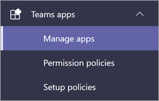

# 安装、管理和分配 Teams Learning 应用的权限 (预览版) Install, manage, and assign permissions for the Teams Learning app (private preview)

*本文包含 Teams Learning 应用（个人预览版）的初步内容。**This article contains preliminary content for the Teams Learning app, which is in private preview.*

Microsoft Teams Learning 应用 (个人预览版) 使组织中团队和个人能够自然地学习一天。The Microsoft Teams Learning app (private preview) empowers teams and individuals in your organization to make learning a natural part of their day. 该应用在 Teams 中创建一个中心，员工可以在其中共享、分配和学习整个组织的内容库。The app creates a central hub in Teams where employees can share, assign, and learn from content libraries across your organization. 管理员设置权限并允许学习应用的内容源。Admins set permissions and allow learning content sources for the app. 学习内容可能包括 LinkedIn Learning、Microsoft Learn、Microsoft 365 培训、组织自己存储在 SharePoint Online 中的内容以及应用支持的第三方提供商。Learning content can include LinkedIn Learning, Microsoft Learn, Microsoft 365 training, your organization's own content stored in SharePoint online, and third-party providers that are supported by the app.

若要将 Teams 学习应用 (个人预览版) ，需要涉及：To set up the Teams Learning app (private preview), you'll need to involve:

-   Teams 管理中心管理员Teams admin center admin
-   Microsoft 365 管理中心管理员 (，即全局管理员) Microsoft 365 admin center admin (that is, a global admin)

## 在 Teams 管理中心 (Teams) 个人预览版Manage the Teams Learning app (private preview) in the Teams admin center

Teams 管理员从应用商店 (个人预览版) Teams Learning 应用，并通过 Teams 管理中心应用应用设置、管理和权限策略。The Teams admin installs the Teams Learning app (private preview) from the app store and applies app setup, manage, and permissions policies through the Teams admin center.

### 管理 Teams Learning 应用 (个人预览版) Manage the Teams Learning app (private preview)

若要管理应用的设置，请执行以下步骤：To manage settings for app, follow these steps:

1. 在 Microsoft Teams 管理中心的左侧导航栏中，转到 **"Teams 应用**  >  **管理应用"。**In the left navigation of the Microsoft Teams admin center, go to **Teams apps** > **Manage apps**.

   

2. 在"**管理应用"** 页面的搜索框中，键入"学习"以搜索 Teams Learning 应用 (个人预览) 。On the **Manage apps** page, in the search box, type *learning* to search for the Teams Learning app (private preview).

   

3. 在" **学习"** 页上：On the **Learning** page:
   1. 在 **"** 状态"下 **，选择** "允许"以打开应用。Under **Status**, select **Allowed** to turn on the app.
   2. 在" **设置"** 选项卡上的" **应用** 设置"部分中，转到 Microsoft 365 管理中心以配置学习内容源。On the **Settings** tab, in the **App settings** section, go to the Microsoft 365 admin center to configure learning content sources.

   

4. 管理 **应用设置** 后，转到"权限和设置"策略，向应该在组织参与个人预览版时有权访问应用的员工授予权限。After **Manage app** settings, go to **Permissions and Set-up policies** to grant permission to employees who should have access to the app as part of your organization's participation in the private preview.

> [!NOTE]
>  如果您的组织在 Teams TAP100 计划的一部分位于 4.0 圈中，您可能需要执行以下操作，使 3.0 圈中的已批准用户能够访问 Teams Learning 应用 (个人预览版) 。If your organization is in Ring 4.0 as part of Teams TAP100 program, you might need to do the following to enable approved users in Ring 3.0 to access the Teams Learning app (private preview).

作为个人预览的一部分，Teams Learning 应用 (3.0) 中发布。As part of private preview, the Teams Learning app (private preview) is released in Ring 3.0. 如果你的组织位于 4.0 圈中，你将在应用商店中看不到该应用。If your organization is in Ring 4.0, you won’t see the app in the app store. 若要测试应用，需要创建自定义应用权限策略，将其设置为"允许 **所有** 应用"，并将其分配给 3.0 批准用户。To test the app, you need to create a custom apps permission policy, set it to **Allow all apps**, and assign it to Ring 3.0 approved users.

   

## 在 Microsoft 365 管理中心配置学习内容源Configure learning content sources in the Microsoft 365 admin center

Microsoft 365 管理中心的管理员可以管理与 Teams Learning 应用相关的设置 (个人预览版) 并配置学习内容源。The admins for the Microsoft 365 admin center can manage settings related to the Teams Learning app (private preview) and can configure the learning content sources.

管理员可以选择哪些其他学习内容 (例如 SharePoint 或受支持的第三方内容提供商源) 可供应用用户使用。The admin can select which additional learning content sources (for example, SharePoint or supported third-party content provider sources) will be available to users of the app. 然后，管理员配置这些源，以确保内容可供搜索和发现，并且可供使用应用的员工浏览。The admin then configures those sources to make sure the content is available for search and discovery and can be browsed by the employees who use the app.

> [!NOTE]
>  用户在浏览器或嵌入式查看器中登录到非 Microsoft 和 LinkedIn Learning Pro 学习。Users sign in to non-Microsoft and LinkedIn Learning Pro learnings in a browser or embedded viewer. 此配置的学习受组织和第三方之间的单独许可、隐私和服务条款的约束，不受学习 (预览版) 的约束。This configured learning is subject to the separate license, privacy and service terms between your organization and the third party, and not the Learning (Preview) terms. 在 Learning (预览版) 选择此学习之前，请验证你已针对组织和用户达成一致。Before selecting this learning in Learning (Preview), verify you have an agreement in place for your organization and users.

### 为应用配置学习内容源的设置Configure settings for the learning content sources for the app

这些步骤由 Microsoft 365 管理员执行。These steps are to be performed by the Microsoft 365 admin.

1.  在 Microsoft 365 管理中心的左侧导航中，转到 **"设置**  >  **组织设置"。**In the left navigation of the Microsoft 365 admin center, go to **Settings** > **Org settings**.

2.  在"**设置**"页上的"服务 **&选项卡** 上，选择 **"学习应用"。**On the **Settings** page, on the **Services & add-ins** tab, select **Learning app**.

   

3.  在 **"学习应用**"面板中，选择要为组织配置的学习内容源，然后选择"保存 **"。**On the **Learning app** panel, select the learning content sources you want to configure for the organization, and then select **Save**.

   

在存在的所有学习源中，默认情况下会启用一些源。Among all the learning sources that exist, some will be enabled by default. 其中包括：These include:

- LinkedIn Learning (免费内容) LinkedIn Learning (free content)
- Microsoft LearnMicrosoft Learn
- Microsoft 365 培训Microsoft 365 Training

> [!NOTE]
> 如果组织具有 LinkedIn Learning Standard 或 Pro 订阅，将为贵组织的员工解锁内容存储库。If your organization has a LinkedIn Learning Standard or Pro subscription, the content repository will be unlocked for the employees in your organization. 只有具有权限的员工才能使用整个内容存储库。Only those employees who have permission will be able to use the entire content repository.

其他源可能需要手动启用或配置。Other sources might need to be enabled or configured manually. 非 Microsoft 的学习源在组织和第三方之间单独获得许可。Learning sources that are not from Microsoft are separately licensed between your organization and the third party. 需要验证你已注册供你和用户学习。You’ll need to verify you’ve signed up for their learning for you and your users.

若要启用或禁用学习内容源，请选中源旁边的复选框。To enable or disable a learning content source, select the check box next to the source. 如果启用了源，则显示一个选中标记。If a source is enabled, a check mark will be visible.

## 将 SharePoint 配置为学习内容源 (即将推出) Configure SharePoint as a learning content source (Coming Soon)

将 SharePoint 配置为 Microsoft 365 管理中心中 Teams Learning (个人预览版) 学习内容源。You configure SharePoint as a learning content source for the Teams Learning app (private preview) in the Microsoft 365 admin center.

### 概述Overview

管理员提供一个网站 URL，学习服务可在其中以结构化 SharePoint 列表的形式创建空集中学习内容存储库。The admin provides a site URL to where the Learning Service can create an empty centralized learning content repository in the form of a structured SharePoint list. 组织可以使用此列表来存储指向包含学习内容的跨公司 SharePoint 文件夹的链接。This list can be used by the organization to house links to cross-company SharePoint folders that contain learning content. 管理员负责收集和管理文件夹的 URL 列表。Admins are responsible for collecting and curating a list of URLs for folders. 这些文件夹应仅包含可在 Teams Learning 应用（个人预览版） (提供) 。These folders should only include content that can be made available in the Teams Learning app (private preview).

### 权限Permissions

可以从组织的任何 SharePoint 网站收集文件夹 URL。Folder URLs can be collected from any SharePoint site in the organization. 这些文件夹中的任何内容都可以搜索，但只能使用单个员工具有权限的内容。Any content within these folders will be searchable, but only content to which the individual employee has permissions can be used.
 
### 学习服务Learning Service

学习服务使用提供的文件夹 URL 从存储在这些文件夹中的所有内容获取元数据。The Learning Service uses the provided folder URLs to get metadata from all content stored in those folders. 在集中式存储库中提供文件夹 URL 的 24 小时内，员工可以在应用中搜索和使用公司的内容。Within 24 hours of supplying the folder URL in the centralized repository, employees can search for and use the company’s content within the app. 目前不支持从存储库删除内容。Content deletion from the repository isn't supported at this point. 只有在 Microsoft 365 管理中心中提供新的 SharePoint 网站 URL，才能删除无意中显示的内容。Unintentionally surfaced content can only be removed by supplying a new SharePoint site URL in the Microsoft 365 admin center.

### 将 SharePoint 配置为源Configure SharePoint as a source

这些步骤由 Microsoft 365 管理员执行。These steps are to be performed by Microsoft 365 admin.

1.  在 Microsoft 365 管理中心的左侧导航中，转到"设置 **"。**In the left navigation of the Microsoft 365 admin center, go to **Settings**.
 
2.  在"**设置**"页上的"服务 **&选项卡** 上，选择 **"学习应用"。**On the **Settings** page, on the **Services & add-ins** tab, select **Learning app**.

   

3.  在 **"学习应用** "面板上，提供 SharePoint 网站的网站 URL，以便应用程序创建集中式存储库。On the **Learning app** panel, provide the site URL to the SharePoint site where you want the app to create a centralized repository.

   

4.  SharePoint 列表在提供的组织的 SharePoint 网站中自动创建。A SharePoint list is created automatically within the provided organization’s SharePoint site. 在 SharePoint 网站的左侧导航栏中，选择 **"学习应用内容存储库"。**In the left navigation of the SharePoint site, select **Learning App Content Repository**. 

   

 
5. 在" **学习应用内容存储库** "页上，使用学习内容文件夹的 URL 填充 SharePoint 列表。On the **Learning App Content Repository** page, populate the SharePoint list with URLs to the learning content folders.

   1.   选择 **"新建** "以查看 **"新建项"** 面板。Select **New** to view the **New item** panel. 

   
 
   2.   在 **"新建项** "面板的"标题 **"字段中，** 添加选择的目录名称。On the **New item** panel, in the **Title** field, add a directory name of your choice. 在 **"文件夹 URL"** 字段中，将 URL 添加到学习内容文件夹。In the **Folder URL** field, add the URL to the learning content folder. 选择 **"保存"。**Select **Save**.

   

   3. 学习应用内容存储库页面使用新的学习内容进行更新。The Learning App Content Repository page is updated with the new learning content.

   

 

