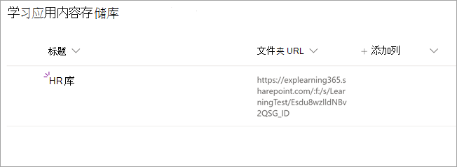

# 安装、管理和分配 Microsoft Viva Learning (个人预览版) 

*本文包含 Microsoft Viva Learning（个人预览版）的初步内容。*

Microsoft Viva learning (个人预览版) 使组织中团队和个人能够自然地学习一天。 该应用在 Teams 中创建了一个中心，员工可以在其中共享、分配内容库以及从整个组织的内容库中学习。

管理员为 Viva Learning 设置权限并允许学习内容源 (个人预览版) 。 学习内容可能包括 LinkedIn Learning、Microsoft Learn、Microsoft 365 培训、组织自己存储在 SharePoint Online 中的内容，以及 Viva Learning (个人预览版) 支持的第三方提供商。

## 管理员角色

若要设置 Viva Learning (个人预览) ，需要具有如下权限：

- Microsoft Teams 管理员
- Microsoft 365 全局管理员或 SharePoint 管理员
- 知识管理员 - 这是 Microsoft 365 管理中心中的一个新角色，可分配给组织中任何人。 此角色通过 Microsoft 365 管理中心管理组织的学习内容源。 

> [!TIP]
> 知识管理员应是中等技术性的，并且具有现有的 SharePoint 管理员凭据，最好是熟悉组织教育、学习、培训或员工经验的人。
 
## 在 Teams 管理中心 (Viva) 个人预览版

Teams 管理员从应用商店 (Viva Learning) 个人预览版，然后通过 Teams 管理中心应用设置、管理和权限策略。

### 管理 Viva Learning (个人预览版) 

你必须是 Teams 管理中心的管理员才能执行这些任务。

若要管理 Viva 学习的设置，请执行以下步骤：

1. 在 Teams 管理中心的左侧导航中，转到 **"Teams 应用**  >  **""管理应用"。**

   

2. 在" **管理应用"** 页面的搜索框中，键入" *学习* "以搜索 Teams Learning 应用 (个人预览版) 。

   

3. 在" **学习"** 页上：
   1. 在 **"状态**"下 **，选择** "允许"以打开应用。
   2. 在" **设置"** 选项卡上的"应用 **设置** "部分中，转到 Microsoft 365 管理中心以配置学习内容源。

   

4. 管理 **应用设置** 后，转到 **"权限** 和设置策略"，向应该在组织参与个人预览版时有权访问应用的员工授予权限。

> [!NOTE]
>  如果您的组织在 Teams TAP100 计划的"环 4.0"中，您可能需要执行以下操作，使 3.0 圈中的已批准用户能够访问 Viva Learning (个人预览版) 。

作为个人预览的一部分，Viva Learning (3.0) 3.0 中发布了个人预览版。 如果你的组织位于 4.0 圈中，你将在应用商店中看不到该应用。 若要测试应用，需要创建自定义应用权限策略，将其设置为"允许 **所有** 应用"，并将其分配给"3.0 圈"批准的用户。

   

## 在 Microsoft 365 管理中心配置学习内容源

Microsoft 365 管理中心的管理员（通过自己或向组织中选定的个人分配知识管理员角色）可以管理与 Viva Learning (个人预览版) 相关的设置，并可以配置学习内容源。

管理员选择哪些其他学习内容 (例如 SharePoint 或受支持的第三方内容提供商源) 可供 Viva Learning (个人预览版) 。 然后，管理员配置这些源以确保内容可用于搜索和发现，并且使用 Viva Learning (个人预览版) 。

> [!NOTE]
>  用户在浏览器或嵌入式查看器中登录到非 Microsoft 和 LinkedIn Learning Pro 学习。 此配置的学习受组织和第三方之间的单独许可、隐私和服务条款的约束，不受 Viva Learning (个人预览版) 的约束。 在选择这种类型的学习之前，请确认你已针对组织和用户达成一致。

### 分配知识管理员角色 [可选]

只有 Microsoft 365 全局管理员才能执行这些任务。

若要为 Viva Learning 分配知识管理员，请执行以下步骤：

1.  在 Microsoft 365 管理中心的左侧导航中，转到"角色 **"。**

2.  在"**角色"** 页上的 **"Azure AD"** 选项卡上，选择"**知识管理员"。**
 
3.  在"**知识管理员"** 页面上的"**分配的** 管理员"部分中，选择"添加"，然后添加你为角色选择的人。

### 为 Viva 学习专用预览版配置 (源) 

只有 Microsoft 365 全局管理员或知识管理员才能执行这些任务。

若要配置 Viva Learning 中学习内容源的设置，请执行以下步骤：

1.  在 Microsoft 365 管理中心的左侧导航中，转到 **"设置**  >  **""组织设置"。**

2.  在"**组织设置"** 页上的"服务 **"选项卡上**，选择"学习应用 (**预览) "。**

     

3.  在"学习 **(预览**) 面板中，选择要为组织配置的学习内容源，然后选择"保存 **"。**

     

在存在的所有学习源中，默认情况下会启用一些。 其中包括：

- LinkedIn Learning (免费) 
- Microsoft Learn
- Microsoft 365 培训

> [!NOTE]
> 如果您的组织具有 LinkedIn Learning Standard 或 Pro 订阅，将为您的组织中的员工解锁内容存储库。 只有具有权限的员工才能使用整个内容存储库。  其他源可能需要手动启用或配置。 非 Microsoft 的学习源在组织和第三方之间单独获得许可。 你需要确认你已注册他们供你和用户学习。

若要启用或禁用学习内容源，请选中源旁边的复选框。 如果启用了源，则显示一个选中标记。

## 将 SharePoint 配置为学习内容源

您可以将 SharePoint 配置为学习内容源，使组织自己的内容在 Viva Learning (预览版) 。

### 概述

知识管理员 (或全局管理员) 提供网站 URL，学习服务可在其中以结构化 SharePoint 列表的形式创建空的集中位置（学习应用内容存储库）。 您的组织可以使用此列表来存储指向包含学习内容的跨公司 SharePoint 文件夹的链接。 管理员负责收集和策展文件夹的 URL 列表。 这些文件夹应仅包含可在 Viva Learning (个人预览版) 。

Viva Learning (个人预览版) 支持以下文档类型：

- Word、PowerPoint、Excel、PDF
- Audio (.m4a) 
- 视频 (.mov、.mp4、.avi) 

有关详细信息，请参阅 [SharePoint Online 文档](https://docs.microsoft.com/sharepoint/introductionlink)。 

### 权限

可以从组织的任何 SharePoint 网站收集文档库文件夹 URL。 Viva Learning (个人预览) 遵循所有现有内容权限。 因此，只有用户有权访问的内容才能在 Viva Learning (预览版中) 。 这些文件夹中的任何内容都可以搜索，但只能使用单个员工具有权限的内容。

目前不支持从组织的存储库删除内容。

若要删除意外显示的内容，请执行以下步骤：

1.  若要限制对文档库的访问，请选择"显示 **操作**"选项，然后选择"**管理访问权限"。**
     
     

2.  删除文档库中的原始文档。

有关详细信息，请参阅 [SharePoint 新式体验中的共享和权限](https://docs.microsoft.com/sharepoint/modern-experience-sharing-permissions)。 

### 学习服务

学习服务使用提供的文件夹 URL 从存储在这些文件夹中的所有内容获取元数据。 在集中式存储库中提供文件夹 URL 的 24 小时内，员工可以在 Viva Learning (个人预览版中搜索和使用) 。 对内容进行的所有更改（包括更新的元数据和权限）也将在 24 小时内应用于学习服务。

### 将 SharePoint 配置为源

只有 Microsoft 365 全局管理员、SharePoint 管理员或知识管理员才能执行这些任务。

若要将 SharePoint 配置为 Viva Learning (个人预览版) 学习内容源，请执行以下步骤：

1.  在 Microsoft 365 管理中心的左侧导航中，转到 **"设置**  >  **""组织设置"。**
 
2.  在"**组织设置"** 页上的"服务 **"选项卡上**，选择"学习应用 (**预览) "。**

     

3.  在" **学习** (预览) "面板的 **"SharePoint"** 下，提供希望 Viva Learning 创建集中式存储库的 SharePoint 网站的网站 URL。

     

4.  SharePoint 列表在提供的 SharePoint 网站中自动创建。

     

     在 SharePoint 网站的左侧导航栏中，选择"**网站内容**  >  **""学习应用内容存储库"。** 

      

5. 在" **学习应用内容存储库"** 页上，使用学习内容文件夹的 URL 填充 SharePoint 列表。

   1. 选择 **"新建** "以查看 **"新建项"** 面板。 

       
 
   2. 在 **"新建项"** 面板的"标题 **"** 字段中，添加选择的目录名称。 在" **文件夹 URL"** 字段中，将 URL 添加到学习内容文件夹。 选择“**保存**”。

       

   3. 使用 **新的学习内容更新** 了"学习应用内容存储库"页。

       

> [!NOTE]
> 为了允许更广泛的访问学习应用内容存储库，Viva Learning (个人预览版) 界面中很快将提供列表的链接，用户可以在这里请求访问权限，并最终帮助填充列表。 网站所有者和全局管理员需要授予对列表的访问权限。 Access 仅特定于列表，不适用于存储列表的网站。

### 文件夹 URL 文档库管理

Microsoft Graph API 会自动将默认元数据 (例如修改日期、创建者、文档名称、内容类型和组织名称) 自动拉取到 Viva Learning (个人预览版) 中。
 
若要改进内容的整体发现和搜索相关性，建议添加"说明 **"** 列。

若要 **向文档** 库页面添加"说明"列，请执行以下步骤：

1.  在"文档 **"** 页上，选择"**添加列"。**

2. 选择"**显示操作**"选项，然后选择"**单行文本"。**

     

3. 在 **"创建列"面板的** "名称 **"** 字段中，为列添加描述性名称。 选择“**保存**”。

     
 
4. 在" **文档"** 页的"说明 **"** 列中，为每个项目添加自定义说明。 如果未提供任何说明，Viva Learning (预览版) 将提供一条默认消息，突出显示内容是否来自自己的 SharePoint 库。 

     
 
