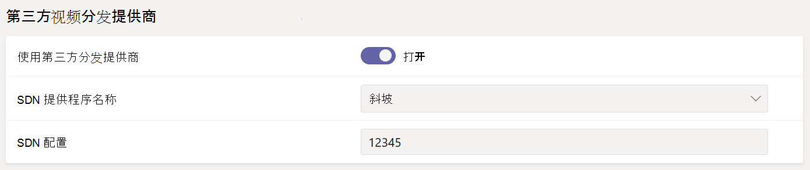

# <a name="configure-live-event-settings-in-microsoft-teams"></a>在 Microsoft Teams 中配置实时事件设置

使用 Teams 实时事件设置为组织中举行的实时事件配置设置。 可以设置支持 URL 并配置第三方视频分发提供商。 这些设置适用于组织中创建的所有实时事件。

可以在 Microsoft Teams 管理中心轻松管理这些设置。 在左侧导航中，转到 **“会议** > **实时事件设置**”。


## <a name="set-up-event-support-url"></a>设置事件支持 URL

此 URL 将显示给实时事件与会者。 为组织添加支持 URL，以便与会者在直播活动期间联系支持人员。

### <a name="using-the-microsoft-teams-admin-center"></a>使用 Microsoft Teams 管理中心

1. 在左侧导航中，转到 **“会议** > **实时事件设置**”。
2. 在 **“支持 URL”** 下，输入组织的支持 URL。

    

### <a name="using-windows-powershell"></a>使用 Windows PowerShell

请运行以下命令：

```PowerShell
Set-CsTeamsMeetingBroadcastConfiguration -SupportURL “{your URL}”
```

有关详细信息，请参阅 [Set-CsTeamsMeetingBroadcastConfiguration](/powershell/module/skype/set-csteamsmeetingbroadcastconfiguration?view=skype-ps&preserve-view=true)。

## <a name="configure-a-third-party-video-distribution-provider"></a>配置第三方视频分发提供商

如果你通过 Microsoft 视频传送合作伙伴购买并设置了软件定义的网络 (SDN) 解决方案或企业内容分发网络 (eCDN) 解决方案，请在 Teams 中为实时事件配置提供商。

### <a name="using-the-microsoft-teams-admin-center"></a>使用 Microsoft Teams 管理中心

1. 在左侧导航中，转到 **“会议** > **实时事件设置**”。
2. 在 **“第三方视频分发提供商”** 下，完成以下操作：

    

    - **第三方分发提供程序** 启用此打开以启用第三方视频分发提供商。
    - **SDN 提供程序名称** 选择你正在使用的提供程序。
    - **SDN 配置** 输入 SDN 配置详细信息。

### <a name="using-windows-powershell"></a>使用 Windows PowerShell

从提供商联系人那里获取许可证 ID 或 API 令牌和 API 模板，然后运行以下选项之一，具体取决于所使用的提供商：

**Microsoft eCDN**
```PowerShell
Set-CsTeamsMeetingBroadcastConfiguration -AllowSdnProviderForBroadcastMeeting $True -SdnProviderName microsoft
```
**Hive** 
```PowerShell
Set-CsTeamsMeetingBroadcastConfiguration -AllowSdnProviderForBroadcastMeeting $True -SdnProviderName hive -SdnLicenseId {license ID GUID provided by Hive} -SdnApiTemplateUrl “{API template URL provided by Hive}”
```
**Kollective** 
```PowerShell
Set-CsTeamsMeetingBroadcastConfiguration -AllowSdnProviderForBroadcastMeeting $True -SdnProviderName kollective -SdnApiTemplateUrl "{API template URL provided by Kollective}" -SdnApiToken {API token GUID provided by Kollective}
```
**Riverbed** 
```PowerShell
Set-CsTeamsMeetingBroadcastConfiguration -AllowSdnProviderForBroadcastMeeting $True -SdnProviderName riverbed -SdnApiTemplateUrl "{API template URL provided by Riverbed}" -SdnApiToken {API token GUID provided by Riverbed}
```
**Ramp** 
```PowerShell
Set-CsTeamsMeetingBroadcastConfiguration -AllowSdnProviderForBroadcastMeeting $True -SdnProviderName ramp -SdnRuntimeConfiguration "{Configuration provided by RAMP}"
```

有关详细信息，请参阅 [Set-CsTeamsMeetingBroadcastConfiguration](/powershell/module/skype/set-csteamsmeetingbroadcastconfiguration?view=skype-ps&preserve-view=true)。

> [!NOTE]
> 如果计划使用外部应用或设备创建实时事件，则还需要 [配置 eCDN 提供程序](../teams-stream-ecdn.md)。

>[!Note]
> 所选的 eCDN 解决方案受所选第三方提供商的服务条款和隐私策略的约束，后者将控制你对 eCDN 提供商解决方案的使用。 你使用 eCDN 提供商的解决方案不受 Microsoft 批量许可条款或在线服务条款的约束。 如果你不同意第三方提供商的条款，请不要在 Microsoft Teams 中启用 eCDN 解决方案。

### <a name="related-topics"></a>相关主题

- [什么是 Teams 实时事件？](what-are-teams-live-events.md)
- [规划 Teams 实时事件](plan-for-teams-live-events.md)
- [设置 Teams 实时事件](set-up-for-teams-live-events.md)
