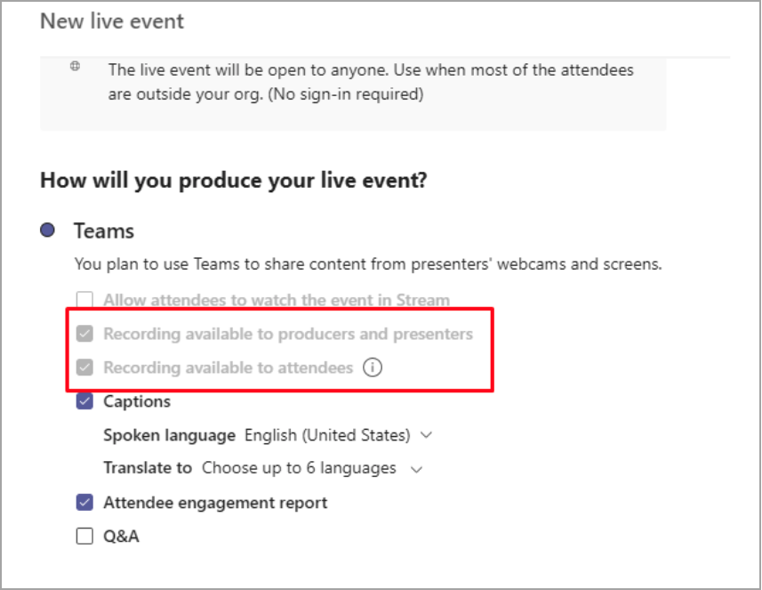

# 实时事件录制策略Microsoft TeamsLive event recording policies in Microsoft Teams

可以使用多个选项来录制实时Microsoft Teams活动。You have several options for recording a Microsoft Teams live event. 录制选项是使用录制策略设置的。The recording options are set using recording policies. 本文介绍各种设置。This article describes the various settings.

录制选项是使用 PowerShell 命令 [Set-CsTeamsMeetingBroadcastPolicy 设置的](/powershell/module/skype/set-csteamsmeetingbroadcastpolicy?view=skype-ps)。The recording options are set using the PowerShell command [Set-CsTeamsMeetingBroadcastPolicy](/powershell/module/skype/set-csteamsmeetingbroadcastpolicy?view=skype-ps).

## 计划和选项行为Scheduling and option behaviors

安排实时事件录制时，有两个组织者选项：There are two organizer options while scheduling a live event recording:

- 录制者与演示者可用Recording available for producers and presenters

  - 录制文件：提供录制文件，制作者和演示者可在事件结束后下载该文件。Recording file: Provides a recording file that producers and presenters can download after the event is over.

- 可用于与会者的录制Recording available for attendees

  - DVR：使用 DVR (数字) ，与会者可以在活动期间后退和暂停DVR: A digital video recorder (DVR) allows attendees to rewind and pause during the event

  - VOD：使用 VOD (点播) ，与会者可以在活动结束后观看VOD: A video on demand (VOD) allows attendees to watch after the event is over

## 广播录制策略设置Broadcast recording policy setting

作为广播策略的一部分，有一个设置可以切换为为实时事件打开或关闭录制。As part of the broadcast policy, there's a setting that you can toggle to turn recording on or off for a live event.

|                                 | 录制者与演示者可用Recording available for producers and presenters | 可用于与会者的录制Recording available for attendees |
| ------------------------------- | ---------------------------------------------------- | ------------------------------------- |
| 始终记录Always record               | 已禁用和已选择Disabled and selected                                | 启用和选择Enabled and selected         |
| 组织者可以录制或不录制Organizer can record or not | 默认情况下启用和选择Enabled and selected by default                  | 默认情况下启用和选择Enabled and selected by default   |
| 从不录制Never record               | 已禁用且未选中Disabled and not selected                            | 已启用且未选中Enabled and not selected      |

当策略设置为"始终 **记录"** 时，策略页具有以下选定选项：When the policy is set to **Always record**, the policy page has the following selected options:

## 存储和持久性行为Storage and persistence behavior

| 选项Option                                       | 省/市/自治区State   | DVRDVR                                                   | VODVOD                                                     | 录制Recording                |
| ------------------------------------------------ | ------------ | --------------------------------------------------------- | ----------------------------------------------------------- | ---------------------------- |
| 可供制作者和演示者使用的记录Recording available to producers and presenters | 选中Selected     | DVR 可用，AZURE 媒体服务 (AMS) 资产存储 180 天DVR is available and the Azure Media Services (AMS) asset is stored for 180 days | 与会者可以访问和观看活动Attendee can access and watch the event                     |                              |
|                                                  | 未选中Not Selected | DVR 可用，AMS 资产存储 180 天DVR is available and the AMS asset is stored for 180 days | 结束后，与会者无法访问事件Attendee won't get access into the event after it's over |                              |
||已禁用 (未选中) Disabled (Not selected)|DVR 可用，事件后将删除 AMS 资产DVR is available and the AMS asset is deleted after the event|结束后，与会者无法访问事件Attendee won't get access into the event after it's over||
| 可供制作者和演示者使用的记录Recording available to producers and presenters | 选中Selected     |                                                           |                                                             | 创建并存储 MP4An MP4 is created and stored |
|                                                  | 未选中Not Selected |                                                           |                                                             | 未创建任何文件No file is created           |

### 相关主题Related topics

- [什么是 Teams 实时活动?What is Teams live events?](what-are-teams-live-events.md)
- [规划 Teams 实时事件Plan for Teams live events](plan-for-teams-live-events.md)
- [配置 Teams 实时事件设置Configure live events settings in Teams](configure-teams-live-events.md)
- [Teams云会议录制Teams clouds meeting recording](../cloud-recording.md)