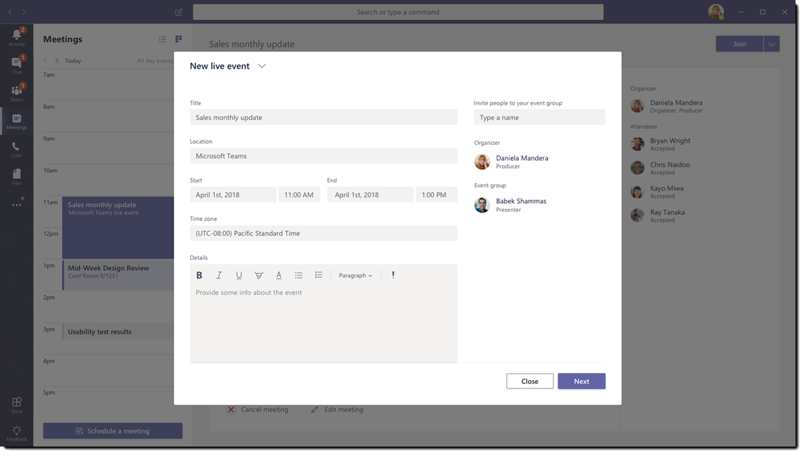

# Microsoft Teams 实时事件是什么？What are Microsoft Teams live events?

## 概述Overview

通过团队实时事件，你组织中的用户可以将视频和会议内容广播到大型在线受众。With Teams live events, users in your organization can broadcast video and meeting content to large online audiences. 

Microsoft 365 实时事件将实时视频流转到新的级别，在整个服务生命周期中与与会者在实时事件之前、期间和之后鼓励其连接。Microsoft 365 live events bring live video streaming to a new level, encouraging connection throughout the entire engagement lifecycle with attendees before, during, and after live events. 你可以使用 Microsoft Stream、团队或 Yammer 在你的受众、团队或社区所驻留的任何位置创建实时事件。You can create a live event wherever your audience, team, or community resides, using Microsoft Stream, Teams, or Yammer.  

团队提供基于聊天的协作、通话、会议和实时事件，因此您可以展开您的会议的受众。Teams delivers chat-based collaboration, calling, meetings, and live events, so you can expand the audience of your meetings. 团队活动事件是团队会议的扩展，使用户能够将视频和会议内容广播给较大的联机受众。Teams live events is an extension of Teams meetings, enabling users to broadcast video and meeting content to a large online audience. 这些内容适用于一对多通信，其中事件的主机在移动时主要是查看由主机共享的内容。These are meant for one-to-many communications where the host of the event is leading the interactions and audience participation is primarily to view the content shared by host. 与会者可以在 Yammer、团队和/或流中观看实时或录制的事件，并且可以使用 & 或 Yammer 对话中的 "审核" 问答与演示者交互。The attendees can watch the live or recorded event in Yammer, Teams, and/or Stream, and can interact with the presenters using moderated Q & A or a Yammer conversation.

团队活动事件被视为下一版本的 Skype 会议直播，最终将替换 Skype 会议直播中提供的功能。Teams live events are considered the next version of Skype Meeting Broadcast and will eventually replace the capabilities provided in Skype Meeting Broadcast. 在此情况下，Microsoft 将继续为在其组织中使用 Skype for Business 的用户继续支持 Skype 会议直播，而不会中断新事件或将来事件的服务。At this point, Microsoft will continue to support Skype Meeting Broadcast for users who are using Skype for Business in their organizations, with no disruption in service for new or future events. 但是，我们鼓励你尝试使用团队实时事件来利用所有全新的激动人心的功能，包括屏幕共享和对外部硬件/软件编码器的支持。However, we encourage you to try out Teams live events to leverage all the new and exciting features including screen sharing and support for external hardware/software encoders.

因此，让我们开始吧。So, let's get started. 首先，看看下图显示了 Microsoft 365 实时事件中涉及的高级组件以及它们的连接方式。First, take a look at the following diagram that shows high level components involved in Microsoft 365 live events and how they are connected. 

### 事件组角色Event group roles
团队中的实时事件使多个角色（组织者、制造者、演示者和与会者）能够成功广播和参与事件。Live events in Teams empowers multiple roles (organizer, producer, presenter, and attendee) to successfully broadcast and participate in an event. 若要了解详细信息，请参阅[事件组角色](https://support.office.com/article/get-started-with-microsoft-teams-live-events-d077fec2-a058-483e-9ab5-1494afda578a?ui=en-US&rs=en-US&ad=US#bkmk_roles)。To learn more, see [Event group roles](https://support.office.com/article/get-started-with-microsoft-teams-live-events-d077fec2-a058-483e-9ab5-1494afda578a?ui=en-US&rs=en-US&ad=US#bkmk_roles).

## 关键组件Key components
您可以从上面的图片中看到，有四个关键组件与团队中的实时事件一起使用。You can see from the picture above that there are four key components that are used with live events in Teams.

> [!NOTE]
> 有关如何设置实时事件和与会者体验的概述，请查看这些简短[视频](https://support.office.com/article/video-plan-and-schedule-a-live-event-f92363a0-6d98-46d2-bdd9-f2248075e502)。For an overview of how to set up live events and the attendee experience, check out these short [videos](https://support.office.com/article/video-plan-and-schedule-a-live-event-f92363a0-6d98-46d2-bdd9-f2248075e502).

### 级Scheduling
团队使组织者能够使用相应的与会者权限创建事件、指定事件团队成员、选择生产方法和邀请与会者。Teams provides the ability for the organizers to create an event with the appropriate attendee permissions, designate event team members, select a production method, and invite attendees. 如果实时事件是从 Yammer 组内创建的，则实时事件参与者将能够使用 Yammer 对话与事件中的人员交互。If the live event was created from within a Yammer group, the live event attendees will be able to use Yammer conversation for interacting with people in the event. 

### 生成Production
视频输入是实时事件的基础，它可能会因单个网络摄像头而异。The video input is the foundation of the live event and it can vary from a single webcam to a multi-camera professional video production. Microsoft 365 中的实时事件支持各种生产方案，包括使用网络摄像头或在外部应用或设备中生成的事件在团队中生成的事件。The live events in Microsoft 365 support a spectrum of production scenarios, include an event produced in Teams using a webcam or an event produced in an external app or device. 您可以根据其项目要求和预算选择这些选项。You can choose these options depending on their project requirements and budget. 可通过两种方式生成事件：There are two ways to produce events:

- **团队**：此生产方法允许用户使用其网络摄像头在团队中生成活动事件，或使用来自团队室系统的/V 输入。**Teams**: This production method allows users to produce their live events in Teams using their webcam or using A/V input from Teams room systems. 如果你想要使用连接到电脑或邀请远程演示者参与事件的音频和视频设备，此选项是最佳和最快的选项。This option is the best and quickest option if you want to use the audio and video devices connected to the PC or are inviting remote presenters to participate in the event. 此选项允许用户轻松使用其网络摄像头并在事件中共享其屏幕作为输入。This option allows users to easily use their webcams and share their screen as input in the event. 

    

- **外部应用或设备**：外部编码器允许用户直接从具有[流](https://stream.microsoft.com)的外部硬件或基于软件的编码器生成实时事件。**External app or device**: External encoders allow users to produce their live events directly from an external hardware or software-based encoder with [Stream](https://stream.microsoft.com). 如果你已经有了 studio 质量的设备（例如 media mixers），并且支持实时消息传递协议（RTMP）服务流，则此选项最适用。This option is best if you already have studio quality equipment (for example, media mixers) which support streaming to a Real-time Messaging Protocol (RTMP) service. 这种类型的生产通常在大规模事件中使用，如 executive 城镇 halls-将媒体混合器中的单个流广播给观众。This type of production is typically used in large scale events such as executive town halls – where a single stream from a media mixer is broadcasted to the audience. 

    

### 流式处理平台Streaming platform
实时事件流平台由以下部分组成：The live event streaming platform is made up of the following pieces:

- **Azure 媒体服务**： [azure 媒体服务](https://docs.microsoft.com/azure/media-services/previous/)为你提供了一种广播质量的视频流服务，可在当今最常用的移动设备上与更大的受众联系。**Azure Media Services**:  [Azure Media Services](https://docs.microsoft.com/azure/media-services/previous/) gives you broadcast-quality video streaming services to reach larger audiences on today’s most popular mobile devices. 媒体服务增强了辅助功能、分发和可伸缩性，并让您能够轻松、经济高效地将内容流式传输给您的本地或全球受众，同时保护内容。Media Services enhances accessibility, distribution, and scalability, and makes it easy and cost-effective to stream content to your local or worldwide audiences — all while protecting your content.
- **Azure 内容交付网络（CDN）**：一旦你的流投入使用，它将通过[Azure 内容交付网络（cdn）](https://docs.microsoft.com/azure/cdn/)进行传递。**Azure Content Delivery Network (CDN)**:  Once your stream goes live, it's delivered through the [Azure Content Delivery Network (CDN)](https://docs.microsoft.com/azure/cdn/). Azure 媒体服务为流式处理终结点提供集成的 CDN。Azure Media Services provides integrated CDN for streaming endpoints. 这允许在全球查看流，无缓冲。This allows the streams to be viewed worldwide with no buffering.

### 企业内容交付网络（eCDN）Enterprise Content Delivery Network (eCDN)
ECDN 的目标是从 internet 获取视频内容，并在整个企业中分发内容，而不会影响网络性能。The goal of eCDN is to take the video content from the internet and distribute the content throughout your enterprise without impacting network performance. 您可以使用以下认证的 eCDN 合作伙伴之一来优化您的网络，以便在您的组织内保持实时事件：You can use one of the following certified eCDN partners to optimize your network for live events held within your organization:
- [配置单元Hive](https://www.hivestreaming.com/partners/integration-partners/microsoft/)
- [KollectiveKollective](https://kollective.com/ecdn-solutions/microsoft-live-events/)
- [渐变Ramp](https://rampecdn.com)

### 与会者体验Attendee experience 
与会者体验是实时事件的最重要的方面，并且很重要的是与会者无需任何问题即可参与实时事件。The attendee experience is the most important aspect of live events and it's critical that the attendees can participate in the live event without having any issues. 与会者体验使用流式播放机（适用于团队中生成的事件）和 Azure 媒体播放器（对于在外部应用或设备中生成的事件），并跨桌面、浏览器和移动设备（iOS、Android）工作。The attendee experience uses Stream Player (for events produced in Teams) and Azure Media Player (for events produced in an external app or device) and works across desktop, browser, and mobile (iOS, Android). Microsoft 365 和 Office 365 将 Yammer 和团队作为两个协作中心提供，并将实时与会者体验集成到这些协作工具中。Microsoft 365 and Office 365 provide Yammer and Teams as two collaboration hubs, and the live attendee experience is integrated into these collaboration tools. 

### 实时事件使用率报告Live event usage report 
租户管理员可在 Microsoft 团队管理中心中查看实时事件的实时使用情况分析。Tenant admins can view real time usage analytics for live events in Microsoft Teams admin center.  [实时事件使用情况报表](../teams-analytics-and-reports/teams-live-event-usage-report.md)显示组织中保留的实时事件的活动概述。The [live event usage report](../teams-analytics-and-reports/teams-live-event-usage-report.md) shows the activity overview of the live events held in the organization.  管理员可以查看事件使用信息，包括事件状态、开始时间、视图和生产类型。Admins can view event usage information, including event status, start time, views and production type.  

## 后续步骤Next steps
转到 "[规划团队实时事件](plan-for-teams-live-events.md)"。Go to [Plan for Teams live events](plan-for-teams-live-events.md).

### 相关主题Related topics
- [Yammer、Microsoft 团队和 Microsoft Stream 中跨 Microsoft 365 的实时事件Live events across Microsoft 365 in Yammer, Microsoft Teams, and Microsoft Stream](https://docs.microsoft.com/stream/live-event-m365)
- [Microsoft Teams 直播活动入门Get started with Microsoft Teams live events](https://support.office.com/article/d077fec2-a058-483e-9ab5-1494afda578a)
- [Yammer 中的实时事件Live events in Yammer](https://support.office.com/article/live-events-in-yammer-4ece0ee2-c268-4636-bf2a-16e454befe57)
- [Microsoft Stream 中的实时事件Live events in Microsoft Stream](https://docs.microsoft.com/stream/live-event-overview)

 
