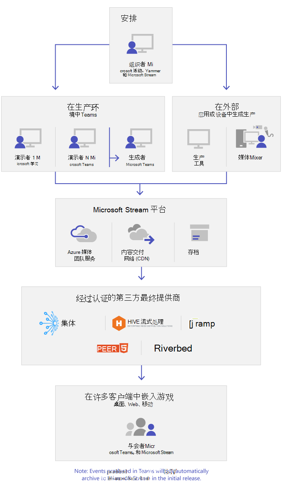

# Microsoft Teams 实时事件是什么

## 概述

借助 Teams 实时事件，组织中的用户可以向大量在线受众广播视频和会议内容。

Microsoft 365 实时事件将实时视频流式处理带到了新高度。 实时事件鼓励在整个预订周期内，与参会者在实时事件前、中、后建立连接。 无论受众、团队或社区驻留在何处，都可以使用 Microsoft Stream、Teams 或 Yammer 创建实时事件。  

Teams 可以实现基于聊天的协作、呼叫、会议和实时事件，这样你可以展开会议的受众。 Teams 实时事件是 Teams 会议的拓展，它使得用户能够向大体量网络受众广播视频和会议内容。 实时事件是一种一对多的通信，事件主持人领导交互，受众参与主要参与方式是查看主持人共享的内容。 与会者可以在 Yammer、Teams 或 Stream 中观看实时事件或录制事件，并能使用受到监管的问答或 Yammer 对话与演示者进行互动。

Teams 实时事件是 Skype 会议直播的下一版本，会最终代替 Skype 会议直播中的功能。 目前，Microsoft 将继续支持 Skype 会议直播，以及正在在组织中使用 Skype for Business 的用户，不会中断新的或未来事件的服务。 但是，我们鼓励你尝试 Teams 实时事件，来利用所有包括屏幕共享和外部硬件/软件编码器在内的新颖且令人激动的功能。

让我们开始吧。首先，看看下面的关系图，它显示了 Microsoft 365 实时事件中的高级组件及它们之间联系的方式。

> [!Note]
> 我们想要强调的是，鉴于广播技术的性质，Teams 直播活动通常会超过普通（内部）的会议人数。
>
> 与其他规模较大的媒体广播服务一样，我们依靠内容分发网络将实时事件的内容传递给收件人。 此内容受加密方法保护，并受访问令牌授权，这些令牌仅根据实时事件会议配置颁发给收件人。
>
> 应格外小心地确保会议内容适合如此众多的受众，或者适当减少敏感内容的受众。  
>
> 正如业内常见的情况一样，对安全的其他要素（例如人员或基础结构）的入侵可能会影响实时事件的安全性。 组织应考虑在其安全规划和练习中包括直播活动和其他广播服务。

### 活动组角色

Teams 中的实时事件让多种角色（组织者、制作者、演示者和与会者）能成功地广播和参与到事件中。 了解更多信息，请参阅[事件组角色](https://support.office.com/article/get-started-with-microsoft-teams-live-events-d077fec2-a058-483e-9ab5-1494afda578a?ui=en-US&rs=en-US&ad=US#bkmk_roles)。

## 主要组件

你可以看到上方的图片，在 Teams 中，有五个主要组件用于实时事件。

> [!NOTE]
> 要查看关于设置实时事件以及与会者体验的概述，请查看此段[视频](https://support.office.com/article/video-plan-and-schedule-a-live-event-f92363a0-6d98-46d2-bdd9-f2248075e502)。

### 安排

Teams 允许组织者创建具有相应与会者权限的事件、指定事件团队成员、选择制作方法和邀请与会者。 如果实时事件是在 Yammer 组中创建的，实时事件与会者可以使用 Yammer 对话与事件中的人员进行交互。

> [!IMPORTANT]
> 当用户脱机或以有限带宽运行时，Teams 不允许用户安排会议或直播活动。

### 制作

此视频输入是实时事件的基础，它可以是单一网络摄像头，也可以是多摄像头专业视频制作设备。 Microsoft 365 中的实时事件支持多种生成场景，包括在 Teams 中用网络摄像头制作的事件或由外部应用或设备制作的事件。 你可以根据项目要求和预算选择不同选项。 有两种方法可以生成事件：

- **Teams**：此制作方法允许用户从 Teams 房间系统使用网络摄像头或 A/V 输入生成实时事件。 当你想要使用连接到电脑的音频或视频设备或正在邀请远程演示者参与事件时，此选项是最好和最快的。 此选项允许用户轻松地通过输入的方式在事件中使用他们的网络摄像头并共享屏幕。

- **外部应用或设备**：外部编码器允许用户直接通过 [ Stream](https://stream.microsoft.com) 从外部硬件或基于软件的编码器生成实时事件。 当你已经具有工作室质量的设备（例如，媒体混合器），此设备需支持流式处理到实时消息协议 (RTMP) 服务，此选项是最好的。 此类制作经常用于大规模事件，例如行政会议 - 此场景下来自媒体混合器的单一数据流被广播给受众。

    

>[!Note]
> 从使用 Microsoft Stream 到[使用 OneDrive for Business 和 SharePoint for meeting 进行会议录制](../tmr-meeting-recording-change.md)的改变将是分阶段进行的。在发布时，你将能够选择加入此体验，如果想继续使用 Stream，则在 11 月必须选择退出，在 2021 年初的某个时候，我们将要求所有客户使用 OneDrive for Business 和 SharePoint 进行新的会议录制。

### 流式处理平台

实时事件流式处理平台由以下部分组成：

- **Microsoft Azure 媒体服务**：[Microsoft Azure 媒体服务](/azure/media-services/previous/)提供给你广播质量的视频流式处理服务，以帮助你在现在最常用的移动设备上触及更大的受众群。 媒体服务增强了可访问性、分发和可扩展性，使得数据流内容能够轻松且低成本地传输到本地和世界的受众 - 同时保护你的内容。
- **Azure 内容交付网络 (CDN)**：当你的数据流实时后，它将通过 [Azure 内容交付网络 (CDN)](/azure/cdn/) 交付。 Microsoft Azure 媒体服务提供集成的 CDN 作为流式处理端点。 这允许数据流在世界范围内无需缓冲就能查看。

### 企业内容交付网络 (eCDN)

eCDN 的目标是从 Internet 上获取视频内容，然后将内容分发到你的企业中而不受网络性能的影响。 你可以使用下列认证的 eCDN 合作伙伴之一来优化你的网络，以支持组织内主持的实时事件：

- [Hive](https://www.hivestreaming.com/partners/integration-partners/microsoft/)
- [Kollective](https://kollective.com/ecdn-solutions/microsoft-live-events/)
- [Ramp](https://rampecdn.com)
- [Riverbed](https://www.riverbed.com/solutions/office-365.html)
- [Peer5](https://www.peer5.com/)（即将推出）

### 与会者体验

与会者体验是实时事件最重要的方面，让与会者参与实时事件而不遇到任何问题非常关键。 与会者体验使用 Stream 播放器（用于 Teams 中生成的事件）和 Azure Media Player（用于外部应用或设备生成的事件），且支持桌面、浏览器和移动端 (iOS、Android)。 Microsoft 365 和 Office 365 提供 Yammer 和 Teams 作为两个协作中心，实时与会者体验集合到这些协作工具中。

### 实时事件使用情况报告

租户管理员可以在 Microsoft Teams 管理中心查看实时事件的实时使用情况分析。  [实时事件使用情况报告](../teams-analytics-and-reports/teams-live-event-usage-report.md)显示了组织内主持的实时事件的活动概述。  管理员可以查看使用情况信息，包括事件状态、开始时间、查看量和生成类型。  

## 下一步

转到 [Teams 实时事件计划](plan-for-teams-live-events.md)。

### 相关主题

- [在 Yammer、Microsoft Teams 和 Microsoft Stream 之间的 Microsoft 365 实时事件](/stream/live-event-m365)
- [Microsoft Teams 直播活动入门](https://support.office.com/article/d077fec2-a058-483e-9ab5-1494afda578a)
- [Yammer 中的实时事件](https://support.office.com/article/live-events-in-yammer-4ece0ee2-c268-4636-bf2a-16e454befe57)
- [Microsoft Stream 中的实时事件](/stream/live-event-overview)
