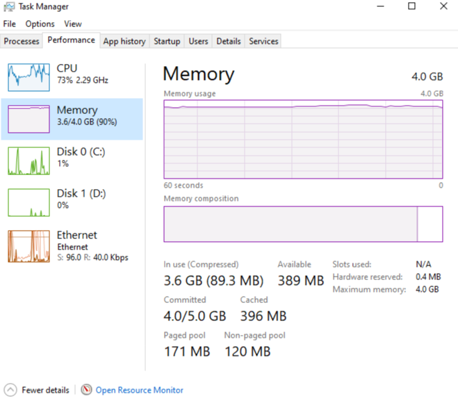

# Microsoft Teams 如何使用内存How Microsoft Teams uses memory

某些 Microsoft 团队用户对团队使用内存的方式有疑问。Some Microsoft Teams users have questions about how Teams uses memory. 本文介绍团队如何使用内存，以及团队桌面应用程序（应用）和团队 web 应用不阻止同一台计算机上的其他应用和工作负荷以最佳运行的内存。This article describes how memory is used by Teams, and why the Teams desktop application (app) and the Teams web app do not prevent other apps and workloads on the same computer from having enough memory to run optimally. 团队设计为使用新式 web 技术。Teams is designed to use modern web technology. 为了实现此目的，已在电子上开发了团队桌面客户端，该客户端使用 Chromium 进行呈现。To achieve this, the Teams desktop client was developed on Electron, which uses Chromium for rendering. 这是当今大多数最热门的浏览器（包括边缘和 Chrome）中的相同呈现引擎。This is the same rendering engine behind many of today's most popular browsers, including Edge and Chrome.

## 团队的工作方式How Teams works

在电子上设计的团队允许更快地进行开发，并且它还会在不同操作系统（Windows、Mac 和 Linux）的团队版本之间保持奇偶校验。Teams being designed on Electron allows for faster development, and it also maintains parity between Teams versions across different operating systems (Windows, Mac, and Linux). 这种奇偶校验是可行的，因为电子和 Chromium 在所有版本中维护类似的基本代码。This parity is possible because Electron and Chromium maintain a similar code base across all versions. 此体系结构的另一个优点是，团队 web 应用和桌面版本之间存在类似的内存使用率配置文件。Another advantage of this architecture is there's a similar memory usage profile between the Teams web app and the desktop version. Web 应用和桌面版本使用内存的方式与浏览器使用内存的方式类似。Both the web app and the desktop versions use memory in a similar way to how a browser would use it. 有关电子的详细信息可在[其网站](https://electronjs.org/)上使用。More information about Electron is available at [their Web site](https://electronjs.org/).

有关详细信息，请参阅[Chrome 内存中](https://chromium.googlesource.com/chromium/src.git/+/master/docs/memory/key_concepts.md)的[Chromium 内存使用](https://www.chromium.org/developers/memory-usage-backgrounder)和关键概念。See [Chromium Memory Usage](https://www.chromium.org/developers/memory-usage-backgrounder) and [Key Concepts in Chrome Memory](https://chromium.googlesource.com/chromium/src.git/+/master/docs/memory/key_concepts.md) for more information.

下图显示了适用于 Windows 和团队 Web 应用（在本示例中，在 Google Chrome 中运行）的团队桌面应用的并行内存使用情况。The following image shows side-by-side memory usages of the Teams desktop app for Windows and the Teams Web app (in this example, running in Google Chrome).

## 团队中的内存使用情况Memory usage in Teams

了解团队在系统内存方面的*预期*行为并了解真正有问题的系统内存问题的症状非常重要。It is important to understand the *expected* behavior of Teams when it comes to system memory, and to know the symptoms of truly problematic system memory issues.

### 团队预期的内存使用情况Expected memory usage by Teams

无论您正在运行的是团队桌面应用还是团队 web 应用，Chromium 都会检测出有多少系统内存可用，并充分利用该内存来优化呈现体验。Whether you're running the Teams desktop app or the Teams web app, Chromium detects how much system memory is available and utilizes enough of that memory to optimize the rendering experience. 当其他应用或服务需要系统内存时，Chromium 将为这些进程提供内存。When other apps or services require system memory, Chromium gives up memory to those processes. Chromium 在不断调整团队内存使用情况，以便优化团队性能而不影响当前运行的任何其他内容。Chromium tunes Teams memory usage on an ongoing basis in order to optimize Teams performance without impacting anything else currently running.

这样，类似的 Chromium 工作负荷可以利用不同数量的内存，具体取决于可用的系统内存量。In this way, similar Chromium workloads can utilize varying amounts of memory, depending on the amount of system memory that is available.

下图介绍了两个独立系统上的团队内存使用情况，每个系统具有不同的可用内存量。The following graph depicts memory usage by Teams on four separate systems, each with different amounts of memory available. 每个系统都处理类似的工作负荷（打开和运行相同的应用）。Each of the systems is processing similar workloads (same apps open and running).

当计算机有更多内存时，团队将使用该内存。When computers have more memory, Teams will use that memory. 在内存不足的系统中，团队将占用较少的时间。In systems where memory is scarce, Teams will use less.

### 系统内存问题的症状Symptoms of system memory issues

如果你在计算机上看到以下一种或多种症状，可能会出现严重的系统内存问题：If you see one or more of the following symptoms on your computer, you could have a serious system memory issue:

- 高内存在多个大型应用程序同时运行时使用。High memory use when multiple large applications are running simultaneously.
- 系统性能较慢或应用程序挂起。Slow system performance or applications hanging.
- 所有应用的持续总系统内存使用率为90% 或更高。Sustained overall system memory usage of 90% or higher across all apps. 使用此内存使用量，团队应将内存提供给其他应用和工作负荷。With this amount of memory usage, Teams should be giving memory back to other apps and workloads. 90% 的持久内存使用意味着团队没有将内存提供给系统，这表示存在问题。Sustained memory usage of 90% could mean Teams isn't giving memory back to the system, which indicates a problem.

下面的图像显示了当系统内存使用异常高时，任务管理器中的视图示例。The following images show examples of views in Task Manager when system memory usage is abnormally high.

