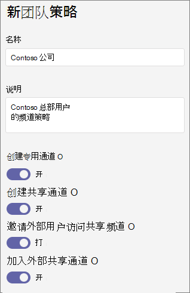

# 在 Microsoft Teams 中管理团队策略

作为管理员，可以使用 Microsoft Teams 中的团队策略来控制组织中用户可在团队和频道中执行哪些操作。 例如，可以设置是否允许用户创建专用通道。

通过访问 Microsoft Teams 管理中心 **中的 Teams**  >  **Teams** 策略来管理团队策略。 可以使用全局（组织范围内的默认）策略，也可以创建并分配自定义策略。 除非你创建并分配自定义策略，否则你组织中的用户将自动获取全局策略。

可以编辑全局策略，也可以创建和分配自定义策略。 编辑全局策略或分配策略后，可能需要几个小时更改才能生效。

## 创建自定义团队策略

1. 在 Microsoft Teams 管理中心的左侧导航栏中，转到 **"Teams**  >  **Teams 策略"。**
2. 单击“**添加**”。
3. 输入策略的名称和说明。

    
4. 打开或关闭 **"创建专用通道**"，具体取决于是否要允许用户创建专用频道。

5. 单击“**保存**”。

## 编辑团队策略

可以编辑全局策略或创建的任何自定义策略。

1. 在 Microsoft Teams 管理中心的左侧导航栏中，转到 **"Teams**  >  **Teams 策略"。**
2. 单击策略名称的左侧以选择用户，然后单击“**编辑**”。
3. 打开或关闭想要的设置，然后单击"保存 **"。**

## 向用户分配自定义团队策略

[!INCLUDE [assign-policy](includes/assign-policy.md)]

## 相关主题

[Teams 中的专用频道](private-channels.md)

[向 Teams 中的用户分配策略](assign-policies.md)

[New-CsTeamsChannelsPolicy](/powershell/module/skype/new-csteamschannelspolicy?view=skype-ps)