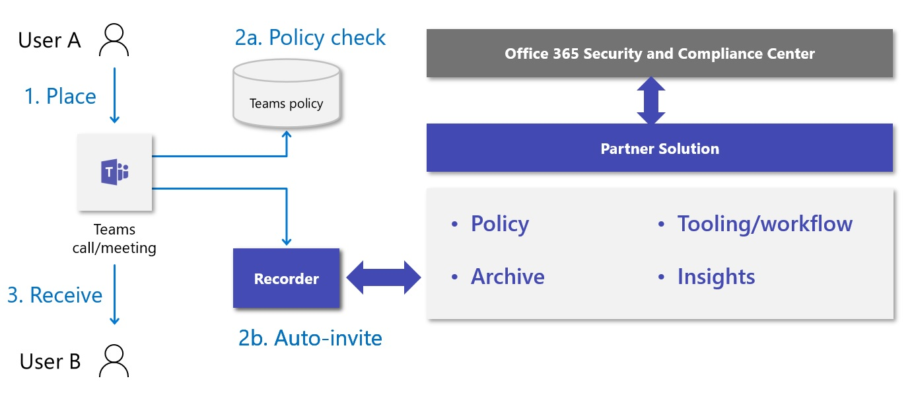

# <a name="introduction-to-teams-policy-based-recording-for-callings--meetings"></a>Teams会议呼叫的基于策略 &的录制简介

通过基于策略的录制，采用通话和会议Microsoft Teams的组织可以使用管理策略规定呼叫和联机会议应自动记录和捕获，以便根据相关公司或法规策略的要求进行后续处理和保留。

Teams已得到增强，以支持第三方录制解决方案的集成，包括平台功能、用户体验和管理接口，为配置、管理、录制、存储和分析Teams通信提供端到端解决方案所需的管理接口。 增强功能包括通信平台 API 和用于录制的事件，其中提供：

- 跨设备和音频、视频、屏幕共享和聊天的所有受支持的终结点进行无缝、高质量的媒体捕获。

- 支持Teams用户之间进行交互捕获，并支持调用终结点 (Teams、Teams移动、Skype for Business、PSTN) 

- 新的合规性记录管理策略，包括与现有Teams管理呼叫和会议工具和策略的集成

可以在Microsoft 365 A3/A5/E3/E5/业务高级版和Office 365 A3/A5/E3/E5 用户上启用合规性记录。 

合规性记录解决方案集成功能也已在 Ignite 2019 的[合规性录制和Microsoft Teams会话中进行](https://myignite.microsoft.com/archives/IG19-VCE40)评审。

## <a name="teams-interaction-recording-overview"></a>Teams交互录制概述

交互录制用例可以有效地分为四个主要类别的录制功能 - 便利、功能、组织和合法侦听，如下图所示：

> [!div class="mx-imgBorder"]
> 

每个类别对如何启动录制、记录内容、记录存储位置、通知人员、控制访问权限以及如何处理保留要求都有不同的要求。

| 类型                   | 方便 (常规Teams录制)  | 组织 - 受监管的 (合规性记录)  |
| ---------------------- | ------------------ | --------------- |
| 引发              | 用户               | 管理员 (系统)   |
| 目标                 | 按呼叫/会议 | 按用户        |
| 存储所有者          | 用户               | 合规性      |
| 需要通知？ | 是                | 是             |
| 访问所有者           | 用户               | 合规性      |
| 保留策略？      | 可选           | 是             |

Teams提供各种功能[，](./cloud-recording.md)方便和功能性地记录会议和直播活动。 组织记录意味着使采用Teams电话和会议的组织能够通过管理政策规定呼叫和联机会议应自动记录和捕获，以便根据相关公司或法规策略的要求进行后续处理和保留。 此策略下的用户会意识到，他们与Teams的数字交互正在录制中，但无法禁用录制，并且在交互完成后将无法访问录制。 记录成为可用于电子数据展示、法律保留和其他公司保留用途的合规性和法律人员的组织存档的一部分。

## <a name="example-user-needs"></a>用户需求示例

<table>
<thead>
<tr class="header">
<th>角色</th>
<th>需要</th>
</tr>
</thead>
<tbody>
<tr class="odd">
<td>录制的用户</td>
<td><ul>
<li><p>正在录制时收到通知。</p></li>
<li><p>当策略和/或记录器错误导致调用行为发生更改时，请告知。</p></li>
</ul></td>
</tr>
<tr class="even">
<td>通信管理员</td>
<td><ul>
<li><p>了解为何以及如何将/强制记录策略应用于Teams用户/终结点。</p></li>
<li><p>为组织配置和维护Teams记录策略。</p></li>
<li><p>监视和排查Teams呼叫和会议的录制相关问题。</p></li>
<li><p>支持内部合规性官员对使用情况、质量和可靠性进行操作分析。</p></li>
</ul></td>
</tr>
<tr class="odd">
<td>合规性官员</td>
<td><ul>
<li><p>按照在适当的区域边界中履行合规义务所需的方式收集所有Teams通信。</p></li>
<li><p>基于与通信相关的元数据或交互内容搜索交互。 常见示例包括：</p>
<ul>
<li><p><strong>元</strong> - 参与者、时间、方向、拨号号码、源号码、自定义业务数据</p></li>
<li><p><strong>内容</strong> - 听录、情绪、拼音、相关交互</p></li>
</ul></li>
<li><p>分析收集的通信并与之交互，包括在收集交互时监视交互的能力。</p></li>
<li><p>确保收集的通信的安全性，并防止在所有阶段篡改。</p></li>
</ul></td>
</tr>
</tbody>
</table>

## <a name="solution-architecture-overview"></a>解决方案体系结构概述

符合性记录解决方案与Teams集成，如下图所示：

> [!div class="mx-imgBorder"]
> 

> [!NOTE]
> 此解决方案专门用于通过Teams启用基于策略的符合性记录。 不支持此解决方案的任何其他使用。

## <a name="recorder"></a>录音机

合规性记录解决方案的核心组件是记录器。
记录器构建为基于 Azure 的可缩放服务， (机器人) [使用 Microsoft 的通信平台](/graph/cloud-communications-concept-overview)，并在 Microsoft Graph中注册为应用程序。 该记录器提供与Teams呼叫和会议[通信平台 API](/graph/api/resources/communications-api-overview) 的直接交互，并为媒体引入提供终结点。

[提供了一个示例合规性记录器应用程序](https://github.com/microsoftgraph/microsoft-graph-comms-samples/tree/a3943bafd73ce0df780c0e1ac3428e3de13a101f/Samples/BetaSamples/LocalMediaSamples/ComplianceRecordingBot)，该应用程序演示如何配置机器人、创建应用实例并分配符合性策略。 该示例还提供了有关用于记录特定交互的 API 用法的示例，例如处理 [传入呼叫](https://github.com/microsoftgraph/microsoft-graph-comms-samples/blob/a3943bafd73ce0df780c0e1ac3428e3de13a101f/Samples/BetaSamples/LocalMediaSamples/ComplianceRecordingBot/FrontEnd/Http/Controllers/PlatformCallController.cs#L199-L244) 路由、 [更改录制状态](https://github.com/microsoftgraph/microsoft-graph-comms-samples/blob/a3943bafd73ce0df780c0e1ac3428e3de13a101f/Samples/BetaSamples/LocalMediaSamples/ComplianceRecordingBot/FrontEnd/Bot/CallHandler.cs#L135-L138)以及 [删除正在录制的用户](https://github.com/microsoftgraph/microsoft-graph-comms-samples/blob/a3943bafd73ce0df780c0e1ac3428e3de13a101f/Samples/BetaSamples/LocalMediaSamples/ComplianceRecordingBot/FrontEnd/Bot/CallHandler.cs#L121-L126)。
Graph有关特定 API 的文档，可在此处找到 [updateRecordingStatus](/graph/api/call-updaterecordingstatus?tabs=http) 和 [incomingContext](/graph/api/resources/incomingcontext)。

记录器服务的确切实现因合作伙伴而异，但必须设计为支持多个记录器，以便实现部署的高可用性和地理分布，以减少从Teams到记录器的延迟。 此外，预计记录器本身的设计考虑到复原能力和冗余。

合作伙伴在提交解决方案进行认证之前，必须先确认 Microsoft Graph通信 API 和 SDK 的最低必需版本，以确保支持合规性记录集成的所有要求。

符合性记录方案的基本两个具体要求是：

- 必须在 Azure 中部署记录器机器人

- 记录器机器人必须在 Azure 中的Windows VM 上运行

Azure 和 Windows VM 要求仅适用于 Teams Bot 组件，这意味着合作伙伴可以实现所选平台的其余部分，前提是他们可以满足合规性记录的相关性能和功能要求。

## <a name="compliance-recording-policy-assignment-and-provisioning"></a>合规性记录策略分配和预配

IT 管理员可以通过创建和分配符合性记录策略来确定要记录的用户以及将用于每个用户的记录器。 当发生通信交互时，记录器会根据这些策略的配置自动邀请他们参与对话。 合规性记录策略使用 [Microsoft PowerShell](./teams-powershell-overview.md) 进行管理，可在每个组织的租户、每个用户和安全组级别应用。 可以找到有关[会议](./meeting-policies-overview.md)策略、[调用](./teams-calling-policy.md)策略和[组](./assign-policies-users-and-groups.md#assign-a-policy-to-a-group)策略的Microsoft Docs的详细信息。

1. 在租户中创建应用程序实例。

   ```powershell
   PS C:\> New-CsOnlineApplicationInstance -UserPrincipalName cr.instance@contoso.onmicrosoft.com -DisplayName ComplianceRecordingBotInstance -ApplicationId fcc88ff5-a42d-49cf-b3d8-f2e1f609d511

   RunspaceId        : 4c13efa6-77bc-42db-b5bf-bdd62cdfc5df
   ObjectId          : 5069aae5-c451-4983-9e57-9455ced220b7
   TenantId          : 5b943d7c-5e14-474b-8237-5022eb8e0dc9
   UserPrincipalName : cr.instance@contoso.onmicrosoft.com
   ApplicationId     : fcc88ff5-a42d-49cf-b3d8-f2e1f609d511
   DisplayName       : ComplianceRecordingBotInstance
   PhoneNumber       :
   ```

   ```powershell
   PS C:\> Sync-CsOnlineApplicationInstance -ObjectId 5069aae5-c451-4983-9e57-9455ced220b7
   ```

2. 创建合规性记录策略。

   ```powershell
   PS C:\> New-CsTeamsComplianceRecordingPolicy -Identity TestComplianceRecordingPolicy -Enabled $true -Description "Test policy created by tenant admin"

   Identity                        : Global
   ComplianceRecordingApplications : {}
   Enabled                         : True
   WarnUserOnRemoval               : True
   Description                     : Test policy created by tenant admin
   ```

   ```powershell
   PS C:\> Set-CsTeamsComplianceRecordingPolicy -Identity TestComplianceRecordingPolicy `
   -ComplianceRecordingApplications @(New-CsTeamsComplianceRecordingApplication -Id 5069aae5-c451-4983-9e57-9455ced220b7 -Parent TestComplianceRecordingPolicy)
   ```

   请参阅 [Set-CsTeamsComplianceRecordingPolicy](/powershell/module/skype/set-csteamscompliancerecordingpolicy)。

3. 将符合性记录策略分配给用户。

   ```powershell
   PS C:\> Grant-CsTeamsComplianceRecordingPolicy -Identity testuser@contoso.onmicrosoft.com -PolicyName TestComplianceRecordingPolicy
   ```

   请参阅 [Grant-CsTeamsComplianceRecordingPolicy](/powershell/module/skype/grant-csteamscompliancerecordingpolicy)。

   ```powershell
   PS C:\> Get-CsOnlineUser testuser@contoso.onmicrosoft.com | select SipAddress, TenantId, TeamsComplianceRecordingPolicy | fl

   UserPrincipalName              : testuser@contoso.onmicrosoft.com
   TenantId                       : 5b943d7c-5e14-474b-8237-5022eb8e0dc9
   TeamsComplianceRecordingPolicy : TestComplianceRecordingPolicy
   ```

## <a name="user-experiences"></a>用户体验

使用Teams客户端体验启用对通知的支持。 体验可以是视觉对象或音频。

**Teams客户端 - 视觉对象通知**
- 桌面/Web
- 移动 (iOS/Android) 
- Teams手机
- Teams会议室

**其他终结点 - 音频通知**
- SIP 手机
- Skype for Business
- 音频会议
- PSTN 调用方

> [!NOTE]
> 会议模式呼叫队列不支持合规性录制。 请使用传输模式呼叫队列。
> 如果用户遇到 Internet 中断，并且正在使用 SBA 发出和接收 PSTN 呼叫，则合规性录制将不起作用。

## <a name="compliance-recording-for-teams-certification-programs"></a>Teams认证程序的符合性记录

除了发布允许合作伙伴开发和集成 CCaaS 解决方案和Teams的公开可用 API 外，我们还为Microsoft Teams认证计划开发了合规性记录，以保证每个参与合作伙伴的解决方案都经过测试和验证，以提供他们期望从 Microsoft 解决方案获得的质量、兼容性和可靠性。  

以下合作伙伴已认证其解决方案Microsoft Teams。<br/><br/>

|伙伴|解决方案网站 |
|:--|:--|
|ASC 技术 |[https://www.asctechnologies.com/english/ASC_Recording_Insights_Compliance_Recording_for_Microsoft_Teams.html](https://www.asctechnologies.com/english/ASC_Recording_Insights_Compliance_Recording_for_Microsoft_Teams.html) |
|AudioCodes |[https://online.audiocodes.com/smarttap-360-live-for-microsoft-teams](https://online.audiocodes.com/smarttap-360-live-for-microsoft-teams) |
|CallCabinet |[https://www.callcabinet.com/compliance-microsoft-teams-call-recording](https://www.callcabinet.com/compliance-microsoft-teams-call-recording ) |
|杜伯 |[https://www.dubber.net/call-recording/](https://www.dubber.net/call-recording/) |
|Insightful 技术 |[https://insightfultechnology.com/teams/](https://insightfultechnology.com/teams/) |
|NICE Engage |[https://www.nice.com/products/workforce-engagement/call-recording/air-and-engage](https://www.nice.com/products/workforce-engagement/call-recording/air-and-engage) |
|NICE NTR |[https://www.niceactimize.com/compliance/ms-teams-recording.html](https://www.niceactimize.com/compliance/ms-teams-recording.html) |
|Numonix |[https://numonix.cloud](https://numonix.cloud)    |
|橡树创新 |[https://www.oakinnovate.com/clarify](https://www.oakinnovate.com/clarify) |
|红框 |[https://www.redboxvoice.com/compliance-recording-for-microsoft-teams](https://www.redboxvoice.com/red-box-partners/microsoft-integration/compliance-recording-for-microsoft-teams)  |
|Theta Lake |[https://thetalake.com/integrations/microsoft/](https://thetalake.com/integrations/microsoft/) |
|Verint |[https://www.verba.com/solutions/microsoft-teams-recording](https://www.verba.com/solutions/microsoft-teams-recording) |
|橡树创新 |[https://www.oakinnovate.com/clarify](https://www.oakinnovate.com/clarify) |

<br/>
以下合作伙伴正在验证其解决方案以进行Microsoft Teams。<br/><br/>

|伙伴|解决方案网站 |
|:--|:--|
|Landis 技术 |[https://landistechnologies.com/](https://landistechnologies.com/) |
|Luware |[https://luware.com/en/solution/microsoft-teams-recording/](https://luware.com/en/solution/microsoft-teams-recording/) |


随着更多合作伙伴加入并满足认证条件，此列表将更新。

## <a name="next-steps"></a>后续步骤

如果你是寻求加入认证计划的供应商，请将邮件发送到 [Teamscategorypartner@microsoft.com](mailto:Teamscategorypartner@microsoft.com)。
